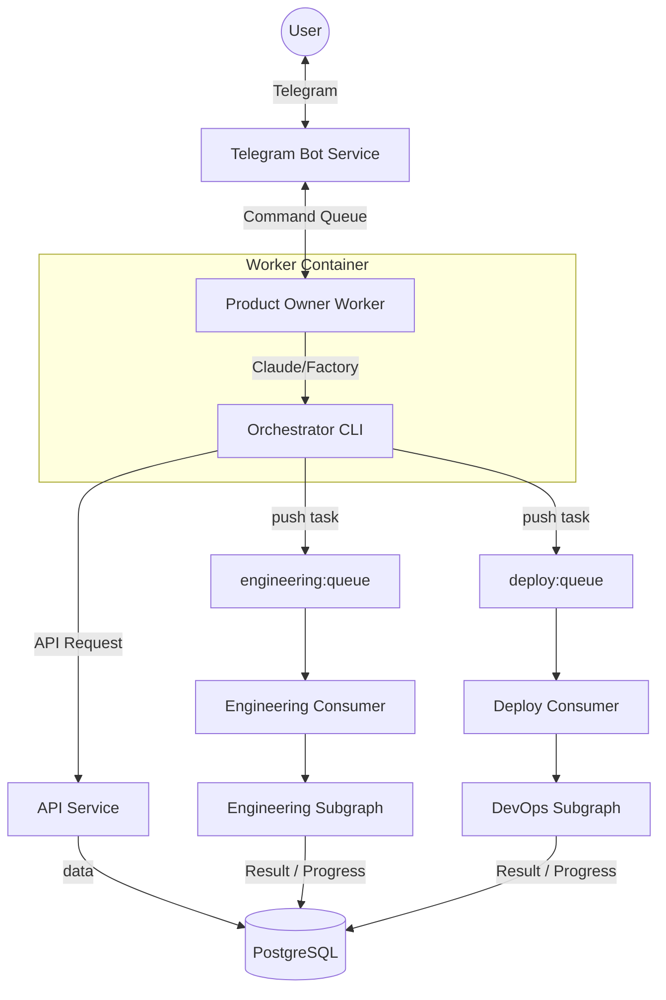

# Архитектура

> **Актуально на**: 2026-02-09

## Обзор

Codegen Orchestrator — мультиагентная система для автоматической генерации и деплоя проектов. Пользователь описывает что хочет в Telegram → система создаёт, тестирует и деплоит.

## Технический стек

| Компонент | Технология |
|-----------|------------|
| **CLI Agents** | Claude Code, Factory.ai Droid |
| **Agent Orchestration** | worker-manager (Docker + Redis) |
| **Backend Orchestration** | LangGraph (subgraphs) |
| **LLM** | Anthropic Claude (via CLI or API) |
| **Интерфейс** | Telegram Bot |
| **Кодогенерация** | service-template (Copier) |
| **Инфраструктура** | `services/infra-service` (Ansible) |
| **Хранение** | PostgreSQL + Redis |

## Ключевые концепции

### Headless Mode
CLI агенты работают в headless режиме — чистый JSON ввод/вывод без TUI. Это обеспечивает надёжный парсинг и session continuity.

### Capabilities
Возможности агента конфигурируются через `WorkerConfig.capabilities`:
- `git`, `github` — работа с репозиториями
- `python`, `node` — runtime environments
- `docker` — Docker-in-Docker через Sysbox

### Session Management
Redis-based sessions с `--resume session_id` для сохранения контекста между сообщениями.

## Сервисы

| Сервис | Описание |
|--------|----------|
| `api` | FastAPI + SQLAlchemy — проекты, серверы, users, configs |
| `telegram_bot` | Telegram интерфейс + PO sessions |
| `worker-manager` | Docker контейнеры с CLI агентами (Replacer legacy workers-spawner) |
| `langgraph` | Engineering/DevOps subgraphs |
| `scheduler` | Background tasks (sync, health checks) |
| `scaffolder` | Copier runner для scaffolding (бывший preparer) |
| `infra-service` | Ansible runner, SSH операции (бывший infrastructure-worker) |

## Граф (CLI Agent Architecture)



### Потоки данных

```
┌─────────┐     ┌──────────────────────┐     ┌─────────────────────────────┐
│  START  │────▶│ Telegram Bot         │────▶│  worker-manager             │
│  User   │     │                      │     │  (Docker isolation)         │
└─────────┘     └──────────────────────┘     └──────────┬──────────────────┘
                                                        │
                                                        ▼
                                             ┌────────────────────────────┐
                                             │ CLI Agent (Product Owner)  │
                                             │ (Claude/Factory/custom)    │
                                             │                            │
                                             │ • All API tools available  │
                                             │ • Native tool calling      │
                                             │ • Session via Redis        │
                                             └──────────┬─────────────────┘
                                                        │
                                                        ▼ (tool calls)
                ┌───────────────────────────────────────┴────────────────────────────┐
                │                                       │                            │
                ▼                                       ▼                            ▼
┌───────────────────────────┐         ┌─────────────────────────┐   ┌──────────────────────┐
│ Analyst (delegate_analyst)│         │ Engineering Subgraph    │   │ DevOps Subgraph      │
│    │                      │         │ (trigger_engineering)   │   │ (trigger_deploy)     │
│    ▼                      │         └──────────┬──────────────┘   └──────────┬───────────┘
│ ┌──────────────────┐      │                    │                             │
│ │  Create Project  │      │                    ▼                             ▼
│ └────────┬─────────┘      │    ┌────────────────────────────┐  ┌──────────────────────────┐
│          │                │    │ Scaffolder → Developer →   │  │ EnvAnalyzer → Deployer   │
│          │                │    │ Tester                     │  │ (Ansible via infra-svc)  │
│          │                │    │ (max 3 iterations)         │  └──────────────────────────┘
│          ▼                │    └────────────────────────────┘
│    ┌─────────────────┐    │
│    │ Resource Mgmt   │    │
│    │ (Zavhoz Node)   │    │
│    └─────────────────┘    │
└───────────────────────────┘
```

**Key Features:**
- **CLI Agent**: Product Owner as pluggable CLI worker (Claude Code, Factory.ai, custom)
- **Native Tools**: All API endpoints exposed as tools via OpenAPI
- **Session Management**: Redis-based locks (PROCESSING/AWAITING states)
- **Engineering Subgraph**: Scaffolder → Developer → Tester (max 3 iterations)
- **DevOps Subgraph**: LLM-based env analysis, Ansible deployment via infra-service

## Внешние зависимости

| Репозиторий | Использование |
|-------------|---------------|
| [service-template](https://github.com/vladmesh/service-template) | Copier шаблон для генерации проектов |
| `infra-service` | Ansible runner для деплоя |

## Документация

Детальная документация вынесена в отдельные файлы:

| Тема | Файл |
|------|------|
| **Contracts (DTO)** | [docs/CONTRACTS.md](docs/CONTRACTS.md) |
| **Glossary** | [docs/GLOSSARY.md](docs/GLOSSARY.md) |
| **Error Handling** | [docs/ERROR_HANDLING.md](docs/ERROR_HANDLING.md) |
| **Secrets** | [docs/SECRETS.md](docs/SECRETS.md) |
| Status & Progress | [docs/STATUS.md](docs/STATUS.md) |
| Resource Management (Завхоз) | [docs/resource-management.md](docs/resource-management.md) |
| Coding Agents (Claude/Droid) | [docs/coding-agents.md](docs/coding-agents.md) |
| Parallel Workers | [docs/parallel-workers.md](docs/parallel-workers.md) |
| Logging | [docs/LOGGING.md](docs/LOGGING.md) |
| Audit (Known Issues) | [docs/audit.md](docs/audit.md) |

## Мониторинг

### LangSmith

```bash
export LANGCHAIN_TRACING_V2=true
export LANGCHAIN_API_KEY=...
```

### Логирование

Все сервисы используют `structlog` (JSON для prod, console для dev).
Подробнее: [docs/LOGGING.md](docs/LOGGING.md)
