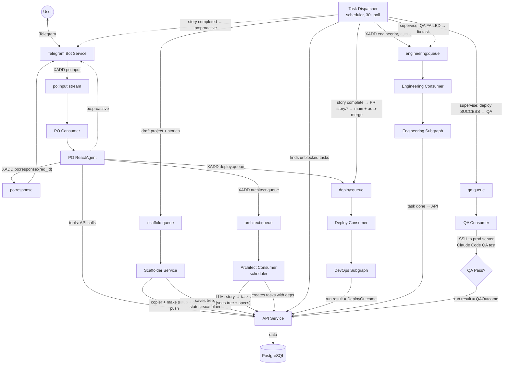

# Архитектура

> **Актуально на**: 2026-03-19

## Обзор

Codegen Orchestrator — мультиагентная система для автоматической генерации и деплоя проектов. Пользователь описывает что хочет в Telegram → система создаёт, тестирует и деплоит.

## Технический стек

| Компонент | Технология |
|-----------|------------|
| **PO** | LangGraph ReactAgent (direct API/Redis tool calls) |
| **Developer Agents** | Claude Code, Factory.ai Droid via worker-manager (Docker + Redis) |
| **Backend Orchestration** | LangGraph (subgraphs) |
| **LLM** | Anthropic Claude (via CLI or API) |
| **LLM Tracing** | Langfuse v3 (self-hosted, CallbackHandler integration) |
| **Интерфейс** | Telegram Bot |
| **Admin UI** | React SPA (admin-frontend, nginx proxy) |
| **Кодогенерация** | service-template (Copier) |
| **Инфраструктура** | `services/infra-service` (Ansible) |
| **Хранение** | PostgreSQL + Redis |
| **Observability** | Loki + Promtail + Grafana (logs), Langfuse (LLM traces) |

## Ключевые концепции

### Planning Layer (Stories → Tasks → Runs)

Трёхуровневая абстракция для продуктового управления:
- **Story** — высокоуровневое требование от пользователя (через PO). Статусы: `created` → `in_progress` → `pr_review` → `deploying` → `testing` → `completed` (также: `waiting_human_review`, `failed`, `reopened`).
- **Task** — конкретная техническая задача. Статусы: `backlog` → `todo` → `in_dev` → `in_ci` → `testing` → `done` (также: `blocked`, `waiting_human_review`, `failed`, `cancelled`). Задачи могут иметь зависимости (`blocked_by_task_id`).
- **Run** — единица исполнения (engineering или deploy). Привязан к Task через `task_id`.

**Pipeline** (scheduler + scaffolder services) автоматически готовит проект и декомпозирует Story в Tasks:
1. PO создаёт Project + Repository + Story
2. Task Dispatcher (каждые 30с) обнаруживает draft-проект со stories → публикует `ScaffoldMessage` (mode=full) в `scaffold:queue`
3. Scaffolder выполняет copier + make setup + git push, сохраняет tree в DB, ставит `project.status = active`
   - Для existing проектов: ensure-workspace gate (mode=ensure) проверяет наличие workspace перед dispatch задач
4. PO публикует `ArchitectMessage` в `architect:queue`
5. Architect Consumer вызывает LLM — видит tree скафолдированного проекта → создаёт tasks только на diff (бизнес-логику)
6. Task Dispatcher находит разблокированные tasks, создаёт Runs, публикует в `engineering:queue`
7. После завершения всех tasks — PR story/* → main, auto-merge → deploy → QA → story completed

Скиллы (`/plan`, `/implement`, `/triage`, `/checkpoint`) взаимодействуют с API для работы с бэклогом, сбора статистики и сохранения истории итераций (`TaskEvent`).
Файл `docs/backlog.md` является автогенерируемым (read-only) представлением базы данных (`make backlog`).

### Capabilities
Возможности Developer агента конфигурируются через `WorkerConfig.capabilities`:
- `git`, `github` — работа с репозиториями
- `python`, `node` — runtime environments
- Docker больше не предоставляется внутри контейнера (DinD удален). Инфраструктура поднимается через compose proxy (`curl localhost:9090/infra/compose`) — запрос проксируется worker-wrapper'ом в worker-manager.

## Сервисы

| Сервис | Описание |
|--------|----------|
| `api` | FastAPI + SQLAlchemy — проекты, серверы, users, configs |
| `telegram_bot` | Telegram интерфейс (PO via Redis Streams) |
| `scaffolder` | Подготовка репозиториев новых проектов (copier + make setup + git push). Потребляет `scaffold:queue`, сохраняет tree в DB. Лёгкий образ без Docker SDK и LLM |
| `worker-manager` | Docker контейнеры с CLI агентами и проксированием `docker compose` для sidecar-инфраструктуры (Flat Dev Environment). Монтирует pre-scaffolded workspace volumes. Воркеры работают в изолированной сети `codegen_worker`. |
| `langgraph` | Engineering/DevOps subgraphs. `engineering-worker`, `deploy-worker`, and `qa-worker` are separate containers of the same image (Redis stream consumers, not independent services) |
| `scheduler` | Background workers: architect consumer (story→tasks LLM decomposition), task dispatcher (scaffold trigger, dispatch unblocked tasks, complete stories), github_sync, server_sync, health_checker |
| `infra-service` | Ansible runner, SSH операции (бывший infrastructure-worker) |
| `admin-frontend` | React 19 + Vite SPA (port 3001). Dashboard, projects, tasks, workers, queues, users, LLM tracing pages. Nginx proxies `/api/*` → api:8000, `/wm-api/*` → worker-manager. Basic auth via htpasswd. Grafana embedded at `/grafana/`, Langfuse linked externally |
| `langfuse-web` | Langfuse v3 UI (port 3002). LLM trace viewer |
| `langfuse-worker` | Langfuse background processor |
| `clickhouse` | ClickHouse — trace analytics for Langfuse |
| `minio` | MinIO — S3-compatible event/media storage for Langfuse |
| `loki` | Log aggregation (7-day retention) |
| `promtail` | Docker log scraper → Loki |
| `grafana` | Dashboards + log viewer. Proxied via admin-frontend at `/grafana/` |

## Граф



### Потоки данных

```
User → Telegram Bot → XADD po:input {type, user_id, request_id, text}
                                  │
                                  ▼
                       PO ReactAgent (langgraph)
                       │  • Python @tool functions
                       │  • PostgreSQL checkpointer (per-user thread)
                       │  • Reminder poller
                       │
                       ├──► API (create_project, create_repo, set_secret, create_story, ...)
                       │
                       │    Task Dispatcher (scheduler, 30s poll)
                       │      ├──► draft project + stories → XADD scaffold:queue
                       │      │                                │
                       │      │                    Scaffolder Service
                       │      │                    │ copier + make setup + git push
                       │      │                    │ saves tree → API
                       │      │                    └ project.status = scaffolded
                       │      │
                       ├──► XADD architect:queue → Architect Consumer (scheduler)
                       │                              │ LLM decomposition (sees tree + specs)
                       │                              ▼
                       │                           API: create tasks with blocked_by chains
                       │                              │
                       │      ├──► XADD engineering:queue → Engineering Subgraph
                       │      └──► story complete → XADD deploy:queue + po:proactive
                       ├──► XADD deploy:queue → DevOps Subgraph
                       └──► XADD po:response:{request_id} {text}
                                  │
                                  ▼
                       Telegram Bot → User

Engineering completion → API (task done) → Dispatcher picks next unblocked task
All tasks done → Dispatcher creates PR story/* → main (auto-merge) → story pr_review
PR merged (PR poller, 30s) → deploy:queue → deploy
Deploy success → run.result = DeployOutcome → supervisor → qa:queue → QA consumer SSHes to prod → Claude Code tests → story testing
QA pass → run.result = QAOutcome.PASSED → supervisor → story completed → PO notification
QA fail → run.result = QAOutcome.FAILED → supervisor → fix task created → story back to in_progress → re-engineer → re-deploy → re-QA
CI failure on story branch (PR poller) → fix task created → story back to in_progress
```

**Key Features:**
- **PO ReactAgent**: LangGraph agent with native Python tools, PostgreSQL checkpointer
- **Developer Workers**: CLI agents (Claude Code, Factory.ai) in Docker containers via worker-manager. Network isolated (`codegen_worker` network) to prevent access to orchestrator DBs.
- **Scaffolder**: Standalone service (no LLM, no Docker SDK). Runs copier + make setup + git push before architect sees the project. Tree saved to DB for architect context.
- **Engineering Subgraph**: Workspace mount → Developer on feature branch (`story/{id}`) → PR-based CI gate (auto-merge on green)
- **DevOps Subgraph**: LLM-based env analysis, env groups for coherent secrets, Ansible deployment via infra-service. Deploy failure LLM classifier (CODE_FIX / RETRY / GIVE_UP) — RETRY re-deploys, CODE_FIX dispatches to engineering, GIVE_UP marks story failed and notifies admin.
- **QA Consumer**: SSHes to prod server, runs Claude Code CLI with story-based QA prompt. Tests endpoints, checks responses against story description. Pass → story completed. Fail → creates fix task, loops back to engineering.
- **Unified Redis Consumers**: All 10 consumers use `RedisStreamClient.consume()` with PEL recovery (`claim_pending=True`) — crashed messages are automatically re-delivered on restart. See [CONTRACTS.md](docs/CONTRACTS.md#consumer-patterns)

## Внешние зависимости

| Репозиторий | Использование |
|-------------|---------------|
| [service-template](https://github.com/project-factory-organization/service-template) | Copier шаблон для генерации проектов |

## Документация

Детальная документация вынесена в отдельные файлы:

| Тема | Файл |
|------|------|
| **Contracts (DTO)** | [docs/CONTRACTS.md](docs/CONTRACTS.md) |
| **Glossary** | [docs/GLOSSARY.md](docs/GLOSSARY.md) |
| **Error Handling** | [docs/ERROR_HANDLING.md](docs/ERROR_HANDLING.md) |
| **Secrets** | [docs/SECRETS.md](docs/SECRETS.md) |
| **Pipeline V2** | [docs/PIPELINE_V2.md](docs/PIPELINE_V2.md) |
| **Testing** | [docs/TESTING.md](docs/TESTING.md) |
| **Deploy** | [docs/DEPLOY.md](docs/DEPLOY.md) |
| Status & Progress | [docs/STATUS.md](docs/STATUS.md) |
| Resource Management | [docs/resource-management.md](docs/resource-management.md) |
| Coding Agents (Claude/Droid) | [docs/coding-agents.md](docs/coding-agents.md) |
| Parallel Workers | [docs/parallel-workers.md](docs/parallel-workers.md) |
| Logging | [docs/LOGGING.md](docs/LOGGING.md) |


## Мониторинг

### Observability Stack

```
Services (structlog JSON) → stdout → Docker → Promtail → Loki → Grafana
All consumers → Langfuse CallbackHandler → langfuse-web (traces)
```

- **Grafana**: Pre-provisioned "Service Logs" dashboard. Filter by service, level, `correlation_id`. Proxied via admin-frontend at `/grafana/`.
- **Langfuse**: Self-hosted LLM tracing. All 4 consumers (PO, architect, engineering, deploy) auto-attach `CallbackHandler` when `LANGFUSE_PUBLIC_KEY` + `SECRET_KEY` env vars are set. Traces enriched with user, project, and agent metadata.
- **LangSmith** (optional): `LANGCHAIN_TRACING_V2=true` + `LANGCHAIN_API_KEY`.

### Логирование

Все сервисы используют `structlog` (JSON для prod, console для dev).
Подробнее: [docs/LOGGING.md](docs/LOGGING.md)
