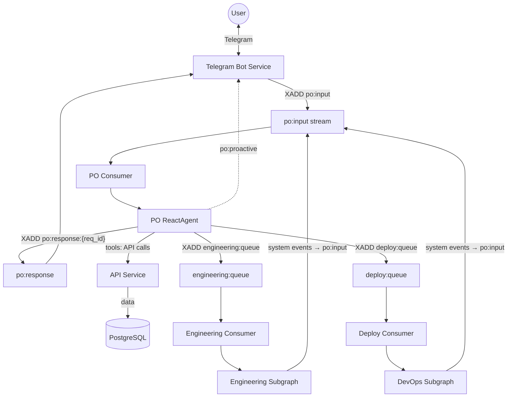

# Архитектура

> **Актуально на**: 2026-03-03

## Обзор

Codegen Orchestrator — мультиагентная система для автоматической генерации и деплоя проектов. Пользователь описывает что хочет в Telegram → система создаёт, тестирует и деплоит.

## Технический стек

| Компонент | Технология |
|-----------|------------|
| **PO** | LangGraph ReactAgent (direct API/Redis tool calls) |
| **Developer Agents** | Claude Code, Factory.ai Droid via worker-manager (Docker + Redis) |
| **Backend Orchestration** | LangGraph (subgraphs) |
| **LLM** | Anthropic Claude (via CLI or API) |
| **Интерфейс** | Telegram Bot |
| **Кодогенерация** | service-template (Copier) |
| **Инфраструктура** | `services/infra-service` (Ansible) |
| **Хранение** | PostgreSQL + Redis |

## Ключевые концепции

### Capabilities
Возможности Developer агента конфигурируются через `WorkerConfig.capabilities`:
- `git`, `github` — работа с репозиториями
- `python`, `node` — runtime environments
- Docker больше не предоставляется внутри контейнера (DinD удален). Инфраструктура поднимается через прокси-команды `orchestrator dev-env`.

## Сервисы

| Сервис | Описание |
|--------|----------|
| `api` | FastAPI + SQLAlchemy — проекты, серверы, users, configs |
| `telegram_bot` | Telegram интерфейс (PO via Redis Streams) |
| `worker-manager` | Docker контейнеры с CLI агентами и проксированием `docker compose` для sidecar-инфраструктуры (Flat Dev Environment). Воркеры работают в изолированной сети `codegen_worker`. |
| `langgraph` | Engineering/DevOps subgraphs. `engineering-worker` and `deploy-worker` are separate containers of the same image (Redis stream consumers, not independent services) |
| `scheduler` | Background tasks (sync, health checks, garbage collection) |
| `infra-service` | Ansible runner, SSH операции (бывший infrastructure-worker) |

## Граф



### Потоки данных

```
User → Telegram Bot → XADD po:input {type, user_id, request_id, text}
                                  │
                                  ▼
                       PO ReactAgent (langgraph)
                       │  • Python @tool functions
                       │  • PostgreSQL checkpointer (per-user thread)
                       │  • Reminder poller
                       │
                       ├──► API (create_project, set_secret, ...)
                       ├──► XADD engineering:queue → Engineering Subgraph
                       ├──► XADD deploy:queue → DevOps Subgraph
                       └──► XADD po:response:{request_id} {text}
                                  │
                                  ▼
                       Telegram Bot → User

System events (worker callbacks, reminders) → po:input → PO decides → po:proactive → Bot → User
```

**Key Features:**
- **PO ReactAgent**: LangGraph agent with native Python tools, PostgreSQL checkpointer
- **Developer Workers**: CLI agents (Claude Code, Factory.ai) in Docker containers via worker-manager. Network isolated (`codegen_worker` network) to prevent access to orchestrator DBs.
- **Engineering Subgraph**: Repo creation → Scaffold (copier via worker-manager) → Developer → CI gate (max 3 fix iterations)
- **DevOps Subgraph**: LLM-based env analysis, env groups for coherent secrets, Ansible deployment via infra-service
- **Unified Redis Consumers**: All 9 consumers use `RedisStreamClient.consume()` with PEL recovery (`claim_pending=True`) — crashed messages are automatically re-delivered on restart. See [CONTRACTS.md](docs/CONTRACTS.md#consumer-patterns)

## Внешние зависимости

| Репозиторий | Использование |
|-------------|---------------|
| [service-template](https://github.com/vladmesh/service-template) | Copier шаблон для генерации проектов |

## Документация

Детальная документация вынесена в отдельные файлы:

| Тема | Файл |
|------|------|
| **Contracts (DTO)** | [docs/CONTRACTS.md](docs/CONTRACTS.md) |
| **Glossary** | [docs/GLOSSARY.md](docs/GLOSSARY.md) |
| **Error Handling** | [docs/ERROR_HANDLING.md](docs/ERROR_HANDLING.md) |
| **Secrets** | [docs/SECRETS.md](docs/SECRETS.md) |
| Status & Progress | [docs/STATUS.md](docs/STATUS.md) |
| Resource Management | [docs/resource-management.md](docs/resource-management.md) |
| Coding Agents (Claude/Droid) | [docs/coding-agents.md](docs/coding-agents.md) |
| Parallel Workers | [docs/parallel-workers.md](docs/parallel-workers.md) |
| Logging | [docs/LOGGING.md](docs/LOGGING.md) |


## Мониторинг

### LangSmith

```bash
export LANGCHAIN_TRACING_V2=true
export LANGCHAIN_API_KEY=...
```

### Логирование

Все сервисы используют `structlog` (JSON для prod, console для dev).
Подробнее: [docs/LOGGING.md](docs/LOGGING.md)
