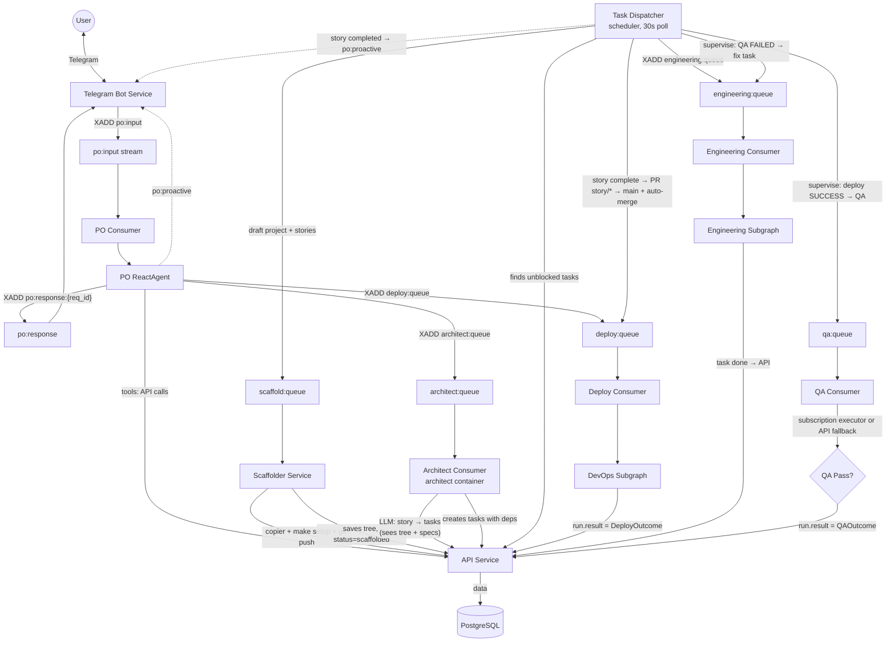

# Architecture

## Overview

Codegen Orchestrator is a multi-agent system for automatic project generation and deployment. The user describes what they want in Telegram → the system creates, tests and deploys it.

## Technology stack

| Component | Technology |
|-----------|------------|
| **PO** | LangGraph ReactAgent (direct API/Redis tool calls) |
| **Developer Agents** | Claude Code, Factory.ai Droid via worker-manager (Docker + Redis) |
| **Backend Orchestration** | LangGraph (subgraphs) |
| **LLM** | Anthropic Claude (via CLI or API) |
| **Interface** | Telegram Bot |
| **Admin UI** | React SPA (admin-frontend, nginx proxy) |
| **Code generation** | service-template (Copier) |
| **Infrastructure** | `services/infra-service` (Ansible) |
| **Storage** | PostgreSQL + Redis |
| **Observability** | Loki + Promtail + Grafana (logs), node_exporter + cadvisor (hardware), Postgres (runs) |

## Key concepts

### Planning Layer (Stories → Tasks → Runs)

A three-level abstraction for product management:
- **Story** — a high-level requirement from the user (through the PO). Statuses: `created` → `in_progress` → `pr_review` → `deploying` → `testing` → `completed` (also: `waiting_human_review`, `failed`, `reopened`).
- **Task** — a concrete technical task. Statuses: `backlog` → `todo` → `in_dev` → `in_ci` → `testing` → `done` (also: `blocked`, `waiting_human_review`, `failed`, `cancelled`). Tasks can have dependencies (`blocked_by_task_id`).
- **Run** — a unit of execution (engineering or deploy). Bound to a Task through `task_id`.

**Pipeline** (the scheduler + scaffolder services) automatically prepares the project and decomposes a Story into Tasks:
1. The PO creates a Project + Repository + Story
2. The Task Dispatcher (every 30s) finds a draft project with stories → publishes a `ScaffoldMessage` (mode=full) to `scaffold:queue`
3. The Scaffolder runs copier + make setup + git push, saves the tree to the DB, sets `project.status = active`
   - For existing projects: the ensure-workspace gate (mode=ensure) checks that the workspace exists before dispatching tasks
4. The PO publishes an `ArchitectMessage` to `architect:queue`
5. The Architect Consumer calls the LLM, which sees the tree of the scaffolded project → creates tasks only for the diff (the business logic)
6. The Task Dispatcher finds admitted, unblocked tasks, creates Runs, publishes to `engineering:queue`. A confirmed Product Brief Story first receives architect planning and durable per-must-requirement dispositions; its planned tasks become admitted only through the Product Brief coverage completion transaction.
7. Once all tasks are done — a PR story/* → main, auto-merge → deploy → QA → story completed

The Story / Task / Run / `TaskEvent` entities in the API describe work on **client** projects; they are created and maintained by the pipeline itself (PO, Architect, Task Dispatcher, workers).

Work on the orchestrator itself is scoped and tracked outside this repository, on the Pipeline board — not in the local Tasks DB and not in markdown here. Brainstorms, plans and the history of past sprints live in the driving installation's knowledge store under `state/knowledge/projects/codegen-orchestrator/`.

### Capabilities
The capabilities of a Developer agent are configured through `WorkerConfig.capabilities`:
- `git`, `github_cli`, `curl`
- Docker is not available inside the container. Infrastructure is brought up through the compose proxy (`curl localhost:9090/infra/compose`): worker-wrapper forwards the request through worker-broker, which authenticates it before worker-manager runs it.

### Project placement

The server for a project is chosen not by its nominal capacity but by the worse of two signals: the sum
of the declared reservations (`applications.reserved_ram_mb`) and the memory actually in use according to
fresh metrics. The `ALLOCATION_RAM_RESERVE_MB` headroom is added to the project's requirement. A server
whose metrics are older than `ALLOCATION_METRICS_FRESHNESS_SECONDS` is considered unknown in terms of load
and is not selected: foreign load that no allocation accounts for would otherwise stay invisible.

A refusal carries a typed reason and is not a failure. A lack of capacity parks the task in
`waiting_resources` without spending attempts on finishing the code, the PO reports this to the project
owner, and the scheduler resumes work once the metrics show free space. A request that exceeds the capacity
of any server is escalated immediately. Details: [docs/ERROR_HANDLING.md](docs/ERROR_HANDLING.md).

The project's requirement itself is still a constant: `estimated_ram_mb` is not filled in by anyone and is
taken from the default value.

## Services

| Service | Description |
|--------|----------|
| `api` | FastAPI + SQLAlchemy — projects, servers, users, configs |
| `telegram_bot` | The Telegram interface (PO via Redis Streams) |
| `scaffolder` | Preparation of repositories for new projects (copier + make setup + git push). Consumes `scaffold:queue`, saves the tree to the DB. A light image without the Docker SDK and without an LLM |
| `worker-manager` | Docker containers with CLI agents and a broker-authenticated `docker compose` proxy for sidecar infrastructure (Flat Dev Environment). Mounts pre-scaffolded workspace volumes. Workers run in the isolated `codegen_worker` network. |
| `worker-broker` | The only service on both control-plane and worker networks. Authenticates per-worker credentials and brokers worker streams, sessions, status and Compose requests. |
| `langgraph` | Engineering/DevOps subgraphs. `engineering-worker`, `deploy-worker`, `qa-worker` and `architect` are separate containers of the same image (Redis stream consumers, not independent services) |
| `architect` | Story→tasks LLM decomposition. Consumes `architect:queue`. A container of the `langgraph` image, not part of `scheduler` |
| `scheduler` | Background workers: task dispatcher (scaffold trigger, dispatch unblocked tasks), story completion, pr_poller, supervisor, provisioner trigger and result listener, github_sync, fail-closed Time4VPS server sync, health_checker, app_health_prober, ssl_checker, analytics_aggregator, rag_summarizer, queue_cleanup, temporary_access |
| `infra-service` | An Ansible runner and SSH operations |
| `admin-frontend` | React 19 + Vite SPA (port 3001). Dashboard, projects, tasks, workers, queues and users. Nginx proxies `/api/*` → api:8000 (stamping `X-Internal-Key` in, so the browser never holds it), `/wm-api/*` → worker-manager. Basic auth via htpasswd decides who reaches that proxy. Grafana is embedded at `/grafana/` |
| `user-dashboard` | React 19 + Vite SPA. The end user's own view of their projects: auth through Telegram, analytics from Loki |
| `loki` | Log aggregation (7-day retention) |
| `promtail` | Docker log scraper → Loki |
| `grafana` | Dashboards + log viewer. Proxied via admin-frontend at `/grafana/` |

### Who may reach the API at all

One dependency on the FastAPI application, `require_authenticated_caller`, stands in front of
every route. It admits two credentials: a valid `X-Internal-Key`, and an LK bearer token. It
admits nothing else — in particular `X-Telegram-ID` on its own is not an identity, because the
header names a user without proving one and anything that can reach the API's port can send it.
The routes that answer anonymously are listed, with a reason each, in `ANONYMOUS_ROUTES` in
`services/api/src/dependencies.py`: `GET /`, `GET /health`, and the LK token exchange
`POST /api/lk/auth/token`, whose caller has no token yet by definition.

Enforcement lives in that one place so a router included without a guard of its own is still
closed. `services/api/tests/unit/test_global_auth_gate.py` walks `app.routes` and fails if any
route outside the allowlist answers an anonymous caller, so a new router cannot arrive open.

Getting through the gate is authentication, not authorization: `resolve_actor` still judges a
request that names a user as that user, and `is_admin` on `POST /api/users` is refused unless
the caller is an internal service.

### Talking to the internal API

Every service reaches `api` through one module, `shared/clients/internal_api.py`, in an async
and a synchronous form. It is where the base URL is resolved and where both required headers
are set: `X-Internal-Key`, which authenticates the call as internal, and `X-Correlation-ID`,
which keeps a request traceable across services. There is no second way in: a raw `httpx` call
to the API from service code is a defect, not a shortcut.


## Graph


```mermaid
graph TD
    User((User)) <--> |Telegram| Bot[Telegram Bot Service]
    Bot --> |"XADD po:input"| POInput[po:input stream]
    POInput --> POConsumer[PO Consumer]
    POConsumer --> PO[PO ReactAgent]
    PO --> |"XADD po:response:{req_id}"| POResp[po:response]
    POResp --> Bot

    PO --> |"tools: API calls"| API[API Service]
    PO --> |"XADD architect:queue"| ArchQueue[architect:queue]
    PO --> |"XADD deploy:queue"| DeployQueue[deploy:queue]
    PO -.-> |"po:proactive"| Bot

    API --> |"data"| DB[(PostgreSQL)]

    Dispatcher[Task Dispatcher<br/>scheduler, 30s poll] --> |"draft project + stories"| ScaffoldQueue[scaffold:queue]
    ScaffoldQueue --> Scaffolder[Scaffolder Service]
    Scaffolder --> |"copier + make setup + git push"| API
    Scaffolder --> |"saves tree, status=scaffolded"| API

    ArchQueue --> ArchConsumer[Architect Consumer<br/>architect container]
    ArchConsumer --> |"LLM: story → tasks<br/>(sees tree + specs)"| API
    ArchConsumer --> |"creates tasks with deps"| API

    Dispatcher --> |"finds unblocked tasks"| API
    Dispatcher --> |"XADD engineering:queue"| EngQueue[engineering:queue]
    Dispatcher --> |"story complete → PR story/* → main + auto-merge"| DeployQueue

    EngQueue --> EngConsumer[Engineering Consumer]
    EngConsumer --> EngGraph[Engineering Subgraph]

    DeployQueue --> DepConsumer[Deploy Consumer]
    DepConsumer --> DepGraph[DevOps Subgraph]
    DepGraph --> |"run.result = DeployOutcome"| API
    Dispatcher --> |"supervise: deploy SUCCESS → QA"| QAQueue[qa:queue]
    QAQueue --> QAConsumer[QA Consumer]
    QAConsumer --> |"subscription executor or API fallback"| QAResult{QA Pass?}

    %% Feedback Loops
    EngGraph --> |"task done → API"| API
    QAResult --> |"run.result = QAOutcome"| API
    Dispatcher --> |"supervise: QA FAILED → fix task"| EngQueue
    Dispatcher -.-> |"story completed → po:proactive"| Bot
```

### Data flows

```
User → Telegram Bot → XADD po:input {type, user_id, request_id, text}
                                  │
                                  ▼
                       PO ReactAgent (langgraph)
                       │  • Python @tool functions
                       │  • PostgreSQL checkpointer (per-user thread)
                       │  • Reminder poller
                       │
                       ├──► API (create_project, create_repo, set_secret, create_story, ...)
                       │
                       │    Task Dispatcher (scheduler, 30s poll)
                       │      ├──► draft project + stories → XADD scaffold:queue
                       │      │                                │
                       │      │                    Scaffolder Service
                       │      │                    │ copier + make setup + git push
                       │      │                    │ saves tree → API
                       │      │                    └ project.status = scaffolded
                       │      │
                       ├──► XADD architect:queue → Architect Consumer (architect container)
                       │                              │ LLM decomposition (sees tree + specs)
                       │                              ▼
                       │                           API: create tasks with blocked_by chains
                       │                              │
                       │      ├──► XADD engineering:queue → Engineering Subgraph
                       │      └──► story complete → XADD deploy:queue + po:proactive
                       ├──► XADD deploy:queue → DevOps Subgraph
                       └──► XADD po:response:{request_id} {text}
                                  │
                                  ▼
                       Telegram Bot → User

Engineering completion → API (task done) → Dispatcher picks next unblocked task
All tasks done → Dispatcher creates PR story/* → main (auto-merge) → story pr_review
PR merged (PR poller, 30s) → deploy:queue → deploy
Deploy success → run.result = DeployOutcome → supervisor → qa:queue → QA consumer runs deterministic checks, then its assigned subscription executor → story testing
QA pass → run.result = QAOutcome.PASSED → supervisor → story completed → PO notification
QA fail → run.result = QAOutcome.FAILED → supervisor → fix task created → story back to in_progress → re-engineer → re-deploy → re-QA
CI failure on story branch (PR poller) → fix task created → story back to in_progress
```

**Key Features:**
- **PO ReactAgent**: LangGraph agent with native Python tools, PostgreSQL checkpointer
- **Developer Workers**: CLI agents (Claude Code, Factory.ai) in Docker containers via worker-manager. Network isolated (`codegen_worker` network) to prevent access to orchestrator DBs.
- **Scaffolder**: Standalone service (no LLM, no Docker SDK). Runs copier + make setup + git push before architect sees the project. Tree saved to DB for architect context.
- **Engineering Subgraph**: Workspace mount → Developer on feature branch (`story/{id}`) → PR-based CI gate (auto-merge on green)
- **DevOps Subgraph**: typed environment-contract resolution and Ansible deployment via infra-service. Deploy failures use deterministic typed outcomes; unclassified subgraph and smoke failures resolve to RETRY.
- **QA Consumer**: runs deterministic probes first, then its assigned subscription executor centrally; an API agent is an optional fallback after that executor fails. Deployment access is limited by a per-run capability set and an unprivileged SSH identity. Pass → story completed. Fail → creates a fix task and returns to engineering.
- **Unified Redis Consumers**: every consumer reads through `RedisStreamClient.consume()` / `consume_typed()` with PEL recovery (`claim_pending=True`) — an entry left unacked is reclaimed by the running consumer on its next `XAUTOCLAIM` sweep, restart or no restart, and a poison entry goes to `{stream}:dlq` rather than being ACKed away. The PO consumer reads through the same client and differs only in what it does with an entry: it dispatches concurrently, and keeps the ids it has in flight so its own sweep cannot hand it work it is already running. Delivery stays at-least-once between processes, as it is for every other consumer. See [CONTRACTS.md](docs/CONTRACTS.md#consumer-patterns) and [ERROR_HANDLING.md](docs/ERROR_HANDLING.md)

## External dependencies

| Repository | Usage |
|-------------|---------------|
| [service-template](https://github.com/vladmesh/service-template) | A Copier template for generating projects |

## Documentation

### Product Brief boundary

The PO freezes product intent as a confirmed Product Brief before creating new
product Story work. The brief is durable and versioned, not a queue payload or
recomposed story description. The architect loads it through the Story identity
and must dispose of every stable must-requirement with task/repository coverage
or a returned reason before runnable progression is allowed.
Until that admission, incomplete planning remains eligible for architect
recovery. Afterwards, follow-on repair tasks are immediately scheduler-admitted
without reopening the completed coverage boundary.

Detailed documentation lives in separate files:

| Topic | File |
|------|------|
| **Contracts (DTO)** | [docs/CONTRACTS.md](docs/CONTRACTS.md) |
| **Glossary** | [docs/GLOSSARY.md](docs/GLOSSARY.md) |
| **Error Handling** | [docs/ERROR_HANDLING.md](docs/ERROR_HANDLING.md) |
| **Secrets** | [docs/SECRETS.md](docs/SECRETS.md) |
| **Pipeline V2** | [docs/PIPELINE_V2.md](docs/PIPELINE_V2.md) |
| **Testing** | [docs/TESTING.md](docs/TESTING.md) |
| **Deploy** | [docs/DEPLOY.md](docs/DEPLOY.md) |
| Resource Management | [docs/resource-management.md](docs/resource-management.md) |
| Coding Agents (Claude/Droid) | [docs/coding-agents.md](docs/coding-agents.md) |
| Parallel Workers | [docs/parallel-workers.md](docs/parallel-workers.md) |
| Logging | [docs/LOGGING.md](docs/LOGGING.md) |


## Monitoring

### Observability Stack

Observability is assembled from logs, hardware metrics, and PostgreSQL data.

**Logs.**

```
Services (structlog JSON) → stdout → Docker → Promtail → Loki → Grafana
```

Promtail runs both on the orchestrator and on the provisioned servers; on the servers it collects containers
labeled `com.codegen.project_id`. Loki retention is set in `infra/loki.yml` (`retention_period`,
the compactor with `retention_enabled`).

**Hardware.**

```
node_exporter + cadvisor (ports 9100/8080, UFW open only to the orchestrator)
  → scheduler/health_checker → servers.* and server_metrics_history
```

The `monitoring` role installs the exporters during provisioning. An existing server is brought to this
baseline by a separate operation, see [docs/DEPLOY.md](docs/DEPLOY.md). Metrics freshness is a meaningful
value: the allocator uses it to decide whether a server's load is known.

**Runs.** `runs` stores not only the status and the timings but also a measure of effort: the tokens spent,
the cost, the head profile. The agent transcript is saved as an artifact on disk with a link from `runs`,
with secrets scrubbed and a size limit; the path and the lifetime are set by `WORKER_TRANSCRIPT_*`.

**Dashboards.** Grafana is provisioned from the repository (`infra/grafana/`) with two datasources, Loki and
Postgres (a read-only role), and three dashboards: "Service Logs", "Server capacity",
"Run operations". It is proxied through admin-frontend at `/grafana/`.

- **LangSmith** (optional): `LANGCHAIN_TRACING_V2=true` + `LANGCHAIN_API_KEY`.

### Logging

All services use `structlog` (JSON for prod, console for dev).
Details: [docs/LOGGING.md](docs/LOGGING.md)
