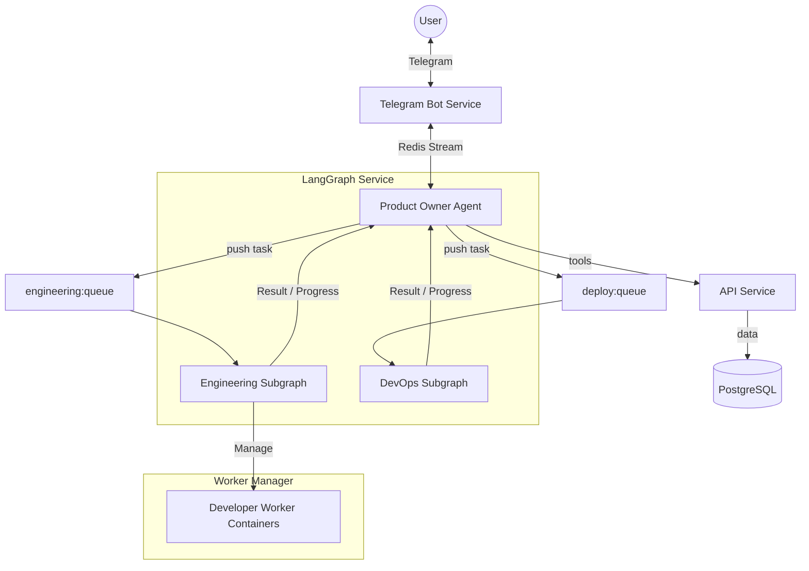

# Codegen Orchestrator

Мультиагентный оркестратор на базе LangGraph для автоматической генерации и деплоя проектов.

**Вход**: Описание проекта в Телеграме  
**Выход**: Работающий проект в продакшене (код, CI/CD, домен, SSL)

## Философия

- **Автономность**: Человек заходит раз в несколько дней, смотрит отчёты, докидывает деньги
- **Агенты как узлы графа**: Product Owner — это агент LangGraph, управляющий процессом.
- **Worker Manager**: Запускает изолированные контейнеры для Engineering/DevOps задач (Claude Code, Factory.ai).
- **Нелинейность**: Агенты могут вызывать друг друга в любом порядке
- **Spec-first**: Используем [service-template](https://github.com/vladmesh/service-template) для генерации кода

## Архитектура



### Основные компоненты

- **API**: FastAPI сервис, единственный источник правды (DAL) для PostgreSQL.
- **Telegram Bot**: Интерфейс для пользователя, управляет PO сессиями.
- **Product Owner (PO)**: LangGraph ReactAgent, общающийся с пользователем и ставящий задачи.
- **Worker Manager**: Управляет Docker контейнерами Developer агентов с проксированием `docker compose` для sidecar-инфраструктуры (Flat Dev Environment). Воркеры изолированы в сети `codegen_worker`.
- **LangGraph**: Оркестратор бизнес-процессов (Engineering, DevOps). Engineering-worker и deploy-worker — отдельные контейнеры того же Docker-образа с собственными entrypoint'ами (Redis stream consumers).
- **Infra Service**: Ansible runner для настройки серверов.
- **Scheduler**: Фоновые задачи (синхронизация, проверка здоровья, сборка мусора).

### Связанные проекты

| Проект | Описание | Репо |
|--------|----------|------|
| **service-template** | Spec-first фреймворк для генерации микросервисов | [GitHub](https://github.com/vladmesh/service-template) |

## Инфраструктура

- **LangGraph сервер**: Отдельный сервер для оркестратора и агентов
- **Prod серверы**: Управляются через infra-service (Ansible)
- **Телеграм**: Основной интерфейс

## Development Setup

### Prerequisites
- Docker & Docker Compose
- Python 3.12+
- Git

### Quick Start

1. **Clone the repository**
   ```bash
   git clone https://github.com/vladmesh/codegen_orchestrator.git
   cd codegen_orchestrator
   ```

2. **Install git hooks**
   ```bash
   make setup-hooks
   ```

3. **Set up environment**
   ```bash
   cp .env.example .env
   # Edit .env with your credentials
   ```

4. **Start services**
   ```bash
   make up
   make migrate
   make seed
   ```

5. **Run tests**
   ```bash
   make test-unit         # Fast unit tests
   make test-integration  # Integration tests (require running services)
   ```

### Development Workflow

- **Code quality**: `ruff format` (pre-commit), linters/tests (pre-push).
- **Testing**: `services/{service}/tests/{unit,integration}/`.
- **CI/CD**: GitHub Actions.

See [docs/TESTING.md](docs/TESTING.md) for detailed testing guide.

## Документация

- [AGENTS.md](AGENTS.md) — точка входа для агентов
- [ARCHITECTURE.md](ARCHITECTURE.md) — актуальная архитектура и потоки данных
- [docs/LOGGING.md](docs/LOGGING.md) — руководство по структурированному логированию

## Logging

Проект использует `structlog` (JSON для prod, console для dev).

```python
from shared.log_config import setup_logging
import structlog

setup_logging(service_name="my_service")
logger = structlog.get_logger()
logger.info("event_name", user_id=123)
```

## GitHub Secrets

Секреты хранятся в GitHub Actions (`Settings → Secrets → Actions`):

| Secret | Description |
|--------|-------------|
| `GH_APP_ID` | GitHub App ID |
| `GH_APP_PRIVATE_KEY` | GitHub App private key |
| `E2E_TEST_ORG` | Test organization |
| `E2E_TEST_INSTALLATION_ID` | Test installation ID |

## Roadmap

- [docs/ROADMAP.md](docs/ROADMAP.md) — вехи и фазы
- [docs/STATUS.md](docs/STATUS.md) — текущая задача
- [docs/backlog.md](docs/backlog.md) — очередь задач (auto-generated read-only view)
- [docs/CHANGELOG.md](docs/CHANGELOG.md) — что сделано