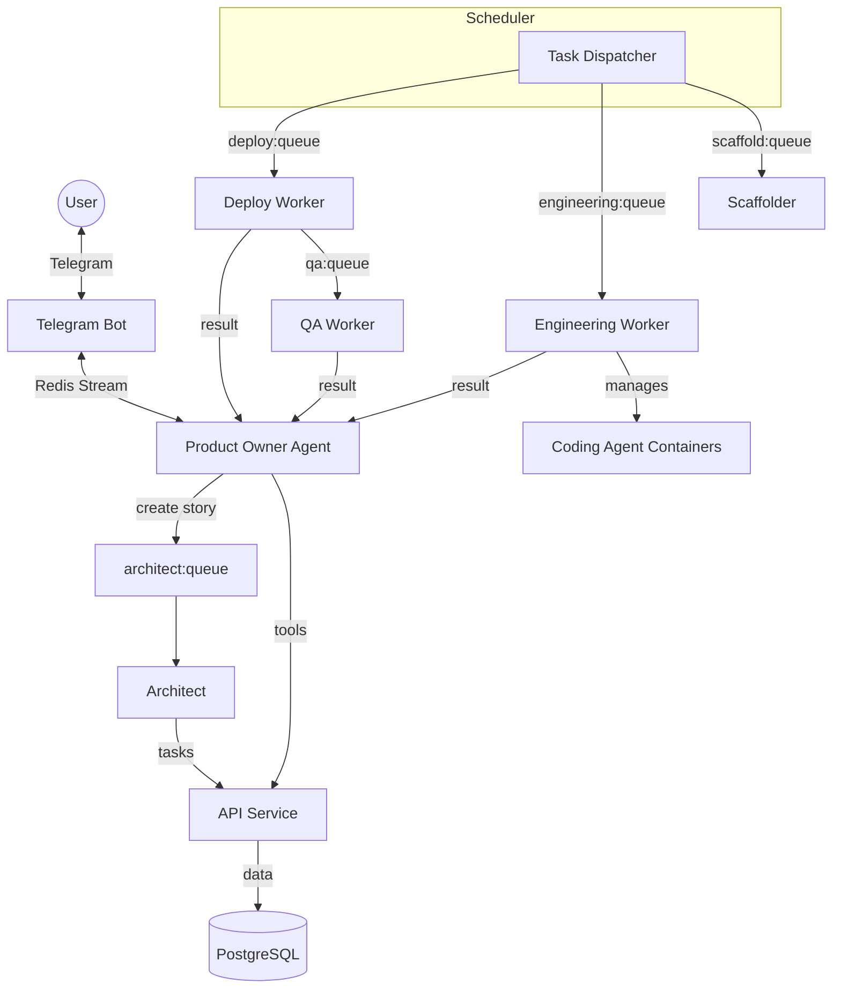

# Codegen Orchestrator

A person describes a project in Telegram. Twenty to thirty minutes later that project is running in
production, with a repository, CI, a domain and a certificate. Between those two moments no human
touches anything.

The system is a set of agents built on LangGraph. A Product Owner agent runs the dialogue and
decides what to build; an architect splits the result into tasks; coding agents in isolated
containers write the code; the pipeline puts it through CI, deploy and post-release QA. The user
comes back and says "now make it send pictures of cats", and the same machinery extends the running
project rather than generating a new one.

Generated projects are built from [service-template](https://github.com/vladmesh/service-template),
a spec-first framework, so the pipeline reasons about a declared contract instead of guessing at
free-form code.

## How a request flows


```mermaid
graph TD
    User((User)) <--> |Telegram| Bot[Telegram Bot]
    Bot <--> |Redis Stream| PO[Product Owner Agent]

    PO --> |tools| API[API Service]
    PO --> |create story| ArchQueue[architect:queue]

    subgraph Scheduler
        Dispatcher[Task Dispatcher]
    end

    ArchQueue --> Architect[Architect]
    Architect --> |tasks| API
    Dispatcher --> |scaffold:queue| Scaffolder[Scaffolder]
    Dispatcher --> |engineering:queue| Eng[Engineering Worker]
    Dispatcher --> |deploy:queue| Dep[Deploy Worker]
    Dep --> |qa:queue| QA[QA Worker]

    Eng --> |manages| Workers[Coding Agent Containers]

    API --> |data| DB[(PostgreSQL)]
    Eng --> |result| PO
    Dep --> |result| PO
    QA --> |result| PO
```

A Project has the lifecycle states `draft`, `active`, `paused`, and `archived`. Pipeline activity is
represented by its Stories, Tasks, and Runs; queues carry typed contracts between pipeline stages.

Stage by stage: [docs/PIPELINE_V2.md](docs/PIPELINE_V2.md). Agent nodes and their tools:
[docs/NODES.md](docs/NODES.md). The queues and DTOs themselves:
[docs/CONTRACTS.md](docs/CONTRACTS.md).

## Services

| Service | What it does |
|---|---|
| `api` | FastAPI, the single source of truth over PostgreSQL. Every other service reads and writes through it. |
| `telegram_bot` | The user interface; owns PO sessions. |
| `langgraph` | The PO agent and the Engineering/DevOps subgraphs. |
| `architect` | Splits a story into tasks. Its own container, not part of the scheduler. |
| `scheduler` | Task dispatcher, scaffold trigger, github/server sync, health checker. |
| `scaffolder` | Prepares the repository: copier, `make setup`, first push. Runs before the architect. |
| `engineering-worker`, `deploy-worker`, `qa-worker` | Redis-stream consumers. Separate entrypoints on the shared `langgraph` image. |
| `worker-manager` | Starts and reaps the coding-agent containers, isolated on the `codegen_worker` network. |
| `infra-service` | Ansible runner: provisions and configures the servers projects land on. |
| `admin-frontend` | React SPA on 3001 behind nginx basic auth: projects, tasks, workers, queues. |
| `user-dashboard` | The end user's own view of their projects. |
| `loki`, `promtail`, `grafana` | Structured logs and dashboards. |

Coding agents run inside the worker containers rather than being written here: Claude Code,
Factory.ai Droid and OpenAI Codex are interchangeable behind one interface
([docs/coding-agents.md](docs/coding-agents.md)).

## Running it locally

Needs Docker with Compose, Python 3.12+ and `uv`.

```bash
cp .env.example .env      # then fill in the credentials
make setup-hooks
make up
make migrate
make seed
```

The stack is up when `curl -sf http://localhost:8000/health` answers. From there, `make test-unit`
is the fast gate and `make test-integration` needs the stack running.

Two details that cost the most time when they are unknown:

- `shared/` is never installed as a package. Compose bind-mounts it, images `COPY` it, tests import
  it from the tree. Editing it needs no rebuild for bind-mounted services — see
  [docs/REBUILD.md](docs/REBUILD.md), which is also where the two separate build loops are
  explained.
- Nothing takes a default value. A missing key raises rather than falling back, on purpose. The
  reasoning is in [AGENTS.md](AGENTS.md#project-conventions).

Test layers, what each one costs and when to run it: [docs/TESTING.md](docs/TESTING.md).

## Repository map

| Area | Start here |
|---|---|
| Product services | `services/` — one directory per deployable service; [ARCHITECTURE.md](ARCHITECTURE.md) explains their relationships. |
| Shared contracts and utilities | `shared/` — typed DTOs, queues, clients, and common runtime helpers. |
| Tests | `tests/` — cross-service, live, and E2E coverage; service-local tests live beside each service. |
| Compose test harnesses | `tests/compose/` — test-owned Dockerfiles and Compose stacks, with a local README. |
| Operations | `infra/` — Ansible, production configuration, and operational scripts. |
| Developer and CI scripts | `scripts/` — repository checks and repeatable maintenance commands. |
| Documentation | `docs/` — contracts, pipeline, operations, testing, and historical change notes. |
| Assistant workflows | `.claude/skills/` — optional live-pipeline and maintenance skills; their state and secrets stay there. |
| Assistant instructions | [AGENTS.md](AGENTS.md) — canonical guidance; [CLAUDE.md](CLAUDE.md) only redirects Claude Code to it. |

## Documentation

| | |
|---|---|
| [ARCHITECTURE.md](ARCHITECTURE.md) | Services, data flows, the system as a whole |
| [docs/CONTRACTS.md](docs/CONTRACTS.md) | Queue registry, DTOs, correlation IDs |
| [docs/GLOSSARY.md](docs/GLOSSARY.md) | What an entity is called and what it means |
| [docs/DEPLOY.md](docs/DEPLOY.md) | Production deploy, GitHub Actions, server setup |
| [docs/SECRETS.md](docs/SECRETS.md) | The three secret levels: platform, project, user |
| [docs/ERROR_HANDLING.md](docs/ERROR_HANDLING.md) | Error categories, retry and timeout policy |
| [docs/LOGGING.md](docs/LOGGING.md) | structlog patterns, the Loki/Grafana stack |
| [AGENTS.md](AGENTS.md) | How AI assistants should work in this repository |
| [docs/CHANGELOG.md](docs/CHANGELOG.md) | What has been done |

Work on the orchestrator itself is scoped and tracked outside this repository, on a Pipeline board.
Brainstorms, plans and the history of past sprints live in the knowledge store of the installation
that drives that work, under `state/knowledge/projects/codegen-orchestrator/`.

## License

MIT — see [LICENSE](LICENSE).
