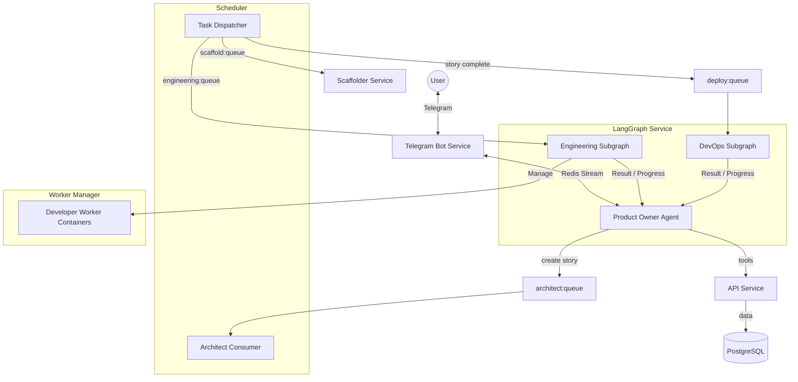

# Codegen Orchestrator

A multi-agent orchestrator built on LangGraph for automatic project generation and deployment.

**Input**: a project description in Telegram  
**Output**: a working project in production (code, CI/CD, domain, SSL)

## Philosophy

- **Autonomy**: a human drops in every few days, looks at the reports, tops up the money
- **Agents as graph nodes**: the Product Owner is a LangGraph agent that drives the process.
- **Worker Manager**: starts isolated containers for Engineering/DevOps tasks (Claude Code, Factory.ai, OpenAI Codex).
- **Non-linearity**: agents can call each other in any order
- **Spec-first**: we use [service-template](https://github.com/vladmesh/service-template) to generate code

## Architecture


```mermaid
graph TD
    User((User)) <--> |Telegram| Bot[Telegram Bot Service]
    Bot <--> |"Redis Stream"| PO[Product Owner Agent]

    subgraph "LangGraph Service"
        PO
        EngGraph[Engineering Subgraph]
        DepGraph[DevOps Subgraph]
    end

    PO --> |"tools"| API[API Service]
    PO --> |"create story"| ArchQueue[architect:queue]

    subgraph "Scheduler"
        Dispatcher[Task Dispatcher]
        ArchConsumer[Architect Consumer]
    end

    Dispatcher --> |"scaffold:queue"| Scaffolder[Scaffolder Service]
    ArchQueue --> ArchConsumer
    Dispatcher --> |"engineering:queue"| EngGraph
    Dispatcher --> |"story complete"| DeployQueue[deploy:queue]

    subgraph "Worker Manager"
        Worker[Developer Worker Containers]
    end

    EngGraph --> |"Manage"| Worker

    API --> |"data"| DB[(PostgreSQL)]
    DeployQueue --> DepGraph

    %% Feedback Loops
    EngGraph --> |"Result / Progress"| PO
    DepGraph --> |"Result / Progress"| PO
```

### Main components

- **API**: a FastAPI service, the single source of truth (DAL) for PostgreSQL.
- **Telegram Bot**: the user interface, manages PO sessions.
- **Product Owner (PO)**: a LangGraph ReactAgent that talks to the user and assigns tasks.
- **Scaffolder**: repository preparation (copier + make setup + git push). Runs before the architect.
- **Worker Manager**: manages the Docker containers of Developer agents. Mounts pre-scaffolded workspaces. Workers are isolated in the `codegen_worker` network.
- **LangGraph**: the business-process orchestrator (Engineering, DevOps). Engineering-worker and deploy-worker are separate containers of the same Docker image with their own entrypoints (Redis stream consumers).
- **Infra Service**: an Ansible runner for server setup.
- **Scheduler**: architect consumer (story→tasks), task dispatcher (scaffold trigger, dispatch, supervisor), github_sync, server_sync, health_checker.
- **Admin Frontend**: React SPA (port 3001) — dashboard, projects, tasks, workers, queues, and users. Nginx proxy with basic auth.
- **Observability**: Loki + Promtail + Grafana for structured logs.

### Related projects

| Project | Description | Repo |
|--------|----------|------|
| **service-template** | A spec-first framework for generating microservices | [GitHub](https://github.com/vladmesh/service-template) |

## Infrastructure

- **LangGraph server**: a dedicated server for the orchestrator and the agents
- **Prod servers**: managed through infra-service (Ansible)
- **Telegram**: the main interface

## Development Setup

### Prerequisites
- Docker & Docker Compose
- Python 3.12+
- Git

### Quick Start

1. **Clone the repository**
   ```bash
   git clone https://github.com/vladmesh/codegen_orchestrator.git
   cd codegen_orchestrator
   ```

2. **Install git hooks**
   ```bash
   make setup-hooks
   ```

3. **Set up environment**
   ```bash
   cp .env.example .env
   # Edit .env with your credentials
   ```

4. **Start services**
   ```bash
   make up
   make migrate
   make seed
   ```

5. **Run tests**
   ```bash
   make test-unit         # Fast unit tests
   make test-integration  # Integration tests (require running services)
   ```

### Development Workflow

- **Code quality**: `ruff format` (pre-commit), linters/tests (pre-push).
- **Testing**: `services/{service}/tests/{unit,integration}/`.
- **CI/CD**: GitHub Actions.

See [docs/TESTING.md](docs/TESTING.md) for detailed testing guide.

## Documentation

- [docs/DEV_PIPELINE.md](docs/DEV_PIPELINE.md) — the feature lifecycle and the working process (**MANDATORY READ**)
- [AGENTS.md](AGENTS.md) — general instructions for agents
- [ARCHITECTURE.md](ARCHITECTURE.md) — the current architecture and data flows
- [docs/LOGGING.md](docs/LOGGING.md) — a guide to structured logging

## Logging

The project uses `structlog` (JSON for prod, console for dev).

```python
from shared.log_config import setup_logging
import structlog

setup_logging(service_name="my_service")
logger = structlog.get_logger()
logger.info("event_name", user_id=123)
```

## GitHub Secrets

Secrets are stored in GitHub Actions (`Settings → Secrets → Actions`):

| Secret | Description |
|--------|-------------|
| `GH_APP_ID` | GitHub App ID |
| `GH_APP_PRIVATE_KEY` | GitHub App private key |
| `E2E_TEST_ORG` | Test organization |
| `E2E_TEST_INSTALLATION_ID` | Test installation ID |

## Roadmap

- [docs/ROADMAP.md](docs/ROADMAP.md) — milestones and phases
- [docs/STATUS.md](docs/STATUS.md) — the current task
- [docs/backlog.md](docs/backlog.md) — the task queue (auto-generated read-only view)
- [docs/CHANGELOG.md](docs/CHANGELOG.md) — what has been done

## License

MIT — see [LICENSE](LICENSE).
