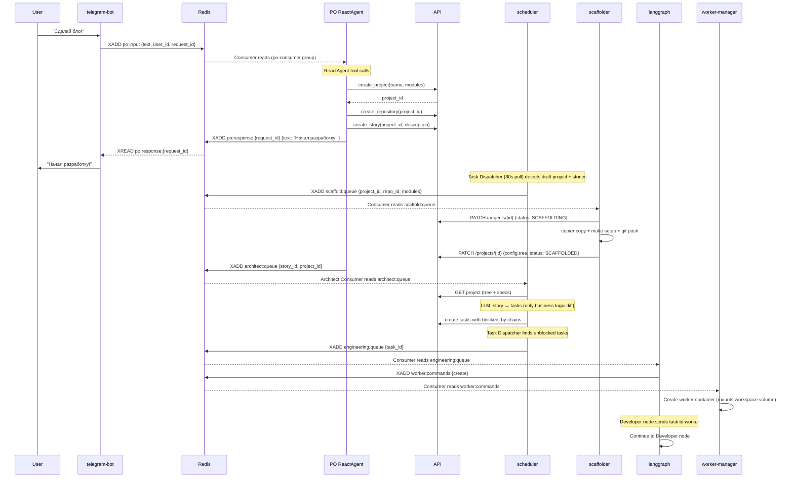
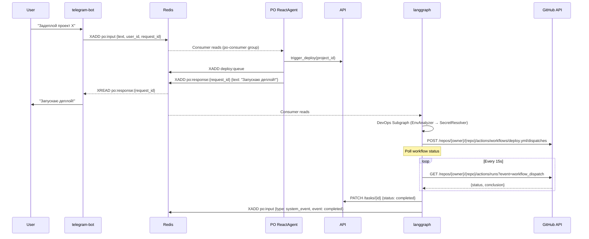
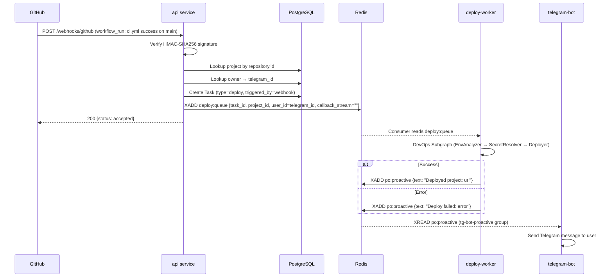

# Contracts / Контракты

Типизированные схемы для REST API и Redis очередей.

## Design Principles

1. **Schema-first** — все сообщения валидируются Pydantic схемами
2. **1:1 Queues** — одна очередь = один Writer → один Consumer (+ optional observers)
3. **Logical Actors** — указываем роль (PO ReactAgent, Developer-Worker, langgraph), не техническую прослойку
4. **Traceable** — `correlation_id` для сквозной трассировки

---

## Queue Registry

> **Complete list of all Redis Streams / Queues.**
>
> **Source of Truth:** `shared/queues.py` (`QUEUE_TOPOLOGY`)

### Scaffolding

| Queue | Group | DTO | Initiator | Consumer | Purpose |
|-------|-------|-----|-----------|----------|---------|
| `scaffold:queue` | `scaffold-consumers` | ScaffoldMessage | Task Dispatcher (scheduler) | scaffolder | Prepare repo: copier + make setup + git push |

---

### Architect Pipeline

| Queue | Group | DTO | Initiator | Consumer | Purpose |
|-------|-------|-----|-----------|----------|---------|
| `architect:queue` | `architect-consumers` | ArchitectMessage | PO ReactAgent | scheduler | Story → tasks LLM decomposition |

---

### Engineering Flows

| Queue | Group | DTO | Initiator | Consumer | Purpose |
|-------|-------|-----|-----------|----------|---------|
| `engineering:queue` | `capability-workers` | EngineeringMessage | Task Dispatcher (scheduler) | langgraph | Start development task |
| `deploy:queue` | `capability-workers` | DeployMessage | Task Dispatcher (scheduler) / PO | langgraph | Start deploy task |

---

### Worker Management

| Queue | Group | DTO | Initiator | Consumer | Purpose |
|-------|-------|-----|-----------|----------|---------|
| `worker:commands` | `worker_manager` | WorkerCommand | langgraph | worker-manager | Create/Delete worker containers |
| `worker:responses:developer` | — | WorkerResponse | worker-manager | langgraph | Developer worker command responses |
| `worker:lifecycle` | — | WorkerLifecycleEvent | worker-wrapper | worker-manager | Container lifecycle events |

---

### Worker I/O (Developer only)

| Queue | Group | DTO | Initiator | Consumer | Purpose |
|-------|-------|-----|-----------|----------|---------|
| `worker:{worker_id}:input` | — | DeveloperWorkerInput | langgraph (DeveloperNode) | worker-wrapper | Task input to Developer worker |
| `worker:{worker_id}:output` | — | DeveloperWorkerOutput | worker-wrapper | langgraph (DeveloperNode) | Developer worker results |

> **Note:** Worker I/O streams use `worker:{worker_id}:input/output` pattern. Used only for Developer workers. PO communicates via `po:input` / `po:response:{request_id}` (see PO ReactAgent I/O below).

---

### Infrastructure

| Queue | Group | DTO | Initiator | Consumer | Purpose |
|-------|-------|-----|-----------|----------|---------|
| `provisioner:queue` | `infrastructure-workers` | ProvisionerMessage | scheduler | infra-service | Provision server |
| `provisioner:results` | `scheduler-consumers` | ProvisionerResult | infra-service | scheduler | Provisioning result |
| `provisioner:results` | `telegram-bot` | ProvisionerResult | infra-service | telegram-bot | Provisioning notifications |

---

### Events & Progress

| Queue | Group | DTO | Initiator | Consumer | Purpose |
|-------|-------|-----|-----------|----------|---------|
| `task_progress:{task_id}` | — | ProgressEvent | All services | telegram-bot | Task progress notifications |
| `workflow:status` | — | WorkflowStatusEvent | langgraph (poller) | telegram-bot | Deploy progress updates |

### Transport Layer Note

> **Important:** The "Initiator" column shows the **logical actor** — who makes the decision to publish.
>
> PO ReactAgent calls tools directly (Python functions → API/Redis). No CLI proxy needed.
>
> For **Developer-Worker** messages, the actual transport is:
> ```
> Developer Worker (AI Agent) → orchestrator-cli → Redis/API
> ```
> The CLI is a permission-checked proxy, not an independent actor.

### Actor Roles

| Actor | Type | Description |
|-------|------|-------------|
| **PO ReactAgent** | LangGraph Agent | Product Owner, communicates via Redis streams `po:input`/`po:response` |
| **Developer-Worker** | Worker | Developer agent (inside engineering flow) |
| **langgraph** | Service | Workflow orchestrator |
| **worker-manager** | Service | Container lifecycle manager |
| **worker-wrapper** | Process | Agent bridge inside container |
| **telegram-bot** | Service | User interface |
| **infra-service** | Service | Server provisioning only (no app deploy) |
| **scheduler** | Service | Background tasks |

### MVP Notes

> [!IMPORTANT]
> **Tester Node** is an MVP stub. It does NOT spawn a Worker.  
> Implementation: A simple LangGraph node that always returns `{"passed": True}`.  
> Post-MVP: Will delegate to a Tester-Worker with code analysis capabilities.

### Rate Limiting Policy

> [!IMPORTANT]
> External APIs have hard limits. Exceeding them blocks all operations.

| Resource | Limit | Strategy |
|----------|-------|----------|
| **GitHub API** | 5000 req/hour | Token Bucket in `GitHubAppClient`, buffer 500 |
| **LLM API (Claude)** | Per-plan limits | Token Bucket per service, cost alerts |
| **External APIs** | Varies | Per-client configuration |

**Design Principles:**

1. **Fail-fast**: Raise `RateLimitExceeded` immediately, don't queue silently
2. **Buffer zone**: Use 90% of limit, leave 10% for emergencies
3. **Monitoring**: Expose metrics for all rate-limited resources
4. **Per-service**: Each client manages its own limits (MVP)
5. **Post-MVP**: Centralized Redis-based limiter for horizontal scaling

Implementation: `shared/clients/github.py` (`GitHubAppClient`).

---

## Flow Diagrams

### Engineering Flow



### Deploy Flow (PO-triggered)



### Deploy Flow (Webhook-triggered)



---

## Consumer Patterns

> **Implemented in**: Redis Streams unification (#3+#5)

All Redis Stream consumers use unified `RedisStreamClient.consume()` API from `shared.redis_client`.

### Unified consume() API

```python
async for msg in client.consume(
    stream="engineering:queue",
    group="capability-workers",
    consumer="worker-1",
    auto_ack=False,          # False = caller must call ack() after processing
    claim_pending=True,      # Recover PEL (crashed messages) on startup
    pending_timeout_ms=60_000,  # Min idle time before re-claiming pending message
):
    await process(msg.data)
    await client.ack(stream, group, msg.message_id)
```

### ACK Modes

| Mode | `auto_ack` | Use Case | Services |
|------|-----------|----------|----------|
| **Manual ACK** | `False` | At-least-once delivery, ack after successful processing | engineering-worker, deploy-worker, infra-service, worker-manager, scheduler |
| **Auto ACK** | `True` | Fire-and-forget, ack on read | telegram-bot (ProactiveListener, ProvisionerNotifier) |

### PEL Recovery

On startup with `claim_pending=True`, the consumer calls `XAUTOCLAIM` to reclaim messages that were pending for longer than `pending_timeout_ms`. This handles the case where a consumer crashes mid-processing — on restart, the message is automatically re-delivered.

**Special case:** PO Consumer (`services/langgraph/src/consumers/po.py`) uses a custom while-loop for concurrent dispatch but still implements PEL recovery via direct `XAUTOCLAIM` calls on startup.

### Consumer Inventory

| # | Consumer | File | Queue | ACK | PEL Recovery | Validation |
|---|----------|------|-------|-----|-------------|------------|
| 1 | Engineering Consumer | `langgraph/src/consumers/engineering.py` | `engineering:queue` | manual | `claim_pending` | in `process_fn` |
| 2 | Deploy Consumer | `langgraph/src/consumers/deploy.py` | `deploy:queue` | manual | `claim_pending` | in `process_fn` |
| 3 | PO Consumer | `langgraph/src/consumers/po.py` | `po:input` | manual (finally) | `xautoclaim` | `TypeAdapter` |
| 4 | Worker Manager | `worker-manager/src/consumer.py` | `worker:commands` | manual | `claim_pending` | `validate_python` |
| 5 | Infra Service | `infra-service/src/main.py` | `provisioner:queue` | manual | `claim_pending` | raw dict |
| 6 | Scheduler | `scheduler/src/main.py` | `provisioner:results` | manual | `claim_pending` | `model_validate` |
| 7 | Provisioner Notifier | `telegram_bot/src/notifications.py` | `provisioner:results` | auto | — | `model_validate` |
| 8 | Proactive Listener | `telegram_bot/src/main.py` | `po:proactive` | auto | — | raw dict |
| 9 | Architect Consumer | `langgraph/src/consumers/architect.py` | `architect:queue` | manual | `claim_pending` | `model_validate` |

---

# Part 1: REST DTO

## ProjectDTO

```python
# shared/contracts/dto/project.py

from enum import StrEnum
from pydantic import BaseModel, ConfigDict

class ProjectStatus(StrEnum):
    """Project lifecycle status.
    
    Happy path: DRAFT → SCAFFOLDING → SCAFFOLDED → DEVELOPING → TESTING → DEPLOYING → ACTIVE
    """

    # Origin
    DRAFT = "draft"
    DISCOVERED = "discovered"

    # Scaffolding
    SCAFFOLDING = "scaffolding"
    SCAFFOLDED = "scaffolded"
    SCAFFOLD_FAILED = "scaffold_failed"

    # Development
    DEVELOPING = "developing"
    TESTING = "testing"

    # Deployment
    DEPLOYING = "deploying"
    ACTIVE = "active"

    # Maintenance
    MAINTENANCE = "maintenance"

    # Issues
    FAILED = "failed"
    MISSING = "missing"
    ARCHIVED = "archived"


class ServiceModule(StrEnum):
    """Available project modules for scaffolding.

    Must match module names in service-template/copier.yml.
    """
    BACKEND = "backend"
    TG_BOT = "tg_bot"
    NOTIFICATIONS = "notifications"
    FRONTEND = "frontend"


class ProjectCreate(BaseModel):
    """Create project request."""
    id: uuid.UUID | None = None
    name: str
    description: str | None = None
    modules: list[ServiceModule] = [ServiceModule.BACKEND]  # Default: backend only
    status: ProjectStatus | None = None


class ProjectUpdate(BaseModel):
    """Update project request."""
    name: str | None = None
    description: str | None = None
    status: ProjectStatus | None = None
    modules: list[ServiceModule] | None = None
    project_spec: dict | None = None


class ProjectDTO(BaseModel):
    """Project response."""
    model_config = ConfigDict(from_attributes=True)

    id: uuid.UUID
    name: str
    description: str | None = None
    status: ProjectStatus
    modules: list[ServiceModule] = []
    owner_id: int
    project_spec: dict | None = None
```

## TaskDTO

```python
# services/api/src/schemas/task.py & shared/contracts/dto/task.py

class TaskStatus(StrEnum):
    BACKLOG = "backlog"
    TODO = "todo"
    IN_DEV = "in_dev"
    IN_CI = "in_ci"
    TESTING = "testing"
    DONE = "done"
    BLOCKED = "blocked"
    FAILED = "failed"
    CANCELLED = "cancelled"

class TaskType(StrEnum):
    CREATE = "create"
    FEATURE = "feature"
    FIX = "fix"
    REFACTOR = "refactor"

class TaskRead(BaseModel):
    """Schema for reading a task."""
    id: str
    project_id: str
    type: str
    title: str
    description: str | None
    plan: str | None = None
    status: str
    priority: int
    acceptance_criteria: str | None
    need_e2e: bool = False
    current_iteration: int
    max_iterations: int
    failure_metadata: dict[str, Any] | None = None
    created_by: str
    created_at: datetime
    updated_at: datetime
    last_event: str | None = None
    elapsed_minutes: float | None = None
```

## TaskEventDTO

```python
# services/api/src/schemas/task.py & shared/contracts/dto/task.py

class TaskEventType(StrEnum):
    STATUS_CHANGE = "status_change"
    ITERATION_START = "iteration_start"
    ITERATION_END = "iteration_end"
    NOTE = "note"
    COMMENT = "comment"  # Jira-style discussion on a task

class TaskEventRead(BaseModel):
    """Schema for reading a task event."""
    id: int
    task_id: str
    event_type: str
    from_status: str | None
    to_status: str | None
    iteration: int | None
    details: dict[str, Any]
    actor: str
    created_at: datetime
```

## RunDTO

```python
# shared/contracts/dto/run.py

from enum import StrEnum
from datetime import datetime
from pydantic import BaseModel, ConfigDict

class RunStatus(StrEnum):
    QUEUED = "queued"
    RUNNING = "running"
    COMPLETED = "completed"
    FAILED = "failed"
    CANCELLED = "cancelled"


class RunType(StrEnum):
    ENGINEERING = "engineering"
    DEPLOY = "deploy"


class RunCreate(BaseModel):
    """Create run request."""
    project_id: str
    type: RunType
    spec: str | None = None


class RunDTO(BaseModel):
    """Run response."""
    model_config = ConfigDict(from_attributes=True)

    id: str
    project_id: str
    type: RunType
    status: RunStatus
    run_metadata: dict[str, Any] = {}
    spec: str | None = None
    result: dict | None = None
    created_at: datetime
    updated_at: datetime | None = None
```

## UserDTO

```python
# shared/contracts/dto/user.py

from pydantic import BaseModel, ConfigDict

class UserDTO(BaseModel):
    """User response."""
    model_config = ConfigDict(from_attributes=True)
    
    id: int
    telegram_id: int

    is_admin: bool = False
```

---

# Part 1.1: Additional DTOs

## ServerDTO

```python
# shared/contracts/dto/server.py

from enum import StrEnum
from pydantic import BaseModel, ConfigDict
from datetime import datetime

class ServerStatus(StrEnum):
    NEW = "new"
    PENDING_SETUP = "pending_setup"
    PROVISIONING = "provisioning"
    ACTIVE = "active"
    UNREACHABLE = "unreachable"
    MAINTENANCE = "maintenance"
    FORCE_REBUILD = "force_rebuild"
    DISCOVERED = "discovered"


class ServerCreate(BaseModel):
    """Create server request."""
    handle: str
    host: str
    public_ip: str
    ssh_user: str = "root"
    ssh_key: str | None = None
    is_managed: bool = True
    status: str = "discovered"
    labels: dict = {}


class ServerUpdate(BaseModel):
    """Update server request."""
    handle: str | None = None
    host: str | None = None
    public_ip: str | None = None
    ssh_user: str | None = None
    ssh_key: str | None = None
    status: ServerStatus | None = None
    labels: dict | None = None
    is_managed: bool | None = None
    provider_id: str | None = None
    capacity_cpu: int | None = None
    capacity_ram_mb: int | None = None
    capacity_disk_mb: int | None = None
    used_ram_mb: int | None = None
    used_disk_mb: int | None = None
    os_template: str | None = None
    provisioning_started_at: datetime | None = None


class ServerDTO(BaseModel):
    """Server response."""
    model_config = ConfigDict(from_attributes=True)

    handle: str
    host: str
    public_ip: str
    status: str
    provider_id: str | None = None
    is_managed: bool
    labels: dict = {}
    capacity_cpu: int = 0
    capacity_ram_mb: int = 0
    capacity_disk_mb: int = 0
    used_ram_mb: int = 0
    used_disk_mb: int = 0
    os_template: str | None = None
    last_health_check: datetime | None = None
    provisioning_started_at: datetime | None = None
    provisioning_attempts: int = 0
```

## ServiceDeploymentDTO

```python
# shared/contracts/dto/service_deployment.py

from pydantic import BaseModel, ConfigDict
from datetime import datetime

class ServiceDeploymentDTO(BaseModel):
    """Service Deployment response."""
    model_config = ConfigDict(from_attributes=True)

    id: int
    project_id: str
    server_id: int
    service_name: str
    port: int
    status: str
    url: str | None = None
    deployed_sha: str | None = None
    deployed_at: datetime
```

## AgentConfigDTO

```python
# shared/contracts/dto/agent_config.py

from pydantic import BaseModel, ConfigDict
from typing import Literal

class AgentConfigDTO(BaseModel):
    """Agent configuration response."""
    model_config = ConfigDict(from_attributes=True)
    
    id: int
    name: str
    type: Literal["claude", "factory"]
    model: str
    system_prompt: str
    is_active: bool = True
```

## APIKeyDTO

```python
# shared/contracts/dto/api_key.py

class APIKeyDTO(BaseModel):
    """API Key response."""
    model_config = ConfigDict(from_attributes=True)

    id: int
    service: str
    key_enc: str
    created_at: str | None = None
```

## AllocationDTO

```python
# shared/contracts/dto/allocation.py

from pydantic import BaseModel, ConfigDict
from datetime import datetime

class AllocationDTO(BaseModel):
    """Port allocation on a server."""
    model_config = ConfigDict(from_attributes=True)
    
    id: int
    server_id: int
    project_id: str
    service_name: str
    port: int
    allocated_at: datetime
```

## TaskExecutionDTO

```python
# shared/contracts/dto/task_execution.py

from pydantic import BaseModel, ConfigDict
from datetime import datetime
from typing import Literal, Any

class TaskExecutionDTO(BaseModel):
    """Worker execution record."""
    model_config = ConfigDict(from_attributes=True)
    
    id: str                                    # request_id from worker
    task_id: str | None = None                 # Optional link to high-level task
    worker_id: str
    started_at: datetime
    finished_at: datetime
    duration_ms: int
    exit_code: int
    status: Literal["success", "failure", "in_progress", "error"]
    result_data: dict[str, Any] | None = None  # AgentVerdict or error details
    created_at: datetime
```

---

# Part 2: Queue Messages

## Base Types

```python
# shared/contracts/base.py

from datetime import datetime
from typing import Literal
from pydantic import BaseModel, Field
import uuid


class QueueMeta(BaseModel):
    """Metadata for all queue messages."""
    version: Literal["1"] = "1"
    correlation_id: str = Field(default_factory=lambda: str(uuid.uuid4()))
    timestamp: datetime = Field(default_factory=datetime.utcnow)


class BaseMessage(QueueMeta):
    """Base class for queue messages."""
    request_id: str = Field(default_factory=lambda: str(uuid.uuid4()))
    callback_stream: str | None = None


class BaseResult(BaseModel):
    """Base result for async operations."""
    request_id: str
    status: Literal["success", "failed", "error", "timeout"]
    error: str | None = None
    duration_ms: int | None = None
```

---

## ScaffoldMessage

**Queue:** `scaffold:queue`
**Initiator:** Task Dispatcher (scheduler, 30s poll)
**Consumer:** scaffolder service

```python
# shared/contracts/queues/scaffold.py

class ScaffoldMessage(BaseMessage):
    """Trigger scaffolding for a new project repository."""
    project_id: str
    repository_id: str
    user_id: str
    template_repo: str    # e.g. "gh:project-factory-organization/service-template"
    project_name: str     # sanitized name for copier
    modules: str          # comma-separated, e.g. "backend,tg_bot"
    task_description: str = ""
```

**Flow:** Scheduler detects `project.status == draft` with stories → publishes ScaffoldMessage → Scaffolder runs copier + make setup + git push → saves tree to `project.config.tree` → sets `project.status = scaffolded`. Architect can then see the tree when decomposing stories.

---

## ArchitectMessage

**Queue:** `architect:queue`
**Initiator:** PO ReactAgent (`create_story` tool)
**Consumer:** scheduler (Architect Consumer)

```python
# shared/contracts/queues/architect.py

class ArchitectMessage(BaseMessage):
    """Trigger story decomposition into tasks."""
    story_id: str
    project_id: str
    user_id: str
```

**Flow:** PO creates Story → publishes ArchitectMessage → Architect Consumer calls LLM to decompose story into N tasks with `blocked_by_task_id` dependency chains → Task Dispatcher picks up unblocked tasks and publishes EngineeringMessages.

---

## EngineeringMessage

**Queue:** `engineering:queue`
**Initiator:** Task Dispatcher (scheduler)
**Consumer:** langgraph

```python
# shared/contracts/queues/engineering.py

class EngineeringMessage(BaseMessage):
    """Start engineering task."""
    task_id: str
    project_id: str
    user_id: int
    action: Literal["create", "feature", "fix"] = "create"
    description: str | None = None
    skip_deploy: bool = False
    planning_task_id: str | None = None  # planning-layer Task ID for status updates
    story_id: str | None = None  # story ID for worker reuse across tasks


class EngineeringResult(BaseResult):
    """Engineering task result."""
    files_changed: list[str] | None = None
    commit_sha: str | None = None
    branch: str | None = None
```

**Action types:**
- `create` (default) — new project: scaffold → develop → CI → deploy
- `feature` — add feature to existing project: develop → CI → deploy (no scaffolding)
- `fix` — fix issue in existing project: develop → CI → deploy (no scaffolding)

**Flags:**
- `skip_deploy=True` — skip auto-deploy after CI passes (develop → CI only)
- `planning_task_id` — when set, engineering worker updates task status (in_dev → done/failed) and writes `iteration_end` events. Dispatcher-created runs always set this + `skip_deploy=True` (deploy handled at story level).

---

## DeployMessage

**Queue:** `deploy:queue`
**Initiator:** Task Dispatcher (scheduler) / PO
**Consumer:** langgraph

```python
# shared/contracts/queues/deploy.py

class DeployMessage(BaseMessage):
    """Start deploy task."""
    task_id: str
    project_id: str
    user_id: int
    action: Literal["create", "feature", "fix"] = "create"


class DeployResult(BaseResult):
    """Deploy task result."""
    deployed_url: str | None = None
    server_ip: str | None = None
    port: int | None = None


## Workflow DTOs

```python
# shared/contracts/queues/workflow.py

class WorkflowTriggerRequest(BaseModel):
    """Request to trigger GitHub Actions workflow."""
    project_id: str
    repo_full_name: str           # "org/repo"
    workflow_file: str = "main.yml"
    inputs: dict[str, str] = {}   # workflow_dispatch inputs

class WorkflowStatusResult(BaseResult):
    """
    Result of workflow execution.
    Derived from: shared.clients.github.WorkflowRun (GitHub API response).
    """
    run_id: int | None = None
    run_url: str | None = None
    deployed_url: str | None = None
    conclusion: Literal["success", "failure", "cancelled", "skipped"] | None = None

class WorkflowStatusEvent(BaseModel):
    """Progress event for workflow execution."""
    project_id: str
    run_id: int
    status: Literal["queued", "in_progress", "completed"]
    conclusion: Literal["success", "failure", "cancelled", "skipped"] | None = None
    current_step: str | None = None
    timestamp: datetime = Field(default_factory=datetime.utcnow)
```


---


---

##### 3. Worker Communication (Single-Listener Pattern)
The Orchestrator (LangGraph) listens to **one** stream for all worker results:

| Stream | Initiator | Consumer | Purpose |
|--------|-----------|----------|---------|
| `worker:developer:output` | worker-wrapper, worker-manager | LangGraph | All results: success, logical errors, AND crash failures. |
| `worker:lifecycle` | worker-wrapper | worker-manager | System events: Container Started/Ready/Failed. NOT consumed by LangGraph. |

> **Why Single-Listener?**
> - Simpler architecture: LangGraph has one entry point for all outcomes
> - `worker-manager` handles crashes and publishes failure results to `output`:
>   ```python
>   # When worker-manager detects crash via lifecycle event:
>   DeveloperWorkerOutput(
>       status="failed",
>       error="Worker crashed: OOM killed",
>       task_id=...,
>       request_id=...
>   )
>   ```
> - LangGraph treats all failures uniformly (retry logic in one place)

| Queue | Initiator | Consumer | Purpose |
|-------|-----------|----------|---------|
| `worker:commands` | LangGraph | worker-manager | Command to Create/Delete worker container. |
| `worker:responses:developer` | worker-manager | langgraph | Responses for Developer worker commands (e.g. "Developer container created"). |

## WorkerCommand / WorkerResponse

**Queue (commands):** `worker:commands`
**Initiator:** langgraph
**Consumer:** worker-manager

**Queue (responses):** `worker:responses:developer`
**Initiator:** worker-manager
**Consumer:** langgraph

```python
# shared/contracts/queues/worker.py

class AgentType(StrEnum):
    CLAUDE = "claude"          # Claude Code
    FACTORY = "factory"        # Factory.ai Droid


class WorkerCapability(StrEnum):
    GIT = "git"
    GITHUB_CLI = "github_cli"
    CURL = "curl"
    DOCKER = "docker"          # dind mount


class WorkerChannels(StrEnum):
    """Redis stream channels and patterns."""
    COMMANDS = "worker:commands"
    LIFECYCLE = "worker:lifecycle"
    INPUT_PATTERN = "worker:{worker_id}:input"
    OUTPUT_PATTERN = "worker:{worker_id}:output"


class WorkerConfig(BaseModel):
    """Worker container configuration."""
    name: str
    worker_type: Literal["developer"]         # Worker type for queue naming
    agent_type: AgentType                     # Which AI agent to use
    instructions: str                         # Content for instruction file (CLAUDE.md / AGENTS.md)
    task_content: str | None = None           # Content for TASK.md (optional, for task-driven workers)
    allowed_commands: list[str]               # ["project.*", "engineering.start"]
    capabilities: list[WorkerCapability]      # ["git", "copier"]
    env_vars: dict[str, str] = {}
    auth_mode: Literal["host_session", "api_key"] = "host_session"
    host_claude_dir: str | None = None
    api_key: str | None = None


class CreateWorkerCommand(QueueMeta):
    """Create new worker."""
    command: Literal["create"] = "create"
    request_id: str
    config: WorkerConfig
    context: dict[str, str] = {}   # Additional context (user_id, task_id, etc.)


class DeleteWorkerCommand(QueueMeta):
    """Delete worker."""
    command: Literal["delete"] = "delete"
    request_id: str
    worker_id: str
    reason: Literal["completed", "failed", "timeout"] | None = None


class StatusWorkerCommand(QueueMeta):
    """Get worker status."""
    command: Literal["status"] = "status"
    request_id: str
    worker_id: str


WorkerCommand = CreateWorkerCommand | DeleteWorkerCommand | StatusWorkerCommand


class CreateWorkerResponse(BaseModel):
    """Response to create command."""
    request_id: str
    success: bool
    worker_id: str | None = None
    error: str | None = None


class DeleteWorkerResponse(BaseModel):
    """Response to delete command."""
    request_id: str
    success: bool
    error: str | None = None


class StatusWorkerResponse(BaseModel):
    """Response to status command."""
    request_id: str
    success: bool
    status: Literal["starting", "running", "stopped", "failed"] | None = None
    error: str | None = None


WorkerResponse = CreateWorkerResponse | DeleteWorkerResponse | StatusWorkerResponse
```

> **Note:** Message passing goes **directly** to worker queues (`worker:{id}:input`, etc.),
> NOT through worker-manager. The manager handles only container lifecycle.

---


## AgentVerdict (DTO from Agent)

```python
# shared/contracts/dto/agent_verdict.py

class AgentVerdictStatus(StrEnum):
    SUCCESS = "success"             # Task completed successfully
    FAILURE = "failure"             # Task failed (retries exhausted)
    IN_PROGRESS = "in_progress"     # Waiting for user input or external event

class AgentVerdict(BaseModel):
    """
    Subjective result from the Agent.
    Parsed from stdout JSON wrapped in <result> tags.
    """
    status: AgentVerdictStatus
    summary: str                    # Human-readable summary
    data: dict[str, Any] = {}       # Structured context (e.g., commit_sha)
```


---

## WorkerLifecycleEvent


**Stream:** `worker:lifecycle`  
**Initiator:** worker-wrapper  
**Consumer:** worker-manager

```python
# shared/contracts/queues/worker_lifecycle.py

class WorkerLifecycleEvent(BaseModel):
    """Worker state change notification from wrapper."""
    worker_id: str
    event: Literal["started", "completed", "failed", "stopped"]
    timestamp: datetime = Field(default_factory=datetime.utcnow)
    result: dict | None = None        # Agent output on success
    error: str | None = None          # Error message on failure
    exit_code: int | None = None
```

---

## PO ReactAgent I/O

| Queue | Group | DTO | Initiator | Consumer | Purpose |
|-------|-------|-----|-----------|----------|---------|
| `po:input` | `po-consumer` | `POInputMessage` (discriminated union: `POUserMessage` / `POSystemEvent` / `POReminderMessage`) | telegram-bot, workers | langgraph (PO consumer) | User messages and system events to PO |
| `po:response:{request_id}` | — | `POResponse` | langgraph (PO consumer) | telegram-bot | PO response for specific request |
| `po:proactive` | `tg-bot-proactive` | `POProactiveMessage` | langgraph (PO `notify_user` tool, deploy-worker) | telegram-bot (ProactiveListener) | Proactive messages to users (PO notifications + webhook deploy results) |

> **Transport note:** PO streams use **flat Redis fields** (not JSON `data` wrapper). Use `to_flat_fields()` / `from_flat_fields()` helpers from `shared.contracts.queues.po` for serialization.

**System events**: Workers write to `po:input` (via `callback_stream`) with `type: "system_event"`. PO decides whether to notify the user via `notify_user` tool → `po:proactive`. The old `po:events:{task_id}` pattern is replaced — events go directly to `po:input`.

---

---

## Developer Worker I/O

> **Terminology:** Developer — это конкретная нода внутри Engineering Subgraph.
> Engineering — абстракция "отдела" для PO. Developer — реализация (воркер, пишущий код).
> См. [GLOSSARY.md](./GLOSSARY.md#engineering-vs-developer).

Коммуникация между LangGraph (Engineering Subgraph, а именно DeveloperNode) и Developer Worker.

**Design Decision:** Developer Workers are **ephemeral** (stateless). Each task spawns a fresh worker.
Context is the code in repo + error messages — no session persistence needed.

**Queue (input):** `worker:{worker_id}:input`
**Initiator:** langgraph (DeveloperNode)
**Consumer:** worker-wrapper (inside Developer container)

**Queue (output):** `worker:{worker_id}:output`
**Initiator:** worker-wrapper (inside Developer container)
**Consumer:** langgraph (DeveloperNode)

> **Note**: Developer workers use the `worker:{worker_id}:input/output` pattern.
> Each worker gets unique streams identified by `worker_id`.

```python
# shared/contracts/queues/developer_worker.py

from datetime import datetime
from pydantic import BaseModel, Field
import uuid


class DeveloperWorkerInput(BaseModel):
    """Task for Developer Worker from LangGraph."""

    request_id: str = Field(default_factory=lambda: str(uuid.uuid4()))
    task_id: str                    # Engineering task ID
    project_id: str                 # Project UUID
    prompt: str                     # Task specification
    timeout: int = 1800             # Max execution time (seconds)
    timestamp: datetime = Field(default_factory=datetime.utcnow)


class DeveloperWorkerOutput(BaseResult):
    """Result from Developer Worker to LangGraph."""

    # request_id, status, error, duration_ms inherited from BaseResult
    task_id: str                    # Engineering task ID
    commit_sha: str | None = None   # Commit SHA if code was written
    pr_url: str | None = None       # PR URL if created
    timestamp: datetime = Field(default_factory=datetime.utcnow)
```

> **Post-MVP:** Add `previous_attempts: list[AttemptLog]` to Input and `approach: str` to Output
> for retry context when Tester/CI returns task for rework. For MVP, Developer sees current code
> and error — sufficient for simple iterations.

---

## ProvisionerMessage

**Queue:** `provisioner:queue`  
**Initiator:** scheduler  
**Consumer:** infra-service

```python
# shared/contracts/queues/provisioner.py

class ProvisionerMessage(BaseMessage):
    """Provision server."""
    server_handle: str       # Cloud provider ID (Droplet ID) or unique identifier
    force_reinstall: bool = False
    is_recovery: bool = False


class ProvisionerResult(BaseResult):
    """
    Provisioning result.
    Stream: provisioner:results
    Consumers: scheduler (update DB), telegram-bot (notify admin)
    """
    server_handle: str
    server_ip: str | None = None
    services_redeployed: int = 0
    errors: list[str] | None = None
```

---


---

## ProgressEvent

**Stream:** `task_progress:{task_id}`  
**Initiator:** All consumers  
**Consumer:** telegram-bot

```python
# shared/contracts/events.py

class ProgressEvent(BaseModel):
    """Task progress notification."""
    type: Literal["started", "progress", "completed", "failed"]
    request_id: str
    task_id: str | None = None
    timestamp: datetime = Field(default_factory=datetime.utcnow)
    message: str | None = None
    progress_pct: int | None = None
    current_step: str | None = None
    error: str | None = None
```

---

## File Structure

```
shared/contracts/
├── __init__.py
├── base.py                  # QueueMeta, BaseMessage, BaseResult
├── events.py                # ProgressEvent
├── dto/
│   ├── __init__.py
│   ├── project.py           # ProjectDTO, ProjectCreate
│   ├── task.py              # TaskDTO, TaskCreate
│   ├── user.py              # UserDTO
│   ├── server.py
│   ├── story.py              # StoryDTO, StoryCreate
│   ├── repository.py         # RepositoryDTO, RepositoryCreate
│   ├── brainstorm.py         # BrainstormDTO, BrainstormCreate
│   ├── service_deployment.py
│   ├── agent_config.py
│   ├── allocation.py
│   └── task_execution.py
└── queues/
    ├── __init__.py           # Re-exports PO contracts
    ├── engineering.py
    ├── deploy.py
    ├── scaffold.py           # ScaffoldMessage
    ├── architect.py          # ArchitectMessage
    ├── provisioner.py
    ├── workflow.py
    ├── worker.py
    ├── developer_worker.py
    └── po.py                 # POInputMessage, POResponse, POProactiveMessage, flat-field helpers
```
