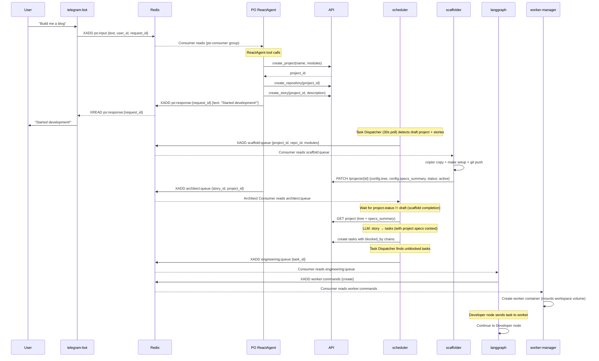
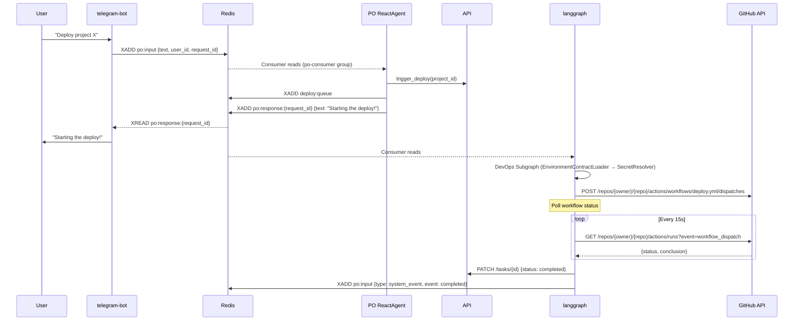
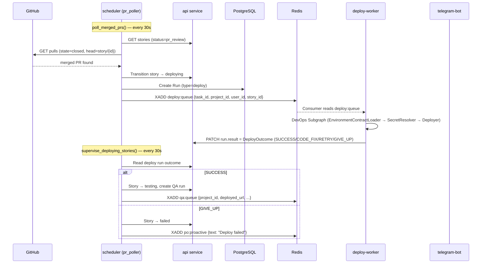

# Contracts

Typed schemas for the REST API and the Redis queues.

## Design Principles

1. **Schema-first** — all messages are validated by Pydantic schemas
2. **1:1 Queues** — one queue = one Writer → one Consumer (+ optional observers)
3. **Logical Actors** — we name the role (PO ReactAgent, Developer-Worker, langgraph), not the technical layer
4. **Traceable** — a `correlation_id` for end-to-end tracing
5. **One definition per request schema** — a request body is defined once, in
   `shared/contracts/dto/`, and `services/api/src/schemas/` re-exports that object.
   The API validates against the same class its callers import, so a field the
   caller sets cannot be one the server forbids.

The last one used to be false: the two trees held 21 same-named pairs whose fields
and types had drifted apart, and `PATCH /api/projects/{id}` answered 422 to every
`github_sync` call because the caller's `ProjectUpdate` carried a field the server's
`ProjectUpdate` did not have. `tests/unit/test_request_schemas_are_not_duplicated.py`
now fails on any name defined under both trees; its `KNOWN_DUPLICATES` backlog is
empty and may not grow.

### Canonical vocabularies (`shared/contracts/vocab.py`)

One `StrEnum` per cross-service concept. Producers and consumers import these
instead of restating a `Literal[...]` or a local enum:

| Enum | Values | Used by |
|------|--------|---------|
| `AgentType` | `claude`, `factory`, `codex`, `noop` | `WorkerConfig.agent_type`, `AgentConfigDTO.type`, worker-manager/worker-wrapper agent branching (re-exported from `queues.worker`) |
| `ActionType` | `create`, `feature`, `fix` | `EngineeringMessage.action` |
| `ResultStatus` | `success`, `failed`, `timeout` | `BaseResult.status` (and its subclasses) |
| `LifecycleEvent` | `started`, `progress`, `completed`, `failed`, `stopped` (canonical member set) | via the field-specific subsets below |

`LifecycleEvent` is the canonical member set, but each wire accepts only the
slice its producers emit — the subsets are `Literal[...]` over the enum members,
kept explicit so the historical per-field vocabularies are not merged:

- `TaskProgressKind` (`started`/`progress`/`completed`/`failed`, no `stopped`) —
  `ProgressEvent.type`, `WorkerEvent.event_type`.

Other vocabularies stay deliberately separate — they carry values the canonical
enums do not, so merging them would broaden a field past what the wire supports:

- `DeployAction` (`create`/`feature`/`fix` **plus** `stop`/`undeploy`) — deploy
  operations, a superset of `ActionType`. `TaskType` (**plus** `refactor`) — the
  planning-layer task kind.
- `WorkerCliKind` (`droid`/`claude_code`/`codex`) is the CLI's self-reported wire
  identity on `worker:events`. It remains a separate concept from `AgentType`;
  only the `codex` spelling currently overlaps.

`WorkerConfig.host_codex_home` adds no new queue shape beyond an optional field.
For `agent_type=codex` and `auth_mode=host_session`, worker-manager validates a
dedicated file-backed ChatGPT profile before image resolution. It then mounts
that host directory read-write at `/home/worker/.codex` and sets `CODEX_HOME`
to the same path. The profile must contain access and refresh tokens so the
non-interactive worker can refresh its session. Unknown agent values fail
Pydantic validation or explicit
LangGraph/image-routing checks; there is no fallback to Claude.

`ResultStatus` dropped the old `error` failure synonym: a failed result is
`failed`, never `error`. The `provisioner:results` consumer treats a message
that fails validation as terminal (logs it and ACKs) so a stale/invalid entry
cannot poison-loop the reclaim.

---

## Queue Registry

> **Complete list of all Redis Streams / Queues.**
>
> **Source of Truth:** `shared/queues.py` (`QUEUE_TOPOLOGY`)

### Scaffolding

| Queue | Group | DTO | Initiator | Consumer | Purpose |
|-------|-------|-----|-----------|----------|---------|
| `scaffold:queue` | `scaffold-consumers` | ScaffoldMessage | Task Dispatcher (scheduler) | scaffolder | Prepare repo: copier + make setup + git push |

---

### Architect Pipeline

| Queue | Group | DTO | Initiator | Consumer | Purpose |
|-------|-------|-----|-----------|----------|---------|
| `architect:queue` | `architect-consumers` | ArchitectMessage | PO ReactAgent | architect | Story → tasks LLM decomposition |

---

### Engineering Flows

| Queue | Group | DTO | Initiator | Consumer | Purpose |
|-------|-------|-----|-----------|----------|---------|
| `engineering:queue` | `capability-workers` | EngineeringMessage | Task Dispatcher (scheduler) | langgraph | Start development task |
| `deploy:queue` | `capability-workers` | DeployMessage | Task Dispatcher (scheduler) / PO | langgraph | Start deploy task |
| `qa:queue` | `qa-consumers` | QAMessage | Task Dispatcher (scheduler) / Admin API | langgraph (qa-worker) | Post-deploy QA: HTTP checks for GET-only criteria, else Claude Code on prod server |

---

### Worker Management

| Queue | Group | DTO | Initiator | Consumer | Purpose |
|-------|-------|-----|-----------|----------|---------|
| `worker:commands` | `worker_manager` | WorkerCommand | langgraph | worker-manager | Create/Delete worker containers |
| `worker:responses:developer` | — | WorkerResponse | worker-manager | langgraph | Developer worker command responses |

---

### Worker I/O (Developer only)

| Queue | Group | DTO | Initiator | Consumer | Purpose |
|-------|-------|-----|-----------|----------|---------|
| `worker:{worker_id}:input` | — | DeveloperWorkerInput | langgraph (DeveloperNode) | worker-wrapper | Task input to Developer worker |
| `worker:{worker_id}:output` | — | DeveloperWorkerOutput | worker-wrapper | langgraph (DeveloperNode) | Developer worker results |

> **Note:** Worker I/O streams use `worker:{worker_id}:input/output` pattern. Used only for Developer workers. PO communicates via `po:input` / `po:response:{request_id}` (see PO ReactAgent I/O below).

---

### Infrastructure

| Queue | Group | DTO | Initiator | Consumer | Purpose |
|-------|-------|-----|-----------|----------|---------|
| `provisioner:queue` | `infrastructure-workers` | ProvisionerMessage | scheduler | infra-service | Provision server |
| `env-observation:queue` | `infrastructure-workers` | EnvObservationRequest | scheduler | infra-service | Read a deployed service's environment |
| `provisioner:results` | `scheduler-consumers` | ProvisionerResult | infra-service | scheduler | Provisioning result |
| `provisioner:results` | `telegram-bot` | ProvisionerResult | infra-service | telegram-bot | Provisioning notifications |

---

### Events & Progress

| Queue | Group | DTO | Initiator | Consumer | Purpose |
|-------|-------|-----|-----------|----------|---------|
| `task_progress:{task_id}` | — | ProgressEvent | All services | telegram-bot | Task progress notifications |
| `workflow:status` | — | WorkflowStatusEvent | langgraph (poller) | telegram-bot | Deploy progress updates |

### Transport Layer Note

> **Important:** The "Initiator" column shows the **logical actor** — who makes the decision to publish.
>
> PO ReactAgent calls tools directly (Python functions → API/Redis). No CLI proxy needed.
>
> For **Developer-Worker** messages, the actual transport is:
> ```
> Developer Worker (AI Agent) → curl localhost:9090 → worker-wrapper → Redis
> ```
> The HTTP server in worker-wrapper validates and proxies agent results to Redis.

### Actor Roles

| Actor | Type | Description |
|-------|------|-------------|
| **PO ReactAgent** | LangGraph Agent | Product Owner, communicates via Redis streams `po:input`/`po:response` |
| **Developer-Worker** | Worker | Developer agent (inside engineering flow) |
| **langgraph** | Service | Workflow orchestrator |
| **worker-manager** | Service | Container lifecycle manager |
| **worker-wrapper** | Process | Agent bridge inside container |
| **telegram-bot** | Service | User interface |
| **infra-service** | Service | Server provisioning only (no app deploy) |
| **scheduler** | Service | Background tasks |

### MVP Notes

> [!IMPORTANT]
> **Tester Node** is an MVP stub. It does NOT spawn a Worker.  
> Implementation: A simple LangGraph node that always returns `{"passed": True}`.  
> Post-MVP: Will delegate to a Tester-Worker with code analysis capabilities.

### Rate Limiting Policy

> [!IMPORTANT]
> External APIs have hard limits. Exceeding them blocks all operations.

| Resource | Limit | Strategy |
|----------|-------|----------|
| **GitHub API** | 5000 req/hour | Token Bucket in `GitHubAppClient`, buffer 500 |
| **LLM API (Claude)** | Per-plan limits | Token Bucket per service, cost alerts |
| **External APIs** | Varies | Per-client configuration |

**Design Principles:**

1. **Fail-fast**: Raise `RateLimitExceeded` immediately, don't queue silently
2. **Buffer zone**: Use 90% of limit, leave 10% for emergencies
3. **Monitoring**: Expose metrics for all rate-limited resources
4. **Per-service**: Each client manages its own limits (MVP)
5. **Post-MVP**: Centralized Redis-based limiter for horizontal scaling

Implementation: `shared/clients/github.py` (`GitHubAppClient`).

---

## Flow Diagrams

### Engineering Flow


```mermaid
sequenceDiagram
    participant User
    participant TG as telegram-bot
    participant Redis
    participant PO as PO ReactAgent
    participant API
    participant SCH as scheduler
    participant SCF as scaffolder
    participant LG as langgraph
    participant WM as worker-manager

    User->>TG: "Build me a blog"
    TG->>Redis: XADD po:input {text, user_id, request_id}
    Redis-->>PO: Consumer reads (po-consumer group)

    Note over PO: ReactAgent tool calls
    PO->>API: create_project(name, modules)
    API-->>PO: project_id
    PO->>API: create_repository(project_id)
    PO->>API: create_story(project_id, description)
    PO->>Redis: XADD po:response:{request_id} {text: "Started development!"}
    Redis-->>TG: XREAD po:response:{request_id}
    TG->>User: "Started development!"

    Note over SCH: Task Dispatcher (30s poll) detects draft project + stories
    SCH->>Redis: XADD scaffold:queue {project_id, repo_id, modules}
    Redis-->>SCF: Consumer reads scaffold:queue
    SCF->>SCF: copier copy + make setup + git push
    SCF->>API: PATCH /projects/{id} {config.tree, config.specs_summary, status: active}

    PO->>Redis: XADD architect:queue {story_id, project_id}
    Redis-->>SCH: Architect Consumer reads architect:queue
    Note over SCH: Wait for project.status != draft (scaffold completion)
    SCH->>API: GET project (tree + specs_summary)
    Note over SCH: LLM: story → tasks (with project specs context)
    SCH->>API: create tasks with blocked_by chains

    Note over SCH: Task Dispatcher finds unblocked tasks
    SCH->>Redis: XADD engineering:queue {task_id}
    Redis-->>LG: Consumer reads engineering:queue
    LG->>Redis: XADD worker:commands {create}
    Redis-->>WM: Consumer reads worker:commands
    WM->>WM: Create worker container (mounts workspace volume)
    Note over LG: Developer node sends task to worker
    LG->>LG: Continue to Developer node
```

### Deploy Flow (PO-triggered)


```mermaid
sequenceDiagram
    participant User
    participant TG as telegram-bot
    participant Redis
    participant PO as PO ReactAgent
    participant API
    participant LG as langgraph
    participant GH as GitHub API

    User->>TG: "Deploy project X"
    TG->>Redis: XADD po:input {text, user_id, request_id}
    Redis-->>PO: Consumer reads (po-consumer group)
    PO->>API: trigger_deploy(project_id)
    PO->>Redis: XADD deploy:queue
    PO->>Redis: XADD po:response:{request_id} {text: "Starting the deploy!"}
    Redis-->>TG: XREAD po:response:{request_id}
    TG->>User: "Starting the deploy!"
    Redis-->>LG: Consumer reads
    LG->>LG: DevOps Subgraph (EnvironmentContractLoader → SecretResolver)
    LG->>GH: POST /repos/{owner}/{repo}/actions/workflows/deploy.yml/dispatches
    Note over LG: Poll workflow status
    loop Every 15s
        LG->>GH: GET /repos/{owner}/{repo}/actions/runs?event=workflow_dispatch
        GH-->>LG: {status, conclusion}
    end
    LG->>API: PATCH /tasks/{id} {status: completed}
    LG->>Redis: XADD po:input {type: system_event, event: completed}
```

### Deploy Flow (PR merge detection)


```mermaid
sequenceDiagram
    participant GH as GitHub
    participant SCH as scheduler (pr_poller)
    participant API as api service
    participant DB as PostgreSQL
    participant Redis
    participant DW as deploy-worker
    participant TG as telegram-bot

    Note over SCH: poll_merged_prs() — every 30s
    SCH->>API: GET stories (status=pr_review)
    SCH->>GH: GET pulls (state=closed, head=story/{id})
    GH-->>SCH: merged PR found
    SCH->>API: Transition story → deploying
    SCH->>DB: Create Run (type=deploy)
    SCH->>Redis: XADD deploy:queue {task_id, project_id, user_id, story_id}
    Redis-->>DW: Consumer reads deploy:queue
    DW->>DW: DevOps Subgraph (EnvironmentContractLoader → SecretResolver → Deployer)
    DW->>API: PATCH run.result = DeployOutcome (SUCCESS/CODE_FIX/RETRY/GIVE_UP)
    Note over SCH: supervise_deploying_stories() — every 30s
    SCH->>API: Read deploy run outcome
    alt SUCCESS
        SCH->>API: Story → testing, create QA run
        SCH->>Redis: XADD qa:queue {project_id, deployed_url, ...}
    else GIVE_UP
        SCH->>API: Story → failed
        SCH->>Redis: XADD po:proactive {text: "Deploy failed"}
    end
```

> **Note:** GitHub webhooks were removed. All PR merge detection and CI failure handling is done by `scheduler/src/tasks/pr_poller.py` (polling, 30s interval). This eliminates webhook reliability issues for newly scaffolded repos.

---

## Consumer Patterns

> **Implemented in**: Redis Streams unification (#3+#5)

All Redis Stream consumers use unified `RedisStreamClient.consume()` API from `shared.redis_client`.

### Unified consume() API

```python
async for msg in client.consume(
    stream="engineering:queue",
    group="capability-workers",
    consumer="worker-1",
    auto_ack=False,          # False = caller must call ack() after processing
    claim_pending=True,      # Recover PEL (crashed messages) on startup
    pending_timeout_ms=60_000,  # Min idle time before re-claiming pending message
):
    await process(msg.data)
    await client.ack(stream, group, msg.message_id)
```

### ACK Modes

| Mode | `auto_ack` | Use Case | Services |
|------|-----------|----------|----------|
| **Manual ACK** | `False` | At-least-once delivery, ack after successful processing | engineering-worker, deploy-worker, infra-service, worker-manager, scheduler |
| **Auto ACK** | `True` | Fire-and-forget, ack on read | telegram-bot (ProactiveListener, ProvisionerNotifier) |

### PEL Recovery

On startup with `claim_pending=True`, the consumer calls `XAUTOCLAIM` to reclaim messages that were pending for longer than `pending_timeout_ms`. This handles the case where a consumer crashes mid-processing — on restart, the message is automatically re-delivered.

**Special case:** PO Consumer (`services/langgraph/src/consumers/po.py`) uses a custom while-loop for concurrent dispatch but still implements PEL recovery via direct `XAUTOCLAIM` calls on startup.

### Consumer Inventory

| # | Consumer | File | Queue | ACK | PEL Recovery | Validation |
|---|----------|------|-------|-----|-------------|------------|
| 1 | Engineering Consumer | `langgraph/src/consumers/engineering.py` | `engineering:queue` | manual | `claim_pending` | in `process_fn` |
| 2 | Deploy Consumer | `langgraph/src/consumers/deploy.py` | `deploy:queue` | manual | `claim_pending` | in `process_fn` |
| 3 | PO Consumer | `langgraph/src/consumers/po.py` | `po:input` | manual (finally) | `xautoclaim` | `TypeAdapter` |
| 4 | Worker Manager | `worker-manager/src/consumer.py` | `worker:commands` | manual | `claim_pending` | `validate_python` |
| 5 | Infra Service | `infra-service/src/main.py` | `provisioner:queue` | manual | `claim_pending` | raw dict |
| 6 | Scheduler | `scheduler/src/main.py` | `provisioner:results` | manual | `claim_pending` | `model_validate` |
| 7 | Provisioner Notifier | `telegram_bot/src/notifications.py` | `provisioner:results` | auto | — | `model_validate` |
| 8 | Proactive Listener | `telegram_bot/src/main.py` | `po:proactive` | auto | — | raw dict |
| 9 | Architect Consumer | `langgraph/src/consumers/architect.py` | `architect:queue` | manual | `claim_pending` | `model_validate` |
| 10 | Scaffolder | `scaffolder/src/consumer.py` | `scaffold:queue` | manual | `claim_pending` | `model_validate` |
| 11 | QA Consumer | `langgraph/src/consumers/qa.py` | `qa:queue` | manual | `claim_pending` | `model_validate` |
| 12 | Env Observer | `infra-service/src/main.py` | `env-observation:queue` | manual | `claim_pending` | `consume_typed` |

---

# Part 1: REST DTO

## ProjectDTO

```python
# shared/contracts/dto/project.py

from enum import StrEnum
from pydantic import BaseModel, ConfigDict

class ProjectStatus(StrEnum):
    """Project lifecycle status.

    Lifecycle only — observable state, not process.
    Activity is derived from child entities (Story/Run).
    Runtime state is tracked by Application.status.
    """

    DRAFT = "draft"
    ACTIVE = "active"
    PAUSED = "paused"
    ARCHIVED = "archived"


class ServiceModule(StrEnum):
    """Available project modules for scaffolding.

    Must match module names in service-template/copier.yml.
    """
    BACKEND = "backend"
    TG_BOT = "tg_bot"
    NOTIFICATIONS = "notifications"
    FRONTEND = "frontend"


# The API validates requests against these two, imported from the contract.
# Fields are the Project columns a caller may set; module choice and free-text
# description live inside config.
class ProjectCreate(BaseModel):
    """Create project request."""
    id: uuid.UUID | None = None
    title: str
    status: ProjectStatus = ProjectStatus.DRAFT
    config: dict[str, Any] = {}


class ProjectUpdate(BaseModel):
    """Update project request, for both PUT and PATCH."""
    title: str | None = None
    status: ProjectStatus | None = None
    config: dict[str, Any] | None = None
    project_spec: dict | None = None


class ProjectDTO(BaseModel):
    """Project response."""
    model_config = ConfigDict(from_attributes=True)

    id: uuid.UUID
    title: str
    slug: str
    description: str | None = None
    status: ProjectStatus
    modules: list[ServiceModule] = []
    config: dict = {}
    owner_id: int
    project_spec: dict | None = None
```

## TaskDTO

```python
# shared/contracts/dto/task.py, re-exported by services/api/src/schemas/task.py

class TaskStatus(StrEnum):
    BACKLOG = "backlog"
    TODO = "todo"
    IN_DEV = "in_dev"
    IN_CI = "in_ci"
    TESTING = "testing"
    DONE = "done"
    BLOCKED = "blocked"
    WAITING_RESOURCES = "waiting_resources"
    WAITING_HUMAN_REVIEW = "waiting_human_review"
    FAILED = "failed"
    CANCELLED = "cancelled"

class TaskType(StrEnum):
    CREATE = "create"
    FEATURE = "feature"
    FIX = "fix"
    REFACTOR = "refactor"

class TaskRead(BaseModel):
    """Schema for reading a task."""
    id: str
    project_id: str
    type: str
    title: str
    description: str | None
    plan: str | None = None
    status: str
    priority: int
    acceptance_criteria: str | None
    need_e2e: bool = False
    current_iteration: int
    max_iterations: int
    failure_metadata: dict[str, Any] | None = None
    created_by: str
    created_at: datetime
    updated_at: datetime
    last_event: str | None = None
    elapsed_minutes: float | None = None
```

## TaskEventDTO

```python
# shared/contracts/dto/task.py, re-exported by services/api/src/schemas/task.py

class TaskEventType(StrEnum):
    STATUS_CHANGE = "status_change"
    ITERATION_START = "iteration_start"
    ITERATION_END = "iteration_end"
    NOTE = "note"
    COMMENT = "comment"  # Jira-style discussion on a task

class TaskEventRead(BaseModel):
    """Schema for reading a task event."""
    id: int
    task_id: str
    event_type: str
    from_status: str | None
    to_status: str | None
    iteration: int | None
    details: dict[str, Any]
    actor: str
    created_at: datetime
```

## RunDTO

```python
# shared/contracts/dto/run.py

from enum import StrEnum
from datetime import datetime
from pydantic import BaseModel, ConfigDict

class RunStatus(StrEnum):
    QUEUED = "queued"
    RUNNING = "running"
    COMPLETED = "completed"
    FAILED = "failed"
    CANCELLED = "cancelled"


class RunType(StrEnum):
    ENGINEERING = "engineering"
    DEPLOY = "deploy"
    QA = "qa"


class RunCreate(BaseModel):
    """Create run request."""
    project_id: str
    type: RunType
    spec: str | None = None


class RunDTO(TimestampedDTO):
    """Run response."""

    id: str
    project_id: str
    type: RunType
    status: RunStatus
    story_id: str | None = None
    spec: str | None = None
    result: RunResult | None = None   # typed per `type`, see below
```

### Typed `Run.result` (`shared/contracts/dto/run_result.py`)

`Run.result` is not a free-form dict. Each `RunType` has exactly one result shape,
bound to `type` by `RunDTO`:

| `RunType` | result model | required field | fields the scheduler routes on |
|---|---|---|---|
| `engineering` | `EngineeringRunResult` | `engineering_status` | (write-only; not routed) |
| `deploy` | `DeployRunResult` | `deploy_outcome` | `deploy_outcome`, `deployed_url`, `application_id`, `bot_username`, `deploy_fix_attempt`, `error_details` |
| `qa` | `QARunResult` | `qa_outcome` | `qa_outcome`, `summary`, `failed_checks` (`QAFailedCheck.name`/`.detail`) |

Rules (all enforced by validation, tested in `shared/tests/unit/test_run_result.py`):

- The models use `extra="forbid"`, so an **unknown field** or a payload belonging to
  **another run type** (e.g. a QA payload on a deploy run) is rejected. Unknown enum
  values (an outcome string the code doesn't know) fail the same way.
- `result=None` is allowed only while no outcome exists yet — `QUEUED`/`RUNNING`, or a
  `CANCELLED` (superseded) run such as a deploy that lost the project lock. A
  `COMPLETED` or `FAILED` run **must** carry a result; a terminal run without one is
  rejected, so it surfaces loudly instead of being silently skipped forever. Every
  producer failure path that reaches a terminal status writes a typed result (deploy
  outcomes, `QAOutcome.ERROR` on QA setup failures, `EngineeringStatus.FAILED`/`GAVE_UP`
  on engineering failures).
- Producers (langgraph deploy/QA/engineering handlers) construct the typed model and
  send `model_dump(mode="json")`, so there is one wire form. Consumers (scheduler
  supervisor) read outcomes through typed attributes — no `.get()` guessing, no
  re-parsing outcome strings.
- Storage is unchanged: the API keeps `Run.result` as a JSON column and its `RunRead`
  schema stays dict-typed (dumb passthrough). No DB migration is required — in-flight
  runs are written by the typed producers, so they parse by construction; historical
  runs are never re-validated on the API read path.
- The scheduler validates only the **latest** run per story
  (`SchedulerAPIClient.get_latest_run_by_story` parses `rows[0]` alone), so an older
  legacy/corrupt run in the story's history can never fail a story whose current run is
  valid. If that latest run fails validation (wrong-type/corrupt result, or a terminal
  run with no result), the supervisor fails the story once with a loud log and admin
  notification (`supervisor._fail_story_on_invalid_result`) — no infinite retry, no
  silent skip.
- `deployed_url` and `application_id` are optional on `DeployRunResult` (a standalone
  deploy, or a success where the app record couldn't be resolved, legitimately lacks
  `application_id`). But a story's QA handoff needs both, so the supervisor checks them
  in `_handle_deploy_success_story` **before** transitioning the story or creating a QA
  run: a `SUCCESS` result missing either is routed to a visible failure (fail story +
  notify admins), never a half-applied handoff that crashes the tick.

## UserDTO

```python
# shared/contracts/dto/user.py

from pydantic import BaseModel, ConfigDict

class UserDTO(BaseModel):
    """User response."""
    model_config = ConfigDict(from_attributes=True)
    
    id: int
    telegram_id: int

    is_admin: bool = False
```

---

# Part 1.1: Additional DTOs

## ServerDTO

```python
# shared/contracts/dto/server.py

from enum import StrEnum
from pydantic import BaseModel, ConfigDict
from datetime import datetime

class ServerStatus(StrEnum):
    NEW = "new"
    PENDING_SETUP = "pending_setup"
    PROVISIONING = "provisioning"
    ACTIVE = "active"
    UNREACHABLE = "unreachable"
    MAINTENANCE = "maintenance"
    FORCE_REBUILD = "force_rebuild"
    DISCOVERED = "discovered"


class ServerCreate(BaseModel):
    """Create server request."""
    handle: str
    host: str
    public_ip: str
    ssh_user: str = "root"
    ssh_key: str | None = None
    is_managed: bool = True
    status: str = "discovered"
    labels: dict = {}


class ServerUpdate(BaseModel):
    """Update server request."""
    handle: str | None = None
    host: str | None = None
    public_ip: str | None = None
    ssh_user: str | None = None
    ssh_key: str | None = None
    status: ServerStatus | None = None
    labels: dict | None = None
    is_managed: bool | None = None
    provider_id: str | None = None
    capacity_cpu: int | None = None
    capacity_ram_mb: int | None = None
    capacity_disk_mb: int | None = None
    used_ram_mb: int | None = None
    used_disk_mb: int | None = None
    os_template: str | None = None
    provisioning_started_at: datetime | None = None


class ServerDTO(BaseModel):
    """Server response."""
    model_config = ConfigDict(from_attributes=True)

    handle: str
    host: str
    public_ip: str
    status: str
    provider_id: str | None = None
    is_managed: bool
    labels: dict = {}
    capacity_cpu: int = 0
    capacity_ram_mb: int = 0
    capacity_disk_mb: int = 0
    used_ram_mb: int = 0
    used_disk_mb: int = 0
    os_template: str | None = None
    last_health_check: datetime | None = None
    provisioning_started_at: datetime | None = None
    provisioning_attempts: int = 0
```

## ApplicationDTO

```python
# shared/contracts/dto/application.py

from enum import StrEnum

class ApplicationStatus(StrEnum):
    """Runtime state of an application on a server."""
    NOT_DEPLOYED = "not_deployed"
    DEPLOYING = "deploying"
    RUNNING = "running"
    STOPPING = "stopping"
    STOPPED = "stopped"
    UNDEPLOYING = "undeploying"
    DOWN = "down"
    DEGRADED = "degraded"


class ApplicationDTO(TimestampedDTO):
    """Application response from API."""
    id: int
    repo_id: str
    server_handle: str
    service_name: str
    status: str
    last_health_check: datetime | None = None
    response_time_ms: int | None = None
    ssl_expires_at: datetime | None = None
    uptime_pct_24h: float | None = None
    ports: list[dict[str, Any]] = []
```

## DeploymentDTO

```python
# shared/contracts/dto/deployment.py

from enum import StrEnum

class DeploymentResult(StrEnum):
    """Outcome of a deployment attempt. Immutable after completion."""
    PENDING = "pending"
    SUCCESS = "success"
    FAILED = "failed"
    CANCELED = "canceled"

# services/api/src/schemas/service_deployment.py

class DeploymentRead(TimestampedDTO):
    """Immutable record of a deployment attempt."""
    id: int
    application_id: int | None = None
    project_id: str
    service_name: str
    server_handle: str
    port: int
    result: str
    deployed_sha: str | None = None
    deployed_at: datetime
    deployment_info: dict = {}
```

## Base DTOs

```python
# shared/contracts/dto/base.py

class BaseDTO(BaseModel):
    """Base DTO for all entities."""
    model_config = ConfigDict(from_attributes=True)

class TimestampedDTO(BaseDTO):
    """Base DTO with timestamps."""
    created_at: datetime
    updated_at: datetime | None = None
```

## AgentConfigDTO

```python
# shared/contracts/dto/agent_config.py

from pydantic import BaseModel, ConfigDict

from shared.contracts.vocab import AgentType

class AgentConfigDTO(BaseModel):
    """Agent configuration response."""
    model_config = ConfigDict(from_attributes=True)
    
    id: int
    name: str
    type: AgentType
    model: str
    system_prompt: str
    is_active: bool = True
```

## APIKeyDTO

```python
# shared/contracts/dto/api_key.py

class APIKeyDTO(BaseModel):
    """API Key response."""
    model_config = ConfigDict(from_attributes=True)

    id: int
    service: str
    key_enc: str
    created_at: str | None = None
```

## TaskExecutionDTO

```python
# shared/contracts/dto/task_execution.py

from pydantic import BaseModel, ConfigDict
from datetime import datetime
from typing import Literal, Any

class TaskExecutionDTO(BaseModel):
    """Worker execution record."""
    model_config = ConfigDict(from_attributes=True)
    
    id: str                                    # request_id from worker
    task_id: str | None = None                 # Optional link to high-level task
    worker_id: str
    started_at: datetime
    finished_at: datetime
    duration_ms: int
    exit_code: int
    status: Literal["success", "failure", "in_progress", "error"]
    result_data: dict[str, Any] | None = None  # AgentVerdict or error details
    created_at: datetime
```

---

# Part 2: Queue Messages

## Base Types

```python
# shared/contracts/base.py

from datetime import datetime
from typing import Literal
from pydantic import BaseModel, Field
import uuid


class QueueMeta(BaseModel):
    """Metadata for all queue messages."""
    version: Literal["1"] = "1"
    correlation_id: str = Field(default_factory=lambda: str(uuid.uuid4()))
    timestamp: datetime = Field(default_factory=datetime.utcnow)


class BaseMessage(QueueMeta):
    """Base class for queue messages."""
    request_id: str = Field(default_factory=lambda: str(uuid.uuid4()))
    callback_stream: str | None = None


class BaseResult(BaseModel):
    """Base result for async operations."""
    request_id: str
    status: ResultStatus  # shared.contracts.vocab
    error: str | None = None
    duration_ms: int | None = None
```

---

## ScaffoldMessage

**Queue:** `scaffold:queue`
**Initiator:** Task Dispatcher (scheduler, 30s poll)
**Consumer:** scaffolder service

```python
# shared/contracts/queues/scaffold.py

class ScaffoldMessage(BaseMessage):
    """Trigger scaffolding for a project repository.

    Published by scheduler for both new (draft) and existing (active) projects.

    Modes:
        full: Full scaffold — copier + make setup + git push (new projects).
        ensure: Verify workspace exists; if missing, clone + setup (existing projects).
    """
    project_id: str
    repository_id: str
    user_id: str
    template_repo: str    # e.g. "gh:vladmesh/service-template"
    project_name: str     # sanitized name for copier
    modules: str          # comma-separated, e.g. "backend,tg_bot"
    task_description: str = ""
    mode: Literal["full", "ensure"] = "full"
```

**Flow:**
- **Full mode** (new projects): Scheduler detects `project.status == draft` with stories → publishes ScaffoldMessage (mode=full) → Scaffolder runs copier + make setup + git push → saves tree to `project.config.tree` + parses YAML specs into `project.config.specs_summary` (models, events, domains) → sets `project.status = active`. Architect consumer waits for scaffold completion (polls project.status != draft) before decomposing stories.
- **Ensure mode** (existing projects): Scaffold trigger detects ACTIVE projects with TODO tasks → publishes ScaffoldMessage (mode=ensure) → Scaffolder checks if workspace exists; if missing, clones repo + runs setup → sets `repository.workspace_ready = True`. Task dispatcher checks `workspace_ready` flag before dispatching. Worker-manager GC calls `POST /repositories/{repo_id}/notify-workspace-deleted` to clear `workspace_ready` on deletion.

---

## ArchitectMessage

**Queue:** `architect:queue`
**Initiator:** PO ReactAgent (`create_story` tool)
**Consumer:** scheduler (Architect Consumer)

```python
# shared/contracts/queues/architect.py

class ArchitectMessage(BaseMessage):
    """Trigger story decomposition into tasks."""
    story_id: str
    project_id: str
    user_id: str
    is_reopen: bool = False          # True when story is being reopened (not first decomposition)
    user_report: str | None = None   # User feedback on what's wrong (for reopened stories)
```

**Flow:** PO creates Story → publishes ArchitectMessage → Architect Consumer calls LLM to decompose story into N tasks with `blocked_by_task_id` dependency chains → Task Dispatcher picks up unblocked tasks and publishes EngineeringMessages.

**Reopen flow:** When user reports a problem with a completed story, PO calls `reopen_story` tool → story transitions back to `in_progress` → ArchitectMessage published with `is_reopen=True` and `user_report` containing user feedback. Architect reviews previous tasks before creating new fix tasks.

---

## EngineeringMessage

**Queue:** `engineering:queue`
**Initiator:** Task Dispatcher (scheduler)
**Consumer:** langgraph

```python
# shared/contracts/queues/engineering.py

class EngineeringMessage(BaseMessage):
    """Start engineering task."""
    task_id: str
    project_id: str
    user_id: str
    action: ActionType = ActionType.CREATE  # shared.contracts.vocab
    description: str | None = None
    skip_deploy: bool = False
    planning_task_id: str | None = None  # planning-layer Task ID for status updates
    story_id: str | None = None  # story ID for worker reuse across tasks
    deploy_fix_attempt: int = 0  # tracks deploy→engineering retry count
    branch: str | None = None  # story branch name (e.g. "story/{story_id}")


class EngineeringResult(BaseResult):
    """Engineering task result."""
    files_changed: list[str] | None = None
    commit_sha: str | None = None
    branch: str | None = None
```

**Action types:**
- `create` (default) — new project: scaffold → develop → CI → deploy
- `feature` — add feature to existing project: develop → CI → deploy (no scaffolding)
- `fix` — fix issue in existing project: develop → CI → deploy (no scaffolding)

**Flags:**
- `skip_deploy=True` — skip auto-deploy after CI passes (develop → CI only)
- `planning_task_id` — when set, engineering worker updates task status (in_dev → done/failed) and writes `iteration_end` events. Dispatcher-created runs always set this + `skip_deploy=True` (deploy handled at story level).

---

## DeployMessage

**Queue:** `deploy:queue`
**Initiator:** Task Dispatcher (scheduler) / PO
**Consumer:** langgraph

```python
# shared/contracts/queues/deploy.py

class DeployTrigger(StrEnum):
    """Origin of a deploy request."""
    ENGINEERING = "engineering"
    WEBHOOK = "webhook"
    PO = "po"
    ADMIN = "admin"


class DeployAction(StrEnum):
    """Type of deploy operation."""
    CREATE = "create"
    FEATURE = "feature"
    FIX = "fix"
    STOP = "stop"
    UNDEPLOY = "undeploy"


class DeployOutcome(StrEnum):
    """Outcome stored in run.result for dispatcher consumption."""
    SUCCESS = "success"
    SMOKE_FAILURE = "smoke_failure"
    CODE_FIX = "code_fix"
    RETRY = "retry"
    GIVE_UP = "give_up"


class DeployMessage(BaseMessage):
    """Start deploy task."""
    task_id: str
    project_id: str
    user_id: str = ""
    story_id: str = ""
    triggered_by: DeployTrigger = DeployTrigger.ENGINEERING
    action: DeployAction = DeployAction.CREATE
    deploy_fix_attempt: int = 0
    head_sha: OptionalCommitSha = ""
    # Required for STOP/UNDEPLOY, rejected as missing by the model otherwise.
    # A project can run on several servers, so the consumer must bring down the
    # application it was told about instead of picking one itself.
    application_id: int | None = None
    # Deploy-time literals on top of the contract, for state a caller turns on and
    # off between deploys of the same commit (QA's temporary test identity). Only
    # keys the contract declares as literals are accepted.
    env_overrides: dict[str, str] = {}
    # This deploy must be the last writer: it skips the redundant-deploy shortcut
    # and, once its own payload is in the repository secrets, stops every
    # unfinished deploy.yml run. Set by a revoke, whose whole point is removing a
    # value an older run could put back.
    fence_active_deploys: bool = False


class DeployResult(BaseResult):
    """Deploy task result."""
    deployed_url: str | None = None
    server_ip: str | None = None
    port: int | None = None
```

### Deploy dispatch boundary

`shared/contracts/dto/deploy_dispatch.py`. A deploy run stops being stoppable from inside the
system the moment its worker reaches GitHub Actions. The crossing is recorded on the run under a
row lock, so a worker about to dispatch and a caller trying to stop it first cannot both win.

| Endpoint | Taken by | Answers |
| --- | --- | --- |
| `POST /api/runs/{id}/start` | any worker taking a run to `running`, as its first act on the message | `DeployRunStart` — `started=False` for a run that is already terminal, and the worker then does nothing with it |
| `POST /api/runs/{id}/dispatch-claim` | the deploy worker, immediately before `workflow_dispatch` and before a rerun | `DeployDispatchClaim` — `granted=False` for a run already cancelled, and the worker then dispatches nothing; `lease_expires_at` is how long the claim is good for |
| `POST /api/runs/{id}/dispatch-withdraw` | whoever needs the deploy stopped (the temporary-access sweep) | `DeployDispatchWithdrawal` — `withdrawn` (never left), `already_dispatched` (stop it on Actions instead), `already_terminal` |
| `POST /api/runs/{id}/dispatch-supersede` | the same caller, once an `already_dispatched` claim has gone quiet | `DeployDispatchSupersede` — `superseded`, `already_settled`, `not_claimed`, or `lease_live` (wait) |

The claim stamps `run_metadata.dispatch_claimed_at` and `run_metadata.dispatch_lease_expires_at`;
the withdrawal reads the first. A withdrawal always marks the run cancelled, because the worker
polls that to stop its own Actions run.

A terminal run never goes back to a live one: `PATCH /api/runs/{id}` refuses such a move with 409,
and `start` is the locked form of the same transition. Without it a worker's read-then-write would
overwrite a cancellation that landed in between, and the resurrected run would pass the claim.

`already_dispatched` is ordinarily settled by the claiming worker's own recorded outcome — a
terminal run carrying a typed result. A worker that dies after claiming never writes one, so
holding the boundary is a lease rather than a possession: the claim carries a deadline (renewed
each time the worker asks), the worker re-reads the clock immediately before dispatching and
refuses once it has passed, and past the deadline `dispatch-supersede` closes the boundary against
it — cancelling the run so it can never be re-claimed and stamping
`run_metadata.dispatch_superseded_at`. That stamp settles the dispatch for any later reader, which
is what lets a restarted sweep revoke instead of waiting on a process that is gone.

The lease is not a fence around the GitHub effect and nothing may be revoked on the strength of
it. It is read on the worker's own clock one HTTP call before the request, so a paused worker, or
a delayed request, can still be accepted after the deadline. What makes that harmless is on the
deploy side: a workflow reads its payload from the repository secrets when it runs, and a fencing
deploy writes its payload before it fences, so a run created after that point carries the new
value whatever asked for it.

A run's outcome is the first one written, and every writer takes the run's row before it reads it
— the rule is decided from the run's current state, and a plain read decides it from a state
another transaction is already replacing. Once a terminal run carries a result, `PATCH
/api/runs/{id}` refuses any change to `status`, `result` or `error_message` with 409; an identical
repeat is accepted as the no-op it is, and fields that are not the outcome (metadata, token
accounting) are still writable. Two writers race for one run whenever a supervisor ends a run its
worker is still inside — the temporary-access sweep failing a QA run whose borrowed identity
expired — and terminal-to-terminal is the same overwrite as terminal-to-live. Filling the result of
a terminal run that has none is not a second outcome: a cancelled run is marked terminal by whoever
cancelled it, and the worker that owned it records what it did afterwards, which is what settles
`already_dispatched` above.

### Temporary access: the boundary of the guarantee

The promise about a test identity's access is not "the access can never come back". It cannot be:
between the decision and the effect stands GitHub Actions, which this system does not own and
which works asynchronously, so no amount of stopping writers here proves that none of them will
apply the old value afterwards. The promise is that **the access does not outlive one
reconciliation interval after it is seen**, and it is made at two speeds:

- **Fast, while the slot is watched** — the grant's own lifetime plus
  `supervisor.temporary_access_revoked_watch_minutes` after the readings closed it. Here the value
  does not outlive one reconciliation interval. This is the level a dispatch that was already in
  flight lands in, and it is worth an ssh every few minutes.
- **Slow, for as long as the slot exists** — the invariant *the key is empty while no grant holds
  it* is checked on its own cadence, `supervisor.temporary_access_contract_audit_hours`, for every
  `(project, env_key)` slot the record knows, however long ago its last grant closed. Here the value
  does not outlive one slow-check interval. It costs one ssh and one playbook per slot, which is why
  it is counted in hours rather than minutes.

The watch expiring is therefore not the end of the promise, only a change of speed. A value applied
a minute after the fast watch ends is found by the slow check, revoked by the same code, and fails
the same way visibly if it will not go.

What that rests on: `revoked` is written only after the environment of the running service has been
read back through `env-observation:queue` and no longer carries the value. Until that reading has
been made the grant stays live in `revoking`, the sweep keeps revoking, and the operation is
idempotent. A writer that applies the old value late — a superseded worker's dispatch that GitHub
accepted anyway, or a hand-run deploy — is then simply a disagreement between what was asked for
and what is observed, and the next cycle sees it and corrects it. A reading that could not be taken
settles nothing either way: the grant stays live, and the sweep asks again.

Three rules make that hold rather than merely describe it:

- **No caller may declare a grant revoked.** `PATCH /api/temporary-access-grants/{id}` refuses
  `status=revoked` outright (422). The only path to that status is
  `POST /api/temporary-access-grants/{id}/observation`, which takes a `TemporaryAccessObservation`
  and decides from the record. A grant closed on a caller's belief would be exactly the claim the
  system cannot make.
- **The reading must be of the deployment QA tested.** Applications are unique per
  `(repo_id, server_handle)`, so a project can be running on several servers at once. The
  observation names its `application_id`, and the record refuses one that is not the
  `application_id` carried in the grant's stored `QAMessage`. An empty slot on another machine says
  nothing about the bot the test identity was admitted by.
- **One empty reading closes nothing.** A reading is a moment, and a dispatch already in flight
  lands after moments. The grant stays under reconciliation until `REVOKE_CONFIRMATION_READINGS`
  readings taken over `REVOKE_CONFIRMATION_WINDOW` (both in
  `shared/contracts/dto/temporary_access.py`) have agreed. A reading that finds the value again
  restarts the streak and the sweep revokes again. That window *is* the reconciliation interval the
  promise above is written in.
- **Closing the grant does not stop the readings.** The writer that can land between two readings
  can land after the last one, so a closed grant keeps being read for
  `supervisor.temporary_access_revoked_watch_minutes` — the sweep asks the API for the live grants
  plus the ones revoked since that cutoff (`GET /api/temporary-access-grants/?live=true&
  revoked_after=…`). A reading that finds the value on a closed grant puts it back to `revoking`
  under `revoke_reason=observed_after_revoke`, with `reopened_at` stamped and the retry budget
  counted from there, and the sweep clears it again on the same tick. Unless the slot has a live
  owner by then: the contract holds one value per `(project, env_key)`, so what is being read may
  be a later grant's access, and that grant is reconciled on its own.
- **Past the watch window the slot is still read, only rarely.** The invariant does not expire with
  the window, so the sweep also asks for the owner of every closed slot last read before
  `now - supervisor.temporary_access_contract_audit_hours` (`GET /api/temporary-access-grants/
  ?live=true&slot_audit_before=…`). One row per slot: the grant that answers for it is the newest
  recorded for that `(project, env_key)`, and the older ones would be the same ssh repeated for
  history. `observed_at` is what makes a slot due and every reading stamps it, so a slot inside the
  fast watch is never audited on top of being watched. A slot on a server that cannot be reached is
  never read and would otherwise be asked for every tick, so the scheduler takes a marker
  (`temporary-access:slot-audit:{project}:{env_key}`, expiring with the interval) before the
  question goes out. What the slow check finds goes down the same path as the fast one: reopened
  under `observed_after_revoke`, revoked, and escalated to a human if it stays.

Cancelling runs on Actions, withdrawing a queued dispatch and superseding a dead claim all remain.
None of them is proof that the access is gone; they shorten the window in which the old value can
be written back. What says it is gone is the reading.

A disagreement that outlives `supervisor.temporary_access_unrevoked_ttl_minutes` or
`supervisor.temporary_access_max_revoke_attempts` stops being an internal retry: the QA run fails
with `qa_cleanup_failed` naming the observed state, and the story goes to a human rather than
waiting in TESTING.

### QA handoff plan

`shared/contracts/dto/qa_handoff.py`. What a successful deploy still owes QA, written into the QA
run's `run_metadata` under `qa_handoff` in the same call that creates the run — before the story
leaves DEPLOYING. `QAHandoffPlan` carries the `QAMessage` and, when the deployed bot does not
already admit the QA identity, a `TemporaryAccessRequest` (`env_key`, `subject`, `head_sha`).
`supervise_testing_stories` finishes any handoff left unfinished from this plan, so no step of it
depends on the process that planned it still being alive.


---

## QAMessage

**Queue:** `qa:queue`
**Initiator:** Task Dispatcher (scheduler) / Admin API
**Consumer:** langgraph (qa-worker)

```python
# shared/contracts/queues/qa.py

class QAOutcome(StrEnum):
    """Outcome stored in run.result for dispatcher consumption."""
    PASSED = "passed"
    FAILED = "failed"
    EXHAUSTED = "exhausted"
    ERROR = "error"


class QAMessage(BaseMessage):
    """Trigger QA testing for a deployed project."""
    story_id: str = ""
    project_id: str
    user_id: str
    deployed_url: str
    application_id: int
    acceptance_criteria: str      # resolved by the producer, never by the consumer
    run_id: str = ""
    bot_username: str | None = None
    qa_attempt: int = 0
```

**Acceptance criteria:** `Repository.acceptance_criteria` is the single source of truth for what QA tests. `POST /api/repositories/` seeds every repository with `BASELINE_ACCEPTANCE_CRITERIA` (`shared/contracts/acceptance.py`), so a story that never reached the architect still has criteria; the architect's `update_acceptance_criteria` tool extends the list as stories add functionality. Story and task criteria describe work to be done and are not what QA runs.

Producers (supervisor, admin `run-e2e`) resolve the criteria and put them on the message. Both refuse to create a QA run without them — the supervisor fails the story visibly before it reaches TESTING, and `run-e2e` answers 422 — so QA never starts a run it can only error out of.

**Bot username:** `Repository.bot_username` is the stored source. `POST /api/projects/{id}/telegram/token` writes it there from the `getMe` response in the same transaction that stores the token, and both producers read it off the same record they read the criteria from. A project without a primary repository gets 409 instead of a half-bound token. The deploy smoke check also reports a `bot_username` on `DeployRunResult`; the supervisor uses it only when the repository has none. A tg_bot project reaching QA without a username errors the run, so a write that silently does nothing turns a working bot into a failed story — the endpoint refuses instead.

**Health-only criteria:** criteria whose every line is a plain `- GET <path> returns <status>` are decided by the QA consumer over HTTP (`parse_health_only_criteria` → `run_health_checks`), with no SSH and no LLM. One prose line sends the whole block to Claude Code on the server instead.

`returns <status>` means the path itself answers that status, so the checks do not follow redirects: a criterion naming a redirect is checked against the redirect, and a criterion naming 200 is not satisfied by a path that redirects to a 200. Checks are retried while the service is still coming up.

The consumer parses the criteria *before* resolving anything else, and only the agent branch reads the server, its SSH key, and `bot_username`. A criteria block the deployed URL alone can answer must not fail over agent scaffolding it never uses.

**Flow:** Deploy succeeds → supervisor resolves criteria → transitions story to TESTING → creates QA run → publishes QAMessage → QA consumer runs the criteria (HTTP checks, or Claude Code on the prod server) → writes `QAOutcome` to `run.result`. Supervisor polls run outcome and routes: PASSED → complete story, FAILED → create fix task + redispatch to engineering, EXHAUSTED/ERROR → fail story.

**Lifecycle operations:** `stop` and `undeploy` actions are handled by the `deploy_lifecycle` module, which SSHes to the server and runs `docker compose stop/down` directly — skipping the full DevOps subgraph.

---

## Workflow DTOs

```python
# shared/contracts/queues/workflow.py

class WorkflowTriggerRequest(BaseModel):
    """Request to trigger GitHub Actions workflow."""
    project_id: str
    repo_full_name: str           # "org/repo"
    workflow_file: str = "main.yml"
    inputs: dict[str, str] = {}   # workflow_dispatch inputs

class WorkflowStatusResult(BaseResult):
    """
    Result of workflow execution.
    Derived from: shared.clients.github.WorkflowRun (GitHub API response).
    """
    run_id: int | None = None
    run_url: str | None = None
    deployed_url: str | None = None
    conclusion: Literal["success", "failure", "cancelled", "skipped"] | None = None

class WorkflowStatusEvent(BaseModel):
    """Progress event for workflow execution."""
    project_id: str
    run_id: int
    status: Literal["queued", "in_progress", "completed"]
    conclusion: Literal["success", "failure", "cancelled", "skipped"] | None = None
    current_step: str | None = None
    timestamp: datetime = Field(default_factory=datetime.utcnow)
```


---


---

##### 3. Worker Communication (Single-Listener Pattern)
The Orchestrator (LangGraph) listens to **one** stream for all worker results:

| Stream | Initiator | Consumer | Purpose |
|--------|-----------|----------|---------|
| `worker:developer:output` | worker-wrapper, worker-manager | LangGraph | All results: success, logical errors, AND crash failures. |

> **Why Single-Listener?**
> - Simpler architecture: LangGraph has one entry point for all outcomes
> - `worker-manager` handles crashes (detected via Docker events) and publishes
>   failure results to `output`:
>   ```python
>   # When worker-manager detects a container crash via Docker events:
>   DeveloperWorkerOutput(
>       status="failed",
>       error="Worker crashed: OOM killed",
>       task_id=...,
>       request_id=...
>   )
>   ```
> - LangGraph treats all failures uniformly (retry logic in one place)

| Queue | Initiator | Consumer | Purpose |
|-------|-----------|----------|---------|
| `worker:commands` | LangGraph | worker-manager | Command to Create/Delete worker container. |
| `worker:responses:developer` | worker-manager | langgraph | Responses for Developer worker commands (e.g. "Developer container created"). |

## WorkerCommand / WorkerResponse

**Queue (commands):** `worker:commands`
**Initiator:** langgraph
**Consumer:** worker-manager

**Queue (responses):** `worker:responses:developer`
**Initiator:** worker-manager
**Consumer:** langgraph

```python
# shared/contracts/queues/worker.py

# AgentType is the canonical enum (shared/contracts/vocab.py), re-exported here.
from shared.contracts.vocab import AgentType  # claude / factory / codex / noop


class WorkerCapability(StrEnum):
    GIT = "git"
    GITHUB_CLI = "github_cli"
    CURL = "curl"


class WorkerChannels(StrEnum):
    """Redis stream channels and patterns."""
    COMMANDS = "worker:commands"
    INPUT_PATTERN = "worker:{worker_id}:input"
    OUTPUT_PATTERN = "worker:{worker_id}:output"


class WorkerConfig(BaseModel):
    """Worker container configuration."""
    name: str
    worker_type: Literal["developer"]         # Worker type for queue naming
    agent_type: AgentType                     # Which AI agent to use
    instructions: str                         # Content for instruction file (CLAUDE.md / AGENTS.md)
    task_content: str | None = None           # Content for TASK.md (optional, for task-driven workers)
    allowed_commands: list[str]               # ["project.*", "engineering.start"]
    capabilities: list[WorkerCapability]      # ["git", "copier"]
    env_vars: dict[str, str] = {}
    auth_mode: Literal["host_session", "api_key"] = "host_session"
    host_claude_dir: str | None = None
    api_key: str | None = None


class CreateWorkerCommand(QueueMeta):
    """Create new worker."""
    command: Literal["create"] = "create"
    request_id: str
    config: WorkerConfig
    context: dict[str, str] = {}   # Additional context (user_id, task_id, etc.)


class DeleteWorkerCommand(QueueMeta):
    """Delete worker."""
    command: Literal["delete"] = "delete"
    request_id: str
    worker_id: str
    reason: Literal["completed", "failed", "timeout"] | None = None


class StatusWorkerCommand(QueueMeta):
    """Get worker status."""
    command: Literal["status"] = "status"
    request_id: str
    worker_id: str


WorkerCommand = CreateWorkerCommand | DeleteWorkerCommand | StatusWorkerCommand


class CreateWorkerResponse(BaseModel):
    """Response to create command."""
    request_id: str
    success: bool
    worker_id: str | None = None
    error: str | None = None


class DeleteWorkerResponse(BaseModel):
    """Response to delete command."""
    request_id: str
    success: bool
    error: str | None = None


class StatusWorkerResponse(BaseModel):
    """Response to status command."""
    request_id: str
    success: bool
    status: Literal["starting", "running", "stopped", "failed"] | None = None
    error: str | None = None


WorkerResponse = CreateWorkerResponse | DeleteWorkerResponse | StatusWorkerResponse
```

> **Note:** Message passing goes **directly** to worker queues (`worker:{id}:input`, etc.),
> NOT through worker-manager. The manager handles only container lifecycle.

## WorkerStatus

```python
# shared/contracts/dto/worker.py

class WorkerStatus(StrEnum):
    STARTING = "STARTING"
    RUNNING = "RUNNING"
    PAUSED = "PAUSED"
    DEAD = "DEAD"
    FAILED = "FAILED"
    STOPPED = "STOPPED"
    GONE = "GONE"       # Stale Redis entry, container no longer exists
    UNKNOWN = "UNKNOWN"
```

Used across worker-manager (manager, events, introspect router) and langgraph (worker_spawner). Replaces all hardcoded status strings.

---


## EngineeringStatus

```python
# shared/contracts/dto/engineering.py

class EngineeringStatus(StrEnum):
    """Status of the engineering subgraph execution.

    Lifecycle:
        IDLE → (subgraph runs) → DONE | GAVE_UP | FAILED
        FAILED → (supervisor retries) → IDLE  OR  (retries exhausted) → GAVE_UP

    FAILED is transient — supervisor either retries or escalates to GAVE_UP.
    """

    IDLE = "idle"
    DONE = "done"
    GAVE_UP = "gave_up"
    FAILED = "failed"
```

Used by Developer node and Engineering consumer. Replaces former bare strings (`"done"`, `"developer_blocked"`, `"developer_rejected"`, etc.). The `GAVE_UP` status covers both former "blocked" (worker hit a blocker) and "rejected" (infra issue) paths — in both cases a human needs to intervene.


---

## PO ReactAgent I/O

| Queue | Group | DTO | Initiator | Consumer | Purpose |
|-------|-------|-----|-----------|----------|---------|
| `po:input` | `po-consumer` | `POInputMessage` (discriminated union: `POUserMessage` / `POSystemEvent` / `POReminderMessage`) | telegram-bot, workers | langgraph (PO consumer) | User messages and system events to PO |
| `po:response:{request_id}` | — | `POResponse` | langgraph (PO consumer) | telegram-bot | PO response for specific request |
| `po:proactive` | `tg-bot-proactive` | `POProactiveMessage` | langgraph (PO `notify_user` tool, deploy-worker) | telegram-bot (ProactiveListener) | Proactive messages to users (PO notifications + webhook deploy results) |

> **Transport note:** PO streams use **flat Redis fields** (not JSON `data` wrapper). Use `to_flat_fields()` / `from_flat_fields()` helpers from `shared.contracts.queues.po` for serialization.

**System events**: Workers write to `po:input` (via `callback_stream`) with `type: "system_event"`. PO decides whether to notify the user via `notify_user` tool → `po:proactive`. The old `po:events:{task_id}` pattern is replaced — events go directly to `po:input`. User-facing resource lifecycle events are `task_waiting_resources`, `task_impossible_capacity`, and `task_resources_resumed`; the scheduler supplies context, PO writes the user text.

---

---

## Developer Worker I/O

> **Terminology:** Developer is a concrete node inside the Engineering Subgraph.
> Engineering is the "department" abstraction for the PO. Developer is the implementation (the worker that writes the code).
> See [GLOSSARY.md](./GLOSSARY.md#engineering-vs-developer).

The communication between LangGraph (the Engineering Subgraph, specifically the DeveloperNode) and a Developer Worker.

**Design Decision:** Developer Workers are **ephemeral** (stateless). Each task spawns a fresh worker.
Context is the code in repo + error messages — no session persistence needed.

**Queue (input):** `worker:{worker_id}:input`
**Initiator:** langgraph (DeveloperNode)
**Consumer:** worker-wrapper (inside Developer container)

**Queue (output):** `worker:{worker_id}:output`
**Initiator:** worker-wrapper (inside Developer container)
**Consumer:** langgraph (DeveloperNode)

> **Note**: Developer workers use the `worker:{worker_id}:input/output` pattern.
> Each worker gets unique streams identified by `worker_id`.

```python
# shared/contracts/queues/developer_worker.py

from datetime import datetime
from pydantic import BaseModel, Field
import uuid


class DeveloperWorkerInput(BaseModel):
    """Task for Developer Worker from LangGraph."""

    request_id: str = Field(default_factory=lambda: str(uuid.uuid4()))
    task_id: str                    # Engineering task ID
    project_id: str                 # Project UUID
    prompt: str                     # Task specification
    timeout: int = 1800             # Max execution time (seconds)
    timestamp: datetime = Field(default_factory=datetime.utcnow)


class DeveloperWorkerOutput(BaseResult):
    """Result from Developer Worker to LangGraph."""

    # request_id, status, error, duration_ms inherited from BaseResult
    task_id: str                    # Engineering task ID
    commit_sha: str | None = None   # Commit SHA if code was written
    pr_url: str | None = None       # PR URL if created
    timestamp: datetime = Field(default_factory=datetime.utcnow)
```

> **Post-MVP:** Add `previous_attempts: list[AttemptLog]` to Input and `approach: str` to Output
> for retry context when Tester/CI returns task for rework. For MVP, Developer sees current code
> and error — sufficient for simple iterations.

---

## ProvisionerMessage

**Queue:** `provisioner:queue`  
**Initiator:** scheduler  
**Consumer:** infra-service

```python
# shared/contracts/queues/provisioner.py

class ProvisionerMessage(BaseMessage):
    """Provision server."""
    server_handle: str       # Cloud provider ID (Droplet ID) or unique identifier
    is_recovery: bool = False


class ProvisionerResult(BaseResult):
    """
    Provisioning result.
    Stream: provisioner:results
    Consumers: scheduler (update DB), telegram-bot (notify admin)
    """
    server_handle: str
    server_ip: str | None = None
    services_redeployed: int = 0
    errors: list[str] | None = None
```

---

## EnvObservationRequest

**Queue:** `env-observation:queue`
**Initiator:** scheduler (the temporary-access sweep)
**Consumer:** infra-service

A deploy is a request handed to GitHub Actions, not an effect. Whoever has to know that a value is
gone from the running service asks for it to be read where the SSH key and the playbooks already
are. The reading changes nothing, so repeating it is free.

```python
# shared/contracts/queues/env_observation.py

class EnvObservationRequest(BaseMessage):
    """Read one environment slot of one deployed service."""
    project_id: str
    server_handle: str      # where the service runs
    service_slug: str       # the directory the deploy put it under
    env_key: str


class EnvObservationOutcome(StrEnum):
    OBSERVED = "observed"
    # SSH down, playbook failed, nothing running to read. Neither a success nor
    # a failure of whatever the caller wanted to confirm.
    UNREACHABLE = "unreachable"


class EnvObservationResult(BaseModel):
    """What the running service has, or why it could not be asked."""
    request_id: str
    outcome: EnvObservationOutcome
    env_key: str
    present: bool | None = None   # None when nothing was read
    containers: int = 0
    detail: str = ""
```

The answer does not travel on a queue: `observe_service_env` runs
`ansible/playbooks/observe_service_env.yml`, which reads the slot out of the running containers
(not the `.env` file next to them), and the result is left in Redis under
`env_observation_result_key(request_id)` for `ENV_OBSERVATION_RESULT_TTL_SECONDS`. The caller is a
sweep that will be on a later tick, or in a later process, by the time the playbook is done.
`env_observation_pending_key(request_id)` is set with an expiry before publishing so one question
is asked per window rather than one per tick.

`UNREACHABLE` is not a third answer about the slot. It says the reading did not happen, and callers
must treat it as the absence of an answer: not a confirmation, not a failure.

---


---

## ProgressEvent

**Stream:** `task_progress:{task_id}`  
**Initiator:** All consumers  
**Consumer:** telegram-bot

```python
# shared/contracts/events.py

class ProgressEvent(BaseModel):
    """Task progress notification."""
    type: TaskProgressKind  # LifecycleEvent slice: started/progress/completed/failed
    request_id: str
    task_id: str | None = None
    timestamp: datetime = Field(default_factory=datetime.utcnow)
    message: str | None = None
    progress_pct: int | None = None
    current_step: str | None = None
    error: str | None = None
```

---

## File Structure

```
shared/contracts/
├── __init__.py
├── base.py                  # QueueMeta, BaseMessage, BaseResult
├── events.py                # ProgressEvent
├── dto/
│   ├── __init__.py
│   ├── project.py           # ProjectDTO, ProjectCreate
│   ├── task.py              # TaskDTO, TaskCreate
│   ├── user.py              # UserDTO
│   ├── server.py
│   ├── story.py              # StoryDTO, StoryCreate
│   ├── repository.py         # RepositoryDTO, RepositoryCreate
│   ├── brainstorm.py         # BrainstormDTO, BrainstormCreate
│   ├── base.py              # BaseDTO, TimestampedDTO
│   ├── application.py       # ApplicationDTO, ApplicationStatus enum
│   ├── deployment.py        # DeploymentResult enum
│   ├── run.py               # RunDTO, RunType, RunStatus enums
│   ├── engineering.py       # EngineeringStatus enum
│   ├── service_deployment.py  # ServiceDeploymentDTO (legacy alias)
│   ├── agent_config.py
│   ├── allocation.py
│   ├── task_execution.py
│   └── worker.py            # WorkerStatus enum
└── queues/
    ├── __init__.py           # Re-exports PO contracts
    ├── engineering.py
    ├── deploy.py
    ├── scaffold.py           # ScaffoldMessage
    ├── architect.py          # ArchitectMessage
    ├── provisioner.py
    ├── workflow.py
    ├── worker.py
    ├── qa.py                 # QAMessage, QAOutcome, QAServerInfo
    ├── developer_worker.py
    └── po.py                 # POInputMessage, POResponse, POProactiveMessage, flat-field helpers
```
