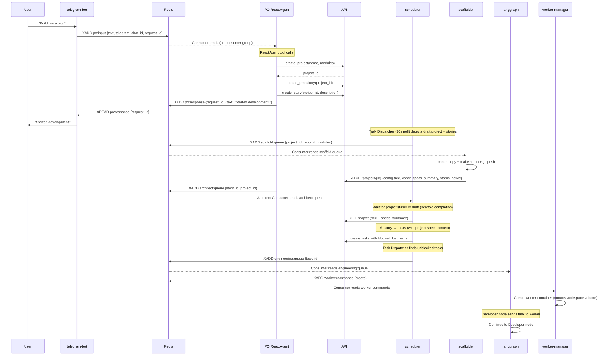
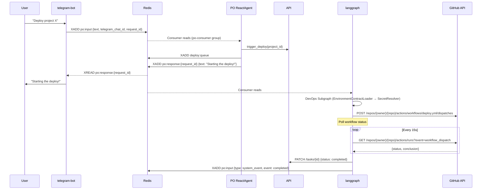

# Contracts

Typed schemas for the REST API and the Redis queues.

## Design Principles

1. **Schema-first** — all messages are validated by Pydantic schemas
2. **1:1 Queues** — one queue = one Writer → one Consumer (+ optional observers)
3. **Logical Actors** — we name the role (PO ReactAgent, Developer-Worker, langgraph), not the technical layer
4. **Traceable** — a `correlation_id` for end-to-end tracing
5. **One definition per request schema** — a request body is defined once, in
   `shared/contracts/dto/`, and `services/api/src/schemas/` re-exports that object.
   The API validates against the same class its callers import, so a field the
   caller sets cannot be one the server forbids.

The last one used to be false: the two trees held 21 same-named pairs whose fields
and types had drifted apart, and `PATCH /api/projects/{id}` answered 422 to every
`github_sync` call because the caller's `ProjectUpdate` carried a field the server's
`ProjectUpdate` did not have. `tests/unit/test_request_schemas_are_not_duplicated.py`
now fails on any name defined under both trees; its `KNOWN_DUPLICATES` backlog is
empty and may not grow.

### Engineering-attempt ledger

`engineering_attempt_ledger` is the append-only accounting record for one terminal
engineering coding-agent attempt. Its stable idempotency key is
`engineering-run:{run_id}` and both that key and `run_id` are unique. The API writes
it only while it holds the terminal Run row lock, so repeated success, failure,
timeout or cancellation delivery retains the first row rather than creating a second.

Money is `cost_microusd`, an integer number of micro-USD (1 = 0.000001 USD), never a
float. `cost_source=provider_reported` requires both a provider and a monetary value.
`cost_source=unknown` requires the monetary value to be NULL: unknown is not zero and
may still retain provider, model and token facts. The old `runs` token/cost fields are
compatibility observations only; new engineering terminal writes derive canonical
accounting from this ledger and do not treat those mutable columns as a cost source.
Worker-wrapper provider totals are rounded into this micro-USD unit before ingestion and
are marked `provider_reported`; the Run API projects its retained float response back
from the ledger. Grafana's engineering effort panels read the ledger too. Historical
backfill records only already terminal engineering Runs, so a queued or running Run can
later record its actual final provider facts through the locked terminal writer.

Claude is the one provider with a currently supported exact-cost evidence path.
Worker-wrapper parses exactly one documented Claude `type=result` JSON object and uses
only its `model` (or its sole `modelUsage` key), `total_cost_usd`, and `usage` fields:
`input_tokens`, `output_tokens`, `cache_read_input_tokens`, and
`cache_creation_input_tokens`. It parses the JSON monetary number as `Decimal`, rounds
it to integer `cost_microusd` before the worker-result queue, and carries those facts as
one `claude_evidence` object through every terminal engineering consumer to the locked
ledger writer. The ledger rejects an evidence object combined with flat provider facts,
and rejects contradictory token totals, so no row can combine two Claude records.
Malformed, absent, negative, or non-finite money leaves `cost_microusd` NULL with
`cost_source=unknown`; valid model, token, and cache facts from that same object remain.
Serializer-derived Claude flat projections that match the evidence remain valid;
contradictory non-null flat facts are rejected.

Factory accepts at most one whole `droid exec -o json` JSON document whose
`type` is `result`. From that one object only, it may retain a string `model`
and non-negative `usage.input_tokens`, `usage.output_tokens`,
`usage.cache_read_input_tokens`, and `usage.cache_creation_input_tokens`.
Each invalid field is unavailable independently. A total is derived only when
both usable input and output components are present; a missing, partial, or
inconsistent provider total is unavailable, while other safe facts from that
same object remain. Malformed JSON, JSONL/multiple objects, and non-result
output leave all Factory evidence unavailable. Factory `cost_usd`,
`total_cost_usd`, or any other money-looking field is never persisted or
converted. Factory evidence always writes `cost_source=unknown` with NULL
`cost_microusd`.

Codex has no stable non-interactive usage-output contract. Its stdout and stderr
are never parsed for model, token, cache, or cost facts; selected `provider=openai`
and configured model may still be retained. Factory likewise retains its selected
provider and configured model when its valid result evidence has no model; a
valid model in that result takes precedence. Both paths use the explicit-unknown
cost contract.

Project deletion never deletes accounting history. PostgreSQL detaches a ledger row's
`run_id`, `project_id`, `story_id` and `task_id` when the corresponding project records
are hard-deleted; all accounting facts and the resolved `user_id` remain immutable.

### Engineering budget policies

### Count-based work admission

`work_admission` is independent of engineering money. Project creation uses its
per-user lock directly. Paid coding-agent work uses `POST /api/work-admission/paid-runs`:
the command locks the controls, checks the emergency stop and concurrent-run
ceiling, performs engineering's existing money admission when applicable, then
creates the queued Run before the transaction commits. No separate successful
paid-work admission exists. Every count decision is stored in
`work_admission_audits` with a typed outcome and reason.

Paid-run retries are decided only by that command while it holds the admission
control locks. An existing Run is replayed only when it is `queued` or
`running` and, for a budgeted engineering attempt, its reservation is still
`active`. Audit rows preserve command identity for payload-conflict detection;
they never cache a denial. A retry after a stop is lifted or a capacity slot is
freed therefore evaluates the controls again. A terminal Run is never reopened:
its identity returns the typed `paid_run_identity_expired` conflict and a caller
must create a new attempt identity. A changed payload under a terminal identity
returns `paid_run_command_conflict` before that expiry outcome.

For scheduler dispatch and QA handoff, an addressable refusal writes its owed
owner-notification record before the task/story transitions that park work;
operator-facing spawn-worker and run-e2e instead return the typed result
synchronously, while the command still records its audit reason.

Known limitations: if a process dies after the paid-run command commits and
before handoff, its queued Run continues to occupy the ceiling until manual
intervention. The atomic internal abort command is used only when preparation
failed before any queue call; it marks the Run `cancelled` and releases its
hold. A publication exception has an unknown broker outcome, so the queued Run
and its active hold remain for normal unfinished-run recovery rather than being
incorrectly cancelled.
Refusal notification is attached to the project's initiating Run, so a second
task refusal for that project can be suppressed and a standalone task has no
owner notification.

The deployed defaults in `scripts/system_configs.yaml` are:

- `work_admission.max_projects_per_user=3`, measured as non-archived projects
  owned by one non-admin user. Deleted projects are absent and archived projects
  do not count; administrators are unlimited.
- `work_admission.max_concurrent_paid_runs=5`, measured globally as queued or
  running `engineering` and `qa` runs together.
- `work_admission.emergency_stop=false`. Internal/admin callers read and set
  this one operator switch at `/api/work-admission/emergency-stop`; while true,
  no new project, engineering run, or QA run is admitted. The stored value must
  be a boolean; malformed configuration fails closed.
  It never changes existing rows, workspaces, containers, or runs.

Engineering's count check precedes its existing monetary
`admit_engineering_attempt` inside that same command, so a count-based refusal
cannot create a financial reservation. QA never enters the monetary gate.

`engineering_budget_policies` holds at most one durable policy row per `user_id`.
`limit_microusd` is a non-negative integer number of micro-USD; budget requests never
accept floating-point or dollar-denominated money. `state` is the typed
`enabled`/`disabled` vocabulary, `attempt_reservation_microusd` is the server-owned
non-negative amount held for one engineering attempt, and `version` is a non-null
integer optimistic-lock version. The policy row is the per-user admission lock; it
never stores aggregate spend.

`PUT /api/engineering-budget-policies/{user_id}` is internal/admin only and requests
the exact state with `{ "limit_microusd": integer, "attempt_reservation_microusd":
integer, "state": "enabled" | "disabled", "version": integer? }`. Creation omits
`version`. Repeating a state already stored is
idempotent and leaves its version unchanged. A genuine change must carry the stored
current version; a missing or stale version returns 409 without changing the row.
This is the policy row/version reservation seam for later admission work. Disabled
policies can be re-enabled through the same command.

`GET /api/engineering-budget-policy` and `/balance` are self-only authenticated reads.
Internal/admin callers may read a named user's policy or balance at
`/api/engineering-budget-policies/{user_id}` and `/balance`; normal users cannot name
another user and cannot write a policy. A missing policy returns `enforcement=unlimited`;
a disabled one returns `enforcement=not_enforced`. Both have a null remaining amount and
are distinct from `enforcement=enforced` with an enabled zero limit, whose balance is
exhausted.

`POST /api/engineering-budget-policies/admissions` is internal/admin only. Its typed
command names the immutable `attempt_id` (the engineering Run id), project, and optional
task/story identifiers; it cannot name a hold amount or user. The API resolves the
project owner, locks that user's policy row, then in one transaction aggregates immutable
ledger cost plus `active` and `unknown_final` holds. The durable result is `admitted`,
`denied`, `unlimited`, or `not_enforced`. Repeating the same identity and payload returns
the stored decision while its state is `active`, `unknown_final`, `settled`, or null;
changing project/task/story under that identity conflicts. `released` takes precedence over
its historical `admitted` decision: the next identical admission reacquires the policy-row
lock, recalculates ledger cost plus chargeable holds, and atomically re-arms that same row
to `active` or changes it to `denied`. An enabled zero or otherwise unavailable balance
denies. `POST .../admissions/{attempt_id}/release` may release only a proven pre-handoff
`active` hold.

`engineering_budget_reservations` records those decisions separately from the immutable
ledger. The pre-handoff boundary ends before an engineering message is submitted to the
queue. Dispatchers validate cheap local conditions first; after an admitted `active` hold,
a typed refusal or an exception proven to occur before that queue call — including Run
creation and recipient resolution — changes it to `released`. An exception from publication
has an unknown broker outcome and does not release the hold or cancel the queued Run. A
released row proves only that its previous handoff did not begin; a deterministic replay such
as a deploy-fix dispatch must re-enter admission and obtain a newly `active` row before any
story transition, Run creation or queue publication. This applies to ordinary task
dispatch and supervisor deploy-fix dispatch, whose stable attempt id is
`eng-deploy-fix-{deploy_run_id}-{attempt}`. A scheduler denial has no Run or queue side
effect and moves the affected task or deploy-fix story to `waiting_human_review` with
budget-denial context and a durable owner notification, so resumption is explicit human
action rather than a polling retry. After successful publication the hold is never
released by dispatch recovery, because provider work may have started. Terminal
engineering ledger creation settles an active hold to `settled` for a known amount, or
retains it as `unknown_final` when no terminal
cost is known. Retrying terminal delivery is idempotent, so ledger cost and a hold are
never double-counted. An unknown-final hold is a conservative coverage value, never
provider spend.

Balances aggregate `engineering_attempt_ledger.user_id` for exact actual
`known_spend_microusd` and separately return `active_held_microusd`,
`unknown_final_held_microusd`, `available_microusd` (also retained as
`remaining_microusd`), `exhausted`,
`unknown_cost_attempt_count`, and `incomplete_coverage`. Retained ledger rows continue to
count after Project deletion. Unknown attempts contribute no invented monetary amount;
when coverage is incomplete, the reported remaining amount is not a proved safe upper
reserve.

User-facing balance consumers present exact known spend and the server-calculated
`remaining_microusd`. They do not expose or recompute the split between active and
unknown-final holds. A non-zero unknown-attempt count or incomplete coverage is shown as
an explicit warning. PO reads this same self-only balance before creating or reopening
paid work; an exhausted balance or less than one attempt reservation is a pre-work
refusal rather than a story that is knowingly sent into the admission quarantine.

### Promo codes

`promo_codes` are the sole registration path for a non-owner Telegram user. A
code compares case-insensitively and may be redeemed once. It carries integer
`credits_microusd >= 0` and a strictly positive
`attempt_reservation_microusd`; activation atomically creates the user, redeems
the code, and creates that user's enabled engineering-budget policy at version
1. Registration failures return typed `promo_code_required`,
`promo_code_not_found`, or `promo_code_redeemed` verdicts, so callers do not
confuse a missing code with a spent one. An `ADMIN_TELEGRAM_IDS` owner is the
only no-code exception. Existing users are not changed by an ordinary upsert;
supplying a code to a user who already has a policy is rejected and leaves that
code unredeemed.

Internal services or administrators mint and inspect codes at
`POST /api/promo-codes/batch` and `GET /api/promo-codes`. Ordinary users have no
code-management surface. An internal service acting for itself (valid internal
key without `X-Telegram-ID`) may create a technical user without a code; that
user deliberately has no policy (`enforcement=unlimited`) until an operator
explicitly arms it. Existing production users are armed with the existing
policy endpoint, for example:

```bash
curl -X PUT "$API_BASE_URL/api/engineering-budget-policies/42" \
  -H "X-Internal-Key: $INTERNAL_API_KEY" \
  -H "Content-Type: application/json" \
  -d '{"limit_microusd":5000000,"attempt_reservation_microusd":250000,"state":"enabled"}'
```

### Canonical vocabularies (`shared/contracts/vocab.py`)

One `StrEnum` per cross-service concept. Producers and consumers import these
instead of restating a `Literal[...]` or a local enum:

| Enum | Values | Used by |
|------|--------|---------|
| `AgentType` | `claude`, `factory`, `codex`, `noop` | `WorkerConfig.agent_type`, `AgentConfigDTO.type`, worker-manager/worker-wrapper agent branching (re-exported from `queues.worker`) |
| `ActionType` | `create`, `feature`, `fix` | `EngineeringMessage.action` |
| `ResultStatus` | `success`, `failed`, `timeout` | `BaseResult.status` (and its subclasses) |
| `LifecycleEvent` | `started`, `progress`, `completed`, `failed`, `stopped` (canonical member set) | via the field-specific subsets below |
| `OwnerNotificationEvent` | routed `story_*` and `task_*` owner-notification events | `POSystemEvent`, scheduler owner-notification producers, PO consumer |

`LifecycleEvent` is the canonical member set, but each wire accepts only the
slice its producers emit — the subsets are `Literal[...]` over the enum members,
kept explicit so the historical per-field vocabularies are not merged:

- `TaskProgressKind` (`started`/`progress`/`completed`/`failed`, no `stopped`) —
  `ProgressEvent.type`, `WorkerEvent.event_type`.

`OwnerNotificationEvent` is the complete routed PO vocabulary: `story_completed`,
`story_failed`, `story_blocked`, `story_quarantined`, `story_waiting_user_secret`,
`task_waiting_resources`, `task_waiting_infrastructure`, `task_impossible_capacity`,
`story_impossible_capacity` and `task_resources_resumed`. `POSystemEvent.event`
accepts that vocabulary plus the three non-owner callback events (`progress`,
`completed`, `failed`); no arbitrary event string is valid. The PO consumer routes
only `OwnerNotificationEvent`, and `OwnerNotification.event` is that same typed
vocabulary. Therefore an unknown owner-notification event is rejected before it can
be recorded, published, or settled as delivered rather than being accepted by a
producer and dropped by PO.

Other vocabularies stay deliberately separate — they carry values the canonical
enums do not, so merging them would broaden a field past what the wire supports:

- `DeployAction` (`create`/`feature`/`fix` **plus** `stop`/`undeploy`) — deploy
  operations, a superset of `ActionType`. `TaskType` (**plus** `refactor`) — the
  planning-layer task kind.
- `WorkerCliKind` (`droid`/`claude_code`/`codex`) is the CLI's self-reported wire
  identity on `worker:events`. It remains a separate concept from `AgentType`;
  only the `codex` spelling currently overlaps.

`WorkerConfig.host_codex_home` adds no new queue shape beyond an optional field.
For `agent_type=codex` and `auth_mode=host_session`, worker-manager validates a
dedicated file-backed ChatGPT profile before image resolution. It then mounts
that host directory read-write at `/home/worker/.codex` and sets `CODEX_HOME`
to the same path. The profile must contain access and refresh tokens so the
non-interactive worker can refresh its session. Unknown agent values fail
Pydantic validation or explicit
LangGraph/image-routing checks; there is no fallback to Claude.

`WorkerConfig.host_claude_dir` is the same shape for Claude: for
`agent_type=claude` and `auth_mode=host_session`, worker-manager mounts that host
directory read-write at `/home/worker/.claude` and sets `CLAUDE_CONFIG_DIR` to
the same path, so the CLI keeps `.claude.json`, its backups and its session in
one host-owned directory instead of the container's ephemeral layer. Every worker
also receives `WORKER_AUTH_MODE`, and a Claude worker created with
`auth_mode=host_session` refuses to start unless `CLAUDE_CONFIG_DIR` is set and is
a mounted, writable host directory — a missing session is a configuration error at
container start, not an agent failure mid-round. `auth_mode=api_key` keeps no
session and requires none of this.

`ResultStatus` dropped the old `error` failure synonym: a failed result is
`failed`, never `error`. The `provisioner:results` consumer treats a message
that fails validation as terminal (logs it and ACKs) so a stale/invalid entry
cannot poison-loop the reclaim.

---

## Queue Registry

> **Complete list of all Redis Streams / Queues.**
>
> **Source of Truth:** `shared/queues.py` (`QUEUE_TOPOLOGY`)

### Scaffolding

| Queue | Group | DTO | Initiator | Consumer | Purpose |
|-------|-------|-----|-----------|----------|---------|
| `scaffold:queue` | `scaffold-consumers` | ScaffoldMessage | Task Dispatcher (scheduler) | scaffolder | Prepare repo: copier + make setup + git push |

---

### Architect Pipeline

| Queue | Group | DTO | Initiator | Consumer | Purpose |
|-------|-------|-----|-----------|----------|---------|
| `architect:queue` | `architect-consumers` | ArchitectMessage | PO ReactAgent | architect | Story → tasks LLM decomposition |

---

### Engineering Flows

| Queue | Group | DTO | Initiator | Consumer | Purpose |
|-------|-------|-----|-----------|----------|---------|
| `engineering:queue` | `capability-workers` | EngineeringMessage | Task Dispatcher (scheduler) | langgraph | Start development task |
| `deploy:queue` | `capability-workers` | DeployMessage | Task Dispatcher (scheduler) / PO | langgraph | Start deploy task |
| `qa:queue` | `qa-consumers` | QAMessage | Task Dispatcher (scheduler) / Admin API | langgraph (qa-worker) | Post-deploy QA: HTTP checks for GET-only criteria, else a central ephemeral `qa` worker on the management host (Codex by default, Claude Code by explicit override) |

---

### Worker Management

| Queue | Group | DTO | Initiator | Consumer | Purpose |
|-------|-------|-----|-----------|----------|---------|
| `worker:commands` | `worker_manager` | WorkerCommand | langgraph | worker-manager | Create/Delete worker containers |
| `worker:responses:developer` | — | WorkerResponse | worker-manager | langgraph | Developer worker command responses |

---

### Worker I/O (Developer only)

| Queue | Group | DTO | Initiator | Consumer | Purpose |
|-------|-------|-----|-----------|----------|---------|
| `worker:{worker_id}:input` | — | DeveloperWorkerInput | langgraph (DeveloperNode) | worker-wrapper | Task input to Developer worker |
| `worker:{worker_id}:output` | — | DeveloperWorkerOutput | worker-wrapper | langgraph (DeveloperNode) | Developer worker results |

> **Note:** Worker I/O streams use `worker:{worker_id}:input/output` pattern. Used only for Developer workers. The worker-broker owns their Redis access: input is leased before processing and ACKed only after one typed output is accepted. Both input and output use approximate `MAXLEN` retention (default 1000 entries); sessions use a finite broker TTL (default 3600 seconds). PO communicates via `po:input` / `po:response:{request_id}` (see PO ReactAgent I/O below).

---

### Infrastructure

| Queue | Group | DTO | Initiator | Consumer | Purpose |
|-------|-------|-----|-----------|----------|---------|
| `provisioner:queue` | `infrastructure-workers` | ProvisionerMessage | scheduler | infra-service | Provision server |
| `env-observation:queue` | `infrastructure-workers` | EnvObservationRequest | scheduler | infra-service | Read a deployed service's environment |
| `provisioner:results` | `scheduler-consumers` | ProvisionerResult | infra-service | scheduler | Provisioning result |
| `provisioner:results` | `telegram-bot` | ProvisionerResult | infra-service | telegram-bot | Provisioning notifications |

---

### Events & Progress

| Queue | Group | DTO | Initiator | Consumer | Purpose |
|-------|-------|-----|-----------|----------|---------|
| `task_progress:{task_id}` | — | ProgressEvent | All services | telegram-bot | Task progress notifications |
| `workflow:status` | — | WorkflowStatusEvent | langgraph (poller) | telegram-bot | Deploy progress updates |

### Transport Layer Note

> **Important:** The "Initiator" column shows the **logical actor** — who makes the decision to publish.
>
> PO ReactAgent calls tools directly (Python functions → API/Redis). No CLI proxy needed.
>
> For **Developer-Worker** messages, the actual transport is:
> ```
> Developer Worker (AI Agent) → curl localhost:9090 → worker-wrapper → worker-broker → Redis
> ```
> The HTTP server in worker-wrapper validates agent results locally; the authenticated broker owns stream, status, session and Compose transport. Authentication is not authorization: the broker and worker-manager each authorize the operation against the worker type recorded server-side (`shared/contracts/worker_control_plane.py`), and a `qa` worker gets the turn protocol only — Compose is refused to it at both hops, because its token is readable by the agent it runs.

### Actor Roles

| Actor | Type | Description |
|-------|------|-------------|
| **PO ReactAgent** | LangGraph Agent | Product Owner, communicates via Redis streams `po:input`/`po:response` |
| **Developer-Worker** | Worker | Developer agent (inside engineering flow) |
| **langgraph** | Service | Workflow orchestrator |
| **worker-manager** | Service | Container lifecycle manager |
| **worker-wrapper** | Process | Agent bridge inside container |
| **telegram-bot** | Service | User interface |
| **infra-service** | Service | Server provisioning only (no app deploy) |
| **scheduler** | Service | Background tasks |

### MVP Notes

> [!IMPORTANT]
> **Tester Node** is an MVP stub. It does NOT spawn a Worker.  
> Implementation: A simple LangGraph node that always returns `{"passed": True}`.  
> Post-MVP: Will delegate to a Tester-Worker with code analysis capabilities.

### Rate Limiting Policy

> [!IMPORTANT]
> External APIs have hard limits. Exceeding them blocks all operations.

| Resource | Limit | Strategy |
|----------|-------|----------|
| **GitHub API** | 5000 req/hour | Token Bucket in `GitHubAppClient`, buffer 500 |
| **LLM API (Claude)** | Per-plan limits | Token Bucket per service, cost alerts |
| **External APIs** | Varies | Per-client configuration |

**Design Principles:**

1. **Fail-fast**: Raise `RateLimitExceeded` immediately, don't queue silently
2. **Buffer zone**: Use 90% of limit, leave 10% for emergencies
3. **Monitoring**: Expose metrics for all rate-limited resources
4. **Per-service**: Each client manages its own limits (MVP)
5. **Post-MVP**: Centralized Redis-based limiter for horizontal scaling

Implementation: `shared/clients/github.py` (`GitHubAppClient`).

---

## Flow Diagrams

### Engineering Flow


```mermaid
sequenceDiagram
    participant User
    participant TG as telegram-bot
    participant Redis
    participant PO as PO ReactAgent
    participant API
    participant SCH as scheduler
    participant SCF as scaffolder
    participant LG as langgraph
    participant WM as worker-manager

    User->>TG: "Build me a blog"
    TG->>Redis: XADD po:input {text, telegram_chat_id, request_id}
    Redis-->>PO: Consumer reads (po-consumer group)

    Note over PO: ReactAgent tool calls
    PO->>API: create_project(name, modules)
    API-->>PO: project_id
    PO->>API: create_repository(project_id)
    PO->>API: create_story(project_id, description)
    PO->>Redis: XADD po:response:{request_id} {text: "Started development!"}
    Redis-->>TG: XREAD po:response:{request_id}
    TG->>User: "Started development!"

    Note over SCH: Task Dispatcher (30s poll) detects draft project + stories
    SCH->>Redis: XADD scaffold:queue {project_id, repo_id, modules}
    Redis-->>SCF: Consumer reads scaffold:queue
    SCF->>SCF: copier copy + make setup + git push
    SCF->>API: PATCH /projects/{id} {config.tree, config.specs_summary, status: active}

    PO->>Redis: XADD architect:queue {story_id, project_id}
    Redis-->>SCH: Architect Consumer reads architect:queue
    Note over SCH: Wait for project.status != draft (scaffold completion)
    SCH->>API: GET project (tree + specs_summary)
    Note over SCH: LLM: story → tasks (with project specs context)
    SCH->>API: create tasks with blocked_by chains

    Note over SCH: Task Dispatcher finds unblocked tasks
    SCH->>Redis: XADD engineering:queue {task_id}
    Redis-->>LG: Consumer reads engineering:queue
    LG->>Redis: XADD worker:commands {create}
    Redis-->>WM: Consumer reads worker:commands
    WM->>WM: Create worker container (mounts workspace volume)
    Note over LG: Developer node sends task to worker
    LG->>LG: Continue to Developer node
```

### Deploy Flow (PO-triggered)


```mermaid
sequenceDiagram
    participant User
    participant TG as telegram-bot
    participant Redis
    participant PO as PO ReactAgent
    participant API
    participant LG as langgraph
    participant GH as GitHub API

    User->>TG: "Deploy project X"
    TG->>Redis: XADD po:input {text, telegram_chat_id, request_id}
    Redis-->>PO: Consumer reads (po-consumer group)
    PO->>API: trigger_deploy(project_id)
    PO->>Redis: XADD deploy:queue
    PO->>Redis: XADD po:response:{request_id} {text: "Starting the deploy!"}
    Redis-->>TG: XREAD po:response:{request_id}
    TG->>User: "Starting the deploy!"
    Redis-->>LG: Consumer reads
    LG->>LG: DevOps Subgraph (EnvironmentContractLoader → SecretResolver)
    LG->>GH: POST /repos/{owner}/{repo}/actions/workflows/deploy.yml/dispatches
    Note over LG: Poll workflow status
    loop Every 15s
        LG->>GH: GET /repos/{owner}/{repo}/actions/runs?event=workflow_dispatch
        GH-->>LG: {status, conclusion}
    end
    LG->>API: PATCH /tasks/{id} {status: completed}
    LG->>Redis: XADD po:input {type: system_event, event: completed}
```

### Deploy Flow (PR merge detection)


```mermaid
sequenceDiagram
    participant GH as GitHub
    participant SCH as scheduler (pr_poller)
    participant API as api service
    participant DB as PostgreSQL
    participant Redis
    participant DW as deploy-worker
    participant TG as telegram-bot

    Note over SCH: poll_merged_prs() — every 30s
    SCH->>API: GET stories (status=pr_review)
    SCH->>GH: GET pulls (state=closed, head=story/{id})
    GH-->>SCH: merged PR found
    SCH->>API: Transition story → deploying
    SCH->>DB: Create Run (type=deploy)
    SCH->>Redis: XADD deploy:queue {task_id, project_id, telegram_chat_id, story_id}
    Redis-->>DW: Consumer reads deploy:queue
    DW->>DW: DevOps Subgraph (EnvironmentContractLoader → SecretResolver → Deployer)
    DW->>API: PATCH run.result = DeployOutcome (SUCCESS/CODE_FIX/RETRY/GIVE_UP)
    Note over SCH: supervise_deploying_stories() — every 30s
    SCH->>API: Read deploy run outcome
    alt SUCCESS
        SCH->>API: Story → testing, create QA run
        SCH->>Redis: XADD qa:queue {project_id, deployed_url, ...}
    else GIVE_UP
        SCH->>API: Story → failed
        SCH->>Redis: XADD po:proactive {text: "Deploy failed"}
    end
```

> **Note:** GitHub webhooks were removed. All PR merge detection and CI failure handling is done by `scheduler/src/tasks/pr_poller.py` (polling, 30s interval). This eliminates webhook reliability issues for newly scaffolded repos.

---

## Consumer Patterns

> **Implemented in**: Redis Streams unification (#3+#5)

All Redis Stream consumers use unified `RedisStreamClient.consume()` API from `shared.redis_client`.

### Unified consume() API

```python
async for msg in client.consume(
    stream="engineering:queue",
    group="capability-workers",
    consumer="worker-1",
    auto_ack=False,          # False = caller must call ack() after processing
    claim_pending=True,      # Sweep the PEL for stuck entries, for this consumer's lifetime
    pending_timeout_ms=60_000,  # Min idle time before re-claiming pending message
    reclaim_interval_ms=None,   # Sweep period; defaults to pending_timeout_ms, floored at 1s
):
    await process(msg.data)
    await client.ack(stream, group, msg.message_id)
```

### ACK Modes

| Mode | `auto_ack` | Use Case | Services |
|------|-----------|----------|----------|
| **Manual ACK** | `False` | At-least-once delivery, ack after successful processing | engineering-worker, deploy-worker, infra-service, worker-manager, scheduler |
| **Auto ACK** | `True` | Fire-and-forget, ack on read | telegram-bot (ProactiveListener, ProvisionerNotifier) |

### PEL Recovery

With `claim_pending=True` the consumer calls `XAUTOCLAIM` from inside its read loop, every `reclaim_interval_ms`, and reclaims entries nobody has been handed for `pending_timeout_ms`. It covers both a consumer that crashed mid-processing and one that is still running when an entry gets stuck: no restart is needed either way. Sweep period and the reasoning behind its default are in [ERROR_HANDLING.md](ERROR_HANDLING.md#c-consumer-errors-redis).

**Concurrent dispatch:** the PO Consumer (`services/langgraph/src/consumers/po.py`) reads through `consume_typed` like everything else, but does not process an entry inline: each one goes to an `asyncio.Task` under a semaphore and a per-user lock and is ACKed in that task's `finally`, so an entry is legitimately pending for as long as the PO graph runs. That is why its read loop keeps the ids it currently has in flight: this process's own sweep finds such an entry idle past `PEL_TIMEOUT_MS` and hands it back, and the set is what stops that redelivery from starting a second `_process_message`. An id is dropped once its task ends, success or failure, so an entry whose ACK raised goes back to ageing towards a reclaim, and an entry left in flight by a dead process is claimable by the next PO after one `PEL_TIMEOUT_MS`. Between processes the delivery contract is the at-least-once every other consumer on this client lives with — an in-process set cannot exclude another PO's sweep and does not claim to. Mutual exclusion between PO processes would need ownership with fencing and cancellation of the running graph; it is deliberately not built, `langgraph` runs one replica, and an overlap would be visible in the PEL and the delivery count rather than silent.

### Consumer Inventory

| # | Consumer | File | Queue | ACK | PEL Recovery | Validation |
|---|----------|------|-------|-----|-------------|------------|
| 1 | Engineering Consumer | `langgraph/src/consumers/engineering.py` | `engineering:queue` | manual | `claim_pending` | in `process_fn` |
| 2 | Deploy Consumer | `langgraph/src/consumers/deploy.py` | `deploy:queue` | manual | `claim_pending` | in `process_fn` |
| 3 | PO Consumer | `langgraph/src/consumers/po.py` | `po:input` | manual (finally, in a dispatched task) | `claim_pending` | `consume_typed` |
| 4 | Worker Manager | `worker-manager/src/consumer.py` | `worker:commands` | manual | `claim_pending` | `validate_python` |
| 5 | Infra Service | `infra-service/src/main.py` | `provisioner:queue` | manual | `claim_pending` | raw dict |
| 6 | Scheduler | `scheduler/src/main.py` | `provisioner:results` | manual | `claim_pending` | `model_validate` |
| 7 | Provisioner Notifier | `telegram_bot/src/notifications.py` | `provisioner:results` | auto | — | `model_validate` |
| 8 | Proactive Listener | `telegram_bot/src/main.py` | `po:proactive` | auto | — | raw dict |
| 9 | Architect Consumer | `langgraph/src/consumers/architect.py` | `architect:queue` | manual | `claim_pending` | `model_validate` |
| 10 | Scaffolder | `scaffolder/src/consumer.py` | `scaffold:queue` | manual | `claim_pending` | `model_validate` |
| 11 | QA Consumer | `langgraph/src/consumers/qa.py` | `qa:queue` | manual | `claim_pending` | `model_validate` |
| 12 | Env Observer | `infra-service/src/main.py` | `env-observation:queue` | manual | `claim_pending` | `consume_typed` |

---

# Part 1: REST DTO

## ProjectDTO

```python
# shared/contracts/dto/project.py

from enum import StrEnum
from pydantic import BaseModel, ConfigDict

class ProjectStatus(StrEnum):
    """Project lifecycle status.

    Lifecycle only — observable state, not process.
    Activity is derived from child entities (Story/Run).
    Runtime state is tracked by Application.status.
    """

    DRAFT = "draft"
    ACTIVE = "active"
    PAUSED = "paused"
    ARCHIVED = "archived"


class ServiceModule(StrEnum):
    """Available project modules for scaffolding.

    Must match module names in service-template/copier.yml.
    """
    BACKEND = "backend"
    TG_BOT = "tg_bot"
    NOTIFICATIONS = "notifications"
    FRONTEND = "frontend"


# The API validates requests against these two, imported from the contract.
# Fields are the Project columns a caller may set; module choice and free-text
# description live inside config.
class ProjectCreate(BaseModel):
    """Create project request."""
    id: uuid.UUID | None = None
    title: str
    status: ProjectStatus = ProjectStatus.DRAFT
    config: dict[str, Any] = {}


class ProjectUpdate(BaseModel):
    """Update project request, for both PUT and PATCH."""
    title: str | None = None
    status: ProjectStatus | None = None
    config: dict[str, Any] | None = None
    project_spec: dict | None = None


class ProjectDTO(BaseModel):
    """Project response."""
    model_config = ConfigDict(from_attributes=True)

    id: uuid.UUID
    title: str
    slug: str
    description: str | None = None
    status: ProjectStatus
    modules: list[ServiceModule] = []
    config: dict = {}
    owner_id: int
    project_spec: dict | None = None
```

## TaskDTO

```python
# shared/contracts/dto/task.py, re-exported by services/api/src/schemas/task.py

class TaskStatus(StrEnum):
    BACKLOG = "backlog"
    TODO = "todo"
    IN_DEV = "in_dev"
    IN_CI = "in_ci"
    TESTING = "testing"
    DONE = "done"
    BLOCKED = "blocked"
    WAITING_RESOURCES = "waiting_resources"
    WAITING_HUMAN_REVIEW = "waiting_human_review"
    FAILED = "failed"
    CANCELLED = "cancelled"

class TaskType(StrEnum):
    CREATE = "create"
    FEATURE = "feature"
    FIX = "fix"
    REFACTOR = "refactor"

class TaskRead(BaseModel):
    """Schema for reading a task."""
    id: str
    project_id: str
    type: str
    title: str
    description: str | None
    plan: str | None = None
    status: str
    priority: int
    acceptance_criteria: str | None
    need_e2e: bool = False
    current_iteration: int
    max_iterations: int
    failure_metadata: dict[str, Any] | None = None
    created_by: str
    created_at: datetime
    updated_at: datetime
    last_event: str | None = None
    elapsed_minutes: float | None = None
```

## TaskEventDTO

```python
# shared/contracts/dto/task.py, re-exported by services/api/src/schemas/task.py

class TaskEventType(StrEnum):
    STATUS_CHANGE = "status_change"
    ITERATION_START = "iteration_start"
    ITERATION_END = "iteration_end"
    NOTE = "note"
    COMMENT = "comment"  # Jira-style discussion on a task

class TaskEventRead(BaseModel):
    """Schema for reading a task event."""
    id: int
    task_id: str
    event_type: str
    from_status: str | None
    to_status: str | None
    iteration: int | None
    details: dict[str, Any]
    actor: str
    created_at: datetime
```

## RunDTO

```python
# shared/contracts/dto/run.py

from enum import StrEnum
from datetime import datetime
from pydantic import BaseModel, ConfigDict

class RunStatus(StrEnum):
    QUEUED = "queued"
    RUNNING = "running"
    COMPLETED = "completed"
    FAILED = "failed"
    CANCELLED = "cancelled"


class RunType(StrEnum):
    ENGINEERING = "engineering"
    DEPLOY = "deploy"
    QA = "qa"


class RunCreate(BaseModel):
    """Create run request."""
    project_id: str
    type: RunType
    spec: str | None = None


class RunDTO(TimestampedDTO):
    """Run response."""

    id: str
    project_id: str
    type: RunType
    status: RunStatus
    story_id: str | None = None
    spec: str | None = None
    result: RunResult | None = None   # typed per `type`, see below
```

### Typed `Run.result` (`shared/contracts/dto/run_result.py`)

`Run.result` is not a free-form dict. Each `RunType` has exactly one result shape,
bound to `type` by `RunDTO`:

| `RunType` | result model | required field | fields the scheduler routes on |
|---|---|---|---|
| `engineering` | `EngineeringRunResult` | `engineering_status` | (write-only; not routed) |
| `deploy` | `DeployRunResult` | `deploy_outcome` | `deploy_outcome`, `deployed_url`, `application_id`, `bot_username`, `deploy_fix_attempt`, `error_details` |
| `qa` | `QARunResult` | `qa_outcome` | `qa_outcome`, `summary`, `failed_checks` (`QAFailedCheck.name`/`.detail`) |

Rules (all enforced by validation, tested in `shared/tests/unit/test_run_result.py`):

- The models use `extra="forbid"`, so an **unknown field** or a payload belonging to
  **another run type** (e.g. a QA payload on a deploy run) is rejected. Unknown enum
  values (an outcome string the code doesn't know) fail the same way.
- `result=None` is allowed only while no outcome exists yet — `QUEUED`/`RUNNING`, or a
  `CANCELLED` (superseded) run such as a deploy that lost the project lock. A
  `COMPLETED` or `FAILED` run **must** carry a result; a terminal run without one is
  rejected, so it surfaces loudly instead of being silently skipped forever. Every
  producer failure path that reaches a terminal status writes a typed result (deploy
  outcomes, `QAOutcome.ERROR` on QA setup failures, `EngineeringStatus.FAILED`/`GAVE_UP`
  on engineering failures).
- Producers (langgraph deploy/QA/engineering handlers) construct the typed model and
  send `model_dump(mode="json")`, so there is one wire form. Consumers (scheduler
  supervisor) read outcomes through typed attributes — no `.get()` guessing, no
  re-parsing outcome strings.
- Storage is unchanged: the API keeps `Run.result` as a JSON column and its `RunRead`
  schema stays dict-typed (dumb passthrough). No DB migration is required — in-flight
  runs are written by the typed producers, so they parse by construction; historical
  runs are never re-validated on the API read path.
- The scheduler validates only the **latest** run per story
  (`SchedulerAPIClient.get_latest_run_by_story` parses `rows[0]` alone), so an older
  legacy/corrupt run in the story's history can never fail a story whose current run is
  valid. If that latest run fails validation (wrong-type/corrupt result, or a terminal
  run with no result), the supervisor fails the story once with a loud log and admin
  notification (`supervisor._fail_story_on_invalid_result`) — no infinite retry, no
  silent skip.
- `deployed_url` and `application_id` are optional on `DeployRunResult` (a standalone
  deploy, or a success where the app record couldn't be resolved, legitimately lacks
  `application_id`). But a story's QA handoff needs both, so the supervisor checks them
  in `_handle_deploy_success_story` **before** transitioning the story or creating a QA
  run: a `SUCCESS` result missing either is routed to a visible failure (fail story +
  notify admins), never a half-applied handoff that crashes the tick.

## UserDTO

```python
# shared/contracts/dto/user.py

from pydantic import BaseModel, ConfigDict

class UserDTO(BaseModel):
    """User response."""
    model_config = ConfigDict(from_attributes=True)
    
    id: int
    telegram_id: int

    is_admin: bool = False
```

---

# Part 1.1: Additional DTOs

## ServerDTO

```python
# shared/contracts/dto/server.py

from enum import StrEnum
from pydantic import BaseModel, ConfigDict
from datetime import datetime

class ServerStatus(StrEnum):
    NEW = "new"
    PENDING_SETUP = "pending_setup"
    PROVISIONING = "provisioning"
    ACTIVE = "active"
    UNREACHABLE = "unreachable"
    MAINTENANCE = "maintenance"
    FORCE_REBUILD = "force_rebuild"
    RESERVED = "reserved"
    DISCOVERED = "discovered"


class ServerCreate(BaseModel):
    """Create server request."""
    handle: str
    host: str
    public_ip: str
    ssh_user: str = "root"
    ssh_key: str | None = None
    is_managed: bool = True
    status: str = "discovered"
    labels: dict = {}


class ServerUpdate(BaseModel):
    """Update server request."""
    handle: str | None = None
    host: str | None = None
    public_ip: str | None = None
    ssh_user: str | None = None
    ssh_key: str | None = None
    status: ServerStatus | None = None
    labels: dict | None = None
    is_managed: bool | None = None
    provider_id: str | None = None
    capacity_cpu: int | None = None
    capacity_ram_mb: int | None = None
    capacity_disk_mb: int | None = None
    used_ram_mb: int | None = None
    used_disk_mb: int | None = None
    os_template: str | None = None
    provisioning_started_at: datetime | None = None


class ServerDTO(BaseModel):
    """Server response."""
    model_config = ConfigDict(from_attributes=True)

    handle: str
    host: str
    public_ip: str
    status: str
    provider_id: str | None = None
    is_managed: bool
    labels: dict = {}
    capacity_cpu: int = 0
    capacity_ram_mb: int = 0
    capacity_disk_mb: int = 0
    used_ram_mb: int = 0
    used_disk_mb: int = 0
    os_template: str | None = None
    last_health_check: datetime | None = None
    provisioning_started_at: datetime | None = None
    provisioning_attempts: int = 0
```

## ApplicationDTO

```python
# shared/contracts/dto/application.py

from enum import StrEnum

class ApplicationStatus(StrEnum):
    """Runtime state of an application on a server."""
    NOT_DEPLOYED = "not_deployed"
    DEPLOYING = "deploying"
    RUNNING = "running"
    STOPPING = "stopping"
    STOPPED = "stopped"
    UNDEPLOYING = "undeploying"
    DOWN = "down"
    DEGRADED = "degraded"


class ApplicationDTO(TimestampedDTO):
    """Application response from API."""
    id: int
    repo_id: str
    server_handle: str
    service_name: str
    status: str
    last_health_check: datetime | None = None
    response_time_ms: int | None = None
    ssl_expires_at: datetime | None = None
    uptime_pct_24h: float | None = None
    ports: list[dict[str, Any]] = []
```

## DeploymentDTO

```python
# shared/contracts/dto/deployment.py

from enum import StrEnum

class DeploymentResult(StrEnum):
    """Outcome of a deployment attempt. Immutable after completion."""
    PENDING = "pending"
    SUCCESS = "success"
    FAILED = "failed"
    CANCELED = "canceled"

# services/api/src/schemas/service_deployment.py

class DeploymentRead(TimestampedDTO):
    """Immutable record of a deployment attempt."""
    id: int
    application_id: int | None = None
    project_id: str
    service_name: str
    server_handle: str
    port: int
    result: str
    deployed_sha: str | None = None
    deployed_at: datetime
    deployment_info: dict = {}
```

## Base DTOs

```python
# shared/contracts/dto/base.py

class BaseDTO(BaseModel):
    """Base DTO for all entities."""
    model_config = ConfigDict(from_attributes=True)

class TimestampedDTO(BaseDTO):
    """Base DTO with timestamps."""
    created_at: datetime
    updated_at: datetime | None = None
```

## AgentConfigDTO

```python
# shared/contracts/dto/agent_config.py

from pydantic import BaseModel, ConfigDict

from shared.contracts.vocab import AgentType

class AgentConfigDTO(BaseModel):
    """Agent configuration response."""
    model_config = ConfigDict(from_attributes=True)
    
    id: int
    name: str
    type: AgentType
    model: str
    system_prompt: str
    is_active: bool = True
```

## APIKeyDTO

```python
# shared/contracts/dto/api_key.py

class APIKeyDTO(BaseModel):
    """API Key response."""
    model_config = ConfigDict(from_attributes=True)

    id: int
    service: str
    key_enc: str
    created_at: str | None = None
```

## TaskExecutionDTO

```python
# shared/contracts/dto/task_execution.py

from pydantic import BaseModel, ConfigDict
from datetime import datetime
from typing import Literal, Any

class TaskExecutionDTO(BaseModel):
    """Worker execution record."""
    model_config = ConfigDict(from_attributes=True)
    
    id: str                                    # request_id from worker
    task_id: str | None = None                 # Optional link to high-level task
    worker_id: str
    started_at: datetime
    finished_at: datetime
    duration_ms: int
    exit_code: int
    status: Literal["success", "failure", "in_progress", "error"]
    result_data: dict[str, Any] | None = None  # AgentVerdict or error details
    created_at: datetime
```

---

# Part 2: Queue Messages

## Base Types

```python
# shared/contracts/base.py

from datetime import datetime
from typing import Literal
from pydantic import BaseModel, Field
import uuid


class QueueMeta(BaseModel):
    """Metadata for all queue messages."""
    version: Literal["1"] = "1"
    correlation_id: str = Field(default_factory=lambda: str(uuid.uuid4()))
    timestamp: datetime = Field(default_factory=datetime.utcnow)


class BaseMessage(QueueMeta):
    """Base class for queue messages."""
    request_id: str = Field(default_factory=lambda: str(uuid.uuid4()))
    callback_stream: str | None = None


class BaseResult(BaseModel):
    """Base result for async operations."""
    request_id: str
    status: ResultStatus  # shared.contracts.vocab
    error: str | None = None
    duration_ms: int | None = None
```

---

## ScaffoldMessage

**Queue:** `scaffold:queue`
**Initiator:** Task Dispatcher (scheduler, 30s poll)
**Consumer:** scaffolder service

```python
# shared/contracts/queues/scaffold.py

class ScaffoldMessage(BaseMessage):
    """Trigger scaffolding for a project repository.

    Published by scheduler for both new (draft) and existing (active) projects.

    Modes:
        full: Full scaffold — copier + make setup + git push (new projects).
        ensure: Verify workspace exists; if missing, clone + setup (existing projects).
    """
    project_id: str
    repository_id: str
    telegram_chat_id: str = ""   # resolved by the producer; never an internal User.id
    template_repo: str    # e.g. "gh:vladmesh/service-template"
    project_name: str     # sanitized name for copier
    modules: str          # comma-separated, e.g. "backend,tg_bot"
    task_description: str = ""
    mode: Literal["full", "ensure"] = "full"
```

**Flow:**
- **Full mode** (new projects): Scheduler detects `project.status == draft` with stories → publishes ScaffoldMessage (mode=full) → Scaffolder runs copier + make setup + git push → saves tree to `project.config.tree` + parses YAML specs into `project.config.specs_summary` (models, events, domains) → sets `project.status = active`. Architect consumer waits for scaffold completion (polls project.status != draft) before decomposing stories.
- **Ensure mode** (existing projects): Scaffold trigger detects ACTIVE projects with TODO tasks → publishes ScaffoldMessage (mode=ensure) → Scaffolder checks if workspace exists; if missing, clones repo + runs setup → sets `repository.workspace_ready = True`. Task dispatcher checks `workspace_ready` flag before dispatching. Worker-manager GC calls `POST /repositories/{repo_id}/notify-workspace-deleted` to clear `workspace_ready` on deletion.

---

## ArchitectMessage

**Queue:** `architect:queue`
**Initiator:** PO ReactAgent (`create_story` tool)
**Consumer:** scheduler (Architect Consumer)

```python
# shared/contracts/queues/architect.py

class ArchitectMessage(BaseMessage):
    """Trigger story decomposition into tasks."""
    story_id: str
    project_id: str
    telegram_chat_id: str = ""   # resolved by the producer; never an internal User.id
    is_reopen: bool = False          # True when story is being reopened (not first decomposition)
    user_report: str | None = None   # User feedback on what's wrong (for reopened stories)
```

**Flow:** PO creates Story → publishes ArchitectMessage → Architect Consumer calls LLM to decompose story into N tasks with `blocked_by_task_id` dependency chains → Task Dispatcher picks up unblocked tasks and publishes EngineeringMessages.

**Reopen flow:** When user reports a problem with a completed story, PO calls `reopen_story` tool → story transitions back to `in_progress` → ArchitectMessage published with `is_reopen=True` and `user_report` containing user feedback. Architect reviews previous tasks before creating new fix tasks.

---

## EngineeringMessage

**Queue:** `engineering:queue`
**Initiator:** Task Dispatcher (scheduler)
**Consumer:** langgraph

```python
# shared/contracts/queues/engineering.py

class EngineeringMessage(BaseMessage):
    """Start engineering task."""
    task_id: str                 # this attempt: the engineering Run row's id
    project_id: str
    # The run that asked for the work, read off `Project.initiating_run_id` by
    # the producer. Required and non-empty: every worker this message leads to
    # is stamped with it, so a message without it could only produce a container
    # nobody can attribute once it is dead.
    initiating_run_id: str
    telegram_chat_id: str = ""   # resolved by the producer; never an internal User.id
    action: ActionType = ActionType.CREATE  # shared.contracts.vocab
    description: str | None = None
    skip_deploy: bool = False
    planning_task_id: str | None = None  # planning-layer Task ID for status updates
    story_id: str | None = None  # story ID for worker reuse across tasks
    deploy_fix_attempt: int = 0  # tracks deploy→engineering retry count
    branch: str | None = None  # story branch name (e.g. "story/{story_id}")


class EngineeringResult(BaseResult):
    """Engineering task result."""
    files_changed: list[str] | None = None
    commit_sha: str | None = None
    branch: str | None = None
```

**Action types:**
- `create` (default) — new project: scaffold → develop → CI → deploy
- `feature` — add feature to existing project: develop → CI → deploy (no scaffolding)
- `fix` — fix issue in existing project: develop → CI → deploy (no scaffolding)

**Flags:**
- `skip_deploy=True` — skip auto-deploy after CI passes (develop → CI only)
- `planning_task_id` — when set, engineering worker updates task status (in_dev → done/failed) and writes `iteration_end` events. Dispatcher-created runs always set this + `skip_deploy=True` (deploy handled at story level).

---

## DeployMessage

**Queue:** `deploy:queue`
**Initiator:** Task Dispatcher (scheduler) / PO
**Consumer:** langgraph

```python
# shared/contracts/queues/deploy.py

class DeployTrigger(StrEnum):
    """Origin of a deploy request."""
    ENGINEERING = "engineering"
    WEBHOOK = "webhook"
    PO = "po"
    ADMIN = "admin"


class DeployAction(StrEnum):
    """Type of deploy operation."""
    CREATE = "create"
    FEATURE = "feature"
    FIX = "fix"
    STOP = "stop"
    UNDEPLOY = "undeploy"


class DeployOutcome(StrEnum):
    """Outcome stored in run.result for dispatcher consumption."""
    SUCCESS = "success"
    SMOKE_FAILURE = "smoke_failure"
    CODE_FIX = "code_fix"
    RETRY = "retry"
    GIVE_UP = "give_up"
    # No server could be allocated, for a reason that is about the platform and
    # not about the project. The story is not failed: it stays DEPLOYING and is
    # re-dispatched once admission accepts a target again. The result carries
    # `allocation_failure_reason` and the admission budget — the contract refuses
    # this outcome without them, so the classification cannot be lost between the
    # deploy consumer and the scheduler.
    WAITING_INFRASTRUCTURE = "waiting_infrastructure"


class DeployMessage(BaseMessage):
    """Start deploy task."""
    task_id: str
    project_id: str
    telegram_chat_id: str = ""   # resolved by the producer; never an internal User.id
    # Why this deploy reports to nobody (admin action, temporary-access
    # machinery). Exactly one of it and telegram_chat_id is set.
    unaddressed_reason: str = ""
    story_id: str = ""
    triggered_by: DeployTrigger = DeployTrigger.ENGINEERING
    action: DeployAction = DeployAction.CREATE
    deploy_fix_attempt: int = 0
    head_sha: OptionalCommitSha = ""
    # Required for STOP/UNDEPLOY, rejected as missing by the model otherwise.
    # A project can run on several servers, so the consumer must bring down the
    # application it was told about instead of picking one itself.
    application_id: int | None = None
    # Deploy-time literals on top of the contract, for state a caller turns on and
    # off between deploys of the same commit (QA's temporary test identity). Only
    # keys the contract declares as literals are accepted.
    env_overrides: dict[str, str] = {}
    # This deploy must be the last writer: it skips the redundant-deploy shortcut
    # and, once its own payload is in the repository secrets, stops every
    # unfinished deploy.yml run. Set by a revoke, whose whole point is removing a
    # value an older run could put back.
    fence_active_deploys: bool = False


class DeployResult(BaseResult):
    """Deploy task result."""
    deployed_url: str | None = None
    server_ip: str | None = None
    port: int | None = None
```

### Deploy dispatch boundary

`shared/contracts/dto/deploy_dispatch.py`. A deploy run stops being stoppable from inside the
system the moment its worker reaches GitHub Actions. The crossing is recorded on the run under a
row lock, so a worker about to dispatch and a caller trying to stop it first cannot both win.

| Endpoint | Taken by | Answers |
| --- | --- | --- |
| `POST /api/runs/{id}/start` | any worker taking a run to `running`, as its first act on the message | `DeployRunStart` — `started=False` for a run that is already terminal, and the worker then does nothing with it |
| `POST /api/runs/{id}/dispatch-claim` | the deploy worker, immediately before `workflow_dispatch` and before a rerun | `DeployDispatchClaim` — `granted=False` for a run already cancelled, and the worker then dispatches nothing; `lease_expires_at` is how long the claim is good for |
| `POST /api/runs/{id}/dispatch-withdraw` | whoever needs the deploy stopped (the temporary-access sweep) | `DeployDispatchWithdrawal` — `withdrawn` (never left), `already_dispatched` (stop it on Actions instead), `already_terminal` |
| `POST /api/runs/{id}/dispatch-supersede` | the same caller, once an `already_dispatched` claim has gone quiet | `DeployDispatchSupersede` — `superseded`, `already_settled`, `not_claimed`, or `lease_live` (wait) |

The claim stamps `run_metadata.dispatch_claimed_at` and `run_metadata.dispatch_lease_expires_at`;
the withdrawal reads the first. A withdrawal always marks the run cancelled, because the worker
polls that to stop its own Actions run.

A terminal run never goes back to a live one: `PATCH /api/runs/{id}` refuses such a move with 409,
and `start` is the locked form of the same transition. Without it a worker's read-then-write would
overwrite a cancellation that landed in between, and the resurrected run would pass the claim.

`already_dispatched` is ordinarily settled by the claiming worker's own recorded outcome — a
terminal run carrying a typed result. A worker that dies after claiming never writes one, so
holding the boundary is a lease rather than a possession: the claim carries a deadline (renewed
each time the worker asks), the worker re-reads the clock immediately before dispatching and
refuses once it has passed, and past the deadline `dispatch-supersede` closes the boundary against
it — cancelling the run so it can never be re-claimed and stamping
`run_metadata.dispatch_superseded_at`. That stamp settles the dispatch for any later reader, which
is what lets a restarted sweep revoke instead of waiting on a process that is gone.

The lease is not a fence around the GitHub effect and nothing may be revoked on the strength of
it. It is read on the worker's own clock one HTTP call before the request, so a paused worker, or
a delayed request, can still be accepted after the deadline. What makes that harmless is on the
deploy side: a workflow reads its payload from the repository secrets when it runs, and a fencing
deploy writes its payload before it fences, so a run created after that point carries the new
value whatever asked for it.

A run's outcome is the first one written, and every writer takes the run's row before it reads it
— the rule is decided from the run's current state, and a plain read decides it from a state
another transaction is already replacing. Once a terminal run carries a result, `PATCH
/api/runs/{id}` refuses any change to `status`, `result` or `error_message` with 409; an identical
repeat is accepted as the no-op it is, and fields that are not the outcome (metadata, token
accounting) are still writable. Two writers race for one run whenever a supervisor ends a run its
worker is still inside — the temporary-access sweep failing a QA run whose borrowed identity
expired — and terminal-to-terminal is the same overwrite as terminal-to-live. Filling the result of
a cancelled deploy run that has none is not a second outcome: deploy cancellation closes the
dispatch boundary, while the worker that owned it may still need to record what happened outside,
which is what settles `already_dispatched` above. QA cancellation is itself the first outcome and
is immutable even without a typed result, so a late central QA verdict cannot replace it.

### Temporary access: the boundary of the guarantee

The promise about a test identity's access is not "the access can never come back". It cannot be:
between the decision and the effect stands GitHub Actions, which this system does not own and
which works asynchronously, so no amount of stopping writers here proves that none of them will
apply the old value afterwards. The promise is that **the access does not outlive one
reconciliation interval after it is seen**, and it is made at two speeds:

- **Fast, while the slot is watched** — the grant's own lifetime plus
  `supervisor.temporary_access_revoked_watch_minutes` after the readings closed it. Here the value
  does not outlive one reconciliation interval. This is the level a dispatch that was already in
  flight lands in, and it is worth an ssh every few minutes.
- **Slow, for as long as the slot exists** — the invariant *the key is empty while no grant holds
  it* is checked on its own cadence, `supervisor.temporary_access_contract_audit_hours`, for every
  `(project, env_key)` slot the record knows, however long ago its last grant closed. Here the value
  does not outlive one slow-check interval. It costs one ssh and one playbook per slot, which is why
  it is counted in hours rather than minutes.

The watch expiring is therefore not the end of the promise, only a change of speed. A value applied
a minute after the fast watch ends is found by the slow check, revoked by the same code, and fails
the same way visibly if it will not go.

What that rests on: `revoked` is written only after the environment of the running service has been
read back through `env-observation:queue` and no longer carries the value. Until that reading has
been made the grant stays live in `revoking`, the sweep keeps revoking, and the operation is
idempotent. A writer that applies the old value late — a superseded worker's dispatch that GitHub
accepted anyway, or a hand-run deploy — is then simply a disagreement between what was asked for
and what is observed, and the next cycle sees it and corrects it. A reading that could not be taken
settles nothing either way: the grant stays live, and the sweep asks again.

Three rules make that hold rather than merely describe it:

- **No caller may declare a grant revoked.** `PATCH /api/temporary-access-grants/{id}` refuses
  `status=revoked` outright (422). The only path to that status is
  `POST /api/temporary-access-grants/{id}/observation`, which takes a `TemporaryAccessObservation`
  and decides from the record. A grant closed on a caller's belief would be exactly the claim the
  system cannot make.
- **The reading must be of the deployment QA tested.** Applications are unique per
  `(repo_id, server_handle)`, so a project can be running on several servers at once. The
  observation names its `application_id`, and the record refuses one that is not the
  `application_id` carried in the grant's stored `QAMessage`. An empty slot on another machine says
  nothing about the bot the test identity was admitted by.
- **One empty reading closes nothing.** A reading is a moment, and a dispatch already in flight
  lands after moments. The grant stays under reconciliation until `REVOKE_CONFIRMATION_READINGS`
  readings taken over `REVOKE_CONFIRMATION_WINDOW` (both in
  `shared/contracts/dto/temporary_access.py`) have agreed. A reading that finds the value again
  restarts the streak and the sweep revokes again. That window *is* the reconciliation interval the
  promise above is written in.
- **Closing the grant does not stop the readings.** The writer that can land between two readings
  can land after the last one, so a closed grant keeps being read for
  `supervisor.temporary_access_revoked_watch_minutes` — the sweep asks the API for the live grants
  plus the ones revoked since that cutoff (`GET /api/temporary-access-grants/?live=true&
  revoked_after=…`). A reading that finds the value on a closed grant puts it back to `revoking`
  under `revoke_reason=observed_after_revoke`, with `reopened_at` stamped and the retry budget
  counted from there, and the sweep clears it again on the same tick. Unless the slot has a live
  owner by then: the contract holds one value per `(project, env_key)`, so what is being read may
  be a later grant's access, and that grant is reconciled on its own.
- **Past the watch window the slot is still read, only rarely.** The invariant does not expire with
  the window, so the sweep also asks for the owner of every closed slot last read before
  `now - supervisor.temporary_access_contract_audit_hours` (`GET /api/temporary-access-grants/
  ?live=true&slot_audit_before=…`). One row per slot: the grant that answers for it is the newest
  recorded for that `(project, env_key)`, and the older ones would be the same ssh repeated for
  history. `observed_at` is what makes a slot due and every reading stamps it, so a slot inside the
  fast watch is never audited on top of being watched. A slot on a server that cannot be reached is
  never read and would otherwise be asked for every tick, so the scheduler takes a marker
  (`temporary-access:slot-audit:{project}:{env_key}`, expiring with the interval) before the
  question goes out. What the slow check finds goes down the same path as the fast one: reopened
  under `observed_after_revoke`, revoked, and escalated to a human if it stays.

Cancelling runs on Actions, withdrawing a queued dispatch and superseding a dead claim all remain.
None of them is proof that the access is gone; they shorten the window in which the old value can
be written back. What says it is gone is the reading.

A disagreement that outlives `supervisor.temporary_access_unrevoked_ttl_minutes` or
`supervisor.temporary_access_max_revoke_attempts` stops being an internal retry: the QA run carries
a `qa_cleanup_failed` blocker naming the observed state, the grant is stamped `escalated_at`, and an
admin alert names the story, project, QA run and grant.

**Cleanup never holds the product back.** `supervise_testing_stories` routes a story on the QA
outcome alone and does not read the grant: a passed run completes its story on the next supervisor
tick, and the owner is told (`story_completed` on `po:input`, with the deployed address) whether or
not the borrowed identity has been handed back yet. The sweep goes on revoking, reading and — when
it gives up — escalating afterwards; a completed story is never reopened by what happens to the
grant later, because only TESTING stories are routed at all. The two are told apart in the cycle
counts: `temporary_access_revoke_failed` is an attempt that will be retried, and
`temporary_access_escalated` is the sweep having given up and called a human. Story routing runs
before the sweep in the dispatcher cycle, so a cleanup that runs out of attempts after an outage
cannot write its incident onto a QA run before the story it belongs to has been routed.

### QA handoff plan

`shared/contracts/dto/qa_handoff.py`. What a successful deploy still owes QA, written into the QA
run's `run_metadata` under `qa_handoff` in the same call that creates the run — before the story
leaves DEPLOYING. `QAHandoffPlan` carries the `QAMessage` and, when the deployed bot does not
already admit the QA identity, a `TemporaryAccessRequest` (`env_key`, `subject`, `head_sha`).
`supervise_testing_stories` finishes any handoff left unfinished from this plan, so no step of it
depends on the process that planned it still being alive.

### QA SSH grant

`shared/contracts/dto/qa_ssh_grant.py`. The SSH reach a central QA run holds on its target, written
into the same QA run's `run_metadata` under `qa_ssh_grant`. The record is created **before** the key
is installed, not after: an append that lands while its answer is lost would otherwise be access
nobody knows about. `QASshGrant` carries the marker identifying exactly this run's `authorized_keys`
line, the server it is on, the account it is under, `state`, `revoke_attempts` and `detail`.

`ISSUING` means a key may be on the target. `OPEN` means the install returned success. Only a
readback proving the marker is gone writes `RELEASED` — nothing infers removal from a revoke that
was merely attempted. `sweep_qa_ssh_grants` (in `qa-worker`, every 5 minutes) drives every unreleased
record to removal, whatever left it that way, and after `GRANT_SWEEP_ESCALATE_AFTER` failed attempts
writes the run's outcome as a `qa_cleanup_failed` blocker so residual access reaches a human.
Escalating does not close the record: it stays selected until a readback proves the key gone.

The sweep reads its work from `GET /api/runs/qa-ssh-grants/held` (internal/admin), which selects on
the record and on nothing else: every run whose `qa_ssh_grant` is not `released`, ordered
`(created_at, id)` ascending, one page at a time. Age is not a selection key — a record written
before an outage of any length is still returned afterwards — and a page bounds the response, not
the coverage: the caller walks pages until one comes back short.

Pages are taken by cursor, never by offset: `after_created_at` and `after_id` name the last record
the caller handled, the two are one position and must be given together (`422` otherwise), and the
next page is strictly after it in that order. The selection shrinks while it is walked, because
handling a record is what releases it — under an offset the unhandled records slide backwards past
the cursor and a cycle can finish while open records remain, which is exactly the reconciliation
this endpoint exists to guarantee. A cursor names a position in the order rather than a count of
rows, so rows leaving behind it move nothing ahead of it, and one cycle presents every record that
was open when it passed.

A record the current schema cannot parse is still returned, since unreadable is not released; the
sweep logs it as `qa_grant_sweep_unreadable_record` and carries on with the rest rather than letting
it end the cycle. The cursor advances over it too — it is passed, not re-asked for — so a record
that can never be closed cannot stall a cycle on itself.

This is not a second `temporary_access`: that grant hands a Telegram identity to a deployed bot and
is settled by deploys, a different subject with a different lifecycle. What is reused from it is the
shape — a durable record, a sweep that reconciles from state rather than from the happy path, and a
failure that lands on the run rather than in a log line.

### Terminal owner notification

`shared/contracts/dto/owner_notification.py`. **The invariant: a terminal story transition cannot be
observed without the owner's message being either already published to `po:input` or durably owed.**
The record lives in `run_metadata` under `owner_notification`, on the run that produced the outcome
— the QA run for the story's own endings, the engineering run for the impossible-capacity task
notice — and is written **before** the transition is committed, for the same reason the SSH grant
above is written before the key is installed: publishing after the commit has a gap, and committing
is exactly what takes the subject out of the status whose scan would otherwise come back to it. For
the three endings owed inside `supervise_testing_stories` that status is `TESTING`; the other two
paths leave the statuses their own loops scan. The endings are not one ending — the five paths
produce different terminal statuses, which is why the record carries the `terminal_status` it
expects instead of assuming one — but the gap has the same shape in all of them, and a publish lost
in it used to be lost permanently.

`OwnerNotification` carries the `POSystemEvent` name PO routes on, the text to publish, the story,
the project, the `terminal_status` the intended transition produces, an optional `task_id`, `state`,
`owed_at`, `attempts` and `detail`. The words are stored rather than recomputed, so a later tick
publishes what the tick that owed it decided; the recipient is *not* stored, because resolving it is
one of the two things that can fail transiently and must be retried.

**Nothing is published until the story proves the transition committed.** The record is written
first, so it cannot be evidence of its own transition: the transition is a separate request and can
fail after the record is durable. Delivery therefore reads the story and publishes only if it is in
the record's `terminal_status` — recorded rather than inferred, so the check is the ending that was
intended and not "any status but the one it started from". Without it this record would trade a lost
message for a false one, and a false "your product is finished" is worse than a missing one: the
owner sees it and believes it. The same check closes the opposite case with the same rule — a
transition that committed and lost its response leaves the story terminal, so its message goes out.
Reading the story is itself an API call, so a failed *read* is treated as the transient failure it
is, not as proof that the transition is missing.

`services/scheduler/src/tasks/owner_notifications.py` is the only seam. All three terminal paths in
`supervise_testing_stories` reach it — QA passed (`story_completed`), an unverifiable application
quarantined (`story_quarantined`), and QA fix attempts exhausted (`story_quarantined`) — and so do
the supervisor's other two terminal owner notifications, whose publishes both previously sat behind
a swallowed exception: `_escalate_refused_deploy` with `tell_owner` (`story_impossible_capacity`),
and `_park_task_waiting_resources` on the `HUMAN_REVIEW_WITH_OWNER_NOTICE` routing
(`task_impossible_capacity`), which parks a failed engineering task *and* its parent story for a
human. That last one is about the task, so its record keeps `task_id` and PO is still told which
task; the record lives on the engineering run, since the record belongs to whatever run produced the
outcome. Each path owes the message, commits the transition, then spends its first delivery attempt.
A refusal escalated with `tell_owner=False` stays admin-only and owes nothing: there is no decision
for the owner to make, and the seam does not invent a message.

A deploy-fix engineering-budget denial takes the same durable path using
`story_quarantined`, with budget-specific text. Its ordering is fixed: it first records the
budget-denial quarantine reason, then writes the `OWED` record using the typed vocabulary, transitions
the story to `waiting_human_review`, and only then attempts delivery. A publish failure leaves that
record owed for `supervise_owed_owner_notifications`; only an accepted publish of a vocabulary member
may settle it `DELIVERED`. The denial creates neither an engineering Run nor queue work and does not
create a polling retry.

The publishes that remain direct in `supervisor.py` are the non-terminal ones, and that is the whole
list: `task_waiting_resources` and `task_waiting_infrastructure`, `task_resources_resumed`, and
`story_waiting_user_secret`. **They are best effort and outside this guarantee**, and not because a
later scan would re-derive them — it would not. `_notify_resources_resumed_via_po` is called once,
on the `backlog → todo` move that admits the task, and nothing calls it again for a task in `todo`.
The first wait messages are published only under `is_new_wait`, so a later pass over a task still
sitting in `waiting_resources` does not repeat them. The `waiting_user_secret` scan exists to
redispatch the story once the secret arrives, not to re-send the request that asked for it. Losing
one of these publishes therefore means the owner does not get that message at all; the bounded retry
and admin alert described in this section do not cover them. Making them durable would mean an
outbox for producers beyond the supervisor's terminal notifications, which is deliberately not what
this record is.

The exhausted-fix path among those three is a decision, not an omission: it used to alert
administrators only. It ends the story for its owner exactly as a quarantine does, so the owner is
told too, through the same seam, under the event PO already routes — a new event name would only be
dropped by PO as unknown. The admin alert on that path is unchanged and still fires.

Five states, and four of them are terminal. `OWED` is work. `DELIVERED` is the stream having
accepted the event, and nothing publishes it again. `UNADDRESSABLE` is a recipient that resolved to
no Telegram chat — an answer, not a failure, so it is logged and alerted once and never retried.
`ABANDONED` is `OWNER_NOTIFICATION_MAX_ATTEMPTS` (3) transient failures, after which an admin alert
names the event, story, project and run. `VOIDED` is the intended transition not being in the story:
fail-closed, so nothing is published and no attempt is spent — an ending that did not happen is not
a delivery that failed — and the obligation is written again from scratch, with a fresh attempt
budget, when routing does reach that ending. Only `owe_owner_notification` may replace a record, and
only a voided one; the other three endings stop the message for good.

`supervise_owed_owner_notifications` is the recovery pass, and it reads its work from
`GET /api/runs/owner-notifications/owed` (internal/admin): every run whose `owner_notification.state`
is `owed`, ordered `(created_at, id)` ascending, bounded by `limit`. Age is not a selection key, so
a story finished during an outage is still served afterwards; no cursor is needed, unlike the grant
selection, because every visit either delivers the record or spends one of its bounded attempts, so
nothing can sit at the head of the page indefinitely. A selected record that does not parse raises
rather than being skipped — unreadable is not delivered, and this module is its only writer.

The pass runs **before** story routing in the dispatcher cycle, so a record owed by this tick's
routing gets exactly the one in-tick attempt routing makes; the other order would spend a second
attempt of the bound in the same second. That order is also what makes a voided record self-healing:
the sweep settles it before routing looks at the story it belongs to, so the same tick can owe the
ending again. Its outcomes are visible in `supervisor_cycle` as `owner_notify_recovered`,
`owner_notify_retrying`, `owner_notify_exhausted`, `owner_notify_unaddressable` and
`owner_notify_voided` — "still being chased" told apart from "given up on and handed to a human"
told apart from "there is no chat to write to" told apart from "there was nothing to say yet".

Bounds of the guarantee. Delivery is at-least-once, not exactly-once: a process that dies between
the publish landing and the record being marked delivered republishes on the next tick. What is
guaranteed is that a *settled* record is never published again and that an owed one is never
forgotten. The record covers the publish leg only, `scheduler → po:input`; the transport leg to
Telegram has its own bounded retry and admin alert in `services/telegram_bot/src/proactive.py`. And
it covers the supervisor's terminal owner notifications only — it is not an outbox for every
producer in the project.

One boundary is worth naming: the proof is the story's status at the moment of delivery, not a
transition log. A story that reaches its terminal status and is then moved on by a human before the
sweep runs voids the record rather than delivering it. That is the fail-closed side of the same
rule, and it costs a message only in the window where a person is already looking at the story.


---

## QAMessage

**Queue:** `qa:queue`
**Initiator:** Task Dispatcher (scheduler) / Admin API
**Consumer:** langgraph (qa-worker)

```python
# shared/contracts/queues/qa.py

class QAOutcome(StrEnum):
    """Outcome stored in run.result for dispatcher consumption."""
    PASSED = "passed"
    FAILED = "failed"
    EXHAUSTED = "exhausted"
    ERROR = "error"


class QAMessage(BaseMessage):
    """Trigger QA testing for a deployed project."""
    story_id: str = ""
    project_id: str
    # The run that asked for the work, exactly as on EngineeringMessage: the
    # executor is owned by the same run as the developer workers that produced
    # the code under test. `run_id` below is this QA attempt, not that run.
    initiating_run_id: str
    telegram_chat_id: str = ""   # resolved by the producer; never an internal User.id
    deployed_url: str
    application_id: int
    acceptance_criteria: str      # resolved by the producer, never by the consumer
    run_id: str = ""
    bot_username: str | None = None
    qa_attempt: int = 0
```

**Acceptance criteria:** `Repository.acceptance_criteria` is the single source of truth for what QA tests. `POST /api/repositories/` seeds every repository with `BASELINE_ACCEPTANCE_CRITERIA` (`shared/contracts/acceptance.py`), so a story that never reached the architect still has criteria; the architect's `update_acceptance_criteria` tool extends the list as stories add functionality. Story and task criteria describe work to be done and are not what QA runs.

Producers (supervisor, admin `run-e2e`) resolve the criteria and put them on the message. Both refuse to create a QA run without them — the supervisor fails the story visibly before it reaches TESTING, and `run-e2e` answers 422 — so QA never starts a run it can only error out of.

**Bot username:** `Repository.bot_username` is the stored source. `POST /api/projects/{id}/telegram/token` writes it there from the `getMe` response in the same transaction that stores the token, and both producers read it off the same record they read the criteria from. A project without a primary repository gets 409 instead of a half-bound token. The deploy smoke check also reports a `bot_username` on `DeployRunResult`; the supervisor uses it only when the repository has none. A tg_bot project reaching QA without a username errors the run, so a write that silently does nothing turns a working bot into a failed story — the endpoint refuses instead.

**Health-only criteria:** criteria whose every line is a plain `- GET <path> returns <status>` are decided by the QA consumer over HTTP (`parse_health_only_criteria` → `run_health_checks`), with no SSH and no LLM. One prose line sends the whole block to the central QA executor instead (`run_qa_centrally`): an ephemeral coding-agent container started on the management host through worker-manager, Codex by default and Claude Code only by explicit override. Codex runs in the intentionally empty non-Git workspace using its native `--skip-git-repo-check` mode and reads the injected `AGENTS.md` and `TASK.md`. Worker-manager keeps the executor in `STARTING`, and the wrapper does not lease its first input, until that instruction, task and `/workspace/qa` are present and usable. It reaches the deployment only through this run's capability endpoint — the same typed read-only calls bounded by the run's capability set, performed by `qa-worker` over a one-shot unprivileged identity issued for that run. "Only" is enforced by the network: that container is attached to the `internal` `codegen_qa_egress` network alone, with one per-run `CONNECT`-only proxy for the assigned CLI's model backend, and worker-manager fails the run closed rather than starting a container whose egress policy did not establish. The target receives no Codex profile, credential or API key. If that executor cannot be started at all, the optional `QA_LLM_*` triplet runs the same calls as an in-process agent; with no triplet the run ends as `qa_executor_unavailable`, which is a platform outcome and never a product verdict.

`returns <status>` means the path itself answers that status, so the checks do not follow redirects: a criterion naming a redirect is checked against the redirect, and a criterion naming 200 is not satisfied by a path that redirects to a 200. Checks are retried while the service is still coming up.

The consumer parses the criteria *before* resolving anything else, and only the agent branch reads the server, its SSH key, and `bot_username`. A criteria block the deployed URL alone can answer must not fail over agent scaffolding it never uses.

**Deterministic probes, and the order they run in.** On the exploratory path, everything below is decided before an executor container exists. Each one is a plain read — no model is asked, and a probe that answers terminally ends the run where it stands.

| # | Probe | Where | Holds | Product is at fault | Infrastructure did not answer |
|---|-------|-------|-------|---------------------|-------------------------------|
| 1 | `check_deployed_url_reachable` | QA consumer, over HTTP | continue | (a response, any status, is reachability) | blocker `deployed_url_unreachable` |
| 2 | bot liveness — `_probe_bot_liveness` → `GET /api/projects/{id}/telegram/liveness` → Telegram `getMe` | API asks; QA gets a state | continue, and the fact is told to the executor | blocker `bot_not_live`, and only when the Bot API refused the token itself (HTTP 401 or 404) | every other non-OK answer, rate limiting included: retried `BOT_LIVENESS_ATTEMPTS` times, then blocker `qa_probe_unavailable` + admin alert |
| 3 | `preflight_bot_access` | QA runtime's Telegram account | continue | — | blockers `missing_telethon_credentials` / `telegram_access_denied` |
| 4 | `run_container_state_checks`, preceded by the `docker ps` in `resolve_capabilities` that lists the run's containers | run's own SSH session, `docker ps` then `docker inspect` | continue, and the fact is told to the executor | QA **fails** with one failed check per container that is down, restarting or unhealthy — no blocker, so the engineering loop gets it | either docker call: retried `CONTAINER_PROBE_ATTEMPTS` times, then blocker `qa_probe_unavailable` + admin alert |
| 5 | exploratory executor | worker-manager container | product verdict | product verdict | blocker `qa_executor_unavailable` + admin alert |

The bot token never leaves the API. QA asks the liveness endpoint (internal or admin only) and gets back `BotLiveness` — a state, the username Telegram itself reported, and a detail line; the credential enters neither the QA runtime nor the target. The endpoint answers `no_token` for a project that never bound one, and 404 for a project that does not exist.

Two categories are new with these probes, and they are not interchangeable with what they sit next to. `qa_probe_unavailable` means a deterministic probe could not be performed at all — docker did not answer on a host the run is already on, or the platform API did not; it is not `server_unavailable`, which means the run never got onto the host and is repaired by looking at the host or its provisioning. `bot_not_live` means Telegram answered and refused the stored token; it is not `telegram_access_denied`, which is a live bot refusing the QA account and is repaired by the temporary-access mechanism. Both infrastructure categories go through the mechanism that already existed for a missing executor: retry, a typed QA-infrastructure outcome, and one administrator alert (`QA_INFRASTRUCTURE_BLOCKERS` in `consumers/qa.py`). None of them is ever a product verdict, and none reaches the engineering loop.

**One condition, one classification, whichever call found it.** A dependency that did not answer is classified by what was unavailable, never by which call happened to meet it first.

* *Docker on the target.* Two calls read it: the `docker ps` in `resolve_capabilities` that builds the run's container capability, and the `docker inspect` of each container in `run_container_state_checks`. Both retry `CONTAINER_PROBE_ATTEMPTS` times with `CONTAINER_PROBE_RETRY_DELAY` between attempts, and both end at `container_runtime_unavailable()` in `consumers/_qa_runner.py`, which is the single place that turns "the container runtime did not answer" into `qa_probe_unavailable` + alert. The listing runs before a session exists, so it raises `QAContainerRuntimeError` and `run_qa_centrally` classifies it there; the inspect raises the outcome directly. A compose project docker knows no container for is the same category with a different reason: nothing was read, so nothing about the product is claimed.
* *Not docker.* A deployment directory that does not resolve, and every failure to open or grant the run's SSH identity, stay `server_unavailable`: no docker call was made, so nothing is known about the container runtime. That distinction is the reason the two are separate categories at all.
* *Telegram, at QA time.* Only HTTP 401 and 404 on `getMe` are the Bot API refusing this token, and only those become `bot_not_live`. Flood control (HTTP 429), a 5xx, a non-JSON body from something in front of Telegram, a transport error, and the platform API not answering are all `telegram_unreachable` / a failed call, and all end at the same retried `qa_probe_unavailable` + alert. When Telegram sends `parameters.retry_after` (https://core.telegram.org/bots/api#responseparameters) it travels on `BotLiveness.retry_after` and the probe waits exactly that long — up to `BOT_LIVENESS_MAX_RETRY_DELAY`; a longer window is not waited out, the probe stops and reports the same infrastructure outcome naming the number Telegram gave. `no_token` is not a dependency failure and keeps its terminal, human-facing route.
* *The exploratory agent's own `container_inspect`.* It runs only after probe 4 has already succeeded, and its result goes to the model unchanged — that is the exploratory contract and it is not a deterministic classification.

Deploy smoke (`subgraphs/devops/smoke.py`) checks the bot's `getMe` and the `tg_bot` container at deploy time and is a separate step — it is not re-run or duplicated here. What probes 2 and 4 add is *at QA time*, on the containers of the whole compose project rather than the one bot service, over the QA run's own unprivileged identity rather than the deploy's access.

**What the executor is told.** Probes 2 and 4 hand their result to `build_qa_prompt(..., established_facts=[...])`, which states them under "Already established" and replaces checklist item 3 (container state) with a line saying not to check it again. The read-only rules and result JSON (`pass` / `checks` / `summary`) are identical with or without facts. `telegram_probe` returns runner-owned `QATelegramProbeEvidence` for every reply: text and caption separately, media type, and reply markup with row/column, button kind and base64 callback data. A media-only reply is consequently evidence, not an empty reply. `telegram_click_button` accepts only a message id and callback data `telegram_probe` made visible during this run, re-reads the bound bot's reply before calling Telegram, establishes its reply baseline immediately before the press, and returns the callback answer, resulting replies and the pressed message's post-press evidence. The executor receives neither Telegram credential.

An error from either Telegram operation is not a product check. A result that proves the operation was not delivered is a `telegram_probe_undelivered` blocker with the attempted action, sent input and Telethon error; a result that cannot prove delivery is an `unknown` blocker. The runner persists its Telegram evidence on `QARunResult.telegram_probe_evidence` and replaces any agent-supplied pass or failure with that blocker before the QA consumer writes the run. This is why Telethon's empty-message `ValueError` cannot create an engineering round.

**Flow:** Deploy succeeds → supervisor resolves criteria → transitions story to TESTING → creates QA run → publishes QAMessage → QA consumer runs the criteria (HTTP checks, or the central QA executor) → writes `QAOutcome` to `run.result`. Supervisor polls run outcome and routes: PASSED → complete story and publish `story_completed` to `po:input` with the deployed address; FAILED with one or more typed failed checks and no blocker → create fix task + redispatch to engineering; BLOCKED, EXHAUSTED, ERROR, or an unverifiable FAILED shape → stop for human review. Routing reads the typed QA result, so a capability failure cannot become a fix task. Temporary access held by the run is settled by its own sweep and never delays the completion or the notification.

**Lifecycle operations:** `stop` and `undeploy` actions are handled by the `deploy_lifecycle` module, which SSHes to the server and runs `docker compose stop/down` directly — skipping the full DevOps subgraph.

---

## Workflow DTOs

```python
# shared/contracts/queues/workflow.py

class WorkflowTriggerRequest(BaseModel):
    """Request to trigger GitHub Actions workflow."""
    project_id: str
    repo_full_name: str           # "org/repo"
    workflow_file: str = "main.yml"
    inputs: dict[str, str] = {}   # workflow_dispatch inputs

class WorkflowStatusResult(BaseResult):
    """
    Result of workflow execution.
    Derived from: shared.clients.github.WorkflowRun (GitHub API response).
    """
    run_id: int | None = None
    run_url: str | None = None
    deployed_url: str | None = None
    conclusion: Literal["success", "failure", "cancelled", "skipped"] | None = None

class WorkflowStatusEvent(BaseModel):
    """Progress event for workflow execution."""
    project_id: str
    run_id: int
    status: Literal["queued", "in_progress", "completed"]
    conclusion: Literal["success", "failure", "cancelled", "skipped"] | None = None
    current_step: str | None = None
    timestamp: datetime = Field(default_factory=datetime.utcnow)
```


---


---

##### 3. Worker Communication (Single-Listener Pattern)
The Orchestrator (LangGraph) listens to **one** stream for all worker results:

| Stream | Initiator | Consumer | Purpose |
|--------|-----------|----------|---------|
| `worker:developer:output` | worker-wrapper, worker-manager | LangGraph | All results: success, logical errors, AND crash failures. |

> **Why Single-Listener?**
> - Simpler architecture: LangGraph has one entry point for all outcomes
> - `worker-manager` handles crashes (detected via Docker events) and publishes
>   failure results to `output`:
>   ```python
>   # When worker-manager detects a container crash via Docker events:
>   DeveloperWorkerOutput(
>       status="failed",
>       error="Worker crashed: OOM killed",
>       task_id=...,
>       request_id=...
>   )
>   ```
> - LangGraph treats all failures uniformly (retry logic in one place)

| Queue | Initiator | Consumer | Purpose |
|-------|-----------|----------|---------|
| `worker:commands` | LangGraph | worker-manager | Command to Create/Delete worker container. |
| `worker:responses:developer` | worker-manager | langgraph | Responses for worker commands (e.g. "Developer container created"). The name is historical: `qa` worker create/delete acks ride the same stream, because there is one worker-command mechanism and one response stream for it. |

## WorkerCommand / WorkerResponse

**Queue (commands):** `worker:commands`
**Initiator:** langgraph
**Consumer:** worker-manager

**Queue (responses):** `worker:responses:developer`
**Initiator:** worker-manager
**Consumer:** langgraph

```python
# shared/contracts/queues/worker.py

# AgentType is the canonical enum (shared/contracts/vocab.py), re-exported here.
from shared.contracts.vocab import AgentType  # claude / factory / codex / noop
# QA_EXECUTOR_AGENT_TYPES is the subset a `qa` worker may run on: claude / codex.
from shared.contracts.vocab import QA_EXECUTOR_AGENT_TYPES


class WorkerCapability(StrEnum):
    GIT = "git"
    GITHUB_CLI = "github_cli"
    CURL = "curl"


class WorkerChannels(StrEnum):
    """Redis stream channels and patterns."""
    COMMANDS = "worker:commands"
    INPUT_PATTERN = "worker:{worker_id}:input"
    OUTPUT_PATTERN = "worker:{worker_id}:output"


class WorkerLabel(StrEnum):
    """Docker labels every dynamic worker container carries, applied at creation."""
    ID = "com.codegen.worker.id"
    TYPE = "com.codegen.type"
    PROJECT = "com.codegen.project.id"
    RUN = "com.codegen.run.id"          # the run that initiated the work
    ATTEMPT = "com.codegen.attempt.id"  # the engineering/QA run row inside it


class WorkerOwnership(BaseModel):
    """Who a dynamic worker belongs to. Every part is non-empty by contract.

    Written by worker-manager onto the container's labels and into
    `worker:meta:<worker_id>` at creation, before the container can exit.
    `delete_worker` removes the container first and deletes the Redis metadata
    afterwards, so a worker that merely *died* is attributed from
    `docker ps -a --filter label=...` alone. A worker that was *removed* is not
    — Docker forgets a removed container and its labels with it — which is what
    `RemovedWorkerEvidence` below is for.

    `run_id` is the **initiating run** — the identity of the thing that asked
    for the work (a live harness run, a matrix combination). It enters the
    system once, as `Project.initiating_run_id`, and travels from there onto
    every queue message (`EngineeringMessage.initiating_run_id`,
    `QAMessage.initiating_run_id`) and into every worker. One run may spawn
    several attempts, which is why run-scoped cleanup and per-run evidence are
    decided against it and not against an attempt.

    `attempt_id` is that attempt: the engineering Run row a developer worker was
    spawned by (`EngineeringMessage.task_id`) or the QA Run row its executor
    serves (`QAMessage.run_id`). It has a label of its own rather than
    overloading `com.codegen.run.id`.

    `ownership.project_id` is also the project whose workspace a developer
    worker locks — there is no second project field.

    `for_engineering(msg)` and `for_qa(msg)` are the only two places this value
    is derived; nothing downstream recomputes it.
    """
    project_id: str = Field(min_length=1)
    run_id: str = Field(min_length=1)
    attempt_id: str = Field(min_length=1)


# shared/contracts/worker_evidence.py — the durable record of a worker's end.
# Written by whoever removes the worker, before the container is removed, to
# the Redis hash `worker:evidence:removed:<run_id>` (field: worker id), which
# `delete_worker`'s deletion of `worker:meta:<id>` does not touch. Retention is
# WORKER_REMOVAL_EVIDENCE_TTL_SECONDS; the capture is bounded by
# WORKER_REMOVAL_EVIDENCE_TIMEOUT_SECONDS and never fails or delays a deletion.
# The container is removed either way; `worker:meta:<id>` is deleted only once
# this record exists, so a worker whose record could not be stored keeps its
# last durable name instead of being silently omitted from its run.

class RemovalFact(BaseModel):
    """One fact read at removal, or the stated reason it could not be read.

    Exactly one of the two is set, always. No field of a removal record is ever
    a bare empty value: "the agent printed nothing" and "the log could not be
    read" are different findings.
    """
    value: Any = None
    missed_reason: str | None = None


class RemovedWorkerEvidence(BaseModel):
    """A removed worker's ending, attributed to the worker's own ownership."""
    worker_id: str = Field(min_length=1)
    container: str = Field(min_length=1)
    ownership: WorkerOwnership
    removed_at: str = Field(min_length=1)     # ISO-8601 UTC
    delete_reason: str | None = None          # the DeleteWorkerCommand reason
    worker_type: RemovalFact                  # "developer" | "qa", from worker:meta
    agent_type: RemovalFact                   # WORKER_AGENT_TYPE as executed
    image: RemovalFact                        # {"tag": ..., "id": ...}
    state: RemovalFact                        # status/running/oom_killed/times/error
    exit_code: RemovalFact                    # int, or why there is none
    log_tail: RemovalFact                     # bounded, redacted container log
    transcript_dir: RemovalFact               # host path, outlives the container


class WorkerConfig(BaseModel):
    """Worker container configuration."""
    name: str
    # "developer" writes code in a pre-scaffolded repository workspace;
    # "qa" is the central exploratory-QA executor (no repository, no git
    # credentials, nothing to commit — see `qa:queue` above).
    worker_type: Literal["developer", "qa"]
    agent_type: AgentType                     # Which AI agent to use
    instructions: str                         # Content for instruction file (CLAUDE.md / AGENTS.md)
    task_content: str | None = None           # Content for TASK.md (optional, for task-driven workers)
    allowed_commands: list[str]               # ["project.*", "engineering.start"]
    capabilities: list[WorkerCapability]      # ["git", "copier"]
    env_vars: dict[str, str] = {}
    auth_mode: Literal["host_session", "api_key"] = "host_session"
    host_claude_dir: str | None = None
    host_codex_home: str | None = None
    api_key: str | None = None
    ownership: WorkerOwnership                # Required: the project and run this worker is for
    repo_id: str | None = None                # Mount pre-scaffolded workspace (developer)
    scaffold_config: ScaffoldConfig | None = None
    branch: str | None = None                 # Story branch to checkout

    @model_validator(mode="after")
    def _qa_runs_on_an_assigned_subscription_agent(self) -> "WorkerConfig":
        # A `qa` worker may only be claude or codex — both subscription CLIs
        # whose session stays on the management host. `factory` runs on a
        # provider API key and `noop` performs no testing, so a `qa` create
        # carrying either is refused where worker-manager validates the command,
        # before any container exists. Developer workers keep the full AgentType.
        if self.worker_type == "qa" and self.agent_type not in QA_EXECUTOR_AGENT_TYPES:
            raise ValueError(...)
        return self


class CreateWorkerCommand(QueueMeta):
    """Create new worker."""
    command: Literal["create"] = "create"
    request_id: str
    config: WorkerConfig
    context: dict[str, str] = {}   # Additional context (user_id, task_id, etc.)


class DeleteWorkerCommand(QueueMeta):
    """Delete worker."""
    command: Literal["delete"] = "delete"
    request_id: str
    worker_id: str
    reason: Literal["completed", "failed", "timeout"] | None = None


class StatusWorkerCommand(QueueMeta):
    """Get worker status."""
    command: Literal["status"] = "status"
    request_id: str
    worker_id: str


WorkerCommand = CreateWorkerCommand | DeleteWorkerCommand | StatusWorkerCommand


class CreateWorkerResponse(BaseModel):
    """Response to create command."""
    request_id: str
    success: bool
    worker_id: str | None = None
    error: str | None = None


class DeleteWorkerResponse(BaseModel):
    """Response to delete command."""
    request_id: str
    success: bool
    error: str | None = None


class StatusWorkerResponse(BaseModel):
    """Response to status command."""
    request_id: str
    success: bool
    status: Literal["starting", "running", "stopped", "failed"] | None = None
    error: str | None = None


WorkerResponse = CreateWorkerResponse | DeleteWorkerResponse | StatusWorkerResponse
```

**`Project.initiating_run_id` and rows that predate it.** The column is nullable and the migration that added it does **not** backfill. A project created before run ownership existed was created by a run nobody recorded, and no value would be true: a project id, a minted id or a shared constant would all reach a container as `com.codegen.run.id` and make two unrelated later runs on that project answer the same run-scoped label query. So absence stays absent and is refused where a worker would be created. `require_initiating_run` (`shared/contracts/dto/project.py`) is the single read; it raises `ProjectPredatesRunOwnership`. The compatibility consequence: such a project can still be read, listed and archived, but it cannot dispatch engineering or QA work — 409 from `spawn-worker` and `run-e2e`, a skipped task in the dispatcher, a failed story in the deploy supervisor — until it is recreated by a run that names itself. Nothing assigns the run afterwards: ownership has one writer, at creation.

> **Note:** Message passing goes **directly** to worker queues (`worker:{id}:input`, etc.),
> NOT through worker-manager. The manager handles only container lifecycle.

## WorkerStatus

```python
# shared/contracts/dto/worker.py

class WorkerStatus(StrEnum):
    STARTING = "STARTING"
    RUNNING = "RUNNING"
    PAUSED = "PAUSED"
    DEAD = "DEAD"
    FAILED = "FAILED"
    STOPPED = "STOPPED"
    GONE = "GONE"       # Stale Redis entry, container no longer exists
    UNKNOWN = "UNKNOWN"
```

Used across worker-manager (manager, events, introspect router) and langgraph (worker_spawner). Replaces all hardcoded status strings.

---


## EngineeringStatus

```python
# shared/contracts/dto/engineering.py

class EngineeringStatus(StrEnum):
    """Status of the engineering subgraph execution.

    Lifecycle:
        IDLE → (subgraph runs) → DONE | GAVE_UP | FAILED
        FAILED → (supervisor retries) → IDLE  OR  (retries exhausted) → GAVE_UP

    FAILED is transient — supervisor either retries or escalates to GAVE_UP.
    """

    IDLE = "idle"
    DONE = "done"
    GAVE_UP = "gave_up"
    FAILED = "failed"
```

Used by Developer node and Engineering consumer. Replaces former bare strings (`"done"`, `"developer_blocked"`, `"developer_rejected"`, etc.). The `GAVE_UP` status covers both former "blocked" (worker hit a blocker) and "rejected" (infra issue) paths — in both cases a human needs to intervene.


---

## PO ReactAgent I/O

| Queue | Group | DTO | Initiator | Consumer | Purpose |
|-------|-------|-----|-----------|----------|---------|
| `po:input` | `po-consumer` | `POInputMessage` (discriminated union: `POUserMessage` / `POSystemEvent` / `POReminderMessage`) | telegram-bot, workers | langgraph (PO consumer) | User messages and system events to PO |
| `po:response:{request_id}` | — | `POResponse` | langgraph (PO consumer) | telegram-bot | PO response for specific request |
| `po:proactive` | `tg-bot-proactive` | `POProactiveMessage` | langgraph (PO `notify_user` tool, deploy-worker) | telegram-bot (ProactiveListener) | Proactive messages to users (PO notifications + webhook deploy results) |

> **Transport note:** PO streams use **flat Redis fields** (not JSON `data` wrapper). Use `to_flat_fields()` / `from_flat_fields()` helpers from `shared.contracts.queues.po` for serialization.

**Addressing**: every queue message and PO event names its recipient as `telegram_chat_id` — the Telegram chat the message is delivered to. `Project.owner_id` is an internal `User.id` and addresses nothing, so the producer resolves it (`User.id` → `User.telegram_id`) *before* publishing; the internal id travels beside it as `owner_user_id`, for logs and admin alerts only. A recipient that cannot be resolved raises an admin alert instead of being dropped. `DeployMessage` makes the second case explicit: it carries either `telegram_chat_id` or `unaddressed_reason` (never both, never neither), so an admin-initiated action or temporary-access machinery says *why* it reports to nobody instead of leaving an empty field a forgetful producer would also leave. PO keys its thread on the chat (`po-chat-{telegram_chat_id}`), so a user's own message and a pipeline event about their project land in one conversation.

**The removed `user_id`**: the field that used to mean both a Telegram chat id and a `User.id` is not merely unused — it is rejected. Every addressable contract refuses a payload containing `user_id` (`shared/contracts/recipient.py`), because Pydantic would otherwise accept it and drop the recipient silently, turning somebody's notification into unaddressable work. The consumers that see the rejection (`consume_typed` — which is the path PO reads through too — and the bot's proactive listener) log it and raise an admin alert naming story, project and event, then quarantine the entry in `{stream}:dlq` and ack it away instead of retrying something that can never succeed.

**Delivery of `po:proactive`**: the bot consumes without auto-ack and claims the pending entries of its previous incarnation on startup, so a delivery interrupted by a restart is picked up rather than lost. `telegram_bot/src/proactive.py::process_proactive_entry` is the single place that settles an entry: it acks only after the message was delivered or its attempts ran out, and the attempt bound is the group's PEL delivery count, which survives the restart (`PROACTIVE_MAX_ATTEMPTS` inside one delivery, `PROACTIVE_MAX_DELIVERIES` across them). Exhaustion raises an admin alert with story, project and event; success and exhaustion are distinct log events (`proactive_message_sent` / `proactive_message_delivery_exhausted`).

**System events**: Workers write to `po:input` (via `callback_stream`) with `type: "system_event"`. PO decides whether to notify the user via `notify_user` tool → `po:proactive`. The old `po:events:{task_id}` pattern is replaced — events go directly to `po:input`. User-facing resource lifecycle events are `task_waiting_resources`, `task_waiting_infrastructure`, `task_impossible_capacity`, `story_impossible_capacity` (the deploy path's equivalent, emitted when a deploy is escalated to operators), and `task_resources_resumed`; the scheduler supplies context, PO writes the user text. `task_waiting_infrastructure` is the non-capacity member of that set: it is emitted when admission refused every server — an unfinished or broken host build, a status that does not admit, a host that stopped being managed (`AllocationFailureReason.SERVER_NOT_PROVISIONED`, the single reason every admission refusal carries), and it must not be worded as a capacity shortage or as a defect in the user's project.

---

---

## Developer Worker I/O

> **Terminology:** Developer is a concrete node inside the Engineering Subgraph.
> Engineering is the "department" abstraction for the PO. Developer is the implementation (the worker that writes the code).
> See [GLOSSARY.md](./GLOSSARY.md#engineering-vs-developer).

The communication between LangGraph (the Engineering Subgraph, specifically the DeveloperNode) and a Developer Worker.

**Design Decision:** Developer Workers are **ephemeral** (stateless). Each task spawns a fresh worker.
Context is the code in repo + error messages — no session persistence needed.

**Queue (input):** `worker:{worker_id}:input`
**Initiator:** langgraph (DeveloperNode)
**Consumer:** worker-wrapper (inside Developer container)

**Queue (output):** `worker:{worker_id}:output`
**Initiator:** worker-wrapper (inside Developer container)
**Consumer:** langgraph (DeveloperNode)

> **Note**: Developer workers use the `worker:{worker_id}:input/output` pattern.
> Each worker gets unique streams identified by `worker_id`.

```python
# shared/contracts/queues/developer_worker.py

from datetime import datetime
from pydantic import BaseModel, Field
import uuid


class DeveloperWorkerInput(BaseModel):
    """Task for Developer Worker from LangGraph."""

    request_id: str = Field(default_factory=lambda: str(uuid.uuid4()))
    task_id: str                    # Engineering task ID
    project_id: str                 # Project UUID
    prompt: str                     # Task specification
    timeout: int = 1800             # Max execution time (seconds)
    timestamp: datetime = Field(default_factory=datetime.utcnow)


class DeveloperWorkerOutput(BaseResult):
    """Result from Developer Worker to LangGraph."""

    # request_id, status, error, duration_ms inherited from BaseResult
    task_id: str                    # Engineering task ID
    commit_sha: str | None = None   # Commit SHA if code was written
    pr_url: str | None = None       # PR URL if created
    timestamp: datetime = Field(default_factory=datetime.utcnow)
```

> **Post-MVP:** Add `previous_attempts: list[AttemptLog]` to Input and `approach: str` to Output
> for retry context when Tester/CI returns task for rework. For MVP, Developer sees current code
> and error — sufficient for simple iterations.

---

## ProvisionerMessage

**Queue:** `provisioner:queue`  
**Initiator:** scheduler  
**Consumer:** infra-service

```python
# shared/contracts/queues/provisioner.py

class ProvisionerMessage(BaseMessage):
    """Provision server."""
    server_handle: str       # Cloud provider ID (Droplet ID) or unique identifier
    is_recovery: bool = False


class ProvisionerResult(BaseResult):
    """
    Provisioning result.
    Stream: provisioner:results
    Consumers: scheduler (update DB), telegram-bot (notify admin)
    """
    server_handle: str
    server_ip: str | None = None
    services_redeployed: int = 0
    errors: list[str] | None = None
```

---

## EnvObservationRequest

**Queue:** `env-observation:queue`
**Initiator:** scheduler (the temporary-access sweep)
**Consumer:** infra-service

A deploy is a request handed to GitHub Actions, not an effect. Whoever has to know that a value is
gone from the running service asks for it to be read where the SSH key and the playbooks already
are. The reading changes nothing, so repeating it is free.

```python
# shared/contracts/queues/env_observation.py

class EnvObservationRequest(BaseMessage):
    """Read one environment slot of one deployed service."""
    project_id: str
    server_handle: str      # where the service runs
    service_slug: str       # the directory the deploy put it under
    env_key: str


class EnvObservationOutcome(StrEnum):
    OBSERVED = "observed"
    # SSH down, playbook failed, nothing running to read. Neither a success nor
    # a failure of whatever the caller wanted to confirm.
    UNREACHABLE = "unreachable"


class EnvObservationResult(BaseModel):
    """What the running service has, or why it could not be asked."""
    request_id: str
    outcome: EnvObservationOutcome
    env_key: str
    present: bool | None = None   # None when nothing was read
    containers: int = 0
    detail: str = ""
```

The answer does not travel on a queue: `observe_service_env` runs
`ansible/playbooks/observe_service_env.yml`, which reads the slot out of the running containers
(not the `.env` file next to them), and the result is left in Redis under
`env_observation_result_key(request_id)` for `ENV_OBSERVATION_RESULT_TTL_SECONDS`. The caller is a
sweep that will be on a later tick, or in a later process, by the time the playbook is done.
`env_observation_pending_key(request_id)` is set with an expiry before publishing so one question
is asked per window rather than one per tick.

`UNREACHABLE` is not a third answer about the slot. It says the reading did not happen, and callers
must treat it as the absence of an answer: not a confirmation, not a failure.

---


---

## ProgressEvent

**Stream:** `task_progress:{task_id}`  
**Initiator:** All consumers  
**Consumer:** telegram-bot

```python
# shared/contracts/events.py

class ProgressEvent(BaseModel):
    """Task progress notification."""
    type: TaskProgressKind  # LifecycleEvent slice: started/progress/completed/failed
    request_id: str
    task_id: str | None = None
    timestamp: datetime = Field(default_factory=datetime.utcnow)
    message: str | None = None
    progress_pct: int | None = None
    current_step: str | None = None
    error: str | None = None
```

---

## File Structure

```
shared/contracts/
├── __init__.py
├── base.py                  # QueueMeta, BaseMessage, BaseResult
├── events.py                # ProgressEvent
├── dto/
│   ├── __init__.py
│   ├── project.py           # ProjectDTO, ProjectCreate
│   ├── task.py              # TaskDTO, TaskCreate
│   ├── user.py              # UserDTO
│   ├── server.py
│   ├── story.py              # StoryDTO, StoryCreate
│   ├── repository.py         # RepositoryDTO, RepositoryCreate
│   ├── brainstorm.py         # BrainstormDTO, BrainstormCreate
│   ├── base.py              # BaseDTO, TimestampedDTO
│   ├── application.py       # ApplicationDTO, ApplicationStatus enum
│   ├── deployment.py        # DeploymentResult enum
│   ├── run.py               # RunDTO, RunType, RunStatus enums
│   ├── engineering.py       # EngineeringStatus enum
│   ├── service_deployment.py  # ServiceDeploymentDTO (legacy alias)
│   ├── agent_config.py
│   ├── allocation.py
│   ├── task_execution.py
│   └── worker.py            # WorkerStatus enum
└── queues/
    ├── __init__.py           # Re-exports PO contracts
    ├── engineering.py
    ├── deploy.py
    ├── scaffold.py           # ScaffoldMessage
    ├── architect.py          # ArchitectMessage
    ├── provisioner.py
    ├── workflow.py
    ├── worker.py
    ├── qa.py                 # QAMessage, QAOutcome, QAServerInfo
    ├── developer_worker.py
    └── po.py                 # POInputMessage, POResponse, POProactiveMessage, flat-field helpers
```
