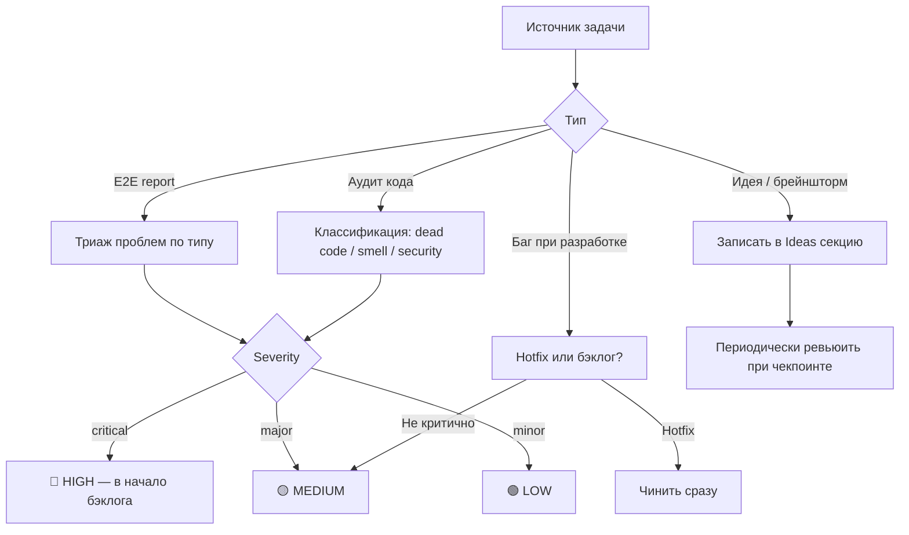
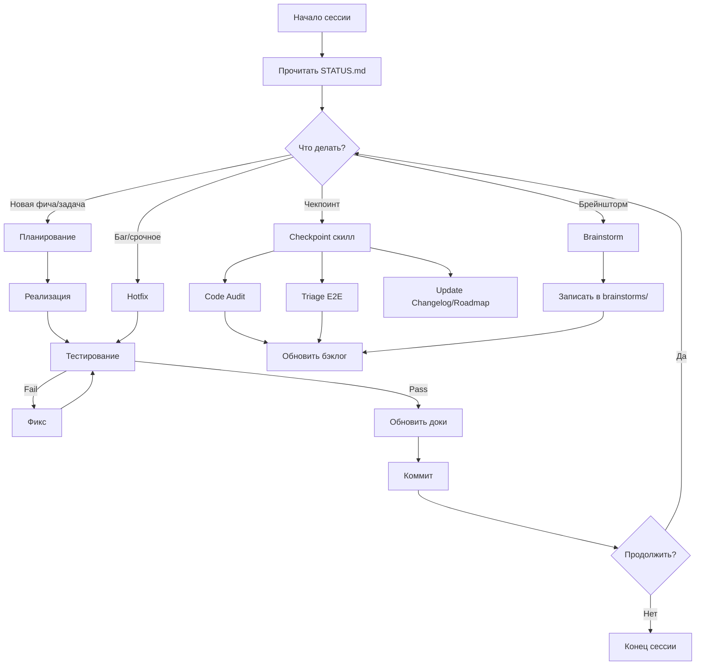

# Брейншторм: Процесс разработки с AI-агентами

> **Дата**: 2026-03-03  
> **Контекст**: codegen_orchestrator — мультиагентный оркестратор. Разрабатывается с помощью AI-агентов (Claude Code, Antigravity). Цель — выстроить процесс, который потом можно перенести в сам оркестратор.
> **Status**: done

---

## Текущее состояние (что уже есть)

| Артефакт | Статус | Проблемы |
|----------|--------|----------|
| `docs/STATUS.md` | Есть, но ручной | Показывает только текущий фокус, нет истории |
| `docs/backlog.md` | Есть, хорошо структурирован | 238 строк, приоритеты, но нет протокола «как задача попадает в бэклог» |
| `AGENTS.md` | Есть, TDD workflow | Описывает общий подход, но устарел в деталях (есть `make test-all`, который удалён) |
| `.claude/skills/` | 3 скилла (e2e-run, e2e-check, e2e-cleanup) | Только E2E. Нет скиллов для dev workflow |
| `docs/brainstorms/` | 10 документов | Исторические брейнштормы, без протокола обработки |
| `docs/e2e_results/` | 22 отчёта | Хорошая практика, но результаты не маршрутизируются в бэклог |
| Changelog | **Отсутствует** | Нет истории изменений кроме git log |
| Roadmap | **Отсутствует** | STATUS.md ~ текущий фокус, но нет долгосрочного вижна |

---

## 1. Стейт проекта

### 1.1 Структура документов

Предлагаю **4 уровня** документов стейта:

```
docs/
├── CHANGELOG.md          # Что сделано (факты, по датам)
├── ROADMAP.md            # Куда идём (высокоуровневые вехи)
├── STATUS.md             # Где мы сейчас (текущий спринт/фокус)
└── backlog.md            # Что делать дальше (приоритизированный список)
```

#### CHANGELOG.md
- Формат: [Keep a Changelog](https://keepachangelog.com/) 
- Секции: `Added`, `Changed`, `Fixed`, `Removed`
- Группировка по датам (не по версиям, т.к. continuous delivery)
- **Кто заполняет**: агент, в конце каждой завершённой задачи (прописать в skills)

```markdown
## 2026-03-03
### Fixed
- Port resolution logic: `BACKEND_PORT` was set to random secret (#22)
### Changed  
- Docs cleanup: removed references to deleted `prod_infra` repo
```

#### ROADMAP.md
- Высокоуровневые вехи (3-5 штук), не задачи
- Каждая веха = набор пунктов бэклога
- Отметки: 🔲 не начато → 🔶 в процессе → ✅ завершено

```markdown
## Вехи

### 🔶 v0.1 — Стабильный пайплайн scaffold→code→CI→deploy
- [x] Redis Streams unification
- [x] Worker reuse for CI fix loop  
- [ ] Worker network isolation (#22)
- [ ] Fix & consolidate test suites (#6)

### 🔲 v0.2 — Надёжность и самовосстановление
- [ ] Agent hierarchy & incident response (#2)
- [ ] Workspace failure counter (#8)
- [ ] Deploy pre-check (#21)

### 🔲 v0.3 — Автоматизация процесса разработки
- [ ] Self-hosted CI runner
- [ ] Admin UI
- [ ] Cost tracking
```

#### STATUS.md (эволюция текущего)
Текущий `STATUS.md` — хороший формат, но добавить:
- Номер «спринта» / итерации (если решим использовать)
- Список активных задач (не только одна)
- Блокеры

#### backlog.md (эволюция текущего)
Оставить как есть, но добавить **протокол попадания задач**:

### 1.2 Протокол управления бэклогом

> [!IMPORTANT]
> Центральный вопрос: **Спринты или Kanban?**

**Вариант A: Спринты (1-2 недели)**
- (+) Чёткий ритм: планирование → работа → ретро
- (+) Можно измерять velocity
- (-) Жёсткость: если задача заняла больше спринта, это стресс для процесса
- (-) Overkill для solo-разработки с агентами

**Вариант B: Kanban с WIP-лимитом**
- (+) Гибкость: берёшь следующую задачу когда закончил текущую
- (+) Естественно ложится на работу с агентами (одна сессия = одна задача)  
- (+) Проще поддерживать
- (-) Нет чёткого ритма для ревью/аудита
- (-) Легко забыть про рефакторинг и аудит

**Вариант C (рекомендую): Kanban + периодические чекпоинты**
- Работа идёт по Kanban (WIP limit = 1-2 задачи)
- Каждые **N сессий** (или по датам, скажем, раз в неделю) — обязательный чекпоинт:
  - Обновить CHANGELOG
  - Обновить ROADMAP
  - Ретроспектива: что пошло не так, что улучшить
  - Триаж новых задач в бэклог (из E2E отчётов, аудитов, идей)
  - Решение: нужен ли рефакторинг / аудит перед следующей фичей?

### 1.3 Протокол попадания задач в бэклог



---

## 2. Agent Skills (`.claude/skills/`)

### 2.1 Текущие скиллы + предлагаемые

| Скилл | Статус | Описание |
|-------|--------|----------|
| `e2e-run` | ✅ Есть | Запуск E2E тестов |
| `e2e-check` | ✅ Есть | Проверка результатов E2E |
| `e2e-cleanup` | ✅ Есть | Очистка после E2E |
| `implement-task` | 🆕 | Взять задачу из бэклога и реализовать по протоколу |
| `code-audit` | 🆕 | Аудит кодовой базы (dead code, smells, security) |
| `triage-results` | 🆕 | Триаж E2E отчётов → задачи в бэклог |
| `update-docs` | 🆕 | Обновление CHANGELOG, STATUS, ROADMAP |
| `checkpoint` | 🆕 | Периодический чекпоинт (всё вместе) |

### 2.2 Каждый новый скилл — что внутри

#### `implement-task` (основной рабочий скилл)
```
.claude/skills/implement-task/
├── SKILL.md              # Инструкции
```

**Протокол:**
1. **Input**: номер задачи из бэклога ИЛИ описание от пользователя
2. **Research**: прочитать связанные документы, понять scope
3. **Plan**: написать краткий план в `docs/tasks/<task-name>.md` (если задача нетривиальная)
4. **Implement**: код
5. **Test**: unit-тесты (`make test-unit`), линт (`make lint`)
6. **Update docs**: 
   - `docs/STATUS.md` — отметить прогресс
   - `docs/backlog.md` — отметить как done
   - `docs/CHANGELOG.md` — добавить запись
7. **Commit**: осмысленное сообщение коммита

#### `code-audit`
**Протокол:**
1. Просканировать кодовую базу
2. Найти: dead code, нарушения DRY, большие файлы, security issues
3. Записать отчёт в `docs/audit.md` (перезаписать)
4. Каждый найденный issue → предложение: hotfix или бэклог?

#### `triage-results`
**Протокол:**
1. Прочитать все `docs/e2e_results/*.md` (особенно непротриаженные)
2. По каждой проблеме из отчётов:
   - Проверить: уже есть в бэклоге?
   - Если нет → создать задачу с нужным приоритетом
3. Пометить отчёты как протриаженные (например, переместить в `docs/e2e_results/triaged/`)

#### `checkpoint` (мета-скилл)
**Протокол:**
1. Запустить `code-audit` (или пропустить если недавно был)
2. Запустить `triage-results`
3. Обновить `CHANGELOG.md`, `ROADMAP.md`, `STATUS.md`
4. Вывести саммари: что сделано с прошлого чекпоинта, блокеры, рекомендация по следующей задаче

### 2.3 AGENTS.md — что обновить

Текущий `AGENTS.md` описывает TDD workflow, но:
1. Есть ссылка на `make test-all`, который удалён → **починить**
2. TDD workflow слишком детализирован для общего случая — не все задачи требуют TDD (например, рефакторинг, документация)
3. Нет ссылок на skills → агент не знает что они есть

**Предложение**: `AGENTS.md` = высокоуровневый overview + ссылки на скиллы для конкретных flow.

---

## 3. Workflow (Flow разработки)

### 3.1 Полная карта



### 3.2 Когда что делать

| Триггер | Действие | Скилл |
|---------|----------|-------|
| Начало работы над задачей | Планирование → реализация → тесты → доки | `implement-task` |
| Каждые 5-7 задач (или раз в неделю) | Полный чекпоинт | `checkpoint` |
| После E2E рана | Триаж результатов | `triage-results` |
| Перед большим рефакторингом | Аудит кода | `code-audit` |
| Идея на обсуждение | Записать брейншторм | вручную → `docs/brainstorms/` |
| Накопился техдолг | Спринт рефакторинга | `code-audit` → `implement-task` |

### 3.3 Маршрутизация ошибок

```
E2E ошибка
├── type: orchestrator → бэклог codegen_orchestrator
├── type: template    → бэклог service-template (TODO: отдельный трекер?)
├── type: meta        → правка скилла e2e-run
└── type: other       → документировать и забыть

Unit test failure
├── Связан с текущей задачей → фиксить немедленно
└── Не связан → бэклог (regression)

Lint failure → фиксить немедленно (часть pre-commit)

Runtime ошибка (при ручном тестировании)
├── Критичная → hotfix
└── Некритичная → бэклог с severity
```

---

## 4. Мета: что из этого переносится в оркестратор

Идея: всё, что мы делаем руками (с помощью агентов) сейчас — кандидат на автоматизацию в самом оркестраторе.

| Практика (ручная) | Кандидат на автоматизацию | Как в оркестраторе |
|-------------------|--------------------------|---------------------|
| Обновление CHANGELOG | ✅ Высокий | Агент автоматически пишет changelog entry после задачи |
| Триаж E2E | ✅ Высокий | E2E runner → parser → автоматическое создание issues |
| Code audit | ✅ Средний | Периодический аудит-агент (уже есть в roadmap как Watchdog) |
| Планирование задач | ⚠️ Низкий пока | Требует понимания приоритетов и контекста |
| Чекпоинт | ✅ Средний | Scheduler запускает checkpoint flow по расписанию |
| Маршрутизация ошибок | ✅ Высокий | Классификатор ошибок → автоматический routing |

---

## 5. Приоритет реализации

Предлагаемый порядок (что делать сначала):

1. **CHANGELOG.md + ROADMAP.md** — создать файлы, наполнить начальным содержимым. Минимальный overhead, большой impact на понимание стейта.
2. **`implement-task` skill** — формализовать основной рабочий процесс. Это самый часто используемый flow.
3. **Починить AGENTS.md** — убрать устаревшее, добавить ссылки на skills.
4. **`triage-results` skill** — формализовать обработку E2E отчётов. Уже 22 отчёта, часть не обработана.
5. **`checkpoint` skill** — мета-скилл для периодических ревью.
6. **`code-audit` skill** — формализовать аудит (уже есть 2 отчёта `refactor-audit*.md`).

---

## Открытые вопросы

1. **Kanban vs спринты vs гибрид?** — Я рекомендую гибрид (Kanban + чекпоинты), но решение за тобой.
2. **Granularity CHANGELOG** — по датам или по «сессиям работы»? По датам проще поддерживать автоматически.
3. **Где трекать service-template задачи?** — Сейчас всё в одном бэклоге. Нужно ли разделять?
4. **Skills: Claude-specific или универсальные?** — Скиллы в `.claude/skills/` специфичны для Claude Code. Antigravity использует другой формат (`.agents/workflows/`). Нужна ли унификация, или ок иметь два формата?
5. **Глубина автоматизации скиллов** — Насколько детально прописывать скиллы? `e2e-run` = 825 строк, но это максимально детерминированный процесс. Для `implement-task` такая детализация может быть контрпродуктивной (ограничит агента).
