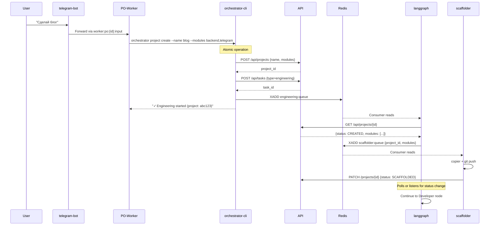
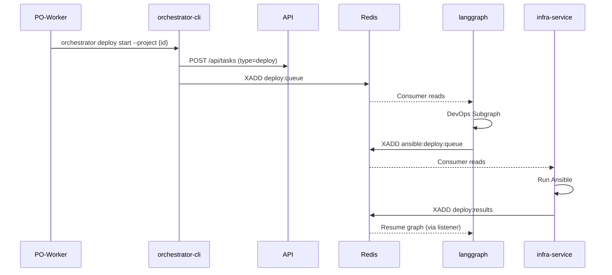

# Contracts / Контракты

Типизированные схемы для REST API и Redis очередей.

## Design Principles

1. **Schema-first** — все сообщения валидируются Pydantic схемами
2. **1:1 Queues** — одна очередь = один Writer → один Consumer (+ optional observers)
3. **Logical Actors** — указываем роль (PO-Worker, langgraph), не техническую прослойку
4. **Traceable** — `correlation_id` для сквозной трассировки

---

## Queue Overview

| Queue | DTO | Initiator | Consumer | Purpose |
|-------|-----|-----------|----------|---------|
| `engineering:queue` | EngineeringMessage | PO-Worker | langgraph | Start development task |
| `deploy:results` | AnsibleDeployResult | infra-service | langgraph | Deploy result (Shared) |
| `deploy:queue` | DeployMessage | PO-Worker | langgraph | Start deploy task |

### Transport Layer Note

> **Important:** The "Initiator" column shows the **logical actor** — who makes the decision to publish.
>
> For **Worker-initiated** messages (PO-Worker, Developer-Worker), the actual transport is:
> ```
> Worker (AI Agent) → orchestrator-cli → Redis/API
> ```
> The CLI is a permission-checked proxy, not an independent actor.
> See [cli_orchestrator.md](../packages/cli_orchestrator.md) for details.

### Actor Roles

| Actor | Type | Description |
|-------|------|-------------|
| **PO-Worker** | Worker | Product Owner agent, talks to user |
| **Developer-Worker** | Worker | Developer agent (inside engineering flow) |
| **langgraph** | Service | Workflow orchestrator |
| **worker-manager** | Service | Container lifecycle manager |
| **worker-wrapper** | Process | Agent bridge inside container |
| **telegram-bot** | Service | User interface |
| **scaffolder** | Service | Project initialization |
| **infra-service** | Service | Ansible/provisioning |
| **scheduler** | Service | Background tasks |

### MVP Notes

> [!IMPORTANT]
> **Tester Node** is an MVP stub. It does NOT spawn a Worker.  
> Implementation: A simple LangGraph node that always returns `{"passed": True}`.  
> Post-MVP: Will delegate to a Tester-Worker with code analysis capabilities.

---

## Flow Diagrams

### Engineering Flow



### Deploy Flow



---

# Part 1: REST DTO

## ProjectDTO

```python
# shared/contracts/dto/project.py

from enum import Enum
from pydantic import BaseModel, ConfigDict

class ProjectStatus(str, Enum):
    DRAFT = "draft"
    SCAFFOLDING = "scaffolding"
    SCAFFOLDED = "scaffolded"
    DEVELOPING = "developing"
    TESTING = "testing"
    DEPLOYING = "deploying"
    ACTIVE = "active"
    FAILED = "failed"
    ARCHIVED = "archived"


class ServiceModule(str, Enum):
    """Available project modules for scaffolding."""
    BACKEND = "backend"
    TELEGRAM = "telegram"
    FRONTEND = "frontend"


class ProjectCreate(BaseModel):
    """Create project request."""
    name: str
    description: str | None = None
    modules: list[ServiceModule] = [ServiceModule.BACKEND]  # Default: backend only


class ProjectDTO(BaseModel):
    """Project response."""
    model_config = ConfigDict(from_attributes=True)
    
    id: str
    name: str
    description: str | None = None
    status: ProjectStatus
    modules: list[ServiceModule] = []
    repository_url: str | None = None
    owner_id: int | None = None
```

## TaskDTO

```python
# shared/contracts/dto/task.py

from enum import Enum
from datetime import datetime
from pydantic import BaseModel, ConfigDict

class TaskStatus(str, Enum):
    QUEUED = "queued"
    RUNNING = "running"
    COMPLETED = "completed"
    FAILED = "failed"
    CANCELLED = "cancelled"


class TaskType(str, Enum):
    ENGINEERING = "engineering"
    DEPLOY = "deploy"


class TaskCreate(BaseModel):
    """Create task request."""
    project_id: str
    type: TaskType
    spec: str | None = None


class TaskDTO(BaseModel):
    """Task response."""
    model_config = ConfigDict(from_attributes=True)

    id: str
    project_id: str
    type: TaskType
    status: TaskStatus
    spec: str | None = None
    result: dict | None = None
    created_at: datetime
    updated_at: datetime | None = None
```

## UserDTO

```python
# shared/contracts/dto/user.py

from pydantic import BaseModel, ConfigDict

class UserDTO(BaseModel):
    """User response."""
    model_config = ConfigDict(from_attributes=True)
    
    id: int
    telegram_id: int

    is_admin: bool = False
```

---

# Part 1.1: Additional DTOs

## ServerDTO

```python
# shared/contracts/dto/server.py

from enum import Enum
from pydantic import BaseModel, ConfigDict
from datetime import datetime

class ServerStatus(str, Enum):
    NEW = "new"
    PENDING_SETUP = "pending_setup"
    ACTIVE = "active"
    UNREACHABLE = "unreachable"
    MAINTENANCE = "maintenance"

class ServerDTO(BaseModel):
    """Server response."""
    model_config = ConfigDict(from_attributes=True)
    
    id: int
    name: str
    ip_address: str
    status: ServerStatus
    provider_id: str
    specs: dict = {}
    last_health_check: datetime | None = None
```

## IncidentDTO

```python
# shared/contracts/dto/incident.py

from enum import Enum
from pydantic import BaseModel, ConfigDict
from datetime import datetime

class IncidentSeverity(str, Enum):
    LOW = "low"
    MEDIUM = "medium"
    HIGH = "high"
    CRITICAL = "critical"

class IncidentStatus(str, Enum):
    OPEN = "open"
    RESOLVED = "resolved"

class IncidentDTO(BaseModel):
    """Incident response."""
    model_config = ConfigDict(from_attributes=True)
    
    id: int
    server_id: int
    severity: IncidentSeverity
    status: IncidentStatus
    title: str
    description: str | None = None
    created_at: datetime
    resolved_at: datetime | None = None
```

## ServiceDeploymentDTO

```python
# shared/contracts/dto/service_deployment.py

from pydantic import BaseModel, ConfigDict
from datetime import datetime

class ServiceDeploymentDTO(BaseModel):
    """Service Deployment response."""
    model_config = ConfigDict(from_attributes=True)
    
    id: int
    project_id: str
    server_id: int
    service_name: str
    port: int
    status: str
    url: str | None = None
    deployed_at: datetime
```

## AgentConfigDTO

```python
# shared/contracts/dto/agent_config.py

from pydantic import BaseModel, ConfigDict
from typing import Literal

class AgentConfigDTO(BaseModel):
    """Agent configuration response."""
    model_config = ConfigDict(from_attributes=True)
    
    id: int
    name: str
    type: Literal["claude", "factory"]
    model: str
    system_prompt: str
    is_active: bool = True
```

---

# Part 2: Queue Messages

## Base Types

```python
# shared/contracts/base.py

from datetime import datetime
from typing import Literal
from pydantic import BaseModel, Field
import uuid


class QueueMeta(BaseModel):
    """Metadata for all queue messages."""
    version: Literal["1"] = "1"
    correlation_id: str = Field(default_factory=lambda: str(uuid.uuid4()))
    timestamp: datetime = Field(default_factory=datetime.utcnow)


class BaseMessage(QueueMeta):
    """Base class for queue messages."""
    request_id: str = Field(default_factory=lambda: str(uuid.uuid4()))
    callback_stream: str | None = None


class BaseResult(BaseModel):
    """Base result for async operations."""
    request_id: str
    status: Literal["success", "failed", "error", "timeout"]
    error: str | None = None
    duration_ms: int | None = None
```

---

## EngineeringMessage

**Queue:** `engineering:queue`  
**Initiator:** PO-Worker  
**Consumer:** langgraph

```python
# shared/contracts/queues/engineering.py

class EngineeringMessage(BaseMessage):
    """Start engineering task."""
    task_id: str
    project_id: str
    user_id: int


class EngineeringResult(BaseResult):
    """Engineering task result."""
    files_changed: list[str] | None = None
    commit_sha: str | None = None
    branch: str | None = None
```

---

## DeployMessage

**Queue:** `deploy:queue`  
**Initiator:** PO-Worker  
**Consumer:** langgraph

```python
# shared/contracts/queues/deploy.py

class DeployMessage(BaseMessage):
    """Start deploy task."""
    task_id: str
    project_id: str
    user_id: int


class DeployResult(BaseResult):
    """Deploy task result."""
    deployed_url: str | None = None
    server_ip: str | None = None
    port: int | None = None
```

---

## ScaffolderMessage

**Queue:** `scaffolder:queue`  
**Initiator:** langgraph (Engineering Subgraph)  
**Consumer:** scaffolder

```python
# shared/contracts/queues/scaffolder.py

class ScaffolderMessage(BaseMessage):
    """
    Initialize project structure.
    
    Responsibilities:
    1. Create remote repository (if not exists).
    2. Generate .project.yml config.
    3. Run copier template.
    4. Push initial commit.
    """
    project_id: str
    project_name: str
    modules: list[ServiceModule]

    # No Result Message:
    # Scaffolder updates Project status in DB directly to 'SCAFFOLDED'.
    # It does NOT publish a result message to Redis.
    # LangGraph polls API or listens to 'project_updates' stream (if implemented).
```


```

---

##### 3. Worker Communication (Two-Listener Pattern)
The Orchestrator (LangGraph) listens to **two** streams to manage worker tasks:

| Stream | Initiator | Consumer | Purpose |
|--------|-----------|----------|---------|
| `worker:developer:output` | worker-wrapper | LangGraph | Successful results or logical errors (compiler fails). |
| `worker:lifecycle` | worker-manager, worker-wrapper | LangGraph | System events: Container Started/Failed/Deleted, Wrapper Ready. |

> **Why two streams?**
> - `output` gives the task result (code, answer).
> - `lifecycle` catches early crashes (Docker fail, OOM) where `output` might never be sent.

| Queue | Initiator | Consumer | Purpose |
|-------|-----------|----------|---------|
| `worker:commands` | LangGraph, TelegramBot | worker-manager | Command to Create/Delete worker container. |
| `worker:responses` | worker-manager | LangGraph | **Responses to Commands** (e.g. "Container created"). Distinct from Lifecycle events. |

## WorkerCommand / WorkerResponse

**Queue (commands):** `worker:commands`  
**Initiator:** langgraph  
**Consumer:** worker-manager

**Queue (responses):** `worker:responses`  
**Initiator:** worker-manager  
**Consumer:** langgraph

```python
# shared/contracts/queues/worker.py

class AgentType(str, Enum):
    CLAUDE = "claude"          # Claude Code
    FACTORY = "factory"        # Factory.ai Droid


class WorkerCapability(str, Enum):
    GIT = "git"
    GITHUB_CLI = "github_cli"
    # Copier moved to dedicated service
    CURL = "curl"
    DOCKER = "docker"          # dind mount


class WorkerConfig(BaseModel):
    """Worker container configuration."""
    name: str
    worker_type: Literal["po", "developer"]  # Worker type for queue naming
    agent_type: AgentType                     # Which AI agent to use
    instructions: str                         # Content for CLAUDE.md / AGENTS.md
    allowed_commands: list[str]               # ["project.*", "engineering.start"]
    capabilities: list[WorkerCapability]      # ["git", "copier"]
    env_vars: dict[str, str] = {}


class CreateWorkerCommand(QueueMeta):
    """Create new worker."""
    command: Literal["create"] = "create"
    request_id: str
    config: WorkerConfig
    context: dict[str, str] = {}   # Additional context (user_id, task_id, etc.)


class DeleteWorkerCommand(QueueMeta):
    """Delete worker."""
    command: Literal["delete"] = "delete"
    request_id: str
    worker_id: str


class StatusWorkerCommand(QueueMeta):
    """Get worker status."""
    command: Literal["status"] = "status"
    request_id: str
    worker_id: str


WorkerCommand = CreateWorkerCommand | DeleteWorkerCommand | StatusWorkerCommand


class CreateWorkerResponse(BaseModel):
    """Response to create command."""
    request_id: str
    success: bool
    worker_id: str | None = None
    error: str | None = None


class DeleteWorkerResponse(BaseModel):
    """Response to delete command."""
    request_id: str
    success: bool
    error: str | None = None


class StatusWorkerResponse(BaseModel):
    """Response to status command."""
    request_id: str
    success: bool
    status: Literal["starting", "running", "stopped", "failed"] | None = None
    error: str | None = None


WorkerResponse = CreateWorkerResponse | DeleteWorkerResponse | StatusWorkerResponse
```

> **Note:** Message passing goes **directly** to worker queues (`worker:po:{id}:input`, etc.), 
> NOT through worker-manager. The manager handles only container lifecycle.

---


## AgentVerdict (DTO from Agent)

```python
# shared/contracts/dto/agent_verdict.py

class AgentVerdictStatus(str, Enum):
    SUCCESS = "success"             # Task completed successfully
    FAILURE = "failure"             # Task failed (retries exhausted)
    IN_PROGRESS = "in_progress"     # Waiting for user input or external event

class AgentVerdict(BaseModel):
    """
    Subjective result from the Agent.
    Parsed from stdout JSON wrapped in <result> tags.
    """
    status: AgentVerdictStatus
    summary: str                    # Human-readable summary
    data: dict[str, Any] = {}       # Structured context (e.g., commit_sha)
```


---

## WorkerLifecycleEvent


**Stream:** `worker:lifecycle`  
**Initiator:** worker-wrapper  
**Consumer:** worker-manager

```python
# shared/contracts/queues/worker_lifecycle.py

class WorkerLifecycleEvent(BaseModel):
    """Worker state change notification from wrapper."""
    worker_id: str
    event: Literal["started", "completed", "failed"]
    timestamp: datetime = Field(default_factory=datetime.utcnow)
    result: dict | None = None        # Agent output on success
    error: str | None = None          # Error message on failure
    exit_code: int | None = None
```

---

## PO Worker I/O

Коммуникация между Telegram Bot и Product Owner Worker.

**Queue (input):** `worker:po:{user_id}:input`  
**Initiator:** telegram-bot  
**Consumer:** worker-wrapper (inside PO container)

**Queue (output):** `worker:po:{user_id}:output`  
**Initiator:** worker-wrapper (inside PO container)  
**Consumer:** telegram-bot

```python
# shared/contracts/queues/po_worker.py

from datetime import datetime
from pydantic import BaseModel, Field
import uuid


class POWorkerInput(BaseModel):
    """Message from Telegram user to PO Worker."""
    
    request_id: str = Field(default_factory=lambda: str(uuid.uuid4()))
    user_id: int                    # Telegram user ID
    prompt: str                     # User's message text
    timestamp: datetime = Field(default_factory=datetime.utcnow)


class POWorkerOutput(BaseModel):
    """Response from PO Worker to Telegram user."""
    
    request_id: str                 # Matches input request_id
    user_id: int                    # Telegram user ID (for routing)
    text: str                       # PO's response text
    is_final: bool = True           # False if streaming (post-MVP)
    timestamp: datetime = Field(default_factory=datetime.utcnow)
```

---

## Developer Worker I/O

Коммуникация между LangGraph (Engineering Subgraph) и Developer Worker.

**Design Decision:** Developer Workers are **ephemeral** (stateless). Each task spawns a fresh worker.
Context is the code in repo + error messages — no session persistence needed.

**Queue (input):** `worker:developer:input` (Shared Queue)
**Initiator:** langgraph (DeveloperNode)
**Consumer:** worker-wrapper (inside Developer container)

**Queue (output):** `worker:developer:output` (Shared Queue)
**Initiator:** worker-wrapper (inside Developer container)
**Consumer:** langgraph (DeveloperNode)

> **Note**: Unlike PO workers which use unique queues per user (`worker:po:{id}:*`), Developer workers use a single shared queue pair.
> Responses are correlated via `task_id` or `request_id`.

```python
# shared/contracts/queues/developer_worker.py

from datetime import datetime
from pydantic import BaseModel, Field
import uuid


class DeveloperWorkerInput(BaseModel):
    """Task for Developer Worker from LangGraph."""

    request_id: str = Field(default_factory=lambda: str(uuid.uuid4()))
    task_id: str                    # Engineering task ID
    project_id: str                 # Project UUID
    prompt: str                     # Task specification
    timeout: int = 1800             # Max execution time (seconds)
    timestamp: datetime = Field(default_factory=datetime.utcnow)


class DeveloperWorkerOutput(BaseResult):
    """Result from Developer Worker to LangGraph."""

    # request_id, status, error, duration_ms inherited from BaseResult
    task_id: str                    # Engineering task ID
    commit_sha: str | None = None   # Commit SHA if code was written
    pr_url: str | None = None       # PR URL if created
    timestamp: datetime = Field(default_factory=datetime.utcnow)
```

> **Post-MVP:** Add `previous_attempts: list[AttemptLog]` to Input and `approach: str` to Output
> for retry context when Tester/CI returns task for rework. For MVP, Developer sees current code
> and error — sufficient for simple iterations.

---

## ProvisionerMessage

**Queue:** `provisioner:queue`  
**Initiator:** scheduler  
**Consumer:** infra-service

```python
# shared/contracts/queues/provisioner.py

class ProvisionerMessage(BaseMessage):
    """Provision server."""
    server_handle: str       # Cloud provider ID (Droplet ID) or unique identifier
    force_reinstall: bool = False
    is_recovery: bool = False


class ProvisionerResult(BaseResult):
    """
    Provisioning result.
    Stream: provisioner:results
    Consumers: scheduler (update DB), telegram-bot (notify admin)
    """
    server_handle: str
    server_ip: str | None = None
    services_redeployed: int = 0
    errors: list[str] | None = None
```

---

## AnsibleDeployMessage

**Queue:** `ansible:deploy:queue`  
**Initiator:** langgraph  
**Consumer:** infra-service

```python
# shared/contracts/queues/ansible_deploy.py

class AnsibleDeployMessage(BaseMessage):
    """Run ansible deploy."""
    job_type: Literal["deploy"] = "deploy"
    project_id: str
    project_name: str
    repo_full_name: str
    server_ip: str
    port: int
    modules: list[str] | None = None
    github_token_ref: str
    secrets_ref: str


class AnsibleDeployResult(BaseResult):
    """
    Ansible deploy result.
    Stream: deploy:results
    """
    deployed_url: str | None = None
    server_ip: str | None = None
    port: int | None = None
    stdout: str | None = None
    stderr: str | None = None
    exit_code: int | None = None
```

---

## ProgressEvent

**Stream:** `task_progress:{task_id}`  
**Initiator:** All consumers  
**Consumer:** telegram-bot

```python
# shared/contracts/events.py

class ProgressEvent(BaseModel):
    """Task progress notification."""
    type: Literal["started", "progress", "completed", "failed"]
    request_id: str
    task_id: str | None = None
    timestamp: datetime = Field(default_factory=datetime.utcnow)
    message: str | None = None
    progress_pct: int | None = None
    current_step: str | None = None
    error: str | None = None
```

---

## File Structure

```
shared/contracts/
├── __init__.py
├── base.py                  # QueueMeta, BaseMessage, BaseResult
├── events.py                # ProgressEvent
├── dto/
│   ├── __init__.py
│   ├── project.py           # ProjectDTO, ProjectCreate
│   ├── task.py              # TaskDTO, TaskCreate
│   └── user.py              # UserDTO
└── queues/
    ├── __init__.py
    ├── engineering.py
    ├── deploy.py
    ├── scaffolder.py
    ├── provisioner.py
    ├── ansible_deploy.py
    ├── worker.py
    └── worker_io.py
```
