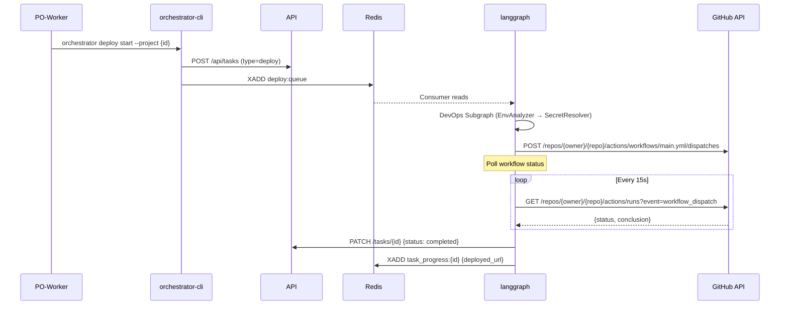

# Deployment Migration Checklist

Анализ изменений для перехода от Ansible-driven deployment к GitHub Actions-driven deployment.

**Дата:** 2026-01-11
**Статус:** Draft
**Связанный документ:** [DEPLOYMENT_STRATEGY.md](./DEPLOYMENT_STRATEGY.md)

---

## Summary

Переход к новой модели деплоя затрагивает **15 документов** в `new_architecture/`:

| Category | Files Affected | Severity |
|----------|---------------|----------|
| Core Contracts | 2 | High |
| Service Specs | 3 | High |
| Migration Plan | 1 | High |
| Test Specs | 4 | Medium |
| Shared/Docs | 5 | Low |

---

## Part 1: codegen_orchestrator Changes

### 1.1 CONTRACTS.md

**File:** `docs/new_architecture/CONTRACTS.md`

#### Queues to REMOVE

| Line | Queue | Action |
|------|-------|--------|
| 26 | `deploy:results` (AnsibleDeployResult → langgraph) | **REMOVE** — больше не нужен |
| 58 | `ansible:deploy:queue` | **REMOVE** — LangGraph не отправляет в infra-service |

#### Queues to ADD

```markdown
| Queue | DTO | Initiator | Consumer | Purpose |
|-------|-----|-----------|----------|---------|
| `workflow:status` | WorkflowStatusEvent | langgraph (poller) | telegram-bot | Deploy progress updates |
```

#### DTOs to REMOVE

| Line | DTO | Action |
|------|-----|--------|
| 882-916 | `AnsibleDeployMessage` | **REMOVE** — не нужен |
| 904-916 | `AnsibleDeployResult` | **REMOVE** — не нужен |

#### DTOs to ADD

```python
# shared/contracts/queues/workflow.py

class WorkflowTriggerRequest(BaseModel):
    """Request to trigger GitHub Actions workflow."""
    project_id: str
    repo_full_name: str           # "org/repo"
    workflow_file: str = "main.yml"
    inputs: dict[str, str] = {}   # workflow_dispatch inputs

class WorkflowStatusResult(BaseResult):
    """Result of workflow execution."""
    run_id: int | None = None
    run_url: str | None = None
    deployed_url: str | None = None
    conclusion: Literal["success", "failure", "cancelled", "skipped"] | None = None
```

#### Deploy Flow Diagram (lines 161-181)

**REPLACE** the entire mermaid diagram:

```markdown
### Deploy Flow


```

#### Actor Roles Table (line 90)

**CHANGE:**
```markdown
| **infra-service** | Service | Server provisioning only (no app deploy) |
```

#### File Structure (end of file)

**REMOVE:**
```
├── ansible_deploy.py
```

---

### 1.2 services/infra_service.md

**File:** `docs/new_architecture/services/infra_service.md`

**Action:** Major rewrite required.

#### Changes:

| Section | Current | New |
|---------|---------|-----|
| Title | "Ansible, Provisioning, Deployment" | "Server Provisioning Only" |
| Responsibilities (line 9-14) | 4 items including deployment | 2 items: Provisioning + Incident Recovery |
| Section 2.2 | "Deployment (`ansible:deploy:queue`)" | **DELETE ENTIRE SECTION** |
| Section 3.2 | "Ansible Structure" with deploy playbook | Remove `deploy_project.yml` mention |
| Dependencies | Keep ansible-core, ansible-runner | Same |

#### New Responsibilities:

```markdown
## 1. Responsibilities

The `infra-service` prepares "bare metal" servers. It does NOT deploy applications.

1.  **Server Provisioning**: Preparing fresh VPS (users, Docker, firewall, SSH keys).
2.  **Incident Recovery**: Auto-fixing common server issues (disk space, docker hang).
3.  **Deploy Key Setup**: Installing SSH public key for GitHub Actions deployment.

> **Note:** Application deployment is handled by GitHub Actions (see DEPLOYMENT_STRATEGY.md).
```

#### Section to ADD:

```markdown
### 2.2 Deploy Key Setup (NEW)

During provisioning, infra-service:
1. Reads `ORCHESTRATOR_SSH_PUBLIC_KEY` from environment.
2. Adds it to `/root/.ssh/authorized_keys` on target server.
3. This enables GitHub Actions to SSH into the server for deployment.

The corresponding private key is stored in GitHub Repository Secrets as `DEPLOY_SSH_KEY`.
```

---

### 1.3 services/langgraph.md

**File:** `docs/new_architecture/services/langgraph.md`

#### Section 3.2.B DevOps Subgraph (lines 36-43)

**REPLACE:**

```markdown
#### B. DevOps Subgraph
*   **Goal**: Make the project live.
*   **Abstraction**: `Project ID` -> `URL`.
*   **Internal Flow**: `EnvAnalyzer` -> `SecretResolver` -> `ReadinessCheck` -> `Deployer`.
*   **Implementation**:
    *   `Deployer` node DOES NOT run Ansible.
    *   It calls `GitHubAppClient.trigger_workflow()` to start GitHub Actions.
    *   It polls `GitHubAppClient.get_workflow_run()` for completion.
    *   On success: extracts `deployed_url` from workflow outputs.
    *   On failure: fetches logs and returns error to Engineering for fix.
```

#### Section 5.2 Emitted Commands (lines 143-145)

**REMOVE:**
```markdown
*   `ansible:deploy:queue` (Target: `infra-service`)
```

**ADD:**
```markdown
*   GitHub Actions API (Target: GitHub, via `GitHubAppClient`)
```

#### Dependencies BANNED list (line 126)

**ADD:**
```markdown
*   `paramiko`, `asyncssh` (SSH handled by GitHub Actions, not LangGraph)
```

---

### 1.4 shared/github_client.md

**File:** `docs/new_architecture/shared/github_client.md`

#### Section 3.1 GitHubAppClient — ADD methods:

```python
# === Workflow Operations (NEW) ===

async def trigger_workflow(
    self,
    repo: str,
    workflow_file: str,
    ref: str = "main",
    inputs: dict[str, str] | None = None,
) -> int:
    """
    Trigger workflow_dispatch event.
    Returns: workflow run_id
    """
    ...

async def get_workflow_run(
    self,
    repo: str,
    run_id: int,
) -> WorkflowRun:
    """Get workflow run status and conclusion."""
    ...

async def get_workflow_runs(
    self,
    repo: str,
    event: str = "workflow_dispatch",
    created: str | None = None,  # e.g., ">2024-01-01"
) -> list[WorkflowRun]:
    """List recent workflow runs."""
    ...

async def get_workflow_logs(
    self,
    repo: str,
    run_id: int,
) -> str:
    """Download and extract workflow logs (for error reporting)."""
    ...
```

#### Section 3.2 Data Classes — ADD:

```python
class WorkflowRun(BaseModel):
    id: int
    name: str
    status: Literal["queued", "in_progress", "completed"]
    conclusion: Literal["success", "failure", "cancelled", "skipped"] | None
    html_url: str
    created_at: datetime
    updated_at: datetime
```

---

### 1.5 GLOSSARY.md

**File:** `docs/new_architecture/GLOSSARY.md`

#### Line 17 — CHANGE:

```markdown
# OLD
- `infra-service` — consumer для `provisioner:queue`, `ansible:deploy:queue`

# NEW
- `infra-service` — consumer для `provisioner:queue` (provisioning only)
```

#### Line 112 — CHANGE:

```markdown
# OLD
- DevOps Subgraph — EnvAnalyzer → SecretResolver → ReadinessCheck → Deployer

# NEW
- DevOps Subgraph — EnvAnalyzer → SecretResolver → ReadinessCheck → Deployer (triggers GitHub Actions)
```

#### Line 143 — REMOVE:

```markdown
- `ansible:deploy:queue` — делегированный Ansible деплой
```

#### Visual Summary diagram (line 175+) — UPDATE:

Remove references to `ansible:deploy:queue`. Update to show GitHub API call.

---

### 1.6 README.md

**File:** `docs/new_architecture/README.md`

#### Queues table (lines 34-37) — CHANGE:

```markdown
# REMOVE this line:
| `ansible:deploy:queue` | DevOps Subgraph | infra-service |

# CHANGE this line:
| `provisioner:queue` | Scheduler | infra-service (provisioning only) |
```

#### Services box (line 55) — CHANGE:

```markdown
# OLD
│  infra-service    Ansible provisioning/deployment       │

# NEW
│  infra-service    Server provisioning only              │
```

#### Section "DevOps Subgraph" (line 155-158) — CHANGE:

```markdown
# OLD
*   **Process**: EnvAnalyzer -> Deployer -> Ansible.

# NEW
*   **Process**: EnvAnalyzer -> SecretResolver -> Deployer -> GitHub Actions.
```

---

### 1.7 MIGRATION_PLAN.md

**File:** `docs/new_architecture/MIGRATION_PLAN.md`

#### P1.3 Infra Service (lines 217-230) — REWRITE:

```markdown
### P1.3 — Infra Service

**Path:** `services/infra-service/`
**Dependencies:** P0.1, P0.2

**Tasks:**
- [ ] Rename from `infrastructure-worker`
- [ ] Subscribe: `provisioner:queue` only (REMOVE ansible:deploy:queue)
- [ ] Ansible execution wrapper (for provisioning playbooks only)
- [ ] SSH key setup during provisioning
- [ ] REMOVE: `deploy_project.yml` playbook and related code

**Tests:**
- [ ] Integration test: Mock Ansible Runner (provision only)
- [ ] SSH key installation verification

**Acceptance:**
- [ ] Provisioning flow works
- [ ] SSH public key added to server's authorized_keys
- [ ] NO deployment logic in service
```

#### P2.2 LangGraph (lines 276-283) — ADD to tasks:

```markdown
- [ ] DeployerNode: Replace Redis publish with GitHub API call
- [ ] Add workflow polling loop with 15s interval
- [ ] Add workflow logs fetching for error reporting
- [ ] Integration test: Mock GitHub API for workflow trigger/poll
```

---

### 1.8 SECRETS.md

**File:** `docs/new_architecture/SECRETS.md`

#### Section "Infra Service & Ansible" (lines 46-63) — REWRITE:

```markdown
### Infra Service (Provisioning Only)

`infra-service` uses L1 secrets for:
1. SSH connection to servers (uses orchestrator's SSH key)
2. Provider API calls (Time4VPS, DigitalOcean) for server management

**It does NOT handle L2 (project) secrets.** Those are managed by GitHub Actions.

### Deployment via GitHub Actions

1. During project creation, orchestrator calls `GitHubAppClient.set_repository_secrets()`:
   - `DEPLOY_HOST` = server IP
   - `DEPLOY_USER` = "root"
   - `DEPLOY_SSH_KEY` = orchestrator's private key
   - `APP_SECRET_KEY`, `POSTGRES_PASSWORD`, etc. = generated/provided secrets

2. GitHub Actions workflow reads secrets via `${{ secrets.* }}` syntax.

3. Workflow SSHs to server and deploys with secrets injected into `.env`.
```

---

### 1.9 ERROR_HANDLING.md

**File:** `docs/new_architecture/ERROR_HANDLING.md`

#### Timeouts table (line 46) — CHANGE:

```markdown
# OLD
| **Ansible Playbook** | 15 min | Kill Process, Fail Task |

# NEW
| **GitHub Workflow** | 30 min | Cancel Workflow, Fail Task |
| **Ansible Provisioning** | 15 min | Kill Process, Fail Task |
```

#### DLQ list (line 78) — REMOVE:

```markdown
- `deploy:queue:dlq`  # Keep this one - still used for deploy tasks
```

Actually, keep `deploy:queue:dlq` but REMOVE any mention of `ansible:deploy:queue:dlq`.

---

### 1.10 tests/TESTING_STRATEGY.md

**File:** `docs/new_architecture/tests/TESTING_STRATEGY.md`

#### Section 3.7 Infra Service (lines 203-221) — REWRITE:

```markdown
### 3.7 Infra Service

| Level | What to Test |
|-------|--------------|
| **Unit** | Inventory generation, playbook selection |
| **Integration** | Provisioning flow (mock Ansible), SSH key setup |

**Integration scenarios:**
- [ ] Consume `ProvisionerMessage` from `provisioner:queue`
- [ ] Generate inventory from server config
- [ ] Run ansible-playbook for provisioning (mock subprocess)
- [ ] Verify SSH public key added to authorized_keys
- [ ] Publish result to `provisioner:results`

**Removed scenarios (now handled by GitHub Actions):**
- ~~Consume `AnsibleDeployMessage` from `ansible:deploy:queue`~~
- ~~Run deploy playbook~~
- ~~Publish result to `deploy:results`~~

**Mocks:**
- Ansible subprocess (capture commands, return mock results)
- SSH connections (for key verification)
```

#### Section 3.3 LangGraph - DevOps scenarios (lines 135-141) — REWRITE:

```markdown
**Integration scenarios (DevOps Subgraph):**
- [ ] Consume `DeployMessage` from `deploy:queue`
- [ ] EnvAnalyzerNode → fetch .env.example, classify vars
- [ ] SecretResolverNode → generate/collect secrets
- [ ] ReadinessCheck → verify all secrets present
- [ ] DeployerNode → call GitHub API to trigger workflow
- [ ] DeployerNode → poll workflow status until completion
- [ ] Success → extract deployed_url, publish `DeployResult`
- [ ] Failure → fetch logs, return to Engineering

**Mocks:**
- GitHub API (workflow trigger, status, logs)
- LLM responses (for env analysis)
```

#### E2E Scenario (lines 249-265) — UPDATE step 8:

```markdown
# OLD
8. Ansible deploys (mock)

# NEW
8. GitHub Actions deploys (real workflow in test org)
```

---

### 1.11 tests/services/infra_service.md

**File:** `docs/new_architecture/tests/services/infra_service.md`

#### Major rewrite required.

**REMOVE sections:**
- Scenario C: Deployment Success (lines 65-68)
- All mentions of `AnsibleDeployMessage`, `deploy:results`

**ADD section:**

```markdown
### Scenario C: SSH Key Installation

1.  **Trigger:** Publish `ProvisionerMessage(server_handle="srv1", ...)` to `provisioner:queue`.
2.  **Mock Behavior:** Subprocess Interceptor captures ansible-playbook call.
3.  **Assert:**
    - Playbook `provision_access.yml` was called
    - Extra vars include `ssh_public_key`
    - Result published to `provisioner:results`
```

---

### 1.12 tests/services/langgraph.md

**File:** `docs/new_architecture/tests/services/langgraph.md`

#### Section 3.2 "Deploy Flow" (lines 129-143) — REWRITE:

```markdown
### 3.2 The "Deploy Flow" (Happy Path)

This scenario verifies: `Deploy Start` -> `Env Analysis` -> `Secrets` -> `GitHub Actions` -> `Success`.

**Setup:**
- Mock GitHub API responses for workflow trigger and polling
- Mock API responses for project/server data

**Flow:**

1.  **Trigger**: Harness sends `DeployMessage(project_id="p1")`.

2.  **DevOps Subgraph Execution**:
    *   Graph runs EnvAnalyzer, SecretResolver, ReadinessCheck.
    *   DeployerNode calls mock GitHub API.
    *   *Assert*: `trigger_workflow()` called with correct repo and inputs.

3.  **Workflow Polling**:
    *   Mock returns `status="in_progress"` then `status="completed", conclusion="success"`.
    *   *Assert*: Polling occurs with expected interval.

4.  **Completion**:
    *   *Assert*: Task status updated to `COMPLETED`.
    *   *Assert*: `deployed_url` extracted from workflow outputs.
```

#### Lines 64-65 — REMOVE:

```python
#    - ansible:deploy:queue
#    - deploy:results
```

---

### 1.13 packages/cli_orchestrator.md

**File:** `docs/new_architecture/packages/cli_orchestrator.md`

No major changes needed. `deploy:queue` is still used — only the consumer behavior changes.

Minor update to line 18:

```markdown
# OLD
2.  **Event Publisher**: Publish messages to Redis queues (engineering, deploy, scaffolder).

# NEW (clarify)
2.  **Event Publisher**: Publish messages to Redis queues (engineering, deploy).
    Note: Deploy is consumed by LangGraph which triggers GitHub Actions.
```

---

## Part 2: service_template Changes

**Repository:** `/home/vlad/projects/service-template`

### 2.1 `.github/workflows/main.yml.jinja`

#### Add workflow_dispatch inputs:

```yaml
on:
  push:
    branches: [main]
  workflow_dispatch:
    inputs:
      skip_build:
        description: 'Skip build step (use existing images)'
        required: false
        default: 'false'
        type: boolean
      # NEW INPUTS
      deploy_host:
        description: 'Override DEPLOY_HOST (optional)'
        required: false
        type: string
      deploy_port:
        description: 'SSH port (default: 22)'
        required: false
        default: '22'
        type: string
      compose_files:
        description: 'Compose files to use'
        required: false
        default: 'infra/compose.base.yml infra/compose.prod.yml'
        type: string
```

#### Modify deploy job to use inputs:

```yaml
deploy:
  # ...
  steps:
    - name: Deploy to server
      uses: appleboy/ssh-action@v1.0.0
      with:
        host: ${{ inputs.deploy_host || secrets.DEPLOY_HOST }}
        port: ${{ inputs.deploy_port || secrets.DEPLOY_PORT || '22' }}
        username: ${{ secrets.DEPLOY_USER }}
        key: ${{ secrets.DEPLOY_SSH_KEY }}
        script: |
          cd ${{ secrets.DEPLOY_PROJECT_PATH }}
          # ... rest of deploy script
```

#### Add workflow outputs:

```yaml
jobs:
  deploy:
    outputs:
      deployed_url: ${{ steps.deploy.outputs.url }}
    steps:
      - name: Deploy to server
        id: deploy
        # ...

      - name: Set output
        run: |
          echo "url=http://${{ inputs.deploy_host || secrets.DEPLOY_HOST }}:${{ secrets.APP_PORT || '8000' }}" >> $GITHUB_OUTPUT
```

### 2.2 New file: `.github/workflows/deploy.yml.jinja`

Create dedicated deploy-only workflow (for orchestrator triggering):

```yaml
# .github/workflows/deploy.yml.jinja
name: Deploy Only

on:
  workflow_dispatch:
    inputs:
      image_tag:
        description: 'Docker image tag to deploy'
        required: true
        default: 'latest'
        type: string
      deploy_host:
        description: 'Target server IP'
        required: true
        type: string
      deploy_port:
        description: 'SSH port'
        required: false
        default: '22'
        type: string

jobs:
  deploy:
    runs-on: ubuntu-latest
    outputs:
      deployed_url: ${{ steps.output.outputs.url }}

    steps:
      - uses: actions/checkout@v4

      - name: Deploy via SSH
        uses: appleboy/ssh-action@v1.0.0
        with:
          host: ${{ inputs.deploy_host }}
          port: ${{ inputs.deploy_port }}
          username: ${{ secrets.DEPLOY_USER }}
          key: ${{ secrets.DEPLOY_SSH_KEY }}
          script: |
            cd ${{ secrets.DEPLOY_PROJECT_PATH }}

            # Generate .env from secrets
            {
              echo "ENVIRONMENT=production"
              echo "APP_NAME={{ project_name }}"
              echo "APP_SECRET_KEY=${{ secrets.APP_SECRET_KEY }}"
              echo "POSTGRES_PASSWORD=${{ secrets.POSTGRES_PASSWORD }}"
              echo "REDIS_URL=redis://redis:6379"
              
              echo "TELEGRAM_BOT_TOKEN=${{ secrets.TELEGRAM_BOT_TOKEN }}"
              
              echo "${{ secrets.EXTRA_ENV_VARS }}"
            } > .env

            # Pull and restart
            docker compose -f ${{ inputs.compose_files || 'infra/compose.base.yml infra/compose.prod.yml' }} pull
            docker compose -f ${{ inputs.compose_files || 'infra/compose.base.yml infra/compose.prod.yml' }} up -d

      - name: Set outputs
        id: output
        run: |
          echo "url=http://${{ inputs.deploy_host }}:8000" >> $GITHUB_OUTPUT
```

### 2.3 Documentation update: `ARCHITECTURE.md.jinja`

Add section explaining orchestrator integration:

```markdown
## Deployment

This project supports two deployment modes:

### 1. Manual (Push to main)
Push to `main` branch triggers full CI/CD:
- Build images → Push to GHCR → Deploy to server

### 2. Orchestrated (workflow_dispatch)
External orchestrator can trigger deployment via GitHub API:
```bash
curl -X POST \
  -H "Authorization: Bearer $GITHUB_TOKEN" \
  -H "Accept: application/vnd.github.v3+json" \
  https://api.github.com/repos/OWNER/REPO/actions/workflows/deploy.yml/dispatches \
  -d '{"ref":"main","inputs":{"deploy_host":"1.2.3.4","image_tag":"latest"}}'
```

Required repository secrets:
- `DEPLOY_USER` - SSH username (usually "root")
- `DEPLOY_SSH_KEY` - SSH private key
- `DEPLOY_PROJECT_PATH` - Path on server (e.g., `/opt/services/myapp`)
- `APP_SECRET_KEY` - Application secret
- `POSTGRES_PASSWORD` - Database password
```

### 2.4 copier.yml — No changes needed

The workflow files are already generated with Jinja templates.

---

## Part 3: Implementation Order

### Phase 1: Contracts & Specs (No code)

1. [ ] Update `CONTRACTS.md` — remove ansible queues, add workflow DTOs
2. [ ] Update `services/infra_service.md` — provisioning only
3. [ ] Update `services/langgraph.md` — GitHub API instead of Redis
4. [ ] Update `shared/github_client.md` — add workflow methods
5. [ ] Update `GLOSSARY.md`, `README.md` — terminology fixes

### Phase 2: Test Specs

6. [ ] Update `tests/TESTING_STRATEGY.md`
7. [ ] Update `tests/services/infra_service.md`
8. [ ] Update `tests/services/langgraph.md`

### Phase 3: Migration Plan

9. [ ] Update `MIGRATION_PLAN.md` — reflect new approach

### Phase 4: service_template

10. [ ] Add `deploy.yml.jinja` workflow
11. [ ] Update `main.yml.jinja` with inputs/outputs
12. [ ] Update documentation

### Phase 5: Cleanup

13. [ ] Update `SECRETS.md`, `ERROR_HANDLING.md`
14. [ ] Remove stale references from `AUDIT.md`
15. [ ] Update `DEPLOYMENT_STRATEGY.md` with bootstrap flow details

---

## Open Questions

1. **Rate Limiting:** GitHub API polling every 15s = 240 req/hour per active deploy. With 10 concurrent deploys = 2400/hour. Safe under 5000 limit, but consider webhooks for future.

2. **Workflow Outputs:** How does orchestrator get `deployed_url`? Options:
   - Parse workflow logs (fragile)
   - Workflow writes to artifact (complex)
   - Workflow calls webhook (requires endpoint)
   - **Recommended:** Construct URL from known `server_ip:port`

3. **Error Logs:** When workflow fails, how much log to fetch? Full logs can be 10MB+. Consider:
   - Last 100 lines only
   - Only failed step logs
   - Summary from workflow conclusion

4. **Rollback:** If deploy fails mid-way, server might be in broken state. Consider:
   - Health check after deploy
   - Automatic rollback to previous image tag
   - Manual intervention alert

---

## Change Log

| Date | Author | Changes |
|------|--------|---------|
| 2026-01-11 | Claude | Initial checklist |
