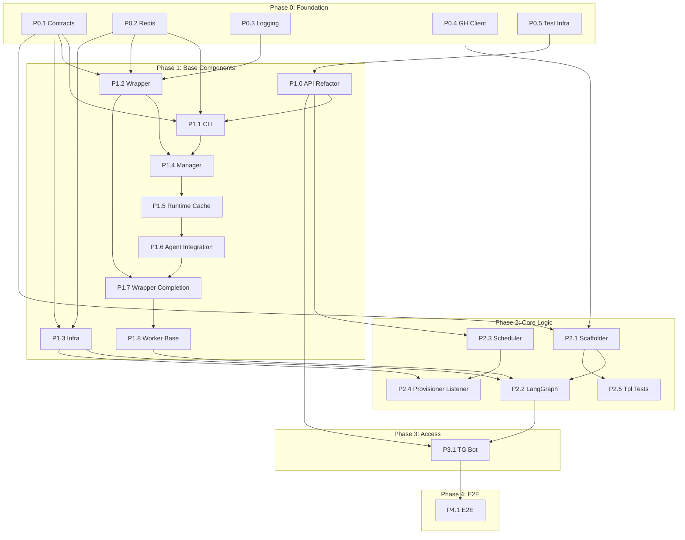

# Migration Plan

Стратегия рефакторинга проекта `codegen_orchestrator` на новую архитектуру.

---

## Philosophy: Hardcore TDD

Подход **Outside-In TDD** с изоляцией сервисов.

1.  **Contract First**: Сначала фиксируем DTO в `CONTRACTS.md`.
2.  **Red (Integration)**: Пишем интеграционный тест сервиса — падает.
3.  **Red (Unit)**: Пишем юнит-тест — падает.
4.  **Green**: Реализуем минимум для прохождения.
5.  **Refactor**: Улучшаем, не ломая тесты.

---

## Dependency Graph



---

## Component Registry

| ID | Component | Package/Service | Depends On | Phase |
|----|-----------|-----------------|------------|-------|
| P0.1 | Shared Contracts | `shared/contracts` | — | 0 |
| P0.2 | Shared Redis | `shared/redis` | — | 0 |
| P0.3 | Shared Logging | `shared/logging` | — | 0 |
| P0.4 | GitHub Client | `shared/clients/github` | — | 0 |
| P0.5 | Test Infrastructure | `docker/test/` | — | 0 |
| P1.0 | API Refactor | `services/api` | P0.5 | 1 |
| P1.1 | Orchestrator CLI | `packages/orchestrator-cli` | P0.1, P0.2, P1.0 | 1 |
| P1.2 | Worker Wrapper | `packages/worker-wrapper` | P0.1, P0.2, P0.3 | 1 |
| P1.3 | Infra Service | `services/infra-service` | P0.1, P0.2 | 1 |
| P1.4 | Worker Manager | `services/worker-manager` | P1.1, P1.2 | 1 |
| P1.5 | Runtime Cache | `services/worker-manager` | P1.4 | 1 |
| P1.6 | Agent Integration | `services/worker-manager` | P1.5 | 1 |
| P1.7 | Wrapper Completion | `packages/worker-wrapper` | P1.2, P1.6 | 1 |
| P1.8 | Worker Base Image | `services/worker-manager/docker` | P1.7 | 1 |
| P1.9 | Integration Milestone | `tests/integration/backend` | P1.8 | 1 |
| P1.10 | **Agent & CLI Tests** | `tests/integration/backend` | P1.9 | 1 |
| P2.1 | Scaffolder | `services/scaffolder` | P0.1, P0.4, **P1.10** | 2 |
| P2.2 | LangGraph Service | `services/langgraph` | P1.3, P1.8, P2.1 | 2 |
| P2.3 | Scheduler Refactoring | `services/scheduler` | P1.0 | 2 |
| P2.4 | Provisioner Result Listener | `services/scheduler` | P2.3, P1.3 | 2 |
| P2.5 | Template Tests | `tests/integration/template` | P2.1 | 2 |
| P3.1 | Telegram Bot | `services/telegram-bot` | P1.0, P2.2 | 3 |
| P4.1 | System E2E | `tests/e2e` | All above | 4 |

---

## Phase 0: Foundation

> **Goal:** Подготовить shared kernel без которого невозможно писать тесты.

### P0.1 — Shared Contracts

**Path:** `shared/contracts/`

**Tasks:**
- [ ] Перенести и актуализировать все Pydantic модели
- [ ] Добавить `pyproject.toml`
- [ ] Убедиться в соответствии с `CONTRACTS.md`

**Acceptance Criteria:**
- [ ] Все DTO из `CONTRACTS.md` имеют реализацию
- [ ] `mypy` проходит без ошибок
- [ ] Тесты валидации моделей проходят

---

### P0.2 — Shared Redis

**Path:** `shared/redis/`

**Tasks:**
- [ ] Обёртка над Redis Streams (XADD, XREAD, XACK)
- [ ] Consumer Group management
- [ ] Поддержка FakeRedis для тестов

**Acceptance Criteria:**
- [ ] Unit tests с FakeRedis
- [ ] Документация API

---

### P0.3 — Shared Logging

**Path:** `shared/logging/`

**Tasks:**
- [ ] Настройка Structlog
- [ ] Correlation ID propagation

**Acceptance Criteria:**
- [ ] Логи в JSON формате
- [ ] Correlation ID присутствует

---

### P0.4 — GitHub Client

**Path:** `shared/clients/github.py`

**Tasks:**
- [x] GitHub App authentication
- [x] Token caching (per-installation)
- [x] Rate limiting

**Acceptance Criteria:**
- [x] Unit tests с respx mock
- [ ] Integration tests с Testcontainers (optional)

---

### P0.5 — Test Infrastructure

**Path:** `docker/test/`  
**Spec:** [TESTING_STRATEGY.md](./tests/TESTING_STRATEGY.md)

**Goal:** Настроить 4-уровневую систему тестирования (Unit, Service, Integration, E2E) чтобы все последующие компоненты разрабатывались в TDD.

**Tasks:**
- [ ] Перенести legacy тесты в `tests_legacy/`
- [ ] Создать структуру `docker/test/{unit,service,integration,e2e}/`
- [ ] Для каждого сервиса создать `docker/test/service/{service}.yml`
- [ ] Обновить Makefile: `test-{service}-unit`, `test-{service}-service`
- [ ] Создать `docker/test/integration/frontend.yml` (telegram + api)
- [ ] Создать `docker/test/integration/backend.yml` (langgraph + workers)
- [ ] Обновить pre-push hook для нового формата
- [ ] Обновить AGENTS.md с TDD workflow

**Acceptance Criteria:**
- [ ] `make test-api-unit` запускает unit тесты API
- [ ] `make test-api-service` поднимает API + DB + test-runner
- [ ] Legacy тесты не блокируют CI
- [ ] Документация TESTING_STRATEGY.md актуальна

---

## Phase 1: Base Components

> **Goal:** Строительные блоки для воркеров и инфраструктуры.

### P1.0 — API Refactor

**Path:** `services/api/`  
**Depends:** P0.5  
**Test Spec:** [tests/services/api.md](./tests/services/api.md)

**Goal:** Превратить API в чистый Data Access Layer без side effects.

#### 🔴 RED: Write Failing Tests

**File:** `services/api/tests/service/test_pure_crud.py`

- [ ] `test_post_tasks_no_redis_publish` — POST /tasks НЕ публикует в Redis
- [ ] `test_post_tasks_no_github_calls` — POST /tasks НЕ вызывает GitHub
- [ ] `test_post_projects_pure_db` — POST /projects только пишет в DB

**Run:** `make test-api-service` → ❌ FAIL

#### 🟢 GREEN: Implement

- [ ] Удалить Redis Publisher из POST `/tasks`
- [ ] Удалить прямые вызовы GitHub/GitLab
- [ ] API = чистый Data Access Layer

**Run:** `make test-api-service` → ✅ PASS

#### ✅ Acceptance Criteria

- [ ] Только CRUD операции с PostgreSQL
- [ ] Никаких side effects кроме записи в БД
- [ ] Все тесты проходят

---

### P1.1 — Orchestrator CLI

**Path:** `packages/orchestrator-cli/`  
**Depends:** P0.1, P0.2, P1.0

**Tasks:**
- [ ] Выделить код из `shared/cli`
- [ ] Добавить `pyproject.toml`
- [ ] Реализовать dual-write: POST API + XADD Redis
- [ ] Permissions system по allowed_commands

**Acceptance Criteria:**
- [ ] `orchestrator project create` → Task in DB + Message in queue
- [ ] Unit tests для всех команд
- [ ] Mock Redis, Mock API

---

### P1.2 — Worker Wrapper

**Path:** `packages/worker-wrapper/`  
**Depends:** P0.1, P0.2, P0.3

**Tasks:**
- [ ] Loop: XREAD → Subprocess → XADD
- [ ] Lifecycle events (started, completed, failed)
- [ ] Session management (PO only)
- [ ] Timeout handling

**Acceptance Criteria:**
- [ ] Integration test: Real Redis + Mock Agent
- [ ] Lifecycle events published correctly
- [ ] Graceful shutdown

---

### P1.3 — Infra Service

**Path:** `services/infra-service/`  
**Depends:** P0.1, P0.2

**Tasks:**
- [ ] Переименовать из `infrastructure-worker`
- [ ] Subscribe: `provisioner:queue` only (REMOVE ansible:deploy:queue)
- [ ] Ansible execution wrapper (for provisioning playbooks only)
- [ ] SSH key setup during provisioning
- [ ] REMOVE: `deploy_project.yml` playbook and related code

**Acceptance Criteria:**
- [ ] Integration test: Mock Ansible Runner (provision only)
- [ ] SSH key installation verification
- [ ] Provisioning flow works

---

### P1.4 — Worker Manager

**Path:** `services/worker-manager/`  
**Depends:** P1.1, P1.2

**Tasks:**
- [ ] Сборка `worker-base` Docker image (CLI + Wrapper)
- [ ] Container lifecycle (create, delete, status)
- [ ] Activity tracking via `worker:lifecycle`
- [ ] Auto-pause inactive PO workers

**Acceptance Criteria:**
- [ ] Integration test: Mock Docker API
- [ ] Create/Delete worker works
- [ ] Crash detection publishes failure to output queue

---

### P1.5 — Programmatic Runtime Cache

**Path:** `services/worker-manager/`
**Depends:** P1.4

**Tasks:**
- [x] Implement `ImageBuilder` class (Dockerfile generation)
- [x] Config hashing logic (JSON canonicalization)
- [x] Build & Cache logic (check hash -> build -> tag)
- [x] Integration with `WorkerManager` logic

**Acceptance Criteria:**
- [x] Unit tests for Dockerfile generation
- [x] Integration test: specific config -> new image built
- [x] Re-use existing image if hash matches

---

### P1.6 — Agent Integration

**Path:** `services/worker-manager/`
**Depends:** P1.5
**Test Spec:** [tests/services/worker_manager.md](./tests/services/worker_manager.md)

**Goal:** Интеграция с реальными CLI-агентами (Claude Code, Factory Droid) и production-ready конфигурация контейнеров.

#### P1.6.1 — Agent Factories

##### 🔴 RED: Write Failing Tests

**File:** `services/worker-manager/tests/unit/test_agent_factories.py`

```python
class TestClaudeCodeAgent:
    def test_get_install_commands_includes_npm_install(self):
        """Install commands should include Claude Code npm install."""
        agent = ClaudeCodeAgent()
        commands = agent.get_install_commands()
        assert any("npm install" in cmd and "claude-code" in cmd for cmd in commands)

    def test_get_instruction_path_returns_claude_md(self):
        """Claude uses CLAUDE.md for instructions."""
        assert ClaudeCodeAgent().get_instruction_path() == "/workspace/CLAUDE.md"

    def test_get_agent_command_includes_dangerously_skip(self):
        """Agent command should skip permission prompts."""
        cmd = ClaudeCodeAgent().get_agent_command()
        assert "--dangerously-skip-permissions" in cmd

class TestFactoryDroidAgent:
    def test_get_install_commands_includes_curl_install(self):
        """Install commands should include Factory CLI install."""
        commands = FactoryDroidAgent().get_install_commands()
        assert any("factory.ai" in cmd for cmd in commands)

    def test_get_instruction_path_returns_agents_md(self):
        """Factory uses AGENTS.md for instructions."""
        assert FactoryDroidAgent().get_instruction_path() == "/workspace/AGENTS.md"
```

**File:** `services/worker-manager/tests/unit/test_image_builder.py` (extend)

```python
class TestImageHashWithAgentType:
    def test_same_capabilities_different_agent_produce_different_hash(self):
        """Same capabilities but different agent = different image."""
        hash_claude = compute_image_hash(["GIT"], agent_type="claude")
        hash_factory = compute_image_hash(["GIT"], agent_type="factory")
        assert hash_claude != hash_factory

    def test_hash_deterministic_with_agent_type(self):
        """Agent type should be part of deterministic hash."""
        h1 = compute_image_hash(["GIT", "CURL"], agent_type="claude")
        h2 = compute_image_hash(["CURL", "GIT"], agent_type="claude")
        assert h1 == h2
```

**Run:** `make test-worker-manager-unit` → ❌ FAIL (classes don't exist)

##### 🟢 GREEN: Implement

- [x] Create `src/agents/__init__.py`
- [x] Create `src/agents/base.py` — `AgentConfig` Protocol
- [x] Create `src/agents/claude_code.py` — `ClaudeCodeAgent`
- [x] Create `src/agents/factory_droid.py` — `FactoryDroidAgent`
- [x] Update `compute_image_hash()` to accept `agent_type` parameter

**Run:** `make test-worker-manager-unit` → ✅ PASS

---

#### P1.6.2 — Container Configuration

##### 🔴 RED: Write Failing Tests

**File:** `services/worker-manager/tests/unit/test_container_config.py`

```python
class TestWorkerContainerConfig:
    def test_to_env_vars_includes_required_fields(self):
        """Config should generate all required env vars."""
        config = WorkerContainerConfig(
            worker_id="test-1", worker_type="developer",
            agent_type="claude", capabilities=["GIT"],
        )
        env = config.to_env_vars(redis_url="redis://r", api_url="http://api")
        assert env["WORKER_ID"] == "test-1"
        assert env["REDIS_URL"] == "redis://r"
        assert env["AGENT_TYPE"] == "claude"

    def test_host_session_mode_adds_volume_mount(self):
        """Host session auth mode should configure volume mount."""
        config = WorkerContainerConfig(
            ..., auth_mode="host_session", host_claude_dir="/home/user/.claude"
        )
        volumes = config.to_volume_mounts()
        assert "/home/user/.claude" in volumes
        assert volumes["/home/user/.claude"]["bind"] == "/home/worker/.claude"

    def test_api_key_mode_adds_env_var(self):
        """API key auth mode should add ANTHROPIC_API_KEY."""
        config = WorkerContainerConfig(
            ..., auth_mode="api_key", api_key="sk-ant-test"
        )
        env = config.to_env_vars(...)
        assert env["ANTHROPIC_API_KEY"] == "sk-ant-test"

    def test_docker_capability_adds_socket_mount(self):
        """DOCKER capability should mount docker.sock."""
        config = WorkerContainerConfig(..., capabilities=["DOCKER"])
        volumes = config.to_volume_mounts()
        assert "/var/run/docker.sock" in volumes
```

**Run:** `make test-worker-manager-unit` → ❌ FAIL

##### 🟢 GREEN: Implement

- [x] Create `src/container_config.py` — `WorkerContainerConfig` dataclass
- [x] Implement `to_env_vars()` method
- [x] Implement `to_volume_mounts()` method
- [x] Implement `to_docker_run_kwargs()` method

**Run:** `make test-worker-manager-unit` → ✅ PASS

---

#### P1.6.3 — Docker Exec Operations

##### 🔴 RED: Write Failing Tests

**File:** `services/worker-manager/tests/unit/test_docker_ops.py` (extend)

```python
class TestDockerExec:
    @pytest.mark.asyncio
    async def test_exec_in_container_returns_exit_code_and_output(self):
        """exec_in_container should return (exit_code, output)."""
        with patch("src.docker_ops.docker.from_env") as mock:
            mock_container = MagicMock()
            mock_container.exec_run.return_value = ExecResult(exit_code=0, output=b"hello")
            mock.return_value.containers.get.return_value = mock_container

            wrapper = DockerClientWrapper()
            exit_code, output = await wrapper.exec_in_container("c-123", "echo hello")

            assert exit_code == 0
            assert "hello" in output

    @pytest.mark.asyncio
    async def test_exec_in_container_handles_failure(self):
        """Should handle non-zero exit codes."""
        with patch("src.docker_ops.docker.from_env") as mock:
            mock_container = MagicMock()
            mock_container.exec_run.return_value = ExecResult(exit_code=1, output=b"error")
            mock.return_value.containers.get.return_value = mock_container

            wrapper = DockerClientWrapper()
            exit_code, output = await wrapper.exec_in_container("c-123", "bad command")

            assert exit_code == 1
```

**Run:** `make test-worker-manager-unit` → ❌ FAIL

##### 🟢 GREEN: Implement

- [x] Add `exec_in_container(container_id, command, user="worker")` to `DockerClientWrapper`

**Run:** `make test-worker-manager-unit` → ✅ PASS

---

#### P1.6.4 — Docker Events Listener

##### 🔴 RED: Write Failing Tests

**File:** `services/worker-manager/tests/unit/test_docker_events.py`

```python
class TestDockerEventsListener:
    @pytest.mark.asyncio
    async def test_detects_worker_container_die_event(self):
        """Should detect when worker container dies."""
        mock_redis = MagicMock()
        mock_redis.hset = AsyncMock()
        mock_redis.hgetall = AsyncMock(return_value={
            "task_id": "task-123", "request_id": "req-123"
        })

        listener = DockerEventsListener(mock_redis)
        await listener._handle_event({
            "Type": "container", "Action": "die",
            "Actor": {"Attributes": {"name": "worker-test-123", "exitCode": "137"}}
        })

        mock_redis.hset.assert_called()
        # Verify status updated to FAILED

    @pytest.mark.asyncio
    async def test_ignores_non_worker_containers(self):
        """Should ignore containers not matching worker-* pattern."""
        mock_redis = MagicMock()
        mock_redis.hset = AsyncMock()

        listener = DockerEventsListener(mock_redis)
        await listener._handle_event({
            "Type": "container", "Action": "die",
            "Actor": {"Attributes": {"name": "postgres", "exitCode": "0"}}
        })

        mock_redis.hset.assert_not_called()

    @pytest.mark.asyncio
    async def test_publishes_failure_to_output_queue(self):
        """On crash, should publish DeveloperWorkerOutput to output queue."""
        mock_redis = MagicMock()
        mock_redis.xadd = AsyncMock()
        mock_redis.hgetall = AsyncMock(return_value={
            "task_id": "task-123", "request_id": "req-123", "worker_type": "developer"
        })

        listener = DockerEventsListener(mock_redis)
        await listener._handle_event({
            "Type": "container", "Action": "die",
            "Actor": {"Attributes": {"name": "worker-crash-test", "exitCode": "137"}}
        })

        mock_redis.xadd.assert_called_once()
        call_args = mock_redis.xadd.call_args
        assert call_args[0][0] == "worker:developer:output"
```

**Run:** `make test-worker-manager-unit` → ❌ FAIL

##### 🟢 GREEN: Implement

- [x] Create `src/events.py` — `DockerEventsListener` class
- [x] Implement `_handle_event()` method
- [x] Implement crash forwarding to output queue
- [x] Wire into `main.py` lifecycle

**Run:** `make test-worker-manager-unit` → ✅ PASS

---

### P1.7 — Worker Wrapper Completion

**Path:** `packages/worker-wrapper/`
**Depends:** P1.2, P1.6
**Test Spec:** [tests/packages/worker_wrapper.md](./tests/packages/worker_wrapper.md)

**Goal:** Завершить реализацию wrapper для headless execution агентов.

#### P1.7.1 — Headless Agent Execution

##### 🔴 RED: Write Failing Tests

**File:** `packages/worker-wrapper/tests/unit/test_runners.py`

```python
class TestClaudeRunner:
    def test_build_command_includes_headless_flags(self):
        """Command should include required Claude headless flags."""
        runner = ClaudeRunner(session_id="sess-123")
        cmd = runner.build_command(prompt="Create hello.py")

        assert "claude" in cmd
        assert "-p" in cmd
        assert "--output-format" in cmd
        assert "json" in cmd
        assert "--resume" in cmd
        assert "sess-123" in cmd

    def test_build_command_without_session_omits_resume(self):
        """Without session_id, should not include --resume."""
        runner = ClaudeRunner(session_id=None)
        cmd = runner.build_command(prompt="Hello")
        assert "--resume" not in cmd

class TestFactoryRunner:
    def test_build_command_uses_droid_exec(self):
        """Factory should use droid exec command."""
        runner = FactoryRunner()
        cmd = runner.build_command(prompt="Fix bug")

        assert "droid" in " ".join(cmd)
        assert "exec" in cmd
        assert "-o" in cmd
        assert "json" in cmd
```

**Run:** `make test-worker-wrapper-unit` → ❌ FAIL

##### 🟢 GREEN: Implement

- [ ] Create `src/worker_wrapper/runners/__init__.py`
- [ ] Create `src/worker_wrapper/runners/base.py` — `AgentRunner` Protocol
- [ ] Create `src/worker_wrapper/runners/claude.py` — `ClaudeRunner`
- [ ] Create `src/worker_wrapper/runners/factory.py` — `FactoryRunner`

**Run:** `make test-worker-wrapper-unit` → ✅ PASS

---

#### P1.7.2 — Result Parsing

##### 🔴 RED: Write Failing Tests

**File:** `packages/worker-wrapper/tests/unit/test_result_parser.py`

```python
class TestResultParser:
    def test_extracts_json_from_result_tags(self):
        """Should extract JSON from <result>...</result>."""
        stdout = '''
        Some text output
        <result>
        {"status": "success", "commit_sha": "abc123"}
        </result>
        More text
        '''
        result = ResultParser.parse(stdout)
        assert result["status"] == "success"
        assert result["commit_sha"] == "abc123"

    def test_handles_missing_result_tags(self):
        """Should return None when no result tags found."""
        stdout = "Agent finished without result tags"
        result = ResultParser.parse(stdout)
        assert result is None

    def test_handles_malformed_json(self):
        """Should raise ParseError for invalid JSON inside tags."""
        stdout = "<result>not valid json</result>"
        with pytest.raises(ResultParseError):
            ResultParser.parse(stdout)

    def test_handles_multiline_json(self):
        """Should handle pretty-printed JSON."""
        stdout = '''<result>
        {
            "status": "success",
            "summary": "Done"
        }
        </result>'''
        result = ResultParser.parse(stdout)
        assert result["status"] == "success"

    def test_extracts_first_result_block(self):
        """If multiple result blocks, extract first one."""
        stdout = "<result>{\"a\": 1}</result> text <result>{\"b\": 2}</result>"
        result = ResultParser.parse(stdout)
        assert result["a"] == 1
```

**Run:** `make test-worker-wrapper-unit` → ❌ FAIL

##### 🟢 GREEN: Implement

- [ ] Create `src/worker_wrapper/result_parser.py` — `ResultParser` class
- [ ] Implement regex extraction for `<result>...</result>`
- [ ] Implement JSON parsing with error handling
- [ ] Define `ResultParseError` exception

**Run:** `make test-worker-wrapper-unit` → ✅ PASS

---

#### P1.7.3 — Session Management

##### 🔴 RED: Write Failing Tests

**File:** `packages/worker-wrapper/tests/unit/test_session.py`

```python
class TestSessionManager:
    @pytest.mark.asyncio
    async def test_creates_new_session_if_not_exists(self):
        """Should generate new session_id if none in Redis."""
        redis = FakeRedis()
        manager = SessionManager(redis, worker_id="worker-1")

        session_id = await manager.get_or_create_session()

        assert session_id is not None
        assert len(session_id) == 36  # UUID format

    @pytest.mark.asyncio
    async def test_returns_existing_session(self):
        """Should return existing session_id from Redis."""
        redis = FakeRedis()
        await redis.set("worker:session:worker-1", '{"session_id": "existing-123"}')

        manager = SessionManager(redis, worker_id="worker-1")
        session_id = await manager.get_or_create_session()

        assert session_id == "existing-123"

    @pytest.mark.asyncio
    async def test_session_has_ttl(self):
        """Session should have TTL set."""
        redis = FakeRedis()
        manager = SessionManager(redis, worker_id="worker-1", ttl=7200)

        await manager.get_or_create_session()

        ttl = await redis.ttl("worker:session:worker-1")
        assert 0 < ttl <= 7200

    @pytest.mark.asyncio
    async def test_updates_session_on_each_access(self):
        """Session TTL should refresh on access."""
        redis = FakeRedis()
        manager = SessionManager(redis, worker_id="worker-1", ttl=7200)

        await manager.get_or_create_session()
        # Simulate time passing...
        await manager.get_or_create_session()

        # TTL should be refreshed
        ttl = await redis.ttl("worker:session:worker-1")
        assert ttl > 7000
```

**Run:** `make test-worker-wrapper-unit` → ❌ FAIL

##### 🟢 GREEN: Implement

- [ ] Create `src/worker_wrapper/session.py` — `SessionManager` class
- [ ] Implement `get_or_create_session()` method
- [ ] Implement Redis storage with TTL

**Run:** `make test-worker-wrapper-unit` → ✅ PASS

---

#### P1.7.4 — Component Integration (Mock Agent)

##### 🔴 RED: Write Failing Tests

**File:** `packages/worker-wrapper/tests/component/test_full_cycle.py`

```python
@pytest.fixture
def mock_agent_script(tmp_path):
    """Create mock agent that returns scripted response."""
    script = tmp_path / "mock_claude.py"
    script.write_text('''
import sys
print("Processing task...")
print("<result>")
print('{"status": "success", "summary": "Task completed"}')
print("</result>")
sys.exit(0)
    ''')
    return str(script)


class TestWrapperFullCycle:
    @pytest.mark.asyncio
    async def test_full_message_cycle(self, mock_agent_script):
        """Test: Redis input → Agent → Redis output."""
        redis = FakeRedis()

        # Push input message
        await redis.xadd("worker:developer:input", {
            "data": DeveloperWorkerInput(
                request_id="req-1", task_id="task-1",
                project_id="proj-1", prompt="Create hello.py"
            ).model_dump_json()
        })

        # Run wrapper with mock agent
        wrapper = WorkerWrapper(
            redis=redis, worker_id="worker-test",
            worker_type="developer",
            agent_command=f"python {mock_agent_script}",
        )
        await wrapper.process_one_message()

        # Verify output
        messages = await redis.xrange("worker:developer:output", "-", "+")
        assert len(messages) == 1

        result = DeveloperWorkerOutput.model_validate_json(messages[0][1]["data"])
        assert result.status == "success"
        assert result.request_id == "req-1"

    @pytest.mark.asyncio
    async def test_timeout_kills_agent(self, tmp_path):
        """Agent exceeding timeout should be killed."""
        # Create agent that sleeps forever
        script = tmp_path / "slow_agent.py"
        script.write_text("import time; time.sleep(60)")

        redis = FakeRedis()
        await redis.xadd("worker:developer:input", {
            "data": DeveloperWorkerInput(
                request_id="req-2", task_id="task-2",
                project_id="proj-2", prompt="Do something", timeout=1
            ).model_dump_json()
        })

        wrapper = WorkerWrapper(
            redis=redis, worker_id="worker-test",
            worker_type="developer",
            agent_command=f"python {script}",
        )
        await wrapper.process_one_message()

        messages = await redis.xrange("worker:developer:output", "-", "+")
        result = DeveloperWorkerOutput.model_validate_json(messages[0][1]["data"])
        assert result.status == "timeout"

    @pytest.mark.asyncio
    async def test_agent_crash_returns_error(self, tmp_path):
        """Agent crash should return error status."""
        script = tmp_path / "crash_agent.py"
        script.write_text("import sys; print('Error!', file=sys.stderr); sys.exit(1)")

        redis = FakeRedis()
        await redis.xadd("worker:developer:input", {
            "data": DeveloperWorkerInput(
                request_id="req-3", task_id="task-3",
                project_id="proj-3", prompt="Crash"
            ).model_dump_json()
        })

        wrapper = WorkerWrapper(
            redis=redis, worker_id="worker-test",
            worker_type="developer",
            agent_command=f"python {script}",
        )
        await wrapper.process_one_message()

        messages = await redis.xrange("worker:developer:output", "-", "+")
        result = DeveloperWorkerOutput.model_validate_json(messages[0][1]["data"])
        assert result.status == "error"
        assert "Error!" in result.error
```

**Run:** `make test-worker-wrapper-component` → ❌ FAIL

##### 🟢 GREEN: Implement

- [ ] Update `src/worker_wrapper/main.py` — integrate runners, parser, session
- [ ] Implement `process_one_message()` method
- [ ] Implement subprocess management with timeout
- [ ] Implement lifecycle event publishing

**Run:** `make test-worker-wrapper-component` → ✅ PASS

---

### P1.8 — Worker Base Image Integration

**Path:** `services/worker-manager/docker/`
**Depends:** P1.7

**Goal:** Обновить worker-base образ для использования worker-wrapper как PID 1.

#### P1.8.1 — Dockerfile Update

##### 🔴 RED: Write Failing Tests

**File:** `tests/integration/test_worker_base.py`

```python
@pytest.mark.integration
class TestWorkerBaseImage:
    @pytest.mark.asyncio
    async def test_container_starts_with_wrapper_as_pid1(self, docker_client):
        """worker-base should start with worker-wrapper as PID 1."""
        container = docker_client.containers.run(
            "worker-base:test",
            detach=True,
            environment={
                "WORKER_ID": "test-1",
                "REDIS_URL": "redis://redis:6379",
                "WORKER_TYPE": "developer",
                "AGENT_TYPE": "claude",
            },
        )
        try:
            await asyncio.sleep(3)  # Wait for startup

            # Check PID 1 process
            exit_code, output = container.exec_run("cat /proc/1/cmdline")
            assert exit_code == 0
            assert b"worker_wrapper" in output

        finally:
            container.remove(force=True)

    @pytest.mark.asyncio
    async def test_orchestrator_cli_installed(self, docker_client):
        """orchestrator-cli should be available in PATH."""
        container = docker_client.containers.run(
            "worker-base:test",
            detach=True,
            environment={"WORKER_ID": "cli-test", ...},
        )
        try:
            exit_code, output = container.exec_run("which orchestrator")
            assert exit_code == 0
            assert b"/usr/local/bin/orchestrator" in output or b"orchestrator" in output

        finally:
            container.remove(force=True)

    @pytest.mark.asyncio
    async def test_publishes_started_lifecycle_event(self, docker_client, redis):
        """Container should publish 'started' event on startup."""
        container = docker_client.containers.run(
            "worker-base:test",
            detach=True,
            environment={
                "WORKER_ID": "lifecycle-test",
                "REDIS_URL": f"redis://{redis_host}:6379",
                "WORKER_TYPE": "developer",
                "AGENT_TYPE": "claude",
            },
            network="test-network",
        )
        try:
            # Wait for lifecycle event
            events = await redis.xread({"worker:lifecycle": "0"}, block=10000)

            assert len(events) > 0
            event_data = json.loads(events[0][1][0][1]["data"])
            assert event_data["worker_id"] == "lifecycle-test"
            assert event_data["event"] == "started"

        finally:
            container.remove(force=True)
```

**Run:** `make test-worker-base-integration` → ❌ FAIL

##### 🟢 GREEN: Implement

- [ ] Update `services/worker-manager/docker/Dockerfile.worker-base`
- [ ] Include `packages/worker-wrapper` in image
- [ ] Change ENTRYPOINT to `worker-wrapper`
- [ ] Ensure `orchestrator-cli` is installed

**Run:** `make test-worker-base-integration` → ✅ PASS

---

#### P1.8.2 — CI Integration

**Tasks:**
- [ ] Update `.github/workflows/ci.yml` to build worker-base with wrapper
- [ ] Add `build-worker-base` job that depends on `build-worker-wrapper`
- [ ] Update integration test job to use built image

```yaml
# .github/workflows/ci.yml (addition)

jobs:
  build-worker-base:
    runs-on: ubuntu-latest
    needs: [lint, test-worker-wrapper-unit]
    steps:
      - uses: actions/checkout@v4
      - name: Build worker-base image
        run: |
          docker build -t worker-base:test \
            -f services/worker-manager/docker/Dockerfile.worker-base .
      - name: Run integration tests
        run: make test-worker-base-integration
```

---

### P1.9 — Phase 1 Integration Milestone 🎯

**Path:** `tests/integration/`
**Depends:** P1.6, P1.7, P1.8
**Test Spec:** [tests/services/worker_manager.md](./tests/services/worker_manager.md) (Scenario E)

**Goal:** End-to-end интеграционный тест всей системы Worker Management с мокированным LLM.

> Этот milestone подтверждает, что Phase 1 завершена и система готова к Phase 2.

---

#### ✅ CURRENT STATUS: PASSED (5/5 tests)

All basic integration tests passing as of 2026-01-13.

---

### P1.10 — Agent Installation & CLI Integration Tests 🚧

**Path:** `tests/integration/backend/test_claude_agent.py`, `test_factory_agent.py`
**Depends:** P1.9
**Test Spec:** [tests/P1_BLOCKING_TESTS.md](./tests/P1_BLOCKING_TESTS.md)

**Goal:** Проверить что агенты (Claude CLI, Droid CLI) реально устанавливаются и работают внутри контейнеров.

> ⚠️ **HARD BLOCKER для Phase 2** — без этих тестов нельзя переходить к P2.

---

#### ❌ CURRENT STATUS: NOT IMPLEMENTED

**Gaps to fix before tests:**
1. `image_builder.py` — включить `agent.get_install_commands()` в Dockerfile
2. `worker-base/Dockerfile` — добавить Node.js
3. `contracts/worker.py` — добавить auth fields
4. `consumer.py` — передавать auth config
5. `container_config.py` — добавить FACTORY_API_KEY

**Test Series:**
- Series 1: Claude Agent Installation (7 tests)
- Series 2: Factory Agent Installation (7 tests)
- Series 3: E2E Real LLM (4 tests, skipped by default)

See **[P1_BLOCKING_TESTS.md](./tests/P1_BLOCKING_TESTS.md)** for full specification

---

#### Test Infrastructure

**File:** `docker/test/integration/phase1-milestone.yml`

```yaml
services:
  # Infrastructure
  redis:
    image: redis:7-alpine
    healthcheck:
      test: redis-cli ping

  db:
    image: pgvector/pgvector:pg16
    tmpfs: /var/lib/postgresql/data
    healthcheck:
      test: pg_isready -U postgres

  # Services Under Test
  api:
    build: ../../../services/api
    environment:
      DATABASE_URL: postgresql://postgres:postgres@db/test
    depends_on:
      db: { condition: service_healthy }
    healthcheck:
      test: curl -f http://localhost:8000/health

  worker-manager:
    build: ../../../services/worker-manager
    environment:
      REDIS_URL: redis://redis:6379
      WORKER_IMAGE_PREFIX: worker-test
      API_URL: http://api:8000
    volumes:
      - /var/run/docker.sock:/var/run/docker.sock
    depends_on:
      redis: { condition: service_healthy }
      api: { condition: service_healthy }

  # Mock LLM Server (see llm_mocking.md)
  mock-anthropic:
    build:
      context: ../../..
      dockerfile: tests/fixtures/Dockerfile.mock-anthropic
    healthcheck:
      test: curl -f http://localhost:8000/health

  # Test Runner
  test-runner:
    build:
      context: ../../..
      dockerfile: tests/integration/Dockerfile.test
    command: ["pytest", "tests/integration/test_phase1_milestone.py", "-v", "-s"]
    environment:
      REDIS_URL: redis://redis:6379
      API_URL: http://api:8000
      MOCK_ANTHROPIC_URL: http://mock-anthropic:8000
    volumes:
      - /var/run/docker.sock:/var/run/docker.sock
    depends_on:
      worker-manager: { condition: service_started }
      mock-anthropic: { condition: service_healthy }
```

---

#### Test Scenarios

##### 🔴 RED: Write Failing Tests

**File:** `tests/integration/test_phase1_milestone.py`

```python
"""
Phase 1 Milestone: End-to-End Worker Integration Test

Validates the complete worker management pipeline:
1. Worker Manager receives CreateWorkerCommand
2. Image is built with correct capabilities + agent type
3. Container starts with worker-wrapper
4. Worker can execute Claude Code (mocked via ANTHROPIC_BASE_URL)
5. Worker can call orchestrator-cli
6. orchestrator-cli can create project via API
7. Results are published correctly to output queue
"""

@pytest.fixture
def mock_anthropic_responses():
    """Scripted Claude responses for milestone test."""
    return {
        "create a new project": {
            "content": [
                {"type": "text", "text": "Creating project via CLI..."},
                {"type": "tool_use", "name": "bash", "input": {
                    "command": "orchestrator project create --name test-milestone"
                }}
            ],
            "stop_reason": "tool_use",
        },
        "project created": {
            "content": [{"type": "text", "text": '''
                <result>
                {"status": "success", "project_id": "proj-123", "summary": "Project created"}
                </result>
            '''}],
            "stop_reason": "end_turn",
        }
    }


@pytest.mark.integration
@pytest.mark.milestone
class TestPhase1Milestone:
    """Integration tests for Phase 1 completion milestone."""

    @pytest.mark.asyncio
    async def test_create_claude_worker_with_git_capability(
        self, redis, api_client, docker_client
    ):
        """
        Scenario D.1: Create Claude worker with GIT capability.

        Verifies:
        - Image built with correct capability hash
        - Container has git binary installed
        - CLAUDE.md instruction file exists
        """
        command = CreateWorkerCommand(
            request_id="test-req-1",
            config=WorkerConfig(
                name="test-claude-git",
                worker_type="developer",
                agent_type=AgentType.CLAUDE,
                instructions="You are a test assistant.",
                allowed_commands=["project.*"],
                capabilities=[WorkerCapability.GIT],
            )
        )
        await redis.xadd("worker:commands", {"data": command.model_dump_json()})

        # Wait for response
        response = await wait_for_stream_message(redis, "worker:responses:developer", timeout=60)
        result = CreateWorkerResponse.model_validate_json(response["data"])

        assert result.success is True
        assert result.worker_id is not None

        # Verify container configuration
        container = docker_client.containers.get(f"worker-{result.worker_id}")

        # Check git is installed
        exit_code, output = container.exec_run("which git")
        assert exit_code == 0

        # Check CLAUDE.md exists with instructions
        exit_code, output = container.exec_run("cat /workspace/CLAUDE.md")
        assert exit_code == 0
        assert b"test assistant" in output

        # Cleanup
        await cleanup_worker(redis, result.worker_id)

    @pytest.mark.asyncio
    async def test_create_factory_worker_with_curl_capability(
        self, redis, docker_client
    ):
        """
        Scenario D.2: Create Factory worker with CURL capability.

        Verifies:
        - Different image hash than Claude (same capabilities)
        - AGENTS.md instruction file (not CLAUDE.md)
        - curl binary installed
        """
        command = CreateWorkerCommand(
            request_id="test-req-2",
            config=WorkerConfig(
                name="test-factory-curl",
                worker_type="developer",
                agent_type=AgentType.FACTORY,
                instructions="You are a Factory assistant.",
                allowed_commands=["project.get"],
                capabilities=[WorkerCapability.CURL],
            )
        )
        await redis.xadd("worker:commands", {"data": command.model_dump_json()})

        response = await wait_for_stream_message(redis, "worker:responses:developer", timeout=60)
        result = CreateWorkerResponse.model_validate_json(response["data"])

        assert result.success is True

        container = docker_client.containers.get(f"worker-{result.worker_id}")

        # Check AGENTS.md (not CLAUDE.md)
        exit_code, _ = container.exec_run("cat /workspace/AGENTS.md")
        assert exit_code == 0

        exit_code, _ = container.exec_run("cat /workspace/CLAUDE.md")
        assert exit_code != 0  # Should NOT exist

        # Check curl installed
        exit_code, _ = container.exec_run("which curl")
        assert exit_code == 0

        await cleanup_worker(redis, result.worker_id)

    @pytest.mark.asyncio
    async def test_different_agent_types_produce_different_images(
        self, redis, docker_client
    ):
        """
        Scenario B: Image caching respects agent_type.

        Same capabilities + different agent_type = different images.
        """
        # Create Claude worker
        cmd1 = CreateWorkerCommand(
            request_id="cache-test-1",
            config=WorkerConfig(
                name="cache-claude", worker_type="developer",
                agent_type=AgentType.CLAUDE, instructions="test",
                allowed_commands=[], capabilities=[WorkerCapability.GIT],
            )
        )
        await redis.xadd("worker:commands", {"data": cmd1.model_dump_json()})
        resp1 = await wait_for_stream_message(redis, "worker:responses:developer")
        worker1_id = CreateWorkerResponse.model_validate_json(resp1["data"]).worker_id

        # Create Factory worker with same capabilities
        cmd2 = CreateWorkerCommand(
            request_id="cache-test-2",
            config=WorkerConfig(
                name="cache-factory", worker_type="developer",
                agent_type=AgentType.FACTORY, instructions="test",
                allowed_commands=[], capabilities=[WorkerCapability.GIT],
            )
        )
        await redis.xadd("worker:commands", {"data": cmd2.model_dump_json()})
        resp2 = await wait_for_stream_message(redis, "worker:responses:developer")
        worker2_id = CreateWorkerResponse.model_validate_json(resp2["data"]).worker_id

        # Get container images
        container1 = docker_client.containers.get(f"worker-{worker1_id}")
        container2 = docker_client.containers.get(f"worker-{worker2_id}")

        # Images should be DIFFERENT (different agent_type)
        assert container1.image.id != container2.image.id

        await cleanup_worker(redis, worker1_id)
        await cleanup_worker(redis, worker2_id)

    @pytest.mark.asyncio
    async def test_worker_executes_task_with_mocked_claude(
        self, redis, api_client, docker_client, mock_anthropic
    ):
        """
        🎯 MAIN MILESTONE TEST: Full integration with mocked Claude.

        Flow:
        1. Create worker with Claude + GIT
        2. Send task to worker via developer input queue
        3. Mock Claude "calls" orchestrator CLI to create project
        4. orchestrator CLI creates project via API
        5. Worker returns success result with project info

        Verifies:
        - End-to-end message flow works
        - orchestrator-cli → API integration works
        - Result parsing works
        """
        # 1. Create worker with mock Anthropic URL
        create_cmd = CreateWorkerCommand(
            request_id="milestone-create",
            config=WorkerConfig(
                name="milestone-worker",
                worker_type="developer",
                agent_type=AgentType.CLAUDE,
                instructions="You can create projects using orchestrator CLI.",
                allowed_commands=["project.create", "project.get", "project.list"],
                capabilities=[WorkerCapability.GIT],
                env_vars={
                    "ANTHROPIC_BASE_URL": "http://mock-anthropic:8000",
                }
            )
        )
        await redis.xadd("worker:commands", {"data": create_cmd.model_dump_json()})

        create_response = await wait_for_stream_message(redis, "worker:responses:developer", timeout=60)
        worker_id = CreateWorkerResponse.model_validate_json(create_response["data"]).worker_id

        # 2. Send task to worker
        task_input = DeveloperWorkerInput(
            request_id="milestone-task",
            task_id="task-milestone",
            project_id="proj-milestone",
            prompt="Create a new project called 'test-milestone-project'",
            timeout=120,
        )
        await redis.xadd("worker:developer:input", {"data": task_input.model_dump_json()})

        # 3. Wait for result
        result_msg = await wait_for_stream_message(redis, "worker:developer:output", timeout=120)
        result = DeveloperWorkerOutput.model_validate_json(result_msg["data"])

        # 4. Verify success
        assert result.status == "success", f"Expected success, got {result.status}: {result.error}"
        assert result.task_id == "task-milestone"
        assert result.request_id == "milestone-task"

        # 5. Verify project was created in API
        projects_response = await api_client.get("/projects")
        projects = projects_response.json()
        project_names = [p["name"] for p in projects]
        assert "test-milestone-project" in project_names, f"Project not found. Projects: {project_names}"

        await cleanup_worker(redis, worker_id)

    @pytest.mark.asyncio
    async def test_worker_crash_publishes_failure_to_output(
        self, redis, docker_client
    ):
        """
        Scenario F: Worker crash detection and failure forwarding.

        Verifies:
        - Docker events are detected by worker-manager
        - Crash causes failure to be published to output queue
        - LangGraph (consumer) gets proper failure notification
        """
        # Create worker
        cmd = CreateWorkerCommand(
            request_id="crash-test",
            config=WorkerConfig(
                name="crash-test-worker",
                worker_type="developer",
                agent_type=AgentType.CLAUDE,
                instructions="test",
                allowed_commands=[],
                capabilities=[],
            )
        )
        await redis.xadd("worker:commands", {"data": cmd.model_dump_json()})
        resp = await wait_for_stream_message(redis, "worker:responses:developer")
        worker_id = CreateWorkerResponse.model_validate_json(resp["data"]).worker_id

        # Store task context (simulating in-progress task)
        await redis.hset(f"worker:status:{worker_id}", mapping={
            "status": "RUNNING",
            "task_id": "crash-task-123",
            "request_id": "crash-req-123",
            "worker_type": "developer",
        })

        # Kill the container (simulate crash)
        container = docker_client.containers.get(f"worker-{worker_id}")
        container.kill()

        # Wait for failure message in output queue
        failure_msg = await wait_for_stream_message(redis, "worker:developer:output", timeout=15)
        result = DeveloperWorkerOutput.model_validate_json(failure_msg["data"])

        assert result.status == "failed"
        assert result.task_id == "crash-task-123"
        assert result.request_id == "crash-req-123"
        assert "crash" in result.error.lower() or "killed" in result.error.lower()

    @pytest.mark.asyncio
    async def test_permissions_enforced_by_cli(
        self, redis, docker_client, api_client
    ):
        """
        Scenario E.4: CLI permission enforcement.

        Worker with limited allowed_commands should fail on unauthorized commands.
        """
        # Create worker with limited permissions
        cmd = CreateWorkerCommand(
            request_id="perms-test",
            config=WorkerConfig(
                name="limited-perms-worker",
                worker_type="developer",
                agent_type=AgentType.CLAUDE,
                instructions="Try to delete things.",
                allowed_commands=["project.get"],  # Only get, no create/delete
                capabilities=[],
                env_vars={"ANTHROPIC_BASE_URL": "http://mock-anthropic:8000"}
            )
        )
        await redis.xadd("worker:commands", {"data": cmd.model_dump_json()})
        resp = await wait_for_stream_message(redis, "worker:responses:developer")
        worker_id = CreateWorkerResponse.model_validate_json(resp["data"]).worker_id

        # Try to execute unauthorized command inside container
        container = docker_client.containers.get(f"worker-{worker_id}")
        exit_code, output = container.exec_run(
            "orchestrator project create --name unauthorized",
            environment={"ALLOWED_COMMANDS": '["project.get"]'}
        )

        # Should fail with permission error
        assert exit_code != 0
        assert b"permission" in output.lower() or b"not allowed" in output.lower()

        await cleanup_worker(redis, worker_id)


# Helper functions
async def wait_for_stream_message(redis, stream: str, timeout: int = 30) -> dict:
    """Wait for a message on Redis stream."""
    start = time.time()
    while time.time() - start < timeout:
        messages = await redis.xread({stream: "0"}, count=1, block=1000)
        if messages:
            return messages[0][1][0][1]
    raise TimeoutError(f"No message received on {stream} within {timeout}s")


async def cleanup_worker(redis, worker_id: str):
    """Send delete command for worker."""
    await redis.xadd("worker:commands", {
        "data": DeleteWorkerCommand(
            request_id=f"cleanup-{worker_id}",
            worker_id=worker_id
        ).model_dump_json()
    })
```

##### 🟢 GREEN: All P1.6-P1.8 Complete

When all tests pass, Phase 1 is complete.

**Run:** `make test-integration-milestone` → ✅ PASS

---

#### Acceptance Criteria for Phase 1 Completion

| Criterion | Test | Status |
|-----------|------|--------|
| Claude worker создаётся с GIT capability | `test_create_claude_worker_with_git_capability` | ⬜ |
| Factory worker создаётся с CURL capability | `test_create_factory_worker_with_curl_capability` | ⬜ |
| Разные agent_type = разные образы | `test_different_agent_types_produce_different_images` | ⬜ |
| Worker выполняет задачу с mocked Claude | `test_worker_executes_task_with_mocked_claude` | ⬜ |
| Crash worker → failure в output queue | `test_worker_crash_publishes_failure_to_output` | ⬜ |
| CLI permissions enforced | `test_permissions_enforced_by_cli` | ⬜ |

---

## Phase 2: Core Logic

> **Goal:** Бизнес-логика оркестрации.

### P2.1 — Scaffolder

**Path:** `services/scaffolder/`  
**Depends:** P0.4

**Tasks:**
- [ ] Subscribe: `scaffolder:queue`
- [ ] Copier template execution
- [ ] GitHub repo creation
- [ ] Initial commit push

**Acceptance Criteria:**
- [ ] Integration test: Real Copier + Mock Git
- [ ] E2E Nightly: Real GitHub test org

---

### P2.2 — LangGraph Service

**Path:** `services/langgraph/`  
**Depends:** P1.3, P1.4, P2.1

**Tasks:**
- [ ] Make DeployerNode call GitHub API (trigger_workflow)
- [ ] Add workflow polling loop
- [ ] Subscribe: `engineering:queue`, `deploy:queue`
- [ ] Single-Listener pattern (only `worker:developer:output`)
- [ ] State persistence (Postgres checkpointer)
- [ ] Retry logic on worker failure

**Acceptance Criteria:**
- [ ] Integration test: MockWorkerManager
- [ ] Graph pauses and resumes correctly
- [ ] Failures trigger retries (up to N times)

---

### P2.3 — Scheduler Refactoring

**Path:** `services/scheduler/`  
**Depends:** P1.0 (API Pure CRUD)  
**Spec:** [services/scheduler.md](./services/scheduler.md)

**Goal:** Scheduler maintains "world state" in DB. Currently uses direct SQLAlchemy — must migrate to API calls.

**Current Tasks (implemented but need refactoring):**
| Task | Interval | Purpose |
|------|----------|---------|
| `github_sync` | 5 min | Sync projects from GitHub organization |
| `server_sync` | 1 min | Sync servers from Time4VPS provider |
| `health_checker` | 2 min | Monitor server health via SSH |
| `rag_summarizer` | 10 min | Summarize project documentation |
| `provisioner_trigger` | startup | Retry pending server provisioning |

**Tasks:**
- [ ] Replace direct SQLAlchemy with API client calls
- [ ] Add Pydantic validation for all task payloads
- [ ] Add comprehensive unit tests (currently only placeholder)
- [ ] Verify `api_client` properly handles auth/errors

**Acceptance Criteria:**
- [ ] No direct `sqlalchemy` imports in scheduler (only API client)
- [ ] All 5 tasks have unit tests with mocked API
- [ ] Scheduler can run independently of DB connection

---

### P2.4 — Provisioner Result Listener

**Path:** `services/scheduler/src/tasks/provisioner_result_listener.py`  
**Depends:** P2.3, P1.3 (infra-service)

**Goal:** Close the feedback loop for server provisioning.

**Current Gap:** Spec mentions this listener but it's NOT implemented!
```
Scheduler → provisioner:queue → infra-service → provisioner:results → ??? (missing)
```

**Tasks:**
- [ ] Create `provisioner_result_listener.py`
- [ ] Subscribe to `provisioner:results` stream
- [ ] Update Server status via API on success/failure
- [ ] Handle error cases (provisioning failed, timeout)
- [ ] Wire into scheduler main.py lifecycle

**Acceptance Criteria:**
- [ ] Server status updated after provisioning completes
- [ ] Failed provisioning triggers alert via `notify_admins`
- [ ] Integration test with mock infra-service

---

### P2.5 — service_template Integration Tests

**Path:** `tests/integration/template/`  
**Depends:** P2.1

**Goal:** Validate orchestrator components work correctly with real service_template.

**Tasks:**
- [ ] Test: Scaffolder + Template Integration (real copier)
- [ ] Test: Deploy Workflow Validation (parse generated main.yml)
- [ ] Test: Secrets Injection Compatibility
- [ ] Test: End-to-End Dry Run (No Deploy, No LLM)

**Acceptance Criteria:**
- [ ] Scaffolder generates valid project from real template
- [ ] Generated workflows match Orchestrator expectations
- [ ] Secret names match between code and template

---

## Phase 3: Access

> **Goal:** Точки входа для пользователей.

### P3.1 — Telegram Bot

**Path:** `services/telegram-bot/`  
**Depends:** P0.5, P2.2

**Tasks:**
- [ ] Session → Worker ID mapping
- [ ] Message routing to PO worker
- [ ] Progress events display
- [ ] Admin commands

**Acceptance Criteria:**
- [ ] Integration test: Telegram Update simulation
- [ ] User message reaches PO worker
- [ ] PO response returns to user

---

## Phase 4: System E2E

> **Goal:** Full system validation.

### P4.1 — System E2E

**Path:** `tests/e2e/`  
**Depends:** All above

**Tasks:**
- [ ] `docker-compose up` всей системы
- [ ] Full flow: User → Bot → PO → Spec → Dev → Deploy → URL

**Acceptance Criteria:**
- [ ] CI pipeline green
- [ ] All services healthy
- [ ] End-to-end flow completes

---

## Definition of Done (Per Component)

| Criterion | Required |
|-----------|----------|
| Контракты согласованы с `CONTRACTS.md` | ✅ |
| Integration tests проходят | ✅ |
| Unit tests для сложной логики | ✅ |
| `ruff` / `mypy` без ошибок | ✅ |
| Dockerfile (для сервисов) | ✅ |
| Документация обновлена | ✅ |

---

## Change Log

| Date | Author | Changes |
|------|--------|---------|
| 2026-01-15 | Claude | Added P2.3 (Scheduler Refactoring) and P2.4 (Provisioner Result Listener) to Phase 2 |
| 2026-01-14 | Claude | Added P1.8.3 Optimization (Shared base layers) to reduce disk usage during tests |
| 2026-01-12 | Claude | Added P1.6 (Agent Integration), P1.7 (Wrapper Completion), P1.8 (Worker Base Image) for production-ready worker management |
| 2026-01-11 | Claude | Complete rewrite: fixed numbering, added dependency graph, acceptance criteria per component |
| 2026-01-11 | Claude | Initial structure |