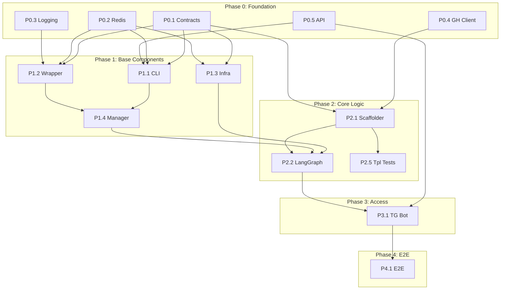

# Migration Plan

Стратегия рефакторинга проекта `codegen_orchestrator` на новую архитектуру.

---

## Philosophy: Hardcore TDD

Подход **Outside-In TDD** с изоляцией сервисов.

1.  **Contract First**: Сначала фиксируем DTO в `CONTRACTS.md`.
2.  **Red (Integration)**: Пишем интеграционный тест сервиса — падает.
3.  **Red (Unit)**: Пишем юнит-тест — падает.
4.  **Green**: Реализуем минимум для прохождения.
5.  **Refactor**: Улучшаем, не ломая тесты.

---

## Dependency Graph

---

## Component Registry

| ID | Component | Package/Service | Depends On | Phase |
|----|-----------|-----------------|------------|-------|
| P0.1 | Shared Contracts | `shared/contracts` | — | 0 |
| P0.2 | Shared Redis | `shared/redis` | — | 0 |
| P0.3 | Shared Logging | `shared/logging` | — | 0 |
| P0.4 | GitHub Client | `shared/clients/github` | — | 0 |
| P0.5 | API Refactor | `services/api` | — | 0 |
| P1.1 | Orchestrator CLI | `packages/orchestrator-cli` | P0.1, P0.2, P0.5 | 1 |
| P1.2 | Worker Wrapper | `packages/worker-wrapper` | P0.1, P0.2, P0.3 | 1 |
| P1.3 | Infra Service | `services/infra-service` | P0.1, P0.2 | 1 |
| P1.4 | Worker Manager | `services/worker-manager` | P1.1, P1.2 | 1 |
| P2.1 | Scaffolder | `services/scaffolder` | P0.1, P0.4 | 2 |
| P2.2 | LangGraph Service | `services/langgraph` | P1.3, P1.4, P2.1 | 2 |
| P2.5 | Template Tests | `tests/integration/template` | P2.1 | 2 |
| P3.1 | Telegram Bot | `services/telegram-bot` | P0.5, P2.2 | 3 |
| P4.1 | System E2E | `tests/e2e` | All above | 4 |

---

## Phase 0: Foundation

> **Goal:** Подготовить shared kernel без которого невозможно писать тесты.

### P0.1 — Shared Contracts

**Path:** `shared/contracts/`

**Tasks:**
- [ ] Перенести и актуализировать все Pydantic модели
- [ ] Добавить `pyproject.toml`
- [ ] Убедиться в соответствии с `CONTRACTS.md`

**Acceptance Criteria:**
- [ ] Все DTO из `CONTRACTS.md` имеют реализацию
- [ ] `mypy` проходит без ошибок
- [ ] Тесты валидации моделей проходят

---

### P0.2 — Shared Redis

**Path:** `shared/redis/`

**Tasks:**
- [ ] Обёртка над Redis Streams (XADD, XREAD, XACK)
- [ ] Consumer Group management
- [ ] Поддержка FakeRedis для тестов

**Acceptance Criteria:**
- [ ] Unit tests с FakeRedis
- [ ] Документация API

---

### P0.3 — Shared Logging

**Path:** `shared/logging/`

**Tasks:**
- [ ] Настройка Structlog
- [ ] Correlation ID propagation

**Acceptance Criteria:**
- [ ] Логи в JSON формате
- [ ] Correlation ID присутствует

---

### P0.4 — GitHub Client

**Path:** `shared/clients/github.py`

**Tasks:**
- [x] GitHub App authentication
- [x] Token caching (per-installation)
- [x] Rate limiting

**Acceptance Criteria:**
- [x] Unit tests с respx mock
- [ ] Integration tests с Testcontainers (optional)

---

### P0.5 — API Refactor

**Path:** `services/api/`

**Tasks:**
- [ ] Удалить Redis Publisher из POST `/tasks`
- [ ] Удалить прямые вызовы GitHub/GitLab
- [ ] API = чистый Data Access Layer

**Acceptance Criteria:**
- [ ] Только CRUD операции с PostgreSQL
- [ ] Никаких side effects кроме записи в БД

---

## Phase 1: Base Components

> **Goal:** Строительные блоки для воркеров и инфраструктуры.

### P1.1 — Orchestrator CLI

**Path:** `packages/orchestrator-cli/`  
**Depends:** P0.1, P0.2, P0.5

**Tasks:**
- [ ] Выделить код из `shared/cli`
- [ ] Добавить `pyproject.toml`
- [ ] Реализовать dual-write: POST API + XADD Redis
- [ ] Permissions system по allowed_commands

**Acceptance Criteria:**
- [ ] `orchestrator project create` → Task in DB + Message in queue
- [ ] Unit tests для всех команд
- [ ] Mock Redis, Mock API

---

### P1.2 — Worker Wrapper

**Path:** `packages/worker-wrapper/`  
**Depends:** P0.1, P0.2, P0.3

**Tasks:**
- [ ] Loop: XREAD → Subprocess → XADD
- [ ] Lifecycle events (started, completed, failed)
- [ ] Session management (PO only)
- [ ] Timeout handling

**Acceptance Criteria:**
- [ ] Integration test: Real Redis + Mock Agent
- [ ] Lifecycle events published correctly
- [ ] Graceful shutdown

---

### P1.3 — Infra Service

**Path:** `services/infra-service/`  
**Depends:** P0.1, P0.2

**Tasks:**
- [ ] Переименовать из `infrastructure-worker`
- [ ] Subscribe: `provisioner:queue` only (REMOVE ansible:deploy:queue)
- [ ] Ansible execution wrapper (for provisioning playbooks only)
- [ ] SSH key setup during provisioning
- [ ] REMOVE: `deploy_project.yml` playbook and related code

**Acceptance Criteria:**
- [ ] Integration test: Mock Ansible Runner (provision only)
- [ ] SSH key installation verification
- [ ] Provisioning flow works

---

### P1.4 — Worker Manager

**Path:** `services/worker-manager/`  
**Depends:** P1.1, P1.2

**Tasks:**
- [ ] Сборка `worker-base` Docker image (CLI + Wrapper)
- [ ] Container lifecycle (create, delete, status)
- [ ] Activity tracking via `worker:lifecycle`
- [ ] Auto-pause inactive PO workers

**Acceptance Criteria:**
- [ ] Integration test: Mock Docker API
- [ ] Create/Delete worker works
- [ ] Crash detection publishes failure to output queue

---

## Phase 2: Core Logic

> **Goal:** Бизнес-логика оркестрации.

### P2.1 — Scaffolder

**Path:** `services/scaffolder/`  
**Depends:** P0.4

**Tasks:**
- [ ] Subscribe: `scaffolder:queue`
- [ ] Copier template execution
- [ ] GitHub repo creation
- [ ] Initial commit push

**Acceptance Criteria:**
- [ ] Integration test: Real Copier + Mock Git
- [ ] E2E Nightly: Real GitHub test org

---

### P2.2 — LangGraph Service

**Path:** `services/langgraph/`  
**Depends:** P1.3, P1.4, P2.1

**Tasks:**
- [ ] Make DeployerNode call GitHub API (trigger_workflow)
- [ ] Add workflow polling loop
- [ ] Subscribe: `engineering:queue`, `deploy:queue`
- [ ] Single-Listener pattern (only `worker:developer:output`)
- [ ] State persistence (Postgres checkpointer)
- [ ] Retry logic on worker failure

**Acceptance Criteria:**
- [ ] Integration test: MockWorkerManager
- [ ] Graph pauses and resumes correctly
- [ ] Failures trigger retries (up to N times)

---

### P2.5 — service_template Integration Tests

**Path:** `tests/integration/template/`  
**Depends:** P2.1

**Goal:** Validate orchestrator components work correctly with real service_template.

**Tasks:**
- [ ] Test: Scaffolder + Template Integration (real copier)
- [ ] Test: Deploy Workflow Validation (parse generated main.yml)
- [ ] Test: Secrets Injection Compatibility
- [ ] Test: End-to-End Dry Run (No Deploy, No LLM)

**Acceptance Criteria:**
- [ ] Scaffolder generates valid project from real template
- [ ] Generated workflows match Orchestrator expectations
- [ ] Secret names match between code and template

---

## Phase 3: Access

> **Goal:** Точки входа для пользователей.

### P3.1 — Telegram Bot

**Path:** `services/telegram-bot/`  
**Depends:** P0.5, P2.2

**Tasks:**
- [ ] Session → Worker ID mapping
- [ ] Message routing to PO worker
- [ ] Progress events display
- [ ] Admin commands

**Acceptance Criteria:**
- [ ] Integration test: Telegram Update simulation
- [ ] User message reaches PO worker
- [ ] PO response returns to user

---

## Phase 4: System E2E

> **Goal:** Full system validation.

### P4.1 — System E2E

**Path:** `tests/e2e/`  
**Depends:** All above

**Tasks:**
- [ ] `docker-compose up` всей системы
- [ ] Full flow: User → Bot → PO → Spec → Dev → Deploy → URL

**Acceptance Criteria:**
- [ ] CI pipeline green
- [ ] All services healthy
- [ ] End-to-end flow completes

---

## Definition of Done (Per Component)

| Criterion | Required |
|-----------|----------|
| Контракты согласованы с `CONTRACTS.md` | ✅ |
| Integration tests проходят | ✅ |
| Unit tests для сложной логики | ✅ |
| `ruff` / `mypy` без ошибок | ✅ |
| Dockerfile (для сервисов) | ✅ |
| Документация обновлена | ✅ |

---

## Change Log

| Date | Author | Changes |
|------|--------|---------|
| 2026-01-11 | Claude | Complete rewrite: fixed numbering, added dependency graph, acceptance criteria per component |
| 2026-01-11 | Claude | Initial structure |