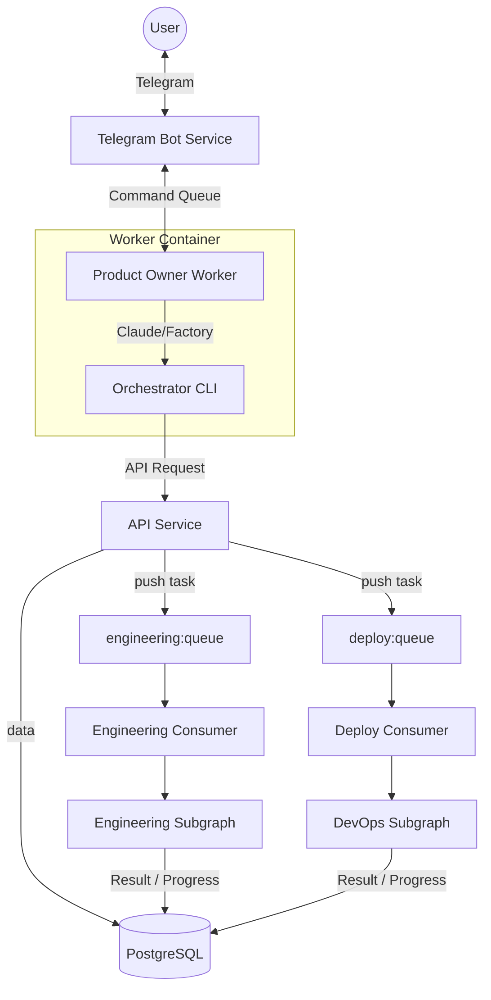

# Architecture Documentation

Документация по архитектуре codegen_orchestrator.

## Documents

| Документ | Описание |
|----------|----------|
| [GLOSSARY.md](./GLOSSARY.md) | Словарь терминов. Единая терминология для проекта. |
| [CONTRACTS.md](./CONTRACTS.md) | Контракты очередей. Pydantic схемы для всех Redis queues. |
| [MIGRATION_PLAN.md](./MIGRATION_PLAN.md) | План миграции. Поэтапный план приведения к целевой архитектуре. |

## Quick Reference

### Terminology

| Термин | Значение |
|--------|----------|
| **Service** | Долгоживущий процесс (api, telegram-bot) |
| **Consumer** | Сервис слушающий Redis queue |
| **Worker** | Эфемерный контейнер с CLI-Agent |
| **CLI-Agent** | AI внутри Worker (Claude Code, Factory.ai) |
| **Task** | Сущность в БД, отслеживает работу |
| **Message** | Данные в Redis queue |
| **Event** | Уведомление о прогрессе |
| **Node** | Узел LangGraph графа |

### Queues

| Очередь | Producer | Consumer |
|---------|----------|----------|
| `engineering:queue` | CLI, Telegram | engineering-consumer |
| `deploy:queue` | CLI, Telegram | deploy-consumer |
| `scaffolder:queue` | LangGraph | scaffolder |
| `provisioner:queue` | Scheduler | infra-service |
| `ansible:deploy:queue` | DevOps Subgraph | infra-service |
| `worker:commands` | LangGraph | worker-manager |
| `worker:responses` | worker-manager | LangGraph |

### Services

```
┌─────────────────────────────────────────────────────────┐
│                       SERVICES                          │
├─────────────────────────────────────────────────────────┤
│                                                         │
│  api              FastAPI, source of truth (CRUD)       │
│  telegram-bot     User interface + PO sessions          │
│  langgraph        Orchestration + queue consumers       │
│  scheduler        Background tasks (sync, health)       │
│  scaffolder       Project scaffolding (Copier)          │
│  worker-manager   Worker container lifecycle            │
│  infra-service    Ansible provisioning/deployment       │
│                                                         │
└─────────────────────────────────────────────────────────┘
```

## Data Layer Architecture

### ORM vs DTO

| Layer | Location | Purpose |
|-------|----------|---------|
| **ORM Models** | `api/src/models/` only | SQLAlchemy models mapped to DB tables |
| **DTO (Contracts)** | `shared/contracts/` | Pydantic schemas for data transfer |

> **Rule:** ORM lives ONLY in `api` service. All other services use DTO.

### Why?

1. **Single Source of Truth**: Only API touches the database
2. **Decoupling**: Other services don't need SQLAlchemy dependency
3. **Clear Boundaries**: DB schema changes are isolated to API
4. **Testability**: Services can be tested with mock DTOs, no DB needed

### Data Flow

```
┌──────────────┐     DTO      ┌──────────────┐     ORM      ┌──────────────┐
│  LangGraph   │ ──────────►  │     API      │ ──────────►  │  PostgreSQL  │
│  Scheduler   │ ◄──────────  │   Service    │ ◄──────────  │              │
│  Telegram    │     DTO      │              │     ORM      │              │
└──────────────┘              └──────────────┘              └──────────────┘
```

### shared/ Structure (Target)

```
shared/
├── contracts/        # Pydantic DTO schemas for queues/API
│   ├── project.py      # ProjectDTO, ProjectCreate, ProjectResponse
│   ├── task.py         # TaskDTO
│   └── ...
├── config.py         # BaseSettings
├── logging_config.py # Structlog setup
└── redis_client.py   # Redis wrapper

# NO models/ here! ORM is in api/src/models/
```

## MVP: Product Owner Flow

В новой архитектуре мы уходим от прямой оркестрации через LangGraph для верхнеуровневых задач.

**Ключевая концепция:**
- **Product Owner (PO)** — это Worker (AI Agent), который является единой точкой входа для User.
- Пользователь общается с PO.
- PO использует CLI для управления проектами и процессами.
- PO не знает деталей реализации Engineering/Deploy, для него это "черные ящики" (отделы).

### High-Level Flow



### Roles & Responsibilities

1.  **Product Owner (Worker)**:
    *   **Agent**: Настраиваемый (Claude Code, Factory.ai). Промпт в `CLAUDE.md` / `AGENTS.md`.
    *   **Задача**: Понять желание пользователя -> Транслировать в CLI команды.
    *   **Пример**: User: "Сделай блог". PO: `orchestrator project create --name blog ...` -> `orchestrator engineering start ...`.

2.  **Engineering Subgraph (The "Engineering Dept")**:
    *   **Input**: ТЗ и репозиторий.
    *   **Process**: Scaffolder -> Developer -> Tester.
    *   **Output**: Готовый PR/Commit.
    *   **PO View**: "Я отдал задачу инженерам, жду результат".

3.  **DevOps Subgraph (The "Ops Dept")**:
    *   **Input**: Проект и сервер.
    *   **Process**: EnvAnalyzer -> Deployer -> Ansible.
    *   **Output**: Работающий URL.
    *   **PO View**: "Я сказал админам выкатить, они сказали ок".

4.  **Schedulers**:
    *   Работают независимо.
    *   Sync repos, check servers health, update stats.
    *   Поддерживают "картину мира" в актуальном состоянии для PO.
