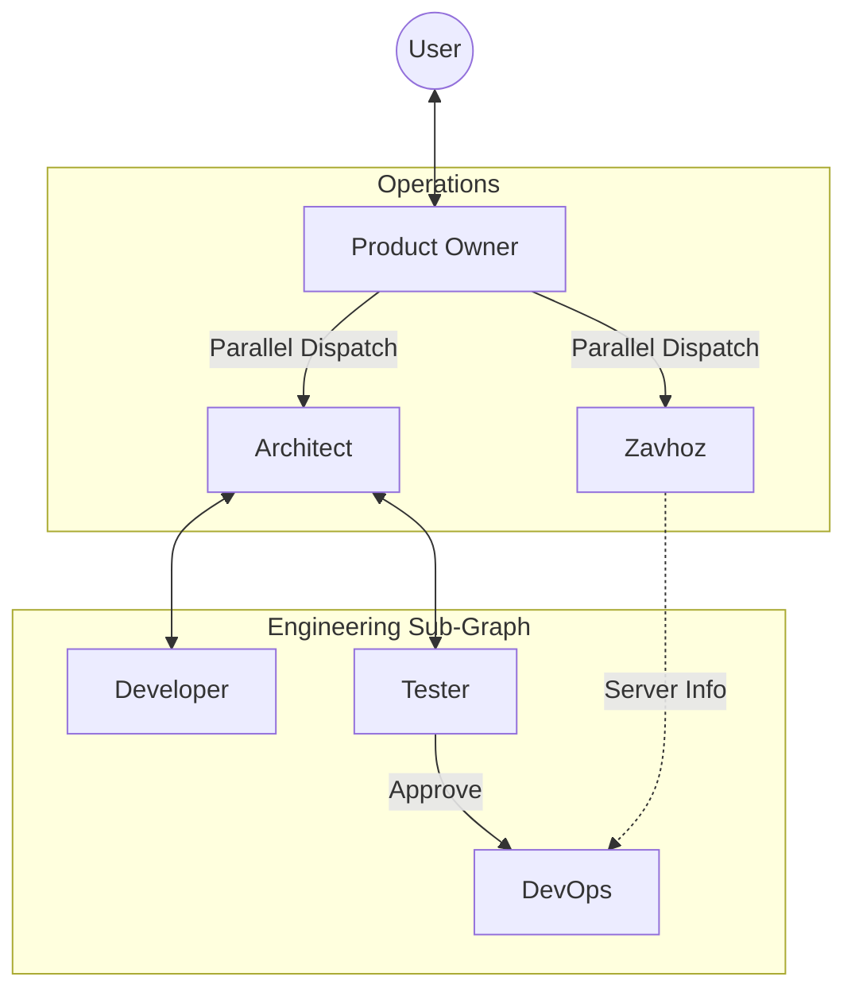

# Product Owner Node Design (The "Spider" Graph)

## 🎯 Concept
The **Product Owner (PO)** is the central hub/router of the system. Unlike the previous linear flow, the PO orchestrates the entire lifecycle, dispatching tasks to specialists in parallel and serving as the single interface for User interaction.

## 🕸️ Topology: Hierarchical (Multi-Level) Graph
Instead of a flat Star, we use a delegated hierarchy.

### Level 1: Strategic (Product Owner)
- **User Interface**: Handle requests, clarify requirements.
- **Resource Manager**: Dispatch **Zavhoz** to prepare infrastructure.
- **Project Manager**: Dispatch **Architect** to build/maintain the software.
- **Synchronizer**: Ensure Resources are ready before Software deployment proceeds.

### Level 2: Engineering (Architect)
- **Design**: Create spec/repo.
- **Implementation Loop**: Orchestrate **Developer** and **Tester**.
- **Delivery**: Trigger **DevOps** when software + hardware are ready.



## 🧠 PO Logic & Responsibilities

The PO node is a loop that runs until it decides to sleep (wait for user).

### 1. Intent Classification
When receiving a message from User:
- **New Project**: Initialize state, trigger Brainstorm/Architect.
- **Status Update**: Query DB, return summary.
- **Scale/Modify**: Analyze request, trigger Zavhoz (Scale) or Architect (Refactor).

### 2. Parallel Orchestration (The "Turbo" Mode)
As per requirements, when a project starts, PO should:
- **Trigger Developer/Architect**: To design/write code.
- **Trigger Zavhoz**: IN PARALLEL. To check/reserve resources immediately. "I need a server for X, go find it while we code."

We will use LangGraph's `Send` API (Map-Reduce pattern) or parallel conditional edges to achieve this.

### 3. The "Human-in-the-Loop" Mediator
Specialists in the sub-graph (Developer, Tester) communicate through the Architect, who communicates with the PO.
- If **Developer** has a question -> Returns to **Architect**.
- **Architect** can't answer -> Returns to **PO** (Blocked).
- **PO** asks **User**.

## 🛠 Graph State Changes

```python
class OrchestratorState(TypedDict):
    # Global
    messages: list
    current_project: str | None
    
    # Sub-agent States
    architect_status: str # "working", "blocked", "waiting_for_resources"
    zavhoz_status: str    # "searching", "provisioning", "done"
    
    # Shared Data
    server_info: dict | None # Written by Zavhoz, Read by DevOps
    repo_info: dict | None   # Written by Architect, Read by DevOps
```

## 🔄 Interaction Flow Example (New Project)

1.  **User**: "Build a shop."
2.  **PO**: "Understood. Starting."
    -   *Dispatch 1*: **Zavhoz** ("Find server").
    -   *Dispatch 2*: **Architect** ("Build shop").
3.  **Zavhoz**: Finds server, updates `server_info`. Status: `Done`.
4.  **Architect**: 
    -   Designs Project. Status: `Working`.
    -   Calls **Developer**.
    -   Calls **Tester**.
    -   **Tester** approves build.
5.  **Architect** (Ready to Deploy):
    -   Checks `server_info`.
    -   *Scenario A (Server Ready)*: Calls **DevOps**.
    -   *Scenario B (Server Not Ready)*: Returns status `waiting_for_resources` to PO.
6.  **PO** (Synchronization):
    -   If Architect is `waiting_for_resources` and Zavhoz finishes -> Re-triggers **Architect** (who then sees server and calls DevOps).

## ⚠️ Challenges & Solutions

1.  **Sub-graph Orchestration**:
    *   LangGraph doesn't natively support "Sub-graphs" easily inside a single graph unless we use `Call` primitives or just conditional routing.
    *   *Solution*: We keep it all in one `StateGraph` but strictly control edges. `Developer` ONLY returns to `Architect` (or `Developer_Spawn_Worker` logic).

2.  **DevOps Dependency**:
    *   DevOps needs `Server` (from Zavhoz) and `Repo` (from Architect).
    *   *Solution*: Architect invokes DevOps, but guards it with a check for `server_info`.

## 📋 Implementation Plan Phase 1

1.  **Refactor Graph Edges**:
    *   Break `Zavhoz -> Architect` sequential link.
    *   Make `PO` the entry point for both.
2.  **Enhance Architect Node**:
    *   Add logic to manage Dev/Test loop.
    *   Add logic to check `server_info` before deployment.
3.  **Create Product Owner Node**:
    *   Implement user intent classification.
    *   Implement parallel dispatch logic (returning multiple "next nodes" or using `Send`).
