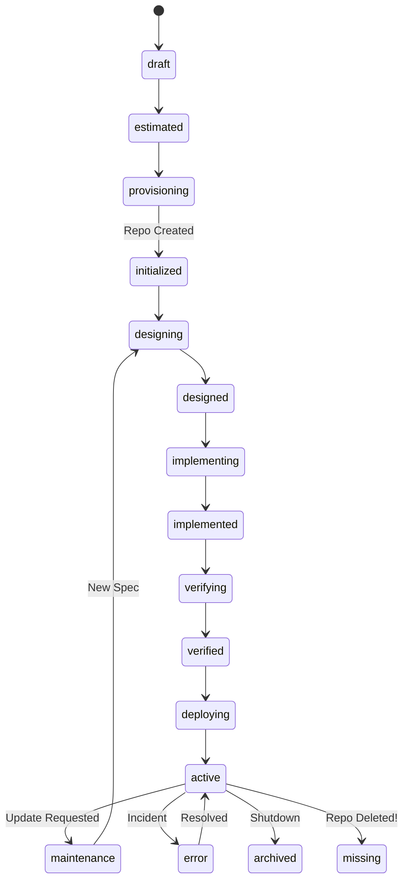

# Project Source of Truth & Lifecycle Design

## 🧠 Philosophy

**Source of Truth**: 
- **Code & Existence**: GitHub Organization. If a repository exists, the project exists.
- **State & Metadata**: Internal Database. Tracks *what stage* the project is in.

## 🔄 Synchronization Strategy (The "Heartbeat")

We implement a polling mechanism (e.g., every 5-10 minutes) that fetches all repositories from the GitHub Organization.

### Sync Logic

1.  **New Repository Detected** (on GitHub, not in DB):
    - **Action**: Import to DB.
    - **Status**: `discovered` (or `initialized`).
    - **Reasoning**: Someone might specialized manually or another tool created availability. We should track it.

2.  **Repository Missing** (in DB, not on GitHub):
    - **Case A**: Status was `draft` / `ordered`. -> **Action**: No-op (it hasn't been created yet).
    - **Case B**: Status was `initialized` or higher. -> **Action**: Mark as `missing` (Incident).
    - **Reasoning**: A deployed project vanishing from GitHub is a critical incident (accidental deletion?).

3.  **Repository Renamed**:
    - **Action**: Update DB name if we track by GitHub ID (preferred) or fail/re-import if tracking by name.
    - **Recommendation**: Add `github_repo_id` to `Project` model for robust tracking.

## 🚦 Project Status Lifecycle

Refining the user's proposed linear flow into a State Machine.

### Phase 1: Inception (Internal Only)
1.  **`draft`** (Заказан):
    - Entry Point: User brainstorms in Telegram.
    - Artifacts: Database record only. No Repo.
    - Next Step: Approval -> `estimated`.

2.  **`estimated`** (Оценен):
    - Spec is generated (`service-template` config).
    - Next Step: Confirmation -> `provisioning`.

### Phase 2: Materialization
3.  **`provisioning`** (Создание):
    - Transient state. The process of calling GitHub API to create the repo.
    - Next Step: Success -> `initialized`.

4.  **`initialized`** (Инициализирован):
    - Repo exists on GitHub.
    - Code is empty or just `README.md`.
    - Next Step: Architect pass -> `designed`.

### Phase 3: Construction
5.  **`designing`** -> **`designed`** (Спроектирован):
    - Architect agent works. Commits `IMPLEMENTATION.md` or structure.
    
6.  **`implementing`** -> **`implemented`** (Реализован):
    - Developer agent writing code.
    - Feature branches merged to `main`.

7.  **`verifying`** -> **`verified`** (Протестирован):
    - CI/CD checks pass.
    - Tester agent approves.

### Phase 4: Production
8.  **`deploying`** -> **`active`** (Запущен):
    - Ansible finished successfully.
    - Site is live.

### Phase 5: Maintenance & Incidents
*   **`maintenance`**: Updates are being applied (loop back to `designing/implementing`?).
*   **`error`**: Something broken (deployment failed, check failed).
*   **`archived`**: Explicitly shut down.
*   **`missing`**: Repo gone but project should exist.

### Visualization

## ❓ Open Questions / "Подводные камни"

1.  **Maintenance Loop**: Changes to an `active` project shouldn't reset it to `draft`.
    *   *Idea*: Use a separate `Task` tracking for updates? Or keep Project in `active` but have a `current_operation` field?
    *   *Alternative*: Status reflects the *last successful state*, and we have a separate `pipeline_status`.

2.  **"Do Not Touch"**:
    *   If a human pushes code, how does the bot know?
    *   *Solution*: Webhooks (Events) are better than Polling for reactions, but Polling is better for Source of Truth consistency. We might need both.

3.  **Secrets & Environment**:
    *   If we import a "Wild" repo, we don't know its secrets. We can't deploy it without config.
    *   *Solution*: Discovered projects start as `setup_required`?
