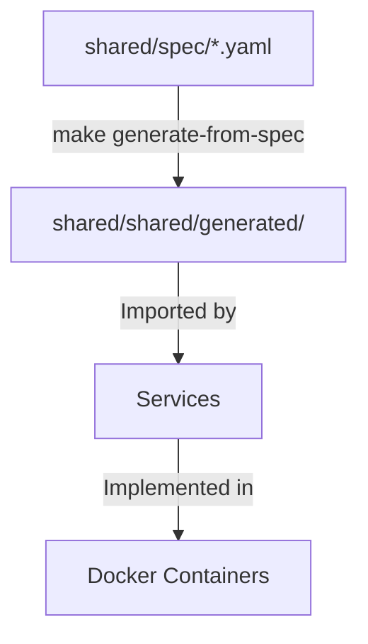

# Architecture & Design

This document describes the technical architecture and design decisions for this project.
The project follows a spec-first microservice architecture: YAML specs own generated contracts,
while services communicate through defined interfaces.

## The "Spec-First" Flow

The heart of the framework is the `shared/spec/` directory. This is the single source of truth for the data model and API surface.



1.  **Define:** You edit `shared/spec/models.yaml`, `shared/spec/events.yaml`, or `services/<service>/spec/*.yaml`.
2.  **Generate:** Run `make generate-from-spec`. This produces Pydantic models, protocols, REST routers, and event adapters.
3.  **Implement:** Services import these generated assets. You only write the business logic to satisfy the interfaces.

### Core Settings

`services/<service>/manifest.yaml` is an explicit, versioned service manifest, separate from
`spec/*.yaml`. Its Draft 2020-12 `settings_schema` declares user-controlled settings and is
validated before generation. The backend exposes typed `settings.get` and `settings.set` v1
operations; values persist by product or user scope and writes validate against that schema. Use a
setting for a value from the Product Brief or one a user may change. Keep startup, connectivity and
secret values in the environment contract. `settings.set` requires the deployment-only
`X-Settings-Capability` header, which is intentionally not documented in OpenAPI.

### Core Jobs

`services/<service>/manifest.yaml` also declares, under `jobs_schema`, the named behaviours that may
be fired, each with the JSON Schema its `arguments` must satisfy. The backend exposes typed
`jobs.fire` and `jobs.evidence` v1 operations. The core schedules nothing: it records a fire under
the caller-supplied `(fired_by_product, command_id)` identity and emits `job_fired`, so an optional
module that declares `provides: ["jobs.fire"]` does the work. Replaying an identity returns the
recorded evidence instead of firing again. `jobs.fire` requires the deployment-only
`X-Jobs-Capability` header, which is intentionally not documented in OpenAPI; reading evidence back
does not.

## Service Modules

The project is a collection of modular services defined in `services.yml`.

- **Definition:** A service is simply an entry in `services.yml` with a `name`, `type`, and `description`.
- **Isolation:** Each service is its own Docker container. They communicate only via defined APIs or shared infrastructure (DB, Queue).

### Service Types

- `python-fastapi`: HTTP API service using FastAPI with uvicorn (exposes port 8000).
- `python-faststream`: Telegram bot with Redis event integration.
- `python-faststream`: Event-driven worker using FastStream (no HTTP, consumes from message broker).
- `node`: Node.js service (exposes port 4321).
- `default`: Generic container placeholder.

### Compose Options

Services can specify `depends_on` in `services.yml` to document runtime dependencies used by Docker Compose and the service tooling.

## Tooling Strategy

- **Local tooling via `uv` + per-service `.venv/`:** Each service has its own virtual environment under `services/<name>/.venv/`. The root `.venv/` holds framework dev tools (`ruff`, `pytest`, `mypy`).
- **`make setup`** bootstraps the project with the installed `uv`: it creates venvs, generates code, and configures git hooks.
- **Service Containers:** Each service has its own `Dockerfile` for Docker-based development and deployment.

## Directory Structure

- `infra/`: Docker Compose files and infrastructure config.
- `services/`: Source code for individual microservices.
  - `backend/`: FastAPI REST API with PostgreSQL.
  - `tg_bot/`: Telegram bot using python-telegram-bot polling.
  - `notifications_worker/`: Notification service (email, telegram).
  - `frontend/`: Node.js frontend.
- `shared/`:
    - `spec/`: YAML specifications (Source of Truth).
    - `generated/`: Auto-generated code (Do Not Edit).
- `.framework/`: Framework internals (spec validation and code generation).

## Infrastructure Components

- **PostgreSQL:** Primary database for persistent storage.
- **Redis:** Message broker for async event processing.

## Unified Handlers

The framework supports **unified handlers** — operations that work over multiple transports.

### Operation Types

| Type | Config | Behavior |
|------|--------|----------|
| **Query** | `rest:` only | Synchronous read, no side effects |
| **Command** | `rest:` + `events:` | REST returns result, event published async |
| **Background** | `events:` only | No HTTP endpoint, event-driven only |

### Example: Dual-Transport Operation

```yaml
# services/backend/spec/users.yaml
operations:
  grant:
    input: UserGrant
    output: UserAccess
    rest:
      method: POST
      path: /grant
      status: 200
    events:
      publish_on_success: user_granted  # Event published after success
```

This generates:
- REST endpoint that calls controller and publishes event after success
- Event adapter in subscriber services that handles `user_granted`
- Unified protocol with all controller methods

## Deployment

This project supports two deployment modes:

### 1. Manual (Push to main)
Push to `main` branch triggers full CI/CD:
- Build images → Push to GHCR → Deploy to server

### 2. Orchestrated (workflow_dispatch)
External orchestrator can trigger deployment via GitHub API:
```bash
curl -X POST \
  -H "Authorization: Bearer $GITHUB_TOKEN" \
  -H "Accept: application/vnd.github.v3+json" \
  https://api.github.com/repos/OWNER/REPO/actions/workflows/deploy.yml/dispatches \
  -d '{"ref":"main","inputs":{"deploy_host":"1.2.3.4","image_tag":"latest"}}'
```

Required repository secrets:
- `DEPLOY_USER` - SSH username (usually "root")
- `DEPLOY_SSH_KEY` - SSH private key
- `DEPLOY_PROJECT_PATH` - Path on server (e.g., `/opt/services/myapp`)
- `POSTGRES_PASSWORD` - Database password
